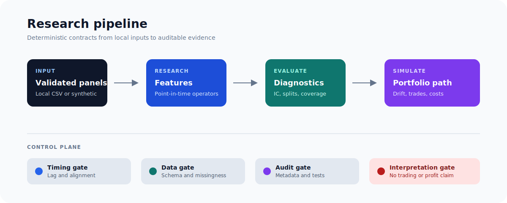

# Equity Factor Research

An auditable Python toolkit for equity-factor research with strict data
contracts, deterministic diagnostics, drift-aware portfolio accounting, and
reproducible experiment records.

[](https://github.com/minqiyang/equity-factor-research/actions/workflows/ci.yml)

[](LICENSE)


The repository focuses on research validity: point-in-time feature semantics,
explicit signal lag, strict local-file validation, auditable costs, and clear
separation between diagnostics and investment claims.



## Core Capabilities

| Layer | Implemented |
| --- | --- |
| Data contracts | Strict wide-price, long-price, benchmark, and OHLCV CSV validation; local files only. |
| Features | Momentum, reversal, volatility, liquidity, normalization, combination, Alpha #009/#012, and reusable panel operators. |
| Diagnostics | Coverage, correlation, IC, Rank IC, quantile spread, and train/validation/test splits. |
| Portfolio | Long-only equal-weight simulation with signal lag, drift-aware holdings and trades, turnover, benchmark, costs, holding count, normalized HHI concentration, and benchmark-relative tracking error. |
| Liquidity friction | Lagged dollar-volume diagnostics and opt-in precomputed impact with trade-source and return-basis metadata. |
| Evidence | Deterministic Markdown reports, JSON experiment logs, registry generation, synthetic demos, and committed fixtures. |

## Quickstart

```bash
git clone https://github.com/minqiyang/equity-factor-research.git
cd equity-factor-research
python3.11 -m venv .venv
source .venv/bin/activate
python -m pip install --upgrade pip
python -m pip install -e ".[dev]"
python -m pytest -q
```

Run reproducible examples:

```bash
python -m research.synthetic_momentum_demo
python -m research.synthetic_multifactor_workflow_demo
python -m research.synthetic_combined_score_backtest_demo
python -m research.local_csv_fixture_workflow_demo
```

These commands use synthetic data or committed fixtures. Generated metrics are
engineering diagnostics, not profitability or trading evidence.

## Architecture

```text
local CSV / synthetic panels
            |
            v
strict validation -> features -> diagnostics -> portfolio simulation
            |                                      |
            +-------------- audit metadata --------+
                                   |
                                   v
                        reports + experiment logs
```

| Path | Responsibility |
| --- | --- |
| `src/data/` | Local CSV validation and inventory review. |
| `src/features/` | Feature, operator, normalization, combination, liquidity, and diagnostic contracts. |
| `src/backtest/` | Simulated portfolio path, metrics, and slippage diagnostics. |
| `src/reporting/` | Experiment logs and registry; plotting remains unimplemented. |
| `research/` | Synthetic, fixture, and private-output runner entrypoints. |
| `tests/` | Deterministic correctness, failure-mode, and scope guardrails. |
| `reports/` | Reproducible synthetic and fixture artifacts. |
| `lean/` | Non-executing LEAN metadata and signal scaffold. |

## Accounting Contract

- Signals are known after their timestamp and lagged by default.
- Holdings earn the next available price-row return.
- Holdings drift between scheduled rebalances.
- Trade weights are absolute changes from drifted pre-trade weights.
- Fixed costs and slippage are charged on post-return portfolio value and
  expressed on beginning-period return basis.
- Volume-aware impact is diagnostic-only by default and requires reviewed,
  aligned metadata before application.
- Tracking error is the annualized population volatility of exact-date aligned
  daily net strategy returns versus cost-free benchmark returns; the synthetic
  first row is excluded and the terminal observed return window is included.

See [`docs/current_roadmap.md`](docs/current_roadmap.md) for the canonical
implementation status and open gaps.

## Quality Gates

```bash
python -m pytest -q
python -m ruff check .
python -m compileall -q src research tests lean
python -m build
git diff --check
```

CI runs tests, lint, compilation, and package build on pull requests and pushes
to `main`. Changes are delivered as small PRs and reviewed on the current head.

## Research Boundaries

- No market-data downloader, vendor API, or credential path.
- No brokerage, order execution, paper trading, or live trading.
- No point-in-time real-market universe is supplied.
- Private inputs and outputs remain outside the repository.
- Volume-aware slippage is not a calibrated fill or market-impact model.
- `src/risk/constraints.py` provides an optional simulated long-only position
  cap; `src/reporting/plots.py` remains a placeholder. Neither is a production
  trading or risk-management capability.

Before interpreting any real-data study, define provenance, adjustment policy,
point-in-time universe and survivorship policy, benchmark, sample splits,
costs, slippage, and interpretation stop conditions.

## Project Records

- [Current roadmap](docs/current_roadmap.md)
- [Current handoff](docs/current_handoff.md)
- [Project specification](PROJECT_SPEC.md)
- [Experiment record contract](EXPERIMENT_LOG.md)
- [Decision log](docs/decision_log.md)
- [Engineering log](docs/engineering_log.md)
- [Experiment registry](reports/experiment_registry.md)

## License

Apache License 2.0. See [LICENSE](LICENSE).
