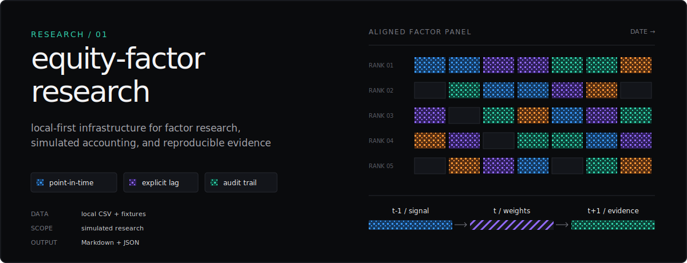

<p align="center">
  
</p>

<p align="center">
  <a href="https://github.com/minqiyang/equity-factor-research/actions/workflows/ci.yml"></a>
  
  <a href="LICENSE"></a>
</p>

An auditable Python toolkit for equity-factor research with strict data contracts, deterministic diagnostics, drift-aware portfolio accounting, and reproducible experiment records.

`POINT-IN-TIME FEATURES` · `EXPLICIT SIGNAL LAG` · `DRIFT-AWARE ACCOUNTING` · `JSON EVIDENCE`

[Quickstart](#quickstart) · [Research method](docs/research_method.md) · [Project specification](PROJECT_SPEC.md) · [Experiment registry](reports/experiment_registry.md) · [Current roadmap](docs/current_roadmap.md)

## Quickstart

Python 3.11 or newer is required.

```bash
git clone https://github.com/minqiyang/equity-factor-research.git
cd equity-factor-research
python3.11 -m venv .venv
source .venv/bin/activate
python -m pip install --upgrade pip
python -m pip install -e ".[dev]"
python -m pytest -q
```

Run the reproducible examples:

```bash
python -m research.synthetic_momentum_demo
python -m research.synthetic_multifactor_workflow_demo
python -m research.synthetic_combined_score_backtest_demo
python -m research.local_csv_fixture_workflow_demo
```

These commands use synthetic data or committed fixtures and may refresh files under `reports/`. Their outputs are reproducibility and engineering diagnostics.

## Method

`LOCAL CSV → FACTOR PANELS → DIAGNOSTICS → DRIFT-AWARE ACCOUNTING → MARKDOWN + JSON`

The timing model, portfolio accounting, control gates, system map, and evidence lifecycle live on a dedicated page:

**[Read the research method →](docs/research_method.md)**

Current documented gap: plotting remains unimplemented; the roadmap tracks its delivery status.

Scope: No market-data downloader; local files and committed fixtures enter the public research path.

## Project records

- [`docs/current_roadmap.md`](docs/current_roadmap.md) — canonical implementation status and open gaps
- [`PROJECT_SPEC.md`](PROJECT_SPEC.md) — objectives, assumptions, factor ideas, and backtesting principles
- [`EXPERIMENT_LOG.md`](EXPERIMENT_LOG.md) — experiment record fields and retention policy
- [`reports/experiment_registry.md`](reports/experiment_registry.md) — deterministic index of committed experiment logs
- [`docs/current_handoff.md`](docs/current_handoff.md) — current verified workflow state and next stage
- [`docs/full_repository_conformance_audit_2026-07-11.md`](docs/full_repository_conformance_audit_2026-07-11.md) — latest full conformance audit

## Quality gates

```bash
python -m pytest -q
python -m ruff check .
python -m compileall -q src research tests lean
python -m build
git diff --check
```

## License

Licensed under the [Apache License 2.0](LICENSE).
