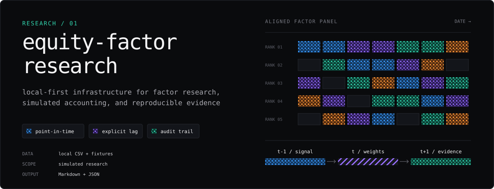

<p align="center">
  
</p>

<p align="center">
  <a href="https://github.com/minqiyang/equity-factor-research/actions/workflows/ci.yml"></a>
  
  <a href="LICENSE"></a>
</p>

An auditable Python toolkit for equity-factor research with strict data contracts, deterministic diagnostics, drift-aware portfolio accounting, and reproducible experiment records.

The ultimate aspiration of the project is automated stock selection and trading, pursuing sustainable risk-controlled long-term net returns (stable profit is an objective, not a guarantee). See [North Star](docs/north_star.md) for the active product aspiration and demo-first delivery principles. The historical [research charter](docs/research_program_charter.md) remains preserved as formal evidence policy. This repository builds the simulated research and backtesting foundation—the essential first part, not the final execution product. Live execution, broker connectivity, pre-trade risk limits, reconciliation, and emergency kill switches belong strictly to a future, separately authorized private execution repository.

`LAGGED FEATURE CONTRACTS` · `EXPLICIT SIGNAL LAG` · `DRIFT-AWARE ACCOUNTING` · `JSON EVIDENCE`

[Quickstart](#quickstart) · [North Star](docs/north_star.md) · [Research charter](docs/research_program_charter.md) · [Data methodology](docs/point_in_time_data_methodology_contract.md) · [Research method](docs/research_method.md) · [Project specification](PROJECT_SPEC.md) · [Experiment registry](reports/experiment_registry.md) · [Current roadmap](docs/current_roadmap.md)

## Quickstart

Python 3.11 or newer is required.

```bash
git clone https://github.com/minqiyang/equity-factor-research.git
cd equity-factor-research
python3.11 -m venv .venv
source .venv/bin/activate
python -m pip install --upgrade pip
python -m pip install -e ".[dev]"
python -m pytest -q
```

Run the official Demo v0 synthetic vertical slice:

```bash
python -m research.demo_v0
```

This command uses existing 12-1 momentum and frozen `SyntheticDemoConfig` values (seed 20260521, 20 assets, 756 rows, lookback 252, skip 21, ME, top 5, 10 bps, 0 slippage). It writes `reports/demo_v0.md` and appends All-Attempt Case Logging to `reports/demo_v0_attempts.jsonl`. The output is a synthetic diagnostic. It is not a profitability claim and uses no private data.

Run the M3-01 exploratory synthetic three-factor backtest:

```bash
python -m research.synthetic_multifactor_backtest_demo
```

This command reuses Demo v0 synthetic price dates and assets, the existing factor generator and 0.50 / 0.30 / 0.20 weights, existing winsorize/z-score/`combine_factors` helpers, and the Demo v0 long-only backtester. The three panels are artificial quality, reversal, and momentum fixtures; they are distinct from Demo v0 12-1 momentum and from fundamentals. It writes `reports/synthetic_multifactor_backtest_demo.md` and appends All-Attempt Case Logging. The output is a synthetic diagnostic. `python -m research.demo_v0` remains the official Demo v0 command. `python -m research.synthetic_multifactor_workflow_demo` remains the feature-only workflow. M3-02 requires complete finite strictly positive price bars in both demos and refuses a supplied missing or zero-volume panel without silent fill, clip, drop, or repair. M3-03 proves signal lag on those commands counts observed source rows; a missing source row remains an omitted observation. Those demos keep the supplied observed index. M3-07 reports adjacent calendar-day spans and refuses panel timestamps absent from the declared source index. Official demos declare the generated price index as source. Session and holiday status remains unverified. M3-04 proves those commands compute held returns from the supplied price series only and refuse a separate cash-dividend overlay (PIT-007). Event-level dividend and split reconciliation remains later Milestone 3/4 work. M3-05 proves those commands run on a longer synthetic panel of length `2 * DEMO_V0_CONFIG.periods` (1512) through `dataclasses.replace`; official frozen Demo v0 config remains 756 rows. M3-06 counts unchanging-price segments on those commands and keeps every supplied bar. Remaining Milestone 3 work is event-level dividend/split reconciliation.

Legacy synthetic and fixture diagnostics remain available:

```bash
python -m research.synthetic_momentum_demo
python -m research.synthetic_multifactor_workflow_demo
python -m research.synthetic_combined_score_backtest_demo
python -m research.local_csv_fixture_workflow_demo
```

These legacy commands use synthetic data or committed fixtures and may refresh files under `reports/`. Their outputs are reproducibility and engineering diagnostics, not Demo v0 evidence. The feature-only multifactor workflow remains available for preprocessing checks. The M3-01 command above is the exploratory three-factor backtest slice.

## Demo-First Delivery Target (Demo v0)

The project follows a **demo-first** engineering strategy: ship a basic, presentable, and reproducible end-to-end version first, record non-blocking imperfections in a lightweight backlog, and iterate in layers. We avoid blocking a working demonstration on an ideal pipeline, full SEC entity lineage proof, complete ledger schema coverage, or a broad factor zoo.

**Demo v0** is the synthetic vertical slice. The official command is `python -m research.demo_v0`:
- One reproducible local command using existing 12-1 momentum and one frozen strategy configuration;
- Simulated stock selection and drift-aware portfolio holdings;
- Human-readable comparison report with benchmark, explicit transaction cost and timing models (accepted `after_close_signal_next_observed_close_v1`), risk metrics, and limitations;
- All-Attempt Case Logging recording all attempted cases, including failures (lightweight diagnostic run logging, distinct from formal experiment/trial-ledger accounting required by charter Stage 4 / Milestone 4).

Synthetic fixture workflows run without private data. Any separately authorized local-data run remains explicitly exploratory and diagnostic. Demo v0 makes no profitability claim.

## Method

`LOCAL CSV → FACTOR PANELS → DIAGNOSTICS → DRIFT-AWARE ACCOUNTING → MARKDOWN + JSON`

The timing model, portfolio accounting, control gates, system map, and evidence lifecycle live on a dedicated page:

**[Read the research method →](docs/research_method.md)**

Plotting is a placeholder module; the roadmap tracks its delivery.

The public research path uses local files and committed fixtures. The
provider-agnostic
[point-in-time data methodology contract](docs/point_in_time_data_methodology_contract.md)
defines manifest, universe, corporate-action, field, privacy, and
holdout-access requirements. Stage 3 contract acceptance is
methodology-process evidence.

## Current program status

- **North Star & Roadmap Alignment**: Five primary milestones define the path from core research foundation to simulated demo slice, exploratory multi-factor expansion, formal research promotion, and eventual separately authorized execution. See the [current roadmap](docs/current_roadmap.md).
- **Historical Track A Disposition**: Track A (14-trial EODHD diagnostic design) remains frozen and REFUSED (`ACCEPTED_IDENTITIES_ZERO_NO_LINEAGE_CONFORMANT_PANEL`) under evidence ceiling `DIAGNOSTIC_ONLY`. This historical refusal is preserved as immutable evidence and is not a universal blocker for the demo-first program.
- **Track B First Checkpoints**: SQLite ledger runtime first checkpoints (Path A PR #199, Path B PR #200) are merged on main as software progress; optional 37-event schema completion is safely deferred.
- **Exploration Diagnostic Context**: A local 2026-09-13 metadata and numerical diagnostic provided qualitative feasibility and planning context on local data history, with documented caveats (zero-volume segments, date gaps, unverified adjustment events) deferred for layered handling. It is outside Demo v0 acceptance, produces no strategy or profitability claims, and does not prove tradability, universe completeness, or a pristine holdout.
- See the [current roadmap](docs/current_roadmap.md) for execution gates and milestone tracking.

## Quality gates

```bash
python -m pytest -q
python -m ruff check .
python -m compileall -q src research tests lean
python -m build
git diff --check
```

## License

Licensed under the [Apache License 2.0](LICENSE).
