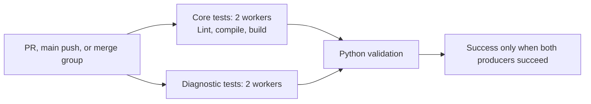

# CI Acceleration and Optimization Architecture

Date: 2026-09-21 (UTC). Design baseline: `3bb32dfd316bdd2a831fbe62ab961e62a0cf7689`.
Implementation recipient: Grok 4.6 Extra High.
Deliverable status: architecture and implementation specification; runtime measurements below distinguish completed experiments from proposed changes.

## 1. Decision and delivery contract

Adopt bounded process parallelism with `pytest-xdist`, fix the demonstrated unordered ML parametrization, use `--dist worksteal`, retain the existing single `Python validation` job for the first implementation, and preserve every existing validation command and collected test. Make the pip cache input explicit. Bound native numerical-library threads before Python starts. Retain timing and result evidence for every attempted configuration.

The 5–8 minute objective requires reducing the test critical path. Current GitHub evidence attributes more than 98% of job time to pytest. A cache change or a separate build job has seconds of opportunity. Two workers have an ideal throughput floor of approximately 19 minutes at the measured workload; four workers have an ideal floor of approximately 9.5 minutes. A single slow test also sets an independent lower bound. Therefore the complete program includes a measured runtime-optimization stage after the scheduling change. Treat 5–8 minutes as an acceptance target until same-runner evidence establishes it.

The design request authorizes this card and local synthetic profiling. This document specifies future implementation work. It records no CI configuration deployment, remote workflow dispatch, publication, or achieved GitHub acceleration.

### Implementation scope

| Stage | Deliverables | Completion gate |
| --- | --- | --- |
| A: bounded scheduling | `pyproject.toml`, `.github/workflows/ci.yml`, and the required one-line ordering fix in `tests/test_ml_combination.py`; engineering evidence and regenerated repo map | Full serial/parallel equivalence, working required check, cold/warm CI measurements |
| B: target closure | Profile-driven, separately scoped changes to demonstrated hot paths, retaining current public behavior and research evidence | Same-machine differential tests, full validation, and the performance acceptance criteria in section 10 |
| C: optional test lanes | The alternative workflow in section 8, activated only when measured partitioning improves the remaining critical path | Exhaustive/disjoint collection, fail-closed gate probes, and a measured advantage over the single job |

Stage A preserves package metadata, the five runtime dependency declarations, Python 3.11 validation, test assertions, synthetic panel sizes, factor inventory, trial retention, timing contracts, tolerances, and result-bearing computation. Runtime changes belong to Stage B's explicit scope and evidence. Private market data and execution capabilities remain outside this task.

## 2. Repository findings and evidence provenance

### Existing workflow and packaging

At the baseline, `.github/workflows/ci.yml` contains one job, ID `validation`, named `Python validation`, on `ubuntu-latest`. It runs for PRs targeting `main` and pushes to `main`, with `contents: read`. Checkout v4 and setup-python v5 precede pip upgrade, editable dev installation, serial pytest, Ruff, two compileall steps, and `python -m build`.

`actions/setup-python@v5` already has `cache: pip`. The cache currently works: the inspected PR run restored approximately 151 MB and installed the NumPy, pandas, SciPy, PyArrow, and scikit-learn binary wheels from cache. Its build log shows the small editable project wheel. The brief's dependency-compilation hypothesis is unsupported by this run. An explicit `cache-dependency-path: pyproject.toml` clarifies invalidation; it does not introduce the first functioning cache. The v5 implementation includes an existing backup dependency-file hash. [setup-python v5 cache implementation](https://raw.githubusercontent.com/actions/setup-python/v5/src/cache-distributions/pip-cache.ts).

`pyproject.toml` declares Python `>=3.11`, setuptools `>=77`, and wheel as build requirements. Runtime dependencies are NumPy `>=1.26`, pandas `>=2.1`, SciPy `>=1.11`, PyArrow `>=14.0`, and scikit-learn `>=1.4`. The dev extra currently contains build `>=1.2`, pytest `>=8.0`, and Ruff `>=0.9`. Pytest uses `tests`, `pythonpath = ["src"]`, and `addopts = "-ra"`. `tests/conftest.py` adds the test-support directory to `sys.path`; it contains no custom scheduler. `uv.lock` is ignored, and CI resolves open lower bounds through pip. Cache hits preserve downloaded packages; dependency versions can still change as the index changes.

The inventory contains **3,819 collected cases across 111 test modules** at this head. Fixtures cover factor operators, statistics, accounting, timing, synthetic demos, campaign state, schema validation, SQLite ledger behavior, data-loader refusal behavior, and repository/document controls. The real-data diagnostic tests generate their own small Parquet inputs under `tmp_path`. Their module name carries no authority to access a user's market-data snapshot.

### Live GitHub observations

Read-only API inspection verified the repository is public, `main` requires the exact context **`Python validation`**, its associated GitHub Actions app ID is `15368`, and strict up-to-date checks are enabled. Preserve both workflow name `CI` and check name `Python validation`; keep job ID `validation` for continuity. Recheck protection at implementation time without changing it.

| Run | Job elapsed | Install | Pytest step | Remaining observations |
| --- | ---: | ---: | ---: | --- |
| [PR #249 run 35568200842](https://github.com/minqiyang/equity-factor-research/actions/runs/35568200842), successful, head `4c88b643aec06f3709382b98c72d3301cee3f90e` | 2,317 s (38m37s) | 18 s | 2,290 s | pytest reports 3,819 passed, 27 warnings in 2,289.27 s; lint 0 s at API resolution, compile 1 s, build 3 s |
| [Main run 35543977273](https://github.com/minqiyang/equity-factor-research/actions/runs/35543977273), successful, head `bb74533ed3a61d455f7df32aa5af1b137591afe9` | 2,336 s (38m56s) | 22 s | 2,296 s | Python setup 6 s, build 4 s |

Step durations come from API timestamps with one-second resolution. Workflow elapsed also includes queuing and final status publication. The PR log uses CPython 3.11.16, Ubuntu 24.04 x64, NumPy 2.4.6, pandas 3.0.6, SciPy 1.17.1, PyArrow 25.0.1, scikit-learn 1.9.1, and pytest 9.1.1. The current-head push run was in progress during initial inspection and contributed no successful-baseline claim.

A 2,051.63-second gap lies between the 84% and 86% pytest progress lines. Mapping that 72-case interval against the current matching collection identifies the integrated M3-10 causal test, the ML module, the eight synthetic diagnostic tests, and a few small operator tests. This interval is localization evidence; progress-line timestamps do not provide individual test durations.

The brief's 2-core/7-GB assumption is the conservative design envelope. Current GitHub documentation lists public Linux standard runners at 4 CPUs/16 GB and private Linux standard runners at 2 CPUs/8 GB. The repository is public, but the inspected job log lacks an explicit CPU/RAM measurement. Add runtime telemetry before selecting a four-worker production setting. [GitHub-hosted runner specifications](https://docs.github.com/en/actions/reference/runners/github-hosted-runners).

### Local execution profile

Local profiling used an isolated detached worktree and a new virtual environment with CPython 3.11.15 on macOS ARM64. NumPy 2.4.6, pandas 3.0.6, SciPy 1.17.1, PyArrow 25.0.1, scikit-learn 1.9.1, pytest 9.1.1, and xdist 3.8.0 were installed. The machine reports 18 logical CPUs. This environment matches the GitHub numerical package versions but differs in CPU architecture, OS, Python patch, and available resources. Local elapsed times establish workload distribution and compatibility; they provide no direct GitHub runtime guarantee.

| Experiment | Outcome | Elapsed / resource observation |
| --- | --- | --- |
| Complete serial suite, unchanged source, `python -m pytest -q --durations=60 --junitxml=...` | 3,817 passed, 2 skipped, 23 warnings | pytest 521.23 s; process elapsed 521.72 s; macOS time max RSS 756,826,112 bytes |
| Initial two-worker worksteal, unchanged source, native thread limits | Collection failed: workers produced different ML model parameter order | pytest 1.20 s; exit 1; full failure log retained |
| Two-worker worksteal after the one-line sort fix, native thread limits | 3,817 passed, 2 skipped, 23 warnings; all 3,819 unique case identities and outcomes match serial | pytest 264.84 s; process elapsed 264.99 s; macOS time max RSS 758,464,512 bytes |

The candidate reduced local pytest elapsed by 49.2% (1.97x). This is one paired comparison of the complete candidate (ordering repair, two workers, and native thread limits); isolated attribution to each setting remains a rollout experiment. Brief collection/metadata checks ran during profiling, and this machine was unrestricted to two CPUs. A live snapshot of the xdist controller and both workers totaled approximately 1.2 GB RSS late in execution; that snapshot and the per-process time statistic establish no full-job peak or 7-GB Linux certification.

The two serial skips concern extended `longdouble` precision absent on this ARM platform (`test_backtest_timing_contract.py:1129`); GitHub x64 ran those cases and reported all 3,819 passed. Preserve that platform-specific accounting. The before/after test-membership comparison allows the intentional ordering correction and otherwise requires identical node IDs and outcomes.

| Module or case | Cases | Serial JUnit seconds / call duration |
| --- | ---: | ---: |
| `test_multifactor_diagnostic_mvp.py` | 8 | 371.248 s summed testcase time |
| `test_m3_10_hardening.py` | 117 | 75.684 s summed testcase time |
| Remaining modules | 3,694 | 58.097 s summed testcase time |
| Full-default report regression, `test_multifactor_diagnostic_mvp.py:1340` | 1 | 141.10 s call |
| Weighting overrides, same module:1444 | 1 | 83.30 s call |
| Integrated causal triplet, `test_m3_10_hardening.py:286` | 1 | 74.76 s call |
| Fifty-stock integration, `test_multifactor_diagnostic_mvp.py:1152` | 1 | 73.66 s call |
| Weighting comparisons, same module:1471 | 1 | 72.93 s call |
| `test_real_data_multifactor_diagnostic.py` | 18 | 3.932 s summed testcase time |
| `test_alphas_diagnostic_mvp.py` | 4 | 8.317 s summed testcase time |

JUnit testcase times sum to 505.029 s; collection, reporting, and other session overhead explain the difference from total elapsed. Rounded pytest call durations and three-decimal JUnit values have different precision. The two dominant modules contribute 88.5% of summed testcase time. The heavy synthetic module contains four full pipeline executions: three reduced 400-row manifests and the 756-row official default. The causal test performs three 420-row runs with a reduced alpha family. The real-data module generates approximately 160 rows for three assets plus a benchmark by default and requests two alphas and one composite.

The first parallel attempt demonstrates a mandatory compatibility repair: `list(_SUPPORTED_MODELS)` iterates a set, producing different order across worker processes. Sorting this test parameter source preserves all four model cases. A fixed `PYTHONHASHSEED` would conceal the underlying unordered collection dependency; the design fixes ordering at its source.

## 3. Performance model and architecture comparison

Let `S` be serial pytest work, `p` the worker count, `L` the longest indivisible test including its required fixture work, `O` setup/collection/scheduling overhead, and `Q` queue delay. A useful optimistic floor is:

```text
single job wall time >= Q + setup + max(S / p, L) + O + remaining checks
parallel job wall time >= max(each lane's queue + setup + test critical path)
                         + aggregate-gate queue and execution
```

These bounds assume comparable execution costs and CPU-bound work; native thread oversubscription, memory pressure, and worker imbalance increase runtime. Eliminating pathological overhead can improve the underlying `S` and `L`; that benefit requires measurement.

For `S = 2,289.27 s`, the two-worker work floor is 1,144.64 s and the four-worker floor is 572.32 s. With 60 s reserved for setup, reporting, and other checks, an eight-minute run gives tests 420 s. The corresponding aggregate-work reduction is at least 2.73x with two workers or 1.36x with four workers, and `L` must also fit within 420 s. A five-minute run provides 240 s and raises those work-reduction requirements to 4.77x and 2.38x. These calculations describe necessary conditions, not speedup forecasts.

| Option | Benefit | Critical limit | Decision |
| --- | --- | --- | --- |
| One job, `-n 2 --dist worksteal` | Small change; full suite collected by every worker; no partition drift | Two execution slots and the longest test | Stage A default for the 2-core envelope |
| One job, `-n auto` | Adapts to detected physical cores | Host-dependent concurrency, memory use, and native-thread contention | Local opt-in; CI uses explicit worker count |
| One job, `-n 4 --dist worksteal` | Uses a verified four-core public runner | Baseline work floor already exceeds eight minutes; long-test tail | Benchmark after telemetry and memory evidence |
| `--dist loadfile` / `loadscope` | Preserves file/module fixture locality | Keeps the dominant diagnostic file together | Reject as the default for the observed distribution |
| Core plus heavy diagnostic jobs, each bounded xdist | Independent runner resources and early core feedback | Heavy lane still owns the long individual tests | Conditional Stage C, exact alternative below |
| Separate lint and package jobs | Earlier packaging/style feedback | Observed check work totals only about four seconds; extra installation and queueing | Keep these checks in one existing producer |
| More shards or a larger runner | Additional execution slots | `L` remains; minutes and availability grow | Revisit after profiling and authorization for any paid capacity |

`worksteal` distributes individual tests and can move queued work away from busy workers. It preserves opportunities to reuse fixtures while handling uneven test durations. Running tests remain indivisible. `loadfile` pins each whole file to one worker. A fixed `-n 2` supplies a reproducible resource bound; `-n 0` restores serial execution. [xdist scheduling modes](https://pytest-xdist.readthedocs.io/en/stable/distribution.html).

## 4. Process-safety and resource design

| Boundary | Current code evidence | Required safeguard / verification |
| --- | --- | --- |
| Temporary files and sidecars | `test_multifactor_diagnostic_mvp.py:1152,1444,1471` uses per-test report paths; `reporting.experiment_log.resolve_experiment_log_path` derives adjacent sidecars | Keep every writable report, `.json`, `.trials.jsonl`, and attempt log under the test's temporary root; hash tracked fixtures/reports before and after runs |
| Default report contract | `test_multifactor_diagnostic_mvp.py:1340` calls the full default pipeline with `write_outputs=False`, then reads the committed report | Preserve the 756x50 full default invocation and all expected cells; use a fresh temporary destination for any write-path test |
| Campaign state | `test_campaign_runner.py:259` redirects the attempt ledger with a function-scoped autouse fixture; subprocess probes at lines 313, 677, and 701 pass isolated environments | Keep per-test ledger and home isolation; preserve within-test cross-process replay/refusal checks; run these tests under xdist |
| Helper imports | `test_ablation_campaign_ownership.py` imports helpers from the campaign test module and explicitly sets its temporary environment | Imported test-module fixtures do not automatically apply to the importing module; audit the caller's isolation separately |
| SQLite | Ledger support accepts test-specific database paths | Unique databases per test; preserve deliberate transaction/contention tests; a worker-specific shared DB would still permit state leakage between tests |
| Monkeypatch and globals | Causal hardening mutates `ALPHA_IDS` and pipeline helpers through `monkeypatch` | Worker processes isolate globals; function teardown restores state within each worker; retain future-price/label mutation checks |
| RNG | Real-data synthetic fixtures and ML tests construct `default_rng(seed)`; ML model factories accept explicit `random_state`; RF defaults `n_jobs=1` | Fixed input seeds stay invariant across worker assignment. `test_long_short_backtest.py:19` resets legacy NumPy state on each helper call; avoid a broad seed rewrite that changes its golden sequence |
| Fixture multiplicity | `test_ablation_public_capture.py:15` has one module-scoped `observed` fixture; other discovered fixtures are function-scoped | Module/session scope executes per participating worker. Current fixture duplication is a cost to measure; shared-file locking is unnecessary without a shared external resource |
| Collection ordering | 304 parametrization calls inspected; direct-literal scan passed, but `test_ml_combination.py:126` converts the `_SUPPORTED_MODELS` set to a list and caused an actual xdist collection failure | Apply `sorted(_SUPPORTED_MODELS)`. Compare collection across processes with differing hash seeds. Static literal scanning alone is insufficient |
| Imports and subprocess paths | `python -m pytest`, `pythonpath=["src"]`, and test-support `sys.path` setup already work | Retain invocation style and editable installation from the current checkout. Every subprocess must import this checkout and inherit its thread limits |
| Native parallelism | NumPy/SciPy linear algebra and HistGradientBoosting can use native threads | Apply the environment below before import; retain RF `n_jobs=1`; inspect `threadpoolctl` output and process-tree memory |

xdist creates worker-specific temporary roots for pytest-managed paths. Fixture execution can repeat in each worker. User-authored absolute paths and shared application outputs still require explicit isolation. Tests must collect in the same order on every worker; unordered parametrization can fail collection. These properties are documented in the [xdist fixture how-to](https://pytest-xdist.readthedocs.io/en/stable/how-to.html) and [known limitations](https://pytest-xdist.readthedocs.io/en/stable/known-limitations.html).

Set `OMP_NUM_THREADS`, `OPENBLAS_NUM_THREADS`, `MKL_NUM_THREADS`, `BLIS_NUM_THREADS`, `VECLIB_MAXIMUM_THREADS`, and `NUMEXPR_NUM_THREADS` to `1`. The scikit-learn `n_jobs` argument controls joblib concurrency, while OpenMP/BLAS have separate controls. Setting the variables at job level also reaches subprocesses. [scikit-learn resource management](https://scikit-learn.org/stable/computing/parallelism.html).

Use two workers within a 7-GB envelope. Budget at least 1.5 GB for the OS, Actions runner, and safety margin; require total job memory peak below 5.5 GB, including the controller, workers, and descendants. Measure Linux cgroup `memory.peak` when available, otherwise sampled process-tree RSS and runner free memory. `/usr/bin/time -v` max RSS alone does not establish aggregate concurrent memory. Exceeding the budget selects one worker or fewer simultaneous heavy tests while the memory hotspot is investigated. Confirm adequate temporary-disk headroom and retain output artifacts only as long as needed.

Set `--max-worker-restart=0` so a crash or OOM remains visible in the initial attempt. Keep the failure and its logs when a later diagnostic rerun succeeds. For interactive debugging, use `-n 0`; distributed `-s` and debugger behavior have documented limitations. Maintain failure, skipped, and xfail accounting when comparing serial and parallel runs.

## 5. Cache and build policy

1. Keep setup-python's pip cache and explicitly hash `pyproject.toml`. The action keys include platform/architecture and Python identity. Install `.[dev]` on every run so cache restoration cannot substitute for resolving the current checkout.
2. Use `--prefer-binary` as a preference for available wheels. Preserve source-build fallback and ordinary dependency validation. Record any source build in the install log and investigate its package/version/platform before introducing a binary-only policy.
3. Keep `python -m build` and build isolation. Rebuild distributions from the current source every run, including the ledger schema package data. A cached prior project wheel, `dist/`, or editable environment can validate stale code.
4. Keep one cache owner: setup-python. Add a custom wheelhouse only after repeated cold-cache installation measurements show a material bottleneck. A future wheelhouse key must include OS/image, architecture, full Python version/ABI, dependency constraints, build inputs, and an explicit schema version; source edits require a fresh project build. The present 18–22-second install profile supplies little opportunity.
5. Keep pytest's local cache ephemeral. The repository uses no persisted expensive pytest fixture computation. `--lf` selects prior failures and is unsuitable for the required full validation. Historical durations belong in evidence artifacts; they never authorize omission of tests. [pytest cache behavior](https://docs.pytest.org/en/stable/how-to/cache.html).
6. Preserve cache-miss correctness, including fork PRs and cold main runs. PR cache scope and default-branch reuse follow GitHub's cache access rules. Cache only public dependency data, with no credentials, home directories, private datasets, or research output bundles. Concurrent cache saves may have one winner; correctness must be independent of the winner. [GitHub cache reference](https://docs.github.com/en/actions/reference/workflows-and-actions/dependency-caching).

pip caches HTTP responses and locally built wheels, with documented exceptions for some locally supplied builds. A cached dependency archive still requires installation into the fresh environment. [pip caching documentation](https://pip.pypa.io/en/stable/topics/caching/).

Dependency locking is a separate reproducibility decision: record `pip freeze --all` for every benchmark, retain the same resolved versions across each A/B pair, and report changes in the environment explicitly. A cache key derived from lower bounds is insufficient to pin transitive versions. A later constraints file must join `cache-dependency-path` and the installation command in the same change.

## 6. Exact Stage A dependency and compatibility changes

Replace only the dev-extra block with:

```toml
[project.optional-dependencies]
dev = [
    "build>=1.2",
    "pytest>=8.0",
    "pytest-xdist>=3.5.0",
    "ruff>=0.9",
]
```

Preserve `[tool.pytest.ini_options]` exactly:

```toml
[tool.pytest.ini_options]
testpaths = ["tests"]
pythonpath = ["src"]
addopts = "-ra"
```

Keep process count in the CI command. Ordinary local `python -m pytest -q` remains a serial reference and works with debuggers. No marker taxonomy, fixture cache, scheduler plugin, or test-selection dependency is required for Stage A.

Apply this required one-line patch in `tests/test_ml_combination.py` before enabling xdist:

```diff
-@pytest.mark.parametrize("model_type", list(_SUPPORTED_MODELS))
+@pytest.mark.parametrize("model_type", sorted(_SUPPORTED_MODELS))
```

Preserve the production `_SUPPORTED_MODELS` set and all test bodies. Sorted case order is the only behavior change in the fixture declaration. Keep ordinary hash randomization enabled during verification so independent workers exercise the collection contract.

## 7. Exact Stage A `.github/workflows/ci.yml`

This is a complete replacement workflow for the scheduling increment. The 45-minute timeout accommodates the measured baseline during rollout and rollback; it is a hang bound, while performance acceptance is measured separately. `merge_group` makes the required workflow eligible for merge-queue events without enabling a queue or changing branch protection. PR supersession cancels obsolete attempts; main and merge-group runs use unique groups and retain their evidence. [Workflow concurrency](https://docs.github.com/en/actions/how-tos/write-workflows/choose-when-workflows-run/control-workflow-concurrency).

```yaml
name: CI

on:
  pull_request:
    branches: [main]
  push:
    branches: [main]
  merge_group:
    types: [checks_requested]

permissions:
  contents: read

concurrency:
  group: ${{ github.workflow }}-${{ github.event_name }}-${{ github.event.pull_request.number || github.run_id }}
  cancel-in-progress: ${{ github.event_name == 'pull_request' }}

env:
  OMP_NUM_THREADS: "1"
  OPENBLAS_NUM_THREADS: "1"
  MKL_NUM_THREADS: "1"
  BLIS_NUM_THREADS: "1"
  VECLIB_MAXIMUM_THREADS: "1"
  NUMEXPR_NUM_THREADS: "1"

defaults:
  run:
    shell: bash

jobs:
  validation:
    name: Python validation
    runs-on: ubuntu-latest
    timeout-minutes: 45
    # Tests use committed or generated synthetic fixtures.
    steps:
      - name: Check out repository
        uses: actions/checkout@v4

      - name: Set up Python
        uses: actions/setup-python@v5
        with:
          python-version: "3.11"
          cache: pip
          cache-dependency-path: pyproject.toml

      - name: Install dependencies
        run: |
          python -m pip install --upgrade pip
          python -m pip install --prefer-binary -e ".[dev]"

      - name: Record validation environment
        run: |
          mkdir -p "$RUNNER_TEMP/ci-evidence"
          git rev-parse HEAD > "$RUNNER_TEMP/ci-evidence/checkout-sha.txt"
          python --version > "$RUNNER_TEMP/ci-evidence/python.txt"
          python -m pip freeze --all > "$RUNNER_TEMP/ci-evidence/dependencies.txt"
          nproc > "$RUNNER_TEMP/ci-evidence/cpus.txt"
          free -m > "$RUNNER_TEMP/ci-evidence/memory-start.txt"
          python -m threadpoolctl -i numpy scipy sklearn > "$RUNNER_TEMP/ci-evidence/threadpools.json"

      - name: Lint repository
        run: python -m ruff check .

      - name: Compile source, tests, and research scripts
        run: python -m compileall src tests research

      - name: Compile LEAN scaffold files
        run: python -m compileall lean

      - name: Build distribution
        run: python -m build

      - name: Run tests
        run: |
          /usr/bin/time -v -o "$RUNNER_TEMP/ci-evidence/pytest-resource.txt" \
            python -m pytest -q -n 2 --dist worksteal \
            --max-worker-restart=0 --durations=50 --durations-min=0.1 \
            --junitxml="$RUNNER_TEMP/ci-evidence/pytest.xml" \
            2>&1 | tee "$RUNNER_TEMP/ci-evidence/pytest.log"

      - name: Verify tracked inputs stayed unchanged
        if: ${{ always() }}
        run: git diff --exit-code HEAD -- .

      - name: Upload validation evidence
        if: ${{ always() }}
        uses: actions/upload-artifact@v4
        with:
          name: ci-evidence-${{ github.run_id }}-${{ github.run_attempt }}
          path: ${{ runner.temp }}/ci-evidence/
          retention-days: 14
          if-no-files-found: warn
```

`shell: bash` gives Actions explicit fail-fast/pipefail behavior, so `tee` preserves a failed pytest step. Earlier lint/compile/build failures keep the job failed and provide quick feedback. The full suite runs on every successful required validation. Upload failure also fails the job; a missing evidence directory after an early setup failure produces a warning while the original failed step remains authoritative. `always()` on local cleanup/evidence preserves failure diagnostics; cancellation can still interrupt uploads.

The checkout action retains the default PR merge-ref behavior, so tests run against the proposed merge with the base. Record the actual checked-out SHA. The ordinary job result is the required check. Preserve fail-closed exit handling and omit `continue-on-error`, `|| true`, path-based test suppression, and success-only reporting wrappers. Required workflows must receive applicable events; path/commit-message skipping can leave required checks pending. [Workflow syntax](https://docs.github.com/en/actions/reference/workflows-and-actions/workflow-syntax), [skipped workflow behavior](https://docs.github.com/en/actions/how-tos/manage-workflow-runs/skip-workflow-runs).

Artifacts contain selected execution metadata and pytest results for synthetic inputs. Use unique names per run attempt; xdist's controller writes one combined JUnit report. Uploaded artifacts remain evidence, and each run reconstructs its own dependency environment and research calculations. [upload-artifact v4](https://github.com/actions/upload-artifact/tree/v4).

## 8. Conditional multi-job architecture and protected gate

Activate lanes when measurements show useful independent work remains after the largest individual tests fit the target. The concrete minimal partition is:

- `core`: every test except `tests/test_multifactor_diagnostic_mvp.py` and `tests/test_m3_10_hardening.py`; also lint, compilation, and package build. At baseline, 3,694 cases.
- `diagnostics`: exactly those two modules, including the causal perturbation oracle. At baseline, 125 cases.
- `validation`: aggregate gate, named exactly `Python validation`, requiring every producer to finish successfully.

This separation follows measured workload and keeps the lightweight real-data synthetic test module in `core`. New test files enter `core` by default. Exact collection equivalence is mandatory when changing the partition. No permanent test names or static count may silently authorize dropping a new test.



Keep the Stage A top-level workflow, triggers, permissions, concurrency, environment, and defaults. Replace its entire `jobs` mapping with the following exact alternative:

```yaml
jobs:
  test-lanes:
    name: Tests (${{ matrix.lane }})
    runs-on: ubuntu-latest
    timeout-minutes: 45
    strategy:
      fail-fast: false
      max-parallel: 2
      matrix:
        lane: [core, diagnostics]
    steps:
      - name: Check out repository
        uses: actions/checkout@v4

      - name: Set up Python
        uses: actions/setup-python@v5
        with:
          python-version: "3.11"
          cache: pip
          cache-dependency-path: pyproject.toml

      - name: Install dependencies
        run: |
          python -m pip install --upgrade pip
          python -m pip install --prefer-binary -e ".[dev]"

      - name: Record validation environment
        run: |
          mkdir -p "$RUNNER_TEMP/ci-evidence"
          git rev-parse HEAD > "$RUNNER_TEMP/ci-evidence/checkout-sha.txt"
          python --version > "$RUNNER_TEMP/ci-evidence/python.txt"
          python -m pip freeze --all > "$RUNNER_TEMP/ci-evidence/dependencies.txt"
          nproc > "$RUNNER_TEMP/ci-evidence/cpus.txt"
          free -m > "$RUNNER_TEMP/ci-evidence/memory-start.txt"
          python -m threadpoolctl -i numpy scipy sklearn > "$RUNNER_TEMP/ci-evidence/threadpools.json"

      - name: Lint, compile, and build
        if: ${{ matrix.lane == 'core' }}
        run: |
          python -m ruff check .
          python -m compileall src tests research
          python -m compileall lean
          python -m build

      - name: Run lane tests
        env:
          CI_LANE: ${{ matrix.lane }}
        run: |
          case "$CI_LANE" in
            core)
              selection=(tests
                --ignore=tests/test_multifactor_diagnostic_mvp.py
                --ignore=tests/test_m3_10_hardening.py)
              ;;
            diagnostics)
              selection=(tests/test_multifactor_diagnostic_mvp.py
                tests/test_m3_10_hardening.py)
              ;;
            *) exit 2 ;;
          esac
          /usr/bin/time -v -o "$RUNNER_TEMP/ci-evidence/pytest-resource.txt" \
            python -m pytest -q -n 2 --dist worksteal \
            --max-worker-restart=0 --durations=50 --durations-min=0.1 \
            --junitxml="$RUNNER_TEMP/ci-evidence/pytest.xml" \
            "${selection[@]}" \
            2>&1 | tee "$RUNNER_TEMP/ci-evidence/pytest.log"

      - name: Verify tracked inputs stayed unchanged
        if: ${{ always() }}
        run: git diff --exit-code HEAD -- .

      - name: Upload validation evidence
        if: ${{ always() }}
        uses: actions/upload-artifact@v4
        with:
          name: ci-evidence-${{ matrix.lane }}-${{ github.run_id }}-${{ github.run_attempt }}
          path: ${{ runner.temp }}/ci-evidence/
          retention-days: 14
          if-no-files-found: warn

  validation:
    name: Python validation
    runs-on: ubuntu-latest
    timeout-minutes: 5
    needs: [test-lanes]
    if: ${{ always() }}
    steps:
      - name: Require every test lane to succeed
        env:
          LANES_RESULT: ${{ needs.test-lanes.result }}
        run: |
          test "$LANES_RESULT" = success
```

The matrix produces a combined `needs.test-lanes.result`; `fail-fast: false` keeps the other lane running after a failure. No matrix child has `continue-on-error`. The gate's exact string comparison accepts only `success`; `failure`, `cancelled`, `skipped`, and an absent/empty value all fail. `always()` ensures upstream failure/skipping reaches the gate when the workflow scheduler permits it. A cancelled workflow can cancel the gate itself; that run has no passing required check. Future producer job IDs must be added to `needs` and checked explicitly.

| Producer state | Required check outcome |
| --- | --- |
| All children succeed | Success |
| Any test, lint, compile, package build, or evidence-upload failure | Failure |
| Any child skipped/cancelled; gate allowed to execute | Failure |
| Whole workflow cancelled / gate cancelled | Cancelled or absent success; merge remains blocked |
| Workflow absent due to invalid YAML or event mismatch | Required success absent; investigate trigger/schema error |

GitHub branch protection can accept skipped or neutral check conclusions in some configurations, so the gate must execute and explicitly reject skipped prerequisites. Preserve the single unambiguous required check name across workflows. [Protected-branch status checks](https://docs.github.com/en/repositories/configuring-branches-and-merges-in-your-repository/managing-protected-branches/about-protected-branches).

For more than two lanes, first identify `L`. File hashing, equal file counts, and a single “slow” bucket can leave almost all cost on one worker. Any later split must use current durations and prove that the union of node IDs equals complete collection and every pair of lanes is disjoint. Prefer a small explicit partition while it remains maintainable; preserve default coverage of newly added tests. Avoid introducing a distributed timing service or custom scheduler for this increment.

## 9. Target-closure runtime work

### Profiling and candidate order

Profile one full default diagnostic test with `cProfile` outside the production workflow; capture uninstrumented duration separately because profiler overhead changes wall time. Inspect cumulative time and self time for `run_multifactor_diagnostic_mvp`, `_evaluate_factor`, both backtest engines, rolling operators, pandas indexing, provenance capture, and report/sidecar serialization. Attribute the 52 alpha evaluations, 10 composites, 16 weighting comparisons, and causal triplet independently.

Run this in the isolated implementation checkout with the thread-limit environment from section 7. `CI_PROFILE_DIR` is a fresh directory outside the repository. Preserve the resulting binary profile and the uninstrumented comparison log:

```bash
mkdir -p "$CI_PROFILE_DIR"
python -m cProfile -o "$CI_PROFILE_DIR/default-diagnostic.prof" \
  -m pytest -q -n 0 \
  tests/test_multifactor_diagnostic_mvp.py::test_multifactor_diagnostic_official_report_table_matches_default_fixture
python - "$CI_PROFILE_DIR/default-diagnostic.prof" <<'PY'
import pstats
import sys
profile = pstats.Stats(sys.argv[1])
profile.sort_stats("cumulative").print_stats(40)
profile.sort_stats("tottime").print_stats(40)
PY
```

Use the profile to select one bounded hypothesis at a time:

1. **Repeated pandas callback/row work.** `features.operators.ts_rank` currently builds a Series rank inside each rolling-window callback. Inspect the installed pandas `Rolling.rank` API and equivalent methods before replacing it. Supported-method and boundary equivalence determine eligibility; preserve fallbacks for accepted modes the native API cannot express.
2. **Accounting-loop allocation.** `backtest.long_short.run_long_short_backtest` creates/reindexes pandas rows inside every accounting period and produces diagnostic price conversions even between rebalances. Evaluate hoisting stable index alignment or diagnostic-only repeated work while retaining held-price validation before valuation, drift, and liquidation. Measured cumulative time determines priority.
3. **Duplicate deterministic setup.** The three reduced diagnostic invocations overlap substantial factor work but exercise distinct parameters and output paths. Share a fixture only when inputs, behavior under test, mutability, and failure evidence remain equivalent. Broad session caching across perturbed inputs risks hiding causality failures.
4. **Independent alpha evaluation.** Per-alpha processes require parent-owned ordered trial recording, deterministic assembly, seed stability, and explicit memory limits. Add this only if simple kernel improvements leave the full-default test above the critical-path budget. Nested pools under xdist require one declared global resource budget.

The full 756x50 default regression, all 52 alpha outputs, composite behavior, cost/slippage checks, and the M3-10 future-label/future-price oracle remain required on every PR. Moving them to a schedule, skipping them on docs changes, reducing the default sample, replacing outputs with a cache, or loosening numerical tolerances changes validation coverage and does not satisfy this card.

### Public-behavior preservation

For each runtime change preserve the source baseline and compare public cells, axes/dtypes, refusal types/reasons, state digests, ordering of trial evidence, holdings, gross/net returns, costs, turnover, benchmark alignment, and every published diagnostic field. Cover empty axes `Nx0`, `0xM`, `0x0`, duplicate/named axes, mixed scalar identity, signed zero, missingness, constant/tied values, and invalid inputs where accepted by the public entry point. A downstream narrower contract leaves upstream obligations intact.

Run existing ablation/public-capture tests plus targeted differential cases and the integrated timing/accounting tests. Retain identical seeds, tolerances, and all failed/negative experiments. A benchmark improvement with changed research behavior is a regression. Production kernel changes require deterministic tests and a methodology/engineering record under the repository's existing rules.

## 10. Grok implementation sequence and acceptance

1. Confirm the current head, current workflow, collected suite, and required check context. Preserve unrelated user files with an isolated worktree. Refresh this card's counts if the implementation head advances.
2. Capture the unchanged serial baseline on Ubuntu/Python 3.11: environment, CPU/RAM, full log, JUnit, per-test durations, process-tree memory, exit status, and actual checkout SHA. Save a dependency snapshot for paired runs.
3. Apply Stage A's three-file change, including deterministic ML collection. Record it in `docs/engineering_log.md` and regenerate `docs/repo_map.md` because CI control changed. Preserve the existing workflow's validation surface.
4. Compare serial, serial with native thread limits, and two-worker worksteal using the same inputs/dependencies. Benchmark loadfile only as an isolated scheduler ablation; test four workers only on verified sufficient CPU/RAM. Keep every outcome, including crashes and numerical failures.
5. Check ordered collection and complete executed node-ID identity, outcomes, skips, and xfails. Every baseline case must execute exactly once per complete validation; session fixture multiplicity is accounted separately. Compare tracked fixture/report hashes and repository state before/after. Investigate missing/duplicate cases and any collection error before accepting timing.
6. Run Ruff, both compileall surfaces, build, and `git diff --check`. Parse workflow YAML with an Actions-aware schema checker such as actionlint. A generic YAML parser alone cannot validate Actions expressions/events. Inspect wheel and sdist for `ledger/schemas/*.json` and `*.sha256`; retain this packaging sanity check during migration.
7. Exercise failure propagation: a failing test, collection error, lint failure, build failure, worker crash, timeout, cancelled old PR run, and dependency/cache miss. For Stage C add skipped/cancelled child probes and a renamed/missing partition file. Preserve actual failure logs; simulate gate result strings locally, then verify scheduler behavior in an authorized PR run.
8. Collect a cold-cache candidate run and at least three comparable warm-cache runs on the actual runner. Observe both PR and main-trigger behavior and merge-group behavior when used. Fork PR behavior must use read-only permissions and public inputs. Re-read exact-head check results before drawing a passing-gate conclusion.
9. Profile and implement Stage B hypotheses until the measured runtime target is met or a specific measured blocker remains. Keep performance incompletion explicit if Stage A passes correctness while exceeding the target. Select Stage C only when its measured improvement justifies the extra queue/setup/minutes.
10. Run a final simplification ablation, retain justified necessities, and report files, test results, timings, risks, raw evidence references, and the next gate. Apply the repository's authorized review/publication lifecycle separately from this design deliverable.

### Performance acceptance criteria

- Primary wall clock: workflow creation to conclusion of the required `Python validation` check, including queueing and aggregate-gate overhead. Also report job execution elapsed so queue delays are visible.
- Target: all of three initial comparable warm runs finish within eight minutes, with a desired median within five to eight minutes. Report every attempted run. After rollout, track median and p95 over at least 20 comparable runs; three runs provide no meaningful p95 claim.
- Cold-cache run: correctness must pass with full installation; record elapsed separately and require eight minutes as well before claiming an unconditional per-PR target. A warm-only result must be labelled warm-only.
- Correctness: complete test coverage, unchanged expected outcome accounting, all required ancillary checks passing, and zero concealed flaky reruns or worker crashes. Baseline 3,819 collected cases is a checkpoint; new implementation tests legitimately increase it.
- Resources: two-worker job stays below the defined 5.5-GB peak budget in the 7-GB envelope. Four-worker eligibility requires measured headroom on the actual runner. Record total runner minutes across jobs as well as wall time.
- Artifact quality: environment, actual checkout SHA, pytest timing/JUnit/logs, and failure evidence are retrievable. A lost benchmark artifact yields an unverified measurement.

### Rollback

For xdist incompatibility, keep its dev dependency and set the single test command to `-n 0`; preserve full validation and the `Python validation` name. For a native-thread numerical difference, restore the prior thread environment in an isolated comparison and fix the exact dependency/behavior issue. Retain the failed parallel record. For Stage C failure, restore the complete Stage A job mapping in one change so the required check continues to exist. Cache misses always use a fresh install. Avoid changing protection rules or accepting a partial suite during rollback.

## 11. Design ablation and validation record

The design ablation uses the measured serial JUnit profile and explicit workflow invariants. It covers scheduler granularity, job decomposition, collection ordering, caching layers, and required-check failure propagation. It records a bounded CI-design experiment; whole-project runtime ablation remains outside the completed scope.

### Measured scheduling model

Assign recorded testcase costs longest-first to the least-loaded execution slot. Repeat once with whole-file groups and once with the two proposed lanes. This is a deterministic counterfactual model with zero added queue/setup costs; xdist uses its own scheduler and actual runs can differ.

| Isolated model change | Modeled critical path | Decision |
| --- | ---: | --- |
| Two execution slots, individual cases | 252.515 s | Baseline model |
| Add whole-file grouping at the same two slots | 371.248 s | Remove file grouping; dominant file costs 118.733 s of modeled critical path |
| Separate core/diagnostics, two slots per lane | 230.991 s | Extra job reduces modeled path only 21.524 s (8.5%) before extra setup/gate costs; retain single job first |
| Four slots in one job | 146.595 s | Benchmark only on eligible hardware |
| Eight slots in one job | 141.096 s | Only 5.499 s improvement over four slots in this model; longest test dominates |

Removing an independent package-build job from an expanded design preserves its command in the validation job. The live baseline places build at three seconds and all ancillary commands near four seconds. Removing a second wheel-cache owner preserves the existing confirmed pip-cache hit. Both simplifications retain current behavior with fewer dependency-install/cache coordination paths. These are design/step-timing analyses; no multi-job GitHub performance result is claimed.

The unordered collection baseline failed in 1.20 s. The sorted parametrization collects the same eight ML cases in the same order under hash seeds 1, 2, and 3, and its serial module run passed all eight cases in 1.68 s. This negative baseline establishes the ordering fix as a retained necessity. Resource bounds, failure propagation, full-default coverage, and per-test output isolation remain required safeguards.

### Card verification

- Both complete workflow variants passed actionlint 1.7.12. The checker was fetched from its official release and verified against the release checksum; its tools stayed outside the repository.
- YAML/TOML snippets parsed successfully; every workflow shell body passed `bash -n`.
- The aggregate shell predicate was exercised for success/failure/cancelled/skipped/empty values. A model of all 25 two-producer state pairs accepted only all-success. These probes verify the predicate and the intended graph contract; actual GitHub scheduling remains a rollout check.
- A shell failure piped through an output consumer retained exit code 7 with the proposed fail-fast/pipefail shell settings.
- The proposed partition is disjoint and exhaustive against all 3,819 collected node IDs: 3,694 core and 125 diagnostic cases. The full suite remains the default discovery source.
- 184 tracked fixture, report, and ledger-schema files matched their Git object identities after the serial run and during the parallel verification; the final post-run Git comparison also passed. Both runs preserved committed inputs and reports.
- The one-line test prototype passed Ruff; whitespace checks passed. The design changes no executable files in the user's working tree.

### Retained raw evidence

Session evidence lives at `/private/tmp/efr-ci-design-evidence/`. This directory is temporary; preserve its relevant files with implementation evidence before cleanup. The card embeds the main measurements so its findings remain readable independently of those local files.

| Artifact | SHA-256 |
| --- | --- |
| Serial full-suite log, `baseline.log` | `fcf9a5e5f9571022a48f03477b648edb2d0d3e1e5140ecab93061bcf0586cec1` |
| Serial full-suite JUnit, `baseline.xml` | `662a58fec59c21dde6e4aa9fc63670a19bcbf58355e2d4e45a0fad41eb9e7a61` |
| Initial collection failure, `worksteal2.log` | `76ad335f4d85171ca85e8258264ab9873de4b12d7650e9387b4e8837c93299ab` |
| Scheduling model, `scheduling-ablation.json` | `5191f60fa21189a612cec7f5f8859e4c89cdce831de3575705d782b7c4d2676a` |
| GitHub PR #249 log, `github-pr249.log` | `146c028a6545faf8d50a97e7feb7e56708f5aa4b9e14110aa91ae5401e5f8e04` |
| Sorted parallel log, `worksteal2-sorted.log` | `1b20540b58399321c0ee740d93d195f5b18492d7244da97dd02c9d0c0ceeb912` |
| Sorted parallel JUnit, `worksteal2-sorted.xml` | `ef935020a8fd2572541b3492fea53b5c548b3bee91a9baa4afb636937b4fa60a` |

## 12. Remaining limits and handoff

The GitHub baseline establishes pytest as the dominant cost and confirms working wheel reuse and the exact required check. Local experiments establish the coverage and scheduler behavior reported above for their stated platform. Ubuntu parallel speedup, aggregate runner memory, cold-cache timing, scheduler cancellation semantics, and final 5–8 minute performance require the implementation runs defined in section 10. The next implementation gate is Stage A correctness and same-runner measurement; performance completion additionally requires Stage B target closure.
