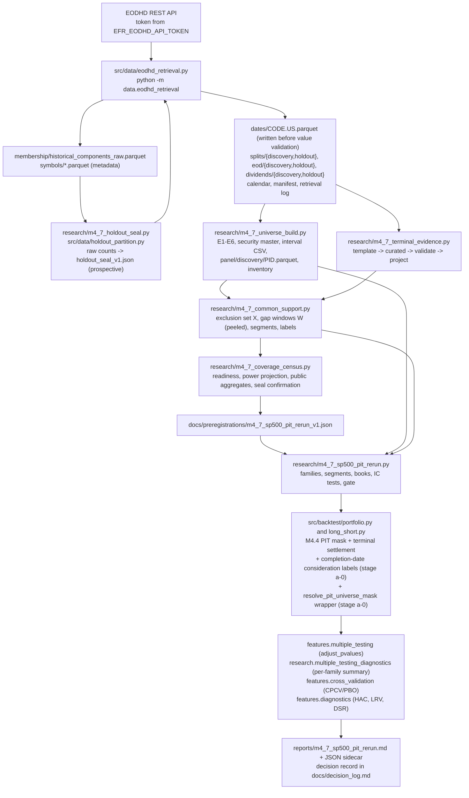
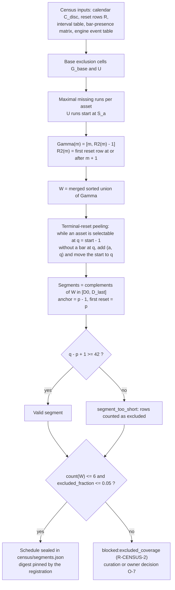
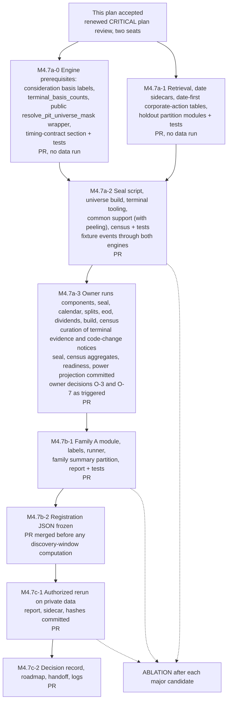

# Milestone 4.7 Binding Implementation Plan (Revision 10)

Survivorship-Reduced S&P 500 Point-in-Time Universe and Pre-Registered Rerun.

| Field | Value |
| --- | --- |
| Task/attempt | `v8-design-m47-plan-a10` |
| Route | `DESIGN` (Coordination Standard V8.4, `may_author_plan = true`) |
| Author session | Claude Opus 5.5 (`claude-opus-5-5`) via Claude Code; card binding `OPUS_LATEST`, effort `high`, normal service tier (the effective harness setting is coordinator dispatch evidence) |
| Card | `coord/v8_review_20260923/card_design_m47_binding_plan_v10.md` |
| Supersedes | Revision 9 candidate, SHA-256 `2640ddfe77e74a5c69e403428f35a5018dd0036d518bdca4c38b78928a99623f`; Revision 8 candidate, SHA-256 `ac37a3a7ad51001eb66f006f1cc21f2cbf19a85a1a156e2f2e605f5a1da9a084`; Revision 7 candidate, SHA-256 `63643d1a8b4cb4c89ac48fe611c472400c40fd5989b2e061e7c37aab66a09ac3`; Revision 6 candidate, SHA-256 `141fe46ef86e31f63a18a95f5bc5eb8fc1315ad8a0a0849b341bda7fa212ac4b`; Revision 5 candidate, SHA-256 `fed6cb86eda33bf6154958018eb1924dcc4a7e807a6325378b770ad580c89a5f`; Revision 4 candidate, SHA-256 `b3bde713777da55c2883a19eb37261315ca1fb404bcfcf94fd5b9f85f8f55fdb`; Revision 3 candidate, SHA-256 `25bb7e7c6716f0d9a216a542c3882dd9492ef9388240a6b0ee70a6cf7540da41`; Revision 2 candidate, SHA-256 `bdc9194be2552fd77537cae773089d6a07ea59e7f8800d5fb4c3719a283770b7`; Revision 1 candidate, SHA-256 `466d44d215c960604d061fb3a22d5fb4172046004c76011d418643473a305424` |
| Resolves | Round 9: `coord/reports/v8_review_20260923/audit_m47_plan_gpt6astra_a9.md` (M9-01, M9-02, M9-03, A9-01, A9-02) and `coord/reports/v8_review_20260923/audit2_m47_plan_opus_a9.md` (OA9-A1 through OA9-A4); the first table of section 0.7 maps each finding to its contract and test. Round 8 resolutions are carried forward in the second table of section 0.7, Round 7 in the third, Round 6 in section 0.8, Round 5 in section 0.9, Round 4 in section 0.10, Round 3 in section 0.11, Round 2 in section 0.12, and Round 1 in section 0.13 |
| Baseline | `main` at `49eacdd` (PR #261 merged: AUDIT-M4-01 and AUDIT-M4-02 repaired) |
| Lane | CRITICAL; structural reasons `ARCHITECTURE`, `SCHEMA_PROTOCOL_CONTRACT`, `CANONICAL_MIGRATION` |
| Plan status | Candidate for renewed CRITICAL plan review (`review_seats.CRITICAL`: `AUDIT` and `AUDIT_2`, two fresh, model-diverse seats) and the independent ABLATION pass |
| Evidence ceiling | `DIAGNOSTIC_ONLY` for every M4.7 artifact; `formal_*_eligible` flags stay `false` |
| Candidate identity | SHA-256 of this file as frozen by the coordinator at acceptance |

This plan binds the architecture, contracts, statistical protocol, and phase
gates of Milestone 4.7. Implementation executes the accepted version. A change
to a key direction, interface, scope, or assumption requires an updated plan
and renewed acceptance before affected implementation continues. Ordinary
implementation detail within the stated bounds proceeds without a revision.

## 0. Objective, Governing Inputs, Scope, And Revision Record

### 0.1 Objective

M4.7 measures, with stated power and without survivorship, whether any
pre-registered monthly-horizon factor carries cross-sectional predictability in
the S&P 500 point-in-time universe, and whether that predictability survives
explicit costs in a long-short book (`docs/current_roadmap.md`, Milestone
4.7). The rerun produces exactly one registered program decision at the gate
in section 6.9.

### 0.2 Governing inputs

| Source | What it binds here |
| --- | --- |
| `AGENTS.md` R1–R12 | Every contract below; a known defect stays a defect when a caveat is added |
| `docs/north_star.md` | Edge thesis premia; SPY and equal-weight PIT benchmarks; each pre-registration states a target information ratio, a tracking-error budget, and a maximum drawdown budget; kill criterion: no BY survivor at 5% in an adequately powered family, where adequate power is a minimum detectable mean monthly Rank IC of 0.02 or better; an underpowered null extends history or breadth first |
| `docs/current_roadmap.md:159-199` | Steps 1–7, including `known_at == effective_date` for vendor membership, Family A of at most ten factors, BY at 5% per family, CPCV/PBO on long-short and excess-return families, stock consideration valued at the effective-date close, and the realized-power form of the kill criterion in step 7 |
| `coord/reports/v8_review_20260923/audit_preflight_m42_m44_opus.md` | AUDIT-M4-07 (family partition, mandatory `family_size`), AUDIT-M4-08 (announcement-date `known_at`, a distinct stock-consideration basis label, runner-side window splitting), AUDIT-M4-09 (supply `constituent_intervals` directly), AUDIT-M4-10 (coerced long-short metrics) |
| `coord/reports/v8_review_20260923/audit_m47_plan_gpt6astra_a9.md`, `coord/reports/v8_review_20260923/audit2_m47_plan_opus_a9.md` | The three MATERIAL and two ADVISORY findings of the AUDIT seat (Codex M9-01, M9-02, M9-03, A9-01, A9-02) and the four ADVISORY findings of the AUDIT_2 seat (Opus OA9-A1 through OA9-A4) on Revision 9; M9-02 and OA9-A3 report one share-basis gap; the first table of section 0.7 maps each to its resolution and test |
| `coord/reports/v8_review_20260923/audit_m47_plan_gpt6astra_a8.md`, `coord/reports/v8_review_20260923/audit2_m47_plan_opus_a8.md` | The three MATERIAL and two ADVISORY findings of the AUDIT seat (Codex M8-01, M8-02, M8-03, A8-01, A8-02) and the two MATERIAL and four ADVISORY findings of the AUDIT_2 seat (Opus OA8-M1, OA8-M2, OA8-A1 through OA8-A4) on Revision 8; M8-02 and OA8-M1 report the in-span half of one basis gap, and M8-03 and OA8-M2 report one membership-coverage gap; the second table of section 0.7 maps each to its resolution and test |
| `coord/reports/v8_review_20260923/audit_m47_plan_gpt6astra_a7.md` | The two MATERIAL and three ADVISORY findings of the AUDIT seat on Revision 7 (Codex M7-01, M7-02, A7-01, A7-02, A7-03); the third table of section 0.7 maps each to its resolution and test |
| `coord/reports/v8_review_20260923/review_m47_plan_gpt6astra_a6.md`, `coord/reports/v8_review_20260923/audit_m47_plan_opus_a6.md` | The one MATERIAL and one ADVISORY finding of the REVIEW seat (Codex M6-01, A6-01) and the two MATERIAL and five ADVISORY findings of the AUDIT seat (Opus MA6-1, MA6-2, A6-1 through A6-5) on Revision 6; Codex M6-01 and Opus MA6-2 report one issue; section 0.8 maps each to its resolution and test |
| `coord/reports/v8_review_20260923/review_m47_plan_gpt6astra_a5.md`, `coord/reports/v8_review_20260923/audit_m47_plan_opus_a5.md` | The one MATERIAL and six ADVISORY findings on Revision 5 (Codex A5-01; Opus MA5-1 and A5-1 through A5-5); section 0.9 maps each to its resolution and test |
| `coord/reports/v8_review_20260923/review_m47_plan_gpt6astra_a4.md`, `coord/reports/v8_review_20260923/audit_m47_plan_opus_a4.md` | The three MATERIAL and six ADVISORY findings on Revision 4 (Codex A4-01 and Opus A4-1 report one issue); section 0.10 maps each to its resolution and test, or records its carried disposition |
| `coord/reports/v8_review_20260923/review_m47_plan_gpt6astra_a3.md`, `coord/reports/v8_review_20260923/audit_m47_plan_opus_a3.md` | The three MATERIAL and seven ADVISORY findings on Revision 3; section 0.11 maps each to its resolution and test |
| `coord/reports/v8_review_20260923/review_m47_plan_gpt6astra_a2.md`, `coord/reports/v8_review_20260923/audit_m47_plan_opus_a2.md` | The nine MATERIAL and thirteen ADVISORY findings on Revision 2; section 0.12 maps each to its resolution and test |
| `coord/reports/v8_review_20260923/review_m47_plan_gpt6astra.md`, `coord/reports/v8_review_20260923/audit_m47_plan_opus.md` | The eighteen MATERIAL and eleven ADVISORY findings on Revision 1; section 0.13 carries their resolutions forward |
| `docs/decision_log.md`, 2026-09-23 entries | D1 retrieval authorization under the written terms; D3 holdout is the earliest available unexamined decade; D7 terminal-evidence standard (documented cash consideration, stock consideration valued at the effective-date close, window splitting for unresolvable events); D9 audit reports stay local; credential convention `EFR_EODHD_API_TOKEN` |
| `docs/stage1_accepted_public_record_v1.json` | Written terms: local retention permitted, raw upload forbidden, noncommercial aggregates, hashes, and counts permitted; `historical_ticker_components: AVAILABLE` |
| `docs/signal_execution_timing_contract.md` | Target freeze, strict incoming-price and execution-price validation, TIMING-005 (a month-end execution consumes the immediately preceding source-row signal under lag one), TIMING-012 (the last observed row of an incomplete bucket is a disclosed reset with open post-trade holdings), `terminal_row_policy = include_return_trade_cost_open_holdings_no_future_return`, the M4.4 terminal-cash section this plan extends |
| `docs/point_in_time_data_methodology_contract.md` | Membership, security-master, terminal-value, benchmark, and holdout-exposure semantics; PIT-012 classifies price, benchmark, and corporate-action data over a protected window as outcome-reconstructible; metadata-only intake preserves a sealed classification only when allowlisted fields cannot reconstruct outcomes and access is recorded prospectively |
| `src/data/constituent_table.py`, `src/data/parquet_loader.py`, `src/backtest/portfolio.py`, `src/backtest/long_short.py`, `src/features/cross_validation.py`, `src/features/multiple_testing.py`, `src/features/diagnostics.py`, `src/features/combination.py`, `src/features/ml_combination.py`, `research/multiple_testing_diagnostics.py`, `research/multifactor_diagnostic_mvp.py`, `research/real_data_multifactor_diagnostic.py`, `research/walking_skeleton_mvp.py` | The interfaces M4.7 consumes; every engine or helper change is named in section 7 |

### 0.3 In scope

1. A network-capable EODHD retrieval module with the `EFR_EODHD_API_TOKEN`
   contract, private caching under `EFR_EODHD_DATA_DIR`, typed failure modes,
   a date-only sidecar per code written before any value validation,
   date-first parsing and write-time partition of every price, split, and
   dividend table at the sealed holdout boundary with per-partition value
   validation, split evidence scoped to the discovery partition and retrieved
   before price validation, an index calendar retrieved only after the seal
   exists, one status per code and table with a resume rule, one canonical
   command sequence, an offline retrieval-completeness check, and an offline
   owner disposition for a provider error that persists across resumed
   invocations, with one authoritative generation per code and table and
   manifest-authorized downstream reads.
2. A prospective holdout seal derived from raw vendor membership counts before
   any price file exists in the snapshot, with acyclic prospective and
   confirmed identities.
3. A security master and M4.4 interval table built from
   `HistoricalTickerComponents` with permanent IDs, fail-closed identity rules
   E1–E6 (E6 requiring affirmative identifier continuity), each interval
   decided on its own bars before any code-level rule applies, `known_at`
   equal to the vendor effective date, boundary semantics stated on calendar
   rows, and corporate actions attributed to listing episodes so that no
   permanent security's adjustment factor depends on another security's
   action, with a split-basis check at the last bar of every episode with a
   discovery bar that writes the panel only when a declared split pattern
   explains the constant beyond the last bar exactly and no competing pattern
   stays feasible, an in-span step check at every pair of consecutive
   discovery bars that refuses the panel whenever the vendor's own series
   contradicts the declared splits and distributions dated between them, with
   every distribution amount compared on the share basis of its own date, a
   cumulative check that bounds the accumulated unexplained drift of the split
   basis on every written row, the vendor-data premises on which the volume
   basis rests named and their exposure measured, one
   entry rule for exactly repeated and overlapping membership entries shared
   with the holdout seal, and one interval-results record per raw membership
   entry.
4. A terminal-evidence table under Decision D7, a validator, an engine
   projection, two new basis labels valued at the completion-date row (the
   effective-date close Decision D7 names, which is the target's last bar or
   the settlement row), a curation rule for renames and successor codes, and
   the engine changes that accept them, delivered as a prerequisite stage
   before any consumer.
5. A common evaluation support: one calendar, one exclusion set, one gap-window
   and segment schedule shared by every trial, both benchmarks, and every
   CPCV matrix, derived from the census before any factor value exists and
   covering every reset the bounded engine calls execute, including
   segment-terminal resets.
6. A coverage census with derived readiness including retrieval
   completeness, a power projection, typed and capped unpriced eligible
   member-days that include the members the vendor returned no bars for, the
   intervals with no bar in their own span, and the member-days of refused
   overlapping membership entries, a gate on membership entries whose
   member-days cannot be computed, a discovery-only measurement of the
   vendor's volume basis at declared splits with a median and a tail stop
   rule, the exposure of written panels to the distribution premise, and the
   holdout confirmation.
7. A pre-registration in JSON with Family A (six price-only edge-thesis
   factors), Family B (fifty-two WorldQuant-101 alphas and eleven composites),
   locked family sizes, the Rank IC primary hypothesis on terminal-aware labels
   aligned row for row with the books, costs, benchmarks, objective budgets,
   halves, MDE, and a total decision gate whose kill outcome follows realized
   power.
8. The rerun through a new entry module that reuses the existing engines,
   loaders, estimators, and trial records, with per-family BY at 5%, CPCV/PBO
   on long-short and excess-return families, excess metrics, and code identity.

### 0.4 Out of scope

Capacity curves, the style-risk model on the PIT universe, new ML combiners,
new composites, fundamentals ingestion, EDGAR lineage, reconciliation of the
vendor's split and dividend tables against an independent event source (the
split-basis and in-span step checks of section 2.2 compare the vendor's
tables with the vendor's own served series only), the 37-event ledger, a delayed-receivable
settlement engine, terminal liquidation at segment ends, a typed-missing-cell
loader contract (the strict `load_eod_parquet` contract stays), formal
promotion, and brokerage of any kind
(`coord/reports/strategic_audit_opus_5_5.md` section 6.4). Value and quality
factors enter a new pre-registration in M4.8 when fundamentals exist; they hold
no slot in the M4.7 family.

### 0.5 Authority notes

D1 authorizes retrieval under the existing plan and written terms with no
purchase. The a-3 census run and the c-1 result-bearing run read private data
and each needs the owner's explicit one-line authorization recorded in the
engineering log before dispatch (R11). Publication of each PR follows the
owner's standing same-change grant in `AUTHORITY.md`. Nothing in this plan
expands authority. Owner decisions O-1 through O-8 in section 7.6 are the only
semantic choices this plan leaves open. Revision 10 opens owner item O-8: the
snapshot cannot establish the split basis of the rows before a declared
distribution without the premise that the vendor applies that distribution
as a non-split adjustment (section 2.2, C80), so the owner ratifies that
premise, with its exposure measured at a-3, or chooses per-episode
withholding or an independent event source. Revisions 3 through 9 open no new
owner item: the effective-date valuation of stock consideration under Decision
D7 holds by construction at both accepted completion-date conventions (section
3.3), the kill criterion follows the North Star's realized-power text (section
6.9), and Revision 5's episode-scoped corporate actions, retrieval-completeness
rule, and survivorship accounting fail closed into counted coverage that the
existing owner item O-7 and the resumable retrieval commands already govern,
and Revision 6's disposition of a persistent provider error extends O-7 (the
owner records the terminal status and its coverage cost) instead of opening a
new item; Revision 7's universal identity trigger, per-interval precedence,
and rename-trigger extension fail closed into the same counted coverage, its
candidate-list filter corrects the liveness of the O-7 stop condition, and its
engineering-log content rule narrows what an O-7 disposition records in the
repository under R11 and grants nothing; Revision 8's split-basis check
refuses into the same counted R-CENSUS-9 coverage that O-7 governs, and its
generation and interval-results rules change bookkeeping and no semantic
choice; Revision 9's in-span step check, its narrower last-bar support, and
its overlap accounting refuse into the same counted R-CENSUS-9 coverage, its
gate on membership entries whose member-days cannot be computed
(R-CENSUS-11) routes to the existing O-7 coverage decision, and its
volume-basis diagnostic returns the plan for revision when it contradicts the
vendor model, which is an acceptance gate and no owner choice. Revision 10's
share-basis rule and cumulative check refuse into the same counted R-CENSUS-9
coverage, and its remaining changes restate effects, tests, and parsing
edges.

### 0.6 Revision record

Revision 10 changes these key directions relative to Revision 9. Each change
names the findings that required it.

| # | Change | Findings |
| --- | --- | --- |
| C80 | The split basis of the rows before a declared distribution is identified only through a named vendor-data premise, and the plan states it, measures its exposure, and routes its ratification to the owner: the served fields fix at each pair only `w_ab = q_ab / (phi_ab * f_ab)`, so at a pair whose declared distribution the series reflects, a history in which the vendor applied an undeclared split of ratio `s` in `(1, 1 / delta_ab]` and left the distribution unapplied to the same extent serves identical `close`, `adjusted_close`, and `volume` (the M9-01 witness at `s = 1 / 0.98`), and at every pair a history with an undeclared split and an undeclared distribution of equal factor does; a rule that reads the snapshot therefore establishes the split basis of those rows only under premise VP-2 (the vendor applies each declared distribution as a non-split adjustment, and no other), beside premise VP-1 (the vendor's volume carries the split adjustment its prices carry, tested by C79 and C85); withholding every episode that depends on VP-2 refuses every distribution payer, and a population test of VP-2 on turnover around ordinary dividends has no usable power (pooled slope standard error 0.36 at 20,000 synthetic events, section 0.14); the build keeps the per-pair distribution support of C73, the census reports `in_span_distribution_support` (the written episodes with at least one declared-distribution pair, their member-days and fraction of eligible member-days, and the quantiles over written member-days of `B_D(t)`, the largest `-ln delta_ab` of a declared-distribution pair of the episode dated after row `t`, which bounds the turnover error one mistyped distribution imposes on that row), the report header states both premises with that exposure, and new owner item O-8 ratifies VP-2 at plan acceptance or chooses per-episode withholding (a plan revision whose coverage cost the count states) or an independent event source (new data authority); A4 is restated as VP-2, the residual paragraph and the ablation record name the premise, and T-UNI-17 (g) pins one outcome for the witness, its near match, and its same-served-fields twin | Codex M9-01 |
| C81 | Each distribution amount is compared with a reference price on its own share basis: for the attributed events of the episode dated in `(date(a), date(b)]`, taken in date order with a split before a distribution dated the same day, `delta_ab = prod_i (1 - amount_i / P_i)` with `P_i = close(a) * prod_{j < i} (1 - amount_j / P_j) / phi_i` and `phi_i` the product of the attributed split ratios dated in `(date(a), date(i)]`, which is the pre-event price per share of the basis on which the distribution is paid when the market does not move; `unadjustedValue` is the amount per share of the basis in effect on the row's date, splits dated that day included; `value` serves only when no discovery split row of the code is dated on or after the row (C74 said after), because a same-date split leaves the adjustment of `value` undetermined; `delta_k` uses the same construction from `close[prev_bar(i)]`; a vendor that states a same-date amount on the pre-split basis fails the pair and the episode is refused, the fail-closed outcome for an unresolvable basis; with one distribution and no split in the pair the factor equals C74's `1 - amount / close(a)`; the correct 2-for-1 split with a 1 dollar dividend per new share, a 1-for-2 reverse split with a dividend, and a pair holding a dividend, a split, and a second dividend pass with turnover/raw `1.0`, and the audit's wrong-basis admission (applied `200 / 101` against a declared 2) is refused with residual `0.0101` | Codex M9-02, Opus OA9-A3 |
| C82 | A cumulative check bounds the accumulated unexplained drift of the split basis on every written row: for an episode whose pairs all pass C73, `c(t) = sum over the pairs (a, b) of the episode with date(a) >= date(t) of ln(w_ab * delta_ab)`, which telescopes to `ln(y(last_bar_k) / y(t)) + sum ln delta_ab` and so carries price rounding from two endpoints only; the episode is refused `episode_panel_refused:split_basis_unverified:cumulative_basis_drift` when `max_t abs(c(t)) > 2e-3`, the telescoped rounding allowance of A1 at an adjusted level of 0.05; `delta_ab` in both checks uses one registered distribution formula per snapshot, the prior-close formula of C81 or the ex-date formula `1 - amount_i / (P_i - amount_i)`, whichever lets more episodes with a declared-distribution pair pass both checks, prior-close on a tie, recorded as `dividend_factor_formula` in the build manifest, because a vendor applies one formula and the two differ by the squared yield per distribution, which accumulates; the in-span proof no longer needs A5 (a minimum split separation): under A1–A3 and VP-1, VP-2 every written row has `abs(ln(Q / F)) <= 2e-3` plus the rounding of its own and the last bar's `y`; Codex's `1.0009 ** 159` witness (turnover/raw `1.1538`, `max abs(c) = 0.1430`), its reverse, a gradual forward-then-reverse cancellation (`0.0711`), and three `1.0009` steps are refused, one or two steps and a two-step cancellation are written within the bound, and T-UNI-17 (a)'s single `1.0009` step is written with turnover/raw `1.0009` inside it | Codex M9-03 |
| C83 | Carried oracles are restated against C73 and the current registration: T-UNI-15 (b)'s 3-for-1 perturbation, whose served values still step by 2, keeps episode 1 byte-identical and refuses episode 2 `in_span_step_mismatch` with kind `declared_split_pair` and residual `1/3`, its member-days under `no_discovery_panel` and R-CENSUS-9; a separate consistent 3-for-1 control (close 150 to 50, adjusted close 50 throughout, volume 3,000 to 1,000) is written with factor `3.0` before the split; the Revision 5 evidence row of section 0.14 that reports factor `3.0` is scoped to its revision; `corporate_action_attribution` becomes `episode_span_attribution_with_split_basis_in_span_step_and_cumulative_drift_checks_v3` and the in-span dividend factor `one_minus_amount_over_own_basis_reference_price_v3`, because C81 and C82 change the rule, and T-REG-1, section 1.6 step 7, and Appendix C read the same strings | Codex A9-01 |
| C84 | A `--refresh` of a table disposed `unavailable:persistent_provider_error` follows C77: an attempt ending `provider_error` commits nothing, keeps the terminal status, the generation, and the authorized files, extends `provider_error_history`, appears under `refresh_not_committed`, leaves `retrieval_complete` and the generation vector unchanged, and needs no new disposition, because the status stays terminal and the table never re-enters `persistent_provider_error_candidates`; an attempt returning 200, 404, an empty list, or a malformed body commits a new generation with that outcome's status; section 1.3's disposition paragraph is restated and T-RET-17 (g) gains the disposed variant | Codex A9-02 |
| C85 | C79's stop rule gains a tail criterion: `a1_volume_half = contradicted` when at least 10 qualifying rows give a median `ell` above 0.5, or when at least 10 qualifying rows with `abs(ln ratio) >= ln 2` exist and more than 20 percent of them give `ell` above 0.5; the diagnostic reports that share beside the median and quartiles; on a split-adjusted synthetic null with 20-bar medians of log-normal daily volume the per-row rate of `ell > 0.5` at ratio 2 is 0.1 to 3.5 percent for daily log standard deviations 0.3 to 0.5 and 10 percent at 0.7, so twelve such rows falsely contradict with probability 0.7 percent at 0.5; T-CENSUS-10 (e) states that its fixture's raw share volume scales with the split ratio (economic turnover continuous) and adds the mixed fixtures (3, 4, 5, and 6 of 12 rows with raw volume all `contradicted`, 2 of 12 `consistent`) | Opus OA9-A1 |
| C86 | The effects of unavailable dividend evidence are restated wherever the plan lists them: with `dividends_status` other than `retrieved` with a valid discovery partition, `delta_ab = 1` on every pair, so every episode whose series steps at a distribution by more than `1e-3` is refused `in_span_step_mismatch` (kind `undeclared_step`, or `declared_split_pair` when a split row shares the pair) and routes its member-days to R-CENSUS-9; with unavailable split evidence every episode whose series steps at a split by more than `1e-3` is refused the same way; the cumulative check of C82 applies with the same factors; section 1.3's `dispose` effects, the two risk-register rows, and O-7 say so, and the C66 engineering-log entry of a disposition counts the member-days of the panels the disposition removes through C73 and C82 | Opus OA9-A2 |
| C87 | The shared entry rule's edges and the components response are fixed: an `EndDate` is open when empty, null, absent, or strictly after the components retrieval date (`components_retrieved_utc_date` in the manifest), and an `EndDate` equal to that date is a closed interval, in C75, section 1.4, and section 1.6 alike; E3 compares each collapsed copy's normalized name with its retained entry's, and a difference fires `ambiguous_reuse_continuous_history` for the code when the retained entry has bars in its span, because two names then claim one continuous span; `components` refuses the invocation with `components_malformed` when the body is not a JSON object whose `HistoricalTickerComponents` is a list or object of entry objects, and with `components_empty` when it holds no entry, keeping the raw bytes and writing no membership file, so the seal and every later command refuse with `holdout_seal_missing` | Opus OA9-A4 |

Revision 9 changes C72–C79 stand except where a Revision 10 row amends them:
C73's dividend factor by C81, its dividend formula and its reliance on A5 by
C82; C74's `value` fallback by C81; C75's open predicate and E3 reading by
C87; C77's refresh outcome for a disposed table by C84, which restates section
1.3; C79's stop rule by C85. C72 stands unchanged.

Revision 9 changes (carried):

| # | Change | Findings |
| --- | --- | --- |
| C72 | The split-basis check at the last bar (C67) supports an explanation only when a declared split pattern explains the constant exactly: `supported(e)` is `abs(d - 1) <= 1e-6` alone for every episode, so no reconstructed dividend factor admits a last-bar deviation; the explanations, the sign-bound feasibility with `P_k`, the decision table, and every C67 refusal code are unchanged, and the outcomes `unapplied_dividend_supported` and `applied_dividend_supported` are removed; `delta_k` stays in `resolution_evidence` and feeds only the census count `split_basis_refusals_matching_dividend_factor` (refused episodes whose required non-split factor matches `delta_k` within `1e-3`), which measures the coverage cost for owner item O-7 and admits nothing; the audit's exact-match, near-match, and dividend-only twin fixtures and T-UNI-15 (h)'s carried-back dividend control are refused `split_basis_unverified:unexplained_deviation`, and T-UNI-15 (i)'s `g_1 = 1 + 2e-6` variant becomes `unexplained_deviation` | Codex M8-01 |
| C73 | An in-span step check runs for every episode with a discovery bar over every pair `(a, b)` of consecutive on-calendar discovery bars of the episode: with `y(t) = F(t) * adjusted_close(t) / close(t)` and `F` the factor the build would write, `w_ab = y(b) / y(a)`, and `delta_ab` the product of `1 - amount_i / close(a)` over the discovery dividend rows attributed to the episode and dated in `(date(a), date(b)]` (1 when there is none or when the code's dividend evidence is unavailable; undefined when a row's amount is undefined or a factor lies outside `(0, 1]`), the pair passes when `delta_ab` is defined and `abs(w_ab * delta_ab - 1) <= 1e-3`; one failing pair refuses the panel `episode_panel_refused:split_basis_unverified:in_span_step_mismatch`, so a declared split row the vendor's own series contradicts (no step, another size, another bar pair), an undeclared split of any size above the tolerance, and a declared distribution the series does not reflect all refuse; dividend rows are attributed to episodes by the C45 position rule and enter only the pairs of their own episode; the check runs after the last-bar check and before the gap-dated refusal, reads discovery rows only, and keeps the retrieval-stage 15 percent rule; the refused episode keeps its permanent ID, intervals, and exit class, and its member-days count under `no_discovery_panel` and R-CENSUS-9; the census records failing pairs by kind (`declared_split_pair`, `declared_dividend_pair`, `undeclared_step`) and by residual | Codex M8-02, Opus OA8-M1 |
| C74 | A dividend row's amount for `delta_ab` and `delta_k` is its `unadjustedValue` against the raw `close` of the previous on-calendar bar; when `unadjustedValue` is absent or non-finite, `value` serves only if no discovery split row of the code is dated after the dividend, because both bases then coincide; otherwise the amount is undefined; `P_k` keeps `value > 0`, a sign no split adjustment changes; retrieval keeps every vendor field verbatim and validates `value` as before | Opus OA8-A1 |
| C75 | The seal and the build share one entry rule: entries parse into `(vendor_code, start_date, end_date_or_open)` (open for an empty, null, absent, or future `EndDate` against the components retrieval date); entries with an equal parsed triple are exact duplicates and collapse to the first in raw-table order in both stages; the build records each copy in `identity/interval_results.csv` with `resolution = exact_duplicate_collapsed`, `duplicate_of` naming the retained `interval_id`, `member_days_disc = 0`, and `census_cap = none`, and E3 and E6 read the fields of every raw entry, copies included; after the collapse, entries of one code whose half-open date intervals intersect are refused `raw_overlap` in both stages (excluded from `n_raw`; no interval), and the census counts the union over each code's refused entries of the cells `[m_in, m_out)` inside `[D0, D_last]` under `eligible_unpriced_member_days:raw_overlap` in the R-CENSUS-9 numerator and denominator, with `census_cap = R-CENSUS-9` on those rows; `degenerate_interval` has zero member-days by construction; `entry_missing_field` and `entry_unparseable_date` block readiness under the new R-CENSUS-11, whose unblock is owner item O-7 | Codex M8-03, Opus OA8-M2 |
| C76 | `interval_id` is `<quote(Code)>/<StartDate>/<EndDate or open>/<n>` for an entry whose `Code` and `StartDate` are present and whose present dates parse strictly: the dates are the vendor's strings, `open` replaces an empty, null, or absent `EndDate` only, a future `EndDate` is written verbatim, `Code` passes through `urllib.parse.quote(code, safe="")`, and `n` counts equal keys in raw-table order; every other entry is keyed `raw_row/<index>`; each key splits on `/` into its fields | Opus OA8-A4 |
| C77 | C70's edge contracts: the manifest keys each code and table entry by `<table>/<CODE>.US` and its `authorized_files` by role (`raw`, `dates`, `discovery`, `holdout`, `quarantine_discovery`, `quarantine_holdout`), each with `path`, `sha256`, `bytes`, and `rows` (Appendix A); T-SEAL-4's permitted set is restated on those paths; reconciliation moves a committed generation's leftover files to `superseded/<table>/<CODE>.US/g<N>/` and every other unauthorized file to `superseded/<table>/<CODE>.US/uncommitted/<m>/`, `m` the sequence number of its `reconciliation_retired` log record, and no move overwrites; a `--refresh` of a table with a terminal status that ends `provider_error` commits nothing, keeps the current generation and status, extends `provider_error_history`, and appears under `refresh_not_committed` in `verify`; `generation_vector_sha256` hashes `(code, table, generation, table status)` with partition statuses excluded; the `generation_committed` log record carries `(table, code, generation, status)` and no hash; `unauthorized_artifact_present` is removed, because reconciliation precedes every `verify` | Codex A8-02, Opus OA8-A2 |
| C78 | T-RET-17 (e) states separate oracles: a 404 refresh of `splits` or `dividends` commits `unavailable:missing_symbol` with the raw response alone, the split-basis, in-span, and terminal basis checks read the table as unavailable evidence, and a `splits` refresh makes `verify` report `split_evidence_stale` for the code's `eod`; an empty-list refresh commits `retrieved` with valid zero-row discovery and holdout partitions, the checks read valid evidence of no rows (no `P_k` from that table, no `corporate_action_evidence_missing`), and `split_evidence_stale` fires exactly when the formerly authorized discovery split partition held a row | Codex A8-01 |
| C79 | The a-3 census reports a discovery-only volume-basis diagnostic for the vendor model's volume half: over attributed in-span split rows of written episodes with `abs(ln ratio) >= ln 1.25` and 20 on-calendar discovery bars of the episode on each side, `ell = ln(median dollar turnover over the 20 bars from the split / median over the 20 bars before) / ln(ratio)` with dollar turnover `split_close * volume` under the written factor; `ell` clusters near 0 under split-adjusted vendor volume and near 1 under raw vendor volume; with at least 10 rows a median `ell` above 0.5 stops a-3 and returns the plan for revision, and fewer rows are reported `insufficient` | Opus OA8-A3 |

Revision 8 changes C67–C71 stand except where a Revision 9 row amends them:
C67's dividend support by C72 and its within-episode scope by C73; C67 and
C68's dividend field by C74; C70's manifest schema, retirement paths, refresh
outcomes, and generation vector by C77; C71's entry handling, `census_cap`
values, and key by C75 and C76.

Revision 8 changes (carried):

| # | Change | Findings |
| --- | --- | --- |
| C67 | One split-basis check replaces the terminal-scale identity, its C59 trigger, and the C53 identity: at the last bar of every episode `k` with a discovery bar, whether or not a later split row exists, let `g_k = adjusted_close / close`, `rho_k` the product of the code's discovery split ratios dated after `last_bar_k` (1 when none), and `P_k` true when the code's dividend evidence is unavailable or its valid discovery dividend partition holds a row with `value > 0` dated after `last_bar_k`; the unapplied explanation (split basis 1, required non-split factor `d = g_k`) and, when `abs(rho_k - 1) > 1e-6`, the applied explanation (split basis `rho_k`, `d = g_k * rho_k`) are each supported when `abs(d - 1) <= 1e-6` or the dividend factor `delta_k` reconstructed from those rows gives `abs(d / delta_k - 1) <= 1e-3`, and feasible when supported or when `P_k` holds and `d <= 1 + 1e-6`, because a non-split adjustment never raises an earlier adjusted price; a non-final episode is written only when the unapplied explanation is supported and the applied one infeasible, a final episode is `excluded_unapplied` or `attributed_applied` only when that explanation is supported and the other infeasible, and every other episode is refused `cross_episode_adjustment`, `split_attribution_ambiguous`, or `split_basis_unverified:<unexplained_deviation|explanations_disagree>`, keeps its permanent ID, intervals, and exit class, and counts under R-CENSUS-9; `delta_k` can support an explanation and never excludes one | Codex M7-01, M7-02 |
| C68 | Consumers of the replaced identity are restated against C67: the terminal basis check keeps `abs(adjusted_close(L) / close(L) - 1) <= 1e-6`, which now certifies an unchanged split basis because a target C67 wrote with that equality has an infeasible applied explanation, and an `attributed_applied` target always fails it; the universe build reads the manifest's `dividends_status` and the discovery dividend rows dated after each episode's last bar, so `dividends` precedes the build as well as `validate`; `resolution_evidence` records `split_basis:<outcome>` with `g`, `rho`, `delta`, and the dividend-evidence state; the build manifest and census replace `terminal_scale_identity_by_outcome` and `identity_deviation_without_later_split_row` with `split_basis_check_by_outcome`; section 0.4 narrows the event-level reconciliation exclusion | Codex M7-01, M7-02 |
| C69 | C63's coverage statement names both effects of an `attributed_applied` delisting candidate in `U`: its cell `(a, S_a)` starts the gap window `Gamma(S_a)`, whose calendar rows count in `excluded_rows` under R-CENSUS-2, and its later `M`-true member-days outside `X` stay under `eligible_unpriced_member_days:after_unresolved_disappearance` and R-CENSUS-9; the two measures have different units and denominators and both apply; T-UNI-15 (f) asserts both on one fixture | Codex A7-01 |
| C70 | One authoritative generation per code and table: every retrieval artifact of a code and table is written once under a generation-qualified file name and never rewritten; the manifest entry names the current generation, its status, and its authorized files with SHA-256; an atomic manifest replace is the only commit point of a transition, after which the prior generation's files move to the private `superseded/` tree; every retrieval command first reconciles the snapshot by moving any file the manifest does not authorize into that tree; downstream stages open only manifest-authorized files whose bytes verify; every derived artifact records `generation_vector_sha256`, and the terminal tooling, common support, census, and runner refuse `derived_artifact_stale` when it differs from the current manifest's; an interrupted transition leaves the complete prior generation or the complete new typed state | Codex A7-02 |
| C71 | Per-interval results live in `identity/interval_results.csv`, one row per raw membership entry keyed by `interval_id = <vendor_code>/<start_date>/<end_date or open>/<n>` (`n` the occurrence among identical triples in raw-table order; `raw_row/<index>` for an entry lacking `Code` or `StartDate`), with the permanent ID, the per-interval resolution and evidence, `bars_in_span`, boundary rows, exit class, member-days in `[D0, D_last]`, and the census cap; `identity/security_master.csv` holds one row per `(vendor_code, episode)` with episode-level fields only; episode counts come from the master, interval counts, exit classes, and member-day numerators from the interval results, and the terminal template holds one row per permanent ID with a `delisting_candidate` interval | Codex A7-03 |

Revision 7 changes C59–C66 stand except where a Revision 8 row amends them:
C59 (the identity trigger) and the identity of C63 are replaced by C67; C63's
coverage statement by C69; C65's dependencies by C68, which adds `dividends`
before the universe build.

Revision 7 changes (carried):

| # | Change | Findings |
| --- | --- | --- |
| C59 | The terminal-scale identity has one trigger: for every episode `k` with at least one discovery bar whose code has a discovery split row dated after `last_bar_k`, wherever that row falls (inside a later episode's span, inside any later E1 gap, or after the code's final bar), the build evaluates `g_k = adjusted_close[last_bar_k] / close[last_bar_k]`; for `k < K`, `abs(g_k - 1) <= 1e-6` passes and the panel's factor comes from `k`'s in-span rows, and any other `g_k` refuses the panel `episode_panel_refused:cross_episode_adjustment`; for `k = K` the C53 decision applies; per episode the order is identity (or C53), then the gap-dated `split_attribution_ambiguous` refusal, then the panel write; `resolution_evidence` records the outcome, the manifest and census count `terminal_scale_identity_by_outcome`, and the census counts `identity_deviation_without_later_split_row`, the disclosed residual of a split the vendor's table omits | Codex M6-01, Opus MA6-2 |
| C60 | E2 decides every interval on its own `bars_in_span` before E3–E6, and its per-interval outcome under (i), (ii), or (iii), or under the two no-bars codes, is final: E3, E4, E5, and E6 evaluate the code's bar history and refuse the intervals E2 resolved (outcome (iv)) together with the code's episodes; an interval with `bars_in_span = 0` keeps `no_containing_episode:no_bars_in_interval`, its member-days stay under R-CENSUS-9, and its `resolution_evidence` records the code-level refusal alongside; R-CENSUS-3 counts the member-days of the intervals that carry an E1–E6 refusal | Opus MA6-1 |
| C61 | `persistent_provider_error_candidates` lists a code and table only while the table's current status is `provider_error` and its `provider_error_history` holds at least three invocations on at least three distinct UTC dates; `dispose` or a successful retry removes the entry while the history stays for audit, so the a-3 stop condition clears | Opus A6-1 |
| C62 | The re-keyed rename trigger also fires for an interval with `bars_in_span = 0` on a code with `eod_status = retrieved` (another company reused the ticker) when another code's membership entry starts on the interval's `EndDate` with an equal normalized name; the refusal `no_containing_episode:rekeyed_rename_candidate` records `eod_status`, `bars_in_span = 0`, and the code's first bar as the reused-code evidence, the member-days stay under R-CENSUS-9, and the section 3.2 link rule reads "no bar inside the old interval's rows" | Opus A6-3 |
| C63 | The C53 decision tests exclusion first, so a ratio product within `1e-6` of 1 (a vendor `1/1` row) is `excluded_unapplied`; an `attributed_applied` final episode has `adjusted_close[L] / close[L] = 1 / rho`, so when it is a `delisting_candidate` the terminal basis check refuses its curated row `terminal_basis_ambiguous` and the candidate enters `U`; the census counts `attributed_applied_delisting_candidates` | Opus A6-2 |
| C64 | The runner repeats the `panel_split_table_present` check over every inventory permanent ID before `load_eod_cohort_panels` and refuses as Class I | Opus A6-4 |
| C65 | One canonical retrieval sequence, `calendar`, `splits`, `eod`, `dividends`, `verify`, governs `all`, standalone commands, a-3, curated additions through `--codes`, and resume; its two dependencies are `splits` before `eod` (`splits_required_before_eod`) and `dividends` before `validate` (the terminal basis check consumes discovery dividend rows and treats an absent `dividends_status` as `corporate_action_evidence_missing`) | Codex A6-01 |
| C66 | The engineering-log entry an O-7 disposition references records counts per table, the affected member-days in `[D0, D_last]`, and the SHA-256 of `dispositions/provider_error_dispositions.csv`; codes, attempt dates, and provider responses stay in the private snapshot (R11) | Opus A6-5 |

Revision 6 changes C52–C58 stand except where a Revision 7 or 8 row amends
them: C52 (interval partition) is amended by C60 and C62; C53 (post-final-bar
decision) by C63 and C67; C55 (step 6 scope and trigger) by C59 and C67; C56
(persistent provider errors) by C61 and C66; C58 (T-UNI-15 values) by C59,
C63, and C67.

Revision 6 changes (carried):

| # | Change | Findings |
| --- | --- | --- |
| C52 | An interval with no bar of its code inside its own rows `[row(start_date), row(end_date))` (through `|C|` for an open interval) is refused `no_containing_episode:no_bars_in_interval` with the code's `eod_status` and `eod_discovery_status` recorded; its member-days in `[D0, D_last]`, computed from `[m_in, m_out)`, count under `eligible_unpriced_member_days:no_bars_in_interval` and R-CENSUS-9 in both numerator and denominator and leave the R-CENSUS-3 numerator; an interval whose span holds bars of one episode and starts more than 20 rows before that episode's first bar stays the identity refusal `no_containing_episode` under R-CENSUS-3; the E2 case list is restated as a partition on `bars_in_span` | MA5-1 |
| C53 | A discovery split row dated after the last bar of a code's final episode is decided by the terminal-scale identity at that bar, because one security is the only candidate: with `g = adjusted_close / close` at `last_bar_K` and `rho` the product of the post-final-bar ratios, `abs(g - 1) <= 1e-6` excludes the rows (`excluded_unapplied`), `abs(g * rho - 1) <= 1e-6` attributes them to the final episode (`attributed_applied`), whose every row then scales by `rho`, and any other `g` refuses the panel `episode_panel_refused:split_attribution_ambiguous`; the census counts `split_rows_after_final_bar` by disposition, apart from gap-dated `split_rows_unattributed` | A5-3 |
| C54 | Exit classes are three mutually exclusive predicates on `(L_a, R_exit(a), D_last)`: `delisting_candidate` when `L_a < R_exit(a)`, `disappearance_outside_membership` when `R_exit(a) <= L_a < D_last`, and `index_removal_still_trading` when `L_a >= D_last`; T-TERM-9 asserts the equality cases `L_a = R_exit(a)` and `L_a = D_last` | A5-01 |
| C55 | Step 6 of the universe build runs the terminal-scale identity and the C53 decision only for episodes with at least one discovery bar; the retrieval-stage scale check compares consecutive on-calendar bars, the projection rule E1 uses; the build refuses `panel_split_table_present` when `load_symbol_splits(panel_dir, PID)` returns a table for any written permanent ID, because the loader prefers such a table over the panel's `split_factor` column (`src/data/parquet_loader.py:120-124`); T-UNI-15 asserts that the loaded factor equals the written column and T-SEAL-3 adds a holdout-ending episode with a later discovery split row | A5-4 |
| C56 | The manifest records `provider_error_history` per code and table; `verify` lists `persistent_provider_error_candidates`, the codes whose table ended `provider_error` in at least three invocations on at least three distinct UTC dates; the offline `dispose` command applies the owner-curated `dispositions/provider_error_dispositions.csv` under owner item O-7 and writes the terminal status `unavailable:persistent_provider_error`, refusing `disposition_unsupported` for a row without that evidence; a disposed `eod` code has no bars and its intervals take the `no_vendor_bars:persistent_provider_error` accounting; a disposed `splits` table lets `eod` run under the discontinuity fallback; R-CENSUS-10, the a-3 stop conditions, and section 0.15 name the O-7 route in place of the Revision 5 claim that no owner decision is involved | A5-1 |
| C57 | One normalization rule maps a code's `eod_status` to the `no_vendor_bars:<subreason>` string: drop the `unavailable:` prefix, replace every `:` with `_`, write absent as `absent`, and write `retrieved` with zero bars on `C` as `retrieved_no_calendar_bars`; every code string and every test oracle uses the normalized form | A5-5 |
| C58 | T-UNI-15 states the vendor values of every variant: (a) compares episode 1 with a single-episode control code `CTRL.US` holding the same rows and a zero-row split table; (c) gives episode 2 constant `close = adjusted_close = 100` and volume 2,000 with the split row dated inside the gap; (d) gives episode 1 `adjusted_close = 50` and vendor volume 2,000 under the stitched convention; variant (f) covers the three C53 dispositions, a perturbed ratio, and a reverse split; every variant asserts loaded equals written `split_factor` | A5-2 |

Revision 5 changes C45–C51 stand except where a Revision 6, 7, or 8 row
amends them: C45 (episode attribution) is amended by C53, C55, C59, and C67;
C67 replaces C45's terminal-scale identity and its trigger with the
split-basis check at every episode with a discovery bar; C46 and C47 (status vocabulary and
retrieval completeness) by C56 and C61; C48 (no-bars refusals) by C52, C57,
and C62.

Revision 5 changes (carried):

| # | Change | Findings |
| --- | --- | --- |
| C45 | Corporate actions are attributed to listing episodes: a discovery split row belongs to the episode whose bar span `[first_bar_k, last_bar_k]` contains its date; each panel's `split_factor` comes from the episode's rows and its attributed rows only, so a later security's split never enters an earlier security's factor, adjusted OHLC, dollar turnover, or factor inputs. A split dated inside an E1 gap or after the code's last bar is unattributable and the episode whose rows it would scale receives no discovery panel (`episode_panel_refused:split_attribution_ambiguous`); a split dated before the code's first bar scales nothing and is counted. An episode whose code has a discovery split row dated after the episode's last bar must satisfy the terminal-scale identity `abs(adjusted_close / close - 1) <= 1e-6` at that last bar; a failure means the vendor applied the later security's split to the episode's values and the episode receives no discovery panel (`episode_panel_refused:cross_episode_adjustment`). The retrieval-stage scale check compares consecutive bars only when at most 20 calendar rows lie strictly between them, so an E1 boundary step is left to the build | M4-01 |
| C46 | The manifest holds one status per code for `eod` and `dividends` in the split vocabulary: `retrieved`, `unavailable:<subreason>`, `provider_error`, `skipped:split_table_provider_error` (`eod` only), or absent; `retrieved` and `unavailable:*` are terminal, the others open. A resumed `eod` or `dividends` without `--refresh` processes every code whose status is open; `verify` computes `retrieval_complete` and lists the incomplete codes by table and status | MA4-1 (a) |
| C47 | R-CENSUS-10 retrieval completeness: readiness requires a terminal status for every requested code in `splits`, `eod`, and `dividends`, which holds only when every `budget_exhausted` or `rate_limited_exhausted` invocation was resumed to completion; failure is `blocked:retrieval_incomplete` and its unblock is the resumed command | MA4-1 (a) |
| C48 | An interval whose code has no bars is refused `no_containing_episode:no_vendor_bars:<subreason>` carrying the code's `eod_status`, or `no_containing_episode:rekeyed_rename_candidate` when the trigger fires; the trigger requires `eod_status` in `{unavailable:empty_payload, unavailable:missing_symbol}`; the member-days of both refusals count under `eligible_unpriced_member_days:no_vendor_bars:<subreason>` and R-CENSUS-9 and leave the R-CENSUS-3 numerator | MA4-1 (b), (c) |
| C49 | T-SEAL-4 compares through a required set and a permitted set: the differing paths must include every required difference and lie inside the permitted set; the permitted set adds the holdout partition files of all three tables, the holdout quarantine files, and their manifest records (`presence`, `sha256`, `rows`, per-code holdout statuses, counters); the seal's holdout integrity counters are addressed at their top-level schema path and are `pending` in the prospective bytes | A4-01, A4-1 |
| C50 | A terminal candidate with `S <= i_H` is `deferred_holdout`, because its reference row `L = S - 1` lies in the holdout partition; `holdout_terms_forbidden` uses the same condition | A4-4 |
| C51 | T-REG-11 gives FULL and NEW separate `ALPHA_019` first-finite rows (549 and 550) with a fixture reset at row 550 so the coverage counts differ by one month, and states the GAP `LOW_VOL_252` excess as the IC months with `401 <= t <= 652` | M4-02, A4-5 |

Revision 4 changes C35–C44 stand except where a Revision 5 row amends them:
C35 (split status and the `eod` behavior per status) is amended by C45 and
C46; C37 (perturbation projection) by C49; C40 (the T-REG-11 oracle) by C51;
C42 (the re-keyed rename trigger) by C48 and C62.

Revision 4 changes (carried):

| # | Change | Findings |
| --- | --- | --- |
| C35 | Split and dividend tables follow the `eod` order: raw bytes, body-level and `date`-field shape check, strict date-structure check, partition at `holdout_end`, per-partition value validation. A malformed holdout-dated ratio or dividend value quarantines the holdout partition only. Split status per code is `retrieved`, `unavailable:<subreason>` (subreason `missing_symbol`, `malformed_response`, or `date_structure:<reason>`), or `provider_error`; `eod` proceeds for `retrieved` and `unavailable` codes, skips `provider_error` codes with a typed per-code reason, and refuses the invocation only when a requested code has no status. Split evidence for the discovery `eod` partition is the validated discovery split partition; with no table the discontinuity check runs with zero split rows, the loader's own fallback; a quarantined discovery split partition fails the discovery `eod` partition closed. `split_table_sha256_at_eod_validation` and `split_evidence_stale` bind the discovery split partition only. `malformed_response` for `eod` covers body-level and `date`-field row-shape failures only; every other field defect is a value defect of its partition | MA3-1, A3-2 |
| C36 | `calendar` runs after the seal and is seal-gated, so the seal precedes every price, split, dividend, and index-level file; the seal script is inside the read-recorder scope and reads the raw components table only | A3-1 |
| C37 | The perturbation oracle changes every holdout-decade price, volume, split, and dividend value, including one malformed split ratio and one malformed dividend value, and compares through a stated projection: the discovery-scope artifact set is byte-identical, and the paths that differ in the manifest, retrieval log, and seal are exactly the enumerated raw-response and holdout-scope fields | A3-01, MA3-1 |
| C38 | Stock and mixed consideration are valued at the acquirer close on `V = row(completion_date)`, the effective-date row Decision D7 names, and accept `lag` in `{-1, 0}` (`V` is `L` or `S`); cash and `evidenced_worthless` accept `-1 <= lag <= 3`; the basis labels read `..._valued_at_completion_date_close`; the validator records `valuation_row` per event; the engine settles on `S` as before | A3-3 |
| C39 | A prerequisite stage a-0 delivers `ACCEPTED_TERMINAL_BASES`, `terminal_basis_counts`, the v2 settlement contract string, the public `resolve_pit_universe_mask` wrapper, the timing-contract section, and tests T-ENG-1..3; a-2 requires a-0 and a-1; the a-2 fixture flow carries one stock event at each accepted lag, one cash event, and one rename through the validator and both engines on the peeled schedule; b-1 delivers no engine change | M3-01 |
| C40 | One warm-up convention: `warmup_rows_f` is the number of bars required before the signal row (252, 251, 21, 252, 252, 63); the census estimate anchors on `max(first_bar(a), i_H)` and reconciles against the measured `coverage_loss_f` through the bound `estimate_f <= coverage_loss_f`, with equality on a fixture free of interior missing bars and zero-volume rows; T-REG-4 pins the first finite row per factor and T-REG-11 distinguishes a joiner with prior history from a new listing | M3-02, A3-5 |
| C41 | T-SUP-11 states the two-consecutive-missing-bar case as a no-peel fixture and demonstrates the second peel with a second terminal-window joiner; section 0.14 records both probes against both engines and the equal-weight benchmark | M3-02 |
| C42 | The census counts `rekeyed_rename_candidates` (old-code intervals refused `no_containing_episode` whose code has no bars while a same-named entry starts on their `EndDate`) with the sub-reason `no_containing_episode:rekeyed_rename_candidate`; a nonzero real-data count at a-3 is a plan-revision trigger whose curated, loader-compatible link design is stated in section 3.2 | A3-4 |
| C43 | The prospective seal identity has one name, `seal_prospective_sha256`, in the seal, the census, the confirmation block, and the registration | A3-6 |
| C44 | The terminal basis check fails closed when the target's discovery split or dividend evidence or the acquirer's discovery split evidence is unavailable or quarantined (`terminal_basis_ambiguous:corporate_action_evidence_missing`), and an acquirer split dated `V` is `terminal_basis_ambiguous` | MA3-1 consequence, R4 |

Revision 3 changes C18–C34 stand except where a Revision 4 row amends them:
C22 (zero lag) is amended by C38; C23 (split evidence and command order) by
C35, C65, and C68; C27
(partitioned corporate actions) by C35 and C37; C29 (warm-up estimate) by
C40; C33 (seal identities) by C43; the C19 wrapper keeps its contract and
moves to stage a-0 under C39.

Revision 3 changes (carried):

| # | Change | Findings |
| --- | --- | --- |
| C18 | Interval boundaries are stated on calendar rows: `row(D)` is the first calendar row with date on or after `D`; the mask admits an interval at execution row `row(start) + 1` and excludes it from `row(end) + 1`; `R_entry`, `R_exit`, exit classification, and hold exposure use these rows. Vendor dates stay verbatim in the interval CSV | MA-1 |
| C19 | The primary IC observation for reset row `r` uses the signal at `r - 1`, the execution close at `r`, and the close at the next reset `r+` (reset to reset), on the cross-section the book can select at `r`; IC months are the fully measured holding periods inside valid segments; the label contract is `terminal_aware_reset_to_reset_forward_return_v2`; `S_mask` derives from the engine-resolved universe (membership plus terminal exclusion) through a public wrapper | MA-2, M2-01, A4 |
| C20 | The common support covers segment-terminal resets: after the base windows are formed, each window start peels backward while any asset selectable at the candidate terminal row lacks its execution bar; the added cells are typed `terminal_reset_missing_bar`; `G` is restricted to cells at or after an asset's first bar | M2-02, A2 |
| C21 | Retrieval writes a date-only sidecar per code before any value validation and refuses date-structure defects for the whole code; every downstream bar-date read binds to the sidecar; value quarantine of either partition changes no date any stage reads; the invariance claim names the counters that may change | MA-3, M2-04 |
| C22 | Stock and mixed consideration require `settlement_lag_rows = 0`, so the settlement-row close is the effective-date close Decision D7 names; a positive lag is `unresolved` with `stock_consideration_lag_nonzero`; cash keeps the 3-row idealization. Renames and successor codes are curated as stock consideration into the successor permanent ID | MA-4, A2 |
| C23 | `splits` runs before `eod` in every command path; `eod` refuses before any request when a requested code has no retrieved split table; the manifest records the split-table hash used at price validation and `verify` flags stale evidence | M2-03 |
| C24 | E6 resolves a continuous history across a delisted-and-listed reuse only on affirmative security continuity: equal ISINs on both symbol-list entries. Name equality is recorded and resolves nothing | M2-05 |
| C25 | Engine frames hold member permanent IDs only; `SPY.US#E1` enters as `benchmark_prices`; acquirer panels feed the terminal validator only; b-1 acceptance requires every Family A trial `evaluated` on the synthetic fixture | A1 |
| C26 | Eligible member-days without a discovery bar outside `X` are typed by reason and capped (R-CENSUS-9); an interval starting after its code's last bar is `no_containing_episode` | A3 |
| C27 | Splits and dividends are partitioned at the seal boundary; downstream stages read discovery partitions only; the seal's access block lists the byte-level token scan; the read recorder covers `open`, `json`, and `Path` reads and forbids every `raw/`, `quarantine/`, and holdout-partition path downstream | A5, PIT-012 |
| C28 | Public gap windows and segments are published at month granularity with reason types and row counts | A6 |
| C29 | Per-factor coverage loss is measured in the run for both families; the census carries a per-factor Family A warm-up estimate labeled as such; Family B composites fit on the M4.7 label frame with closed horizons | A7, A2-01 |
| C30 | The MDE golden tests the formula on a supplied long-run variance; the estimator is tested against a NumPy reference on a fixed series | A8 |
| C31 | Realized `MDE_f` controls the kill outcome; the `kill_reachable` registration Boolean is removed; `kill_reachable_projection` stays as an informational flag; O-3 is restated; the contrary-rejection disposition is recorded for O-3 confirmation | A9, A2-03 |
| C32 | R-CENSUS-1 requires 16 in-band calendar years (10 holdout, 1 warm-up, 5 discovery) | A10 |
| C33 | Seal identities are `seal_prospective_sha256` and `seal_confirmed_sha256` with a stated creation order; the census embeds the prospective identity and the confirmation embeds the census identity | A2-02 |
| C34 | CPCV `holding_periods` equals the census-recorded maximum reset-to-reset span; the registration pins the value | Coherence with C19 |

Revision 2 changes C1–C17 stand except where a Revision 3 row amends them:
C4 (settlement lag) is amended by C22; C9 (labels) by C19; C10 (kill
reachability) by C31; C17 (exit classification) by C18; C5 (holdout reads) by
C21 and C27.

| # | Revision 2 change (carried) | Findings |
| --- | --- | --- |
| C1 | The primary hypothesis per factor is the mean monthly Rank IC on terminal-aware, PIT-eligible labels, tested with a Newey-West HAC statistic and controlled by BY within the family. The long-short net-of-cost book is the registered economic confirmation for `proceed`. The MDE therefore describes the registered test | M5, M-05, M-03 |
| C2 | Window splitting is an ex-ante common-support schedule. The census derives one exclusion set `X = G union U`, one gap-window list `W`, and one segment schedule that every trial, both benchmarks, and every CPCV matrix share | M1, M2, M4, M-02, M-07 |
| C3 | Segment ends keep the engine's terminal-row policy: open holdings, measured terminal reset cost, zero liquidation. Segment starts anchor on the row before a scheduled reset | M-02 |
| C4 | Stock and mixed consideration are valued at the acquirer's settlement-row close under distinct basis labels; every engine event satisfies `known_at <= reference_date` (lag rule amended by C22) | M6, M-01, M2 |
| C5 | The holdout is sealed from raw membership counts before any price file is retrieved; retrieval partitions each price file at the seal boundary; the runner loads the discovery partition only (date reads amended by C21, C27) | M7, M-04 |
| C6 | The panel calendar is the set of `GSPC.INDX` bar dates; vendor bars off that calendar are typed, counted, and kept out of the panel | M1 |
| C7 | Identity gains E6, typed per-entry build refusals, and permanent IDs for consideration securities (E6 evidence amended by C24) | M8, A7, A4 |
| C8 | Family B panels are masked to signal-row eligibility before any cross-sectional operator; `SECTOR_NEUTRAL_COMPOSITE` leaves Family B, whose size is 63 | M9, A8 |
| C9 | Forward labels for Rank IC incorporate accepted terminal payoff and post-settlement cash (alignment amended by C19) | M-03 |
| C10 | The decision gate is a total function with five outcomes including `evaluation_incomplete`; the census emits an ex-ante power projection (kill Boolean amended by C31) | M3, M-06, M5, M-05 |
| C11 | The registration carries the North Star objective budgets | M10, M-08 |
| C12 | The registration is JSON parsed by the standard library; the project adds no dependency | Simplicity rule |
| C13 | Token hygiene adds an exception sanitizer at the transport seam, percent-encoded scanning, and an exact module-name allowlist | A3 |
| C14 | The census reports per-date breadth, a tolerant `coverage_start` rule with sensitivity, and the discovery overlap with previously exposed windows | A-02, A5, A6 |
| C15 | The M4.7 report prints typed statistics only; the long-short engine metric dictionary that coerces undefined values to 0.0 stays out of every M4.7 table | A1 (AUDIT-M4-10) |
| C16 | The rerun is a new entry module that reuses existing components; the 50-name runner path stays unchanged; the module that changes for family partition is `research/multiple_testing_diagnostics.py` | A9, engineering discipline |
| C17 | Exit classification uses the actual reset schedule (row semantics amended by C18) | M1 |

### 0.7 Round 9, Round 8, and Round 7 finding resolution matrices

Round 9:

| Finding | Resolution | Section | Tests |
| --- | --- | --- | --- |
| Codex M9-01 | The identification limit is stated and routed (C80): the witness (an undeclared `1 / 0.98` split on the pair of a declared 2 percent dividend the vendor leaves out of `adjusted_close`), its near match, and its twin (the dividend applied, no split, raw volume equal to the served volume) serve identical fields, so every rule that reads the snapshot gives them one outcome; per-episode withholding of that class refuses every episode with an applied in-span distribution, and turnover around ordinary dividends cannot test the typing at population level; the plan therefore names VP-2, keeps the per-pair distribution support, measures `in_span_distribution_support` with the `B_D(t)` bound (`-ln 0.98 = 0.0202` for the witness), states both premises in the report header, and opens O-8 for the owner's ratification or the stricter choices; A4, the theorem, the residual, the risk register, and the ablation record are restated on VP-2 | 0.5, 0.6, 2.2, 5.2, 6.11, 7.6, 7.8, Appendix C, Appendix E, 0.14, 0.15 | T-UNI-17 (g), T-CENSUS-10 (f), T-REG-1, T-REG-9 |
| Codex M9-02, Opus OA9-A3 | Share-basis reference prices (C81): the amount is compared with `P_i`, the pre-event price on the distribution's own basis, with events in date order and a split before a same-date distribution; the clean same-date control, which Revision 9 refused with residual `0.0102`, passes; the wrong-basis admission, which Revision 9 wrote with turnover/raw `0.9901`, is refused with residual `0.0101`; an amount stated on the pre-split basis for a same-date pair is refused (residual `0.0204`); `value` needs no split row dated on or after the row; Appendix C, Appendix E, and T-UNI-17 (b) and (d) carry the rule with hand cash-and-share accounting oracles | 0.6, 1.3, 2.2, Appendix C, Appendix E, 0.14 | T-UNI-17 (b), (d) |
| Codex M9-03 | The cumulative check (C82) refuses every episode whose accumulated unexplained drift exceeds `2e-3` on any row; the `1.0009 ** 159` witness, its reverse, and the gradual cancellation are refused, bounded cases are written within `2e-3`, and the proof drops A5; the distribution formula is chosen once per snapshot among two registered formulas so that the drift of a consistent vendor stays at rounding level | 0.6, 1.6, 2.2, 5.2, 7.8, Appendix B, Appendix C, Appendix E, 0.14, 0.15 | T-UNI-17 (a), (h) |
| Codex A9-01 | T-UNI-15 (b) refuses the inconsistent 3-for-1 perturbation and adds a consistent 3-for-1 control; the registration strings move to v3 in section 1.6, Appendix C, and T-REG-1 together (C83) | 1.6, 2.6, 6.11, Appendix C, 0.14 | T-UNI-15 (b), T-REG-1 |
| Codex A9-02 | Section 1.3's disposition paragraph follows C77 for a disposed table; T-RET-17 (g) adds the disposed variant (C84) | 1.3, 7.2 | T-RET-17 (g) |
| Opus OA9-A1 | Tail criterion, reported share, stated fixture convention, and mixed fixtures for the volume-basis diagnostic (C85) | 5.2, 5.6, 7.2, 7.8, Appendix E, 0.14 | T-CENSUS-10 (e) |
| Opus OA9-A2 | Unavailable dividend evidence refuses every stepping episode through C73 and C82; the `dispose` effects, the risk register, O-7, and the C66 log content say so (C86) | 1.3, 7.6, 7.8 | T-UNI-17 (c), T-CENSUS-8 (e) |
| Opus OA9-A4 | One open predicate (strictly after the components retrieval date), E3 on collapsed copies, and typed refusals of an empty or malformed components response (C87) | 1.3, 1.4, 1.6, 2.2, Appendix B, Appendix E | T-UNI-16 (c), (e), T-RET-8 |

Round 8 (carried forward; C81 amends the OA8-A1 row's `value` fallback, C82
amends the M8-02 row's small-split residual, which is now bounded by the
cumulative check, and C83 restates the carried T-UNI-15 (b) oracle; every
refusal the rows state stands):

| Finding | Resolution | Section | Tests |
| --- | --- | --- | --- |
| Codex M8-01 | The last-bar check supports an explanation only through an exact declared split pattern (C72): a dividend row dated after a non-final episode's last bar belongs to a later episode or to an E1 gap, never to the episode it would explain, and after a final episode's last bar no served field separates a carried distribution from an omitted split of the same factor, so every last-bar deviation that no declared split pattern explains within `1e-6` is refused `split_basis_unverified:unexplained_deviation`; the exact-match witness (Revision 8 turnover/raw `1.05`), the near match within `1e-3`, the safe dividend-only twin, and the final-episode analog and control are refused with identity and intervals kept and member-days under R-CENSUS-9; the proof, the residual, the ablation record, the risk register, section 7.7 item 13, Appendix C, and Appendix E drop the dividend support; `split_basis_refusals_matching_dividend_factor` reports the coverage cost | 0.6, 1.6, 2.2, 5.2, 7.7, 7.8, Appendix C, Appendix E, 0.14, 0.15 | T-UNI-15 (h), T-UNI-17 (f) |
| Codex M8-02, Opus OA8-M1 | The in-span step check (C73) compares every pair of consecutive discovery bars with the declared splits and distributions dated between them and refuses the episode `split_basis_unverified:in_span_step_mismatch` on one failing pair: the audit's 11-for-10 witness (Revision 8 turnover/raw `1.1` before the split), its reverse form, the 15 percent boundary cases, a 101-for-100 split, OA8-M1 cases A, B, and C (Revision 8 turnover/raw `0.5`, `1.333`, and `0.5`), and a declared distribution the series does not reflect are refused; the correct control D, the same-date dividend control, and dividend-only controls under both common vendor dividend formulas are written with turnover equal to raw turnover; the theorem of section 2.2 now covers every written row under stated assumptions, the residual paragraph names the one undetected class (a split mismatch that the vendor's own departure from its declared distributions at the same bar pair cancels within `1e-3`), and `splits_without_discontinuity` is restated as a retrieval-stage integrity count whose episodes the build refuses | 0.4, 0.6, 1.3, 1.6, 2.2, 5.2, 7.7, 7.8, Appendix B, Appendix E, 0.14, 0.15 | T-UNI-17 (a)–(e) |
| Codex M8-03, Opus OA8-M2 | One entry rule for the seal and the build (C75): exact duplicates collapse in both stages with the copy recorded as `exact_duplicate_collapsed`, so the 500-member fixture keeps 500 members where Revision 8 kept 471 and T-UNI-16 (c)'s duplicated delisting-candidate interval keeps its interval, exit class, and terminal-template row; genuine overlaps are refused `raw_overlap` in both stages and their union member-days enter the R-CENSUS-9 numerator and denominator (`census_cap = R-CENSUS-9`), so 29 overlapping members of 500 give 5.8 percent and `blocked:unpriced_eligible_member_days`, where summing rows would have counted 10.4 percent; `degenerate_interval` carries zero member-days; entries whose member-days cannot be computed block under R-CENSUS-11 with O-7 as the unblock; section 2.1's counting-grain rule, section 5.2's identity and price-coverage rows, section 5.3, Appendix A, and the risk register agree | 1.4, 1.6, 2.1, 5.2, 5.3, 7.6, 7.8, Appendix A, Appendix B, 0.14 | T-UNI-5, T-UNI-16 (c), (d), T-CENSUS-4, T-CENSUS-10 |
| Codex A8-01 | T-RET-17 (e) states the 404 and empty-list refreshes as separate oracles with their evidence states and the `split_evidence_stale` condition (C78) | 1.3, 7.2 | T-RET-17 (e) |
| Codex A8-02 | The manifest schema keys `authorized_files` by role, and T-SEAL-4's required and permitted sets are restated on those paths with the discovery roles, the table status, and the generation byte-identical (C77) | 1.3, 5.4, Appendix A | T-SEAL-4 |
| Opus OA8-A1 | `delta_ab` and `delta_k` read `unadjustedValue` against raw close, with `value` only where no later split row exists (C74); Appendix C and Appendix E name the field | 1.3, 2.2, Appendix C, Appendix E | T-UNI-17 (d) |
| Opus OA8-A2 | Uncommitted generations retire under an attempt-qualified subtree, a refresh ending `provider_error` commits nothing, T-SEAL-4 uses the C70 schema, `unauthorized_artifact_present` is removed, and the generation vector's status is the table status (C77); section 0.14 records the collision the same-number rule produces | 1.3, 5.4, Appendix A, Appendix B, 0.14 | T-RET-17 (g), (h), T-SEAL-4 |
| Opus OA8-A3 | The a-3 volume-basis diagnostic with its stop rule (C79) | 5.2, 7.2, 7.8 | T-CENSUS-10 (e) |
| Opus OA8-A4 | The `interval_id` key is restated (C76) | 2.1, Appendix E | T-UNI-16 (c), (e) |

Round 7 (carried forward; C72 amends the M7-01 and M7-02 rows: a dividend
factor no longer supports a last-bar explanation, so the carried-back
dividend control is refused and the `g_1 = 1 + 2e-6` variant is refused
`unexplained_deviation`; every refusal the two rows state stands):

| Finding | Resolution | Section | Tests |
| --- | --- | --- | --- |
| Codex M7-01 | The split-basis check runs at every episode with a discovery bar whether or not a later split row exists; a deviation that no declared split and no declared distribution explains refuses `episode_panel_refused:split_basis_unverified:unexplained_deviation`; a deviation the reconstructed dividend factor explains within `1e-3`, with no declared split feasible, keeps its panel; the refused episode keeps its identity and intervals, its member-days count under `no_discovery_panel` and R-CENSUS-9, and an episode with no discovery bar reads no value; step 6, section 2.2, the census, the ablation record, the risk register, Appendix E, and the tests carry the rule, and the residual paragraph of section 2.2 states the one remaining unobservable case with its assumptions | 1.6, 2.2, 5.2, 7.7, 7.8, Appendix E, 0.14, 0.15 | T-UNI-15 (h), T-SEAL-3 |
| Codex M7-02 | The applied explanation is excluded only by the sign of a non-split adjustment (`d <= 1`), so the reconstructed dividend factor can admit an explanation and never excludes one; a unit ratio with a feasible applied explanation refuses `split_basis_unverified:explanations_disagree` for a non-final episode and `split_attribution_ambiguous` for a final one, replacing both C59's pass and C53's exclusion at `g == 1`; the terminal basis check's unit-ratio test is restated on that ground (C68); the complete two-episode cancellation fixture, a nonconstant earlier-price variant, variants inside and just outside the `1e-6` tolerance, a misstated-dividend variant, a clean unstitched control, the observationally equivalent unstitched twin, and the final-episode cancellation assert correct turnover or a typed refusal, and the ordinary C53 and C59 witnesses keep their outcomes | 1.6, 2.2, 3.3, 3.6, 5.2, 7.8, Appendix E, 0.14 | T-UNI-15 (a)–(g), (i), T-TERM-5 |
| Codex A7-01 | C63's coverage statement names both effects: the `U` cell starts a gap window counted in `excluded_rows` under R-CENSUS-2, and the later `M`-true member-days outside `X` stay under `after_unresolved_disappearance` and R-CENSUS-9 (C69); section 2.2, section 3.3, the risk register, and T-UNI-15 (f) agree, and the test asserts both counts with their denominators on one fixture | 2.2, 3.3, 7.8, 0.14 | T-UNI-15 (f) |
| Codex A7-02 | One authoritative generation per code and table with generation-qualified immutable files, the manifest replace as the one commit point, retirement to the private `superseded/` tree, reconciliation at the start of every retrieval command, manifest-authorized hash-verified downstream reads, and the derived-artifact generation vector with the `derived_artifact_stale` refusal (C70) | 1.2, 1.3, 1.6, 2.4, 5.2, 5.3, 5.4, 7.2, 7.3, Appendix A, Appendix B, 0.14 | T-RET-17, T-CENSUS-9, T-REG-13 |
| Codex A7-03 | `identity/interval_results.csv` with the stable `interval_id` and an episode-grain `identity/security_master.csv`; counts deduplicate by grain; the repeated-membership fixture with two exit classes and the zero-bar interval beside a code-level refusal assert episode, interval, and terminal-candidate counts and both census numerators (C71) | 1.6, 2.1, 3.1, 5.2, Appendix A | T-UNI-16 |

### 0.8 Round 6 finding resolution matrix (carried forward)

| Finding | Resolution | Section | Tests |
| --- | --- | --- | --- |
| Codex M6-01, Opus MA6-2 | One trigger for the terminal-scale identity: every episode with a discovery bar and any discovery split row dated after its last bar (in a later episode's span, in any later gap, or after the code's final bar) is checked at its last bar and refused `episode_panel_refused:cross_episode_adjustment` on failure, with C53 deciding the final episode; step 6, section 2.2, and Appendix E state the same rule; the two-episode witness with a post-final-bar row refuses the stitched earlier episode, writes the unstitched earlier episode with `1.0`, keeps the final episode `attributed_applied` with turnover `100,000`, and reads no holdout value for a holdout-only earlier episode; the census counts the identity outcomes and discloses the residual of a split the vendor's table omits | 1.6, 2.2, 5.2, 7.8, Appendix E, 0.14 | T-UNI-15 (g), T-SEAL-3 |
| Opus MA6-1 | E2 decides every interval before E3–E6; code-level refusals apply to the intervals E2 resolved and to the code's episodes; a zero-bar interval keeps `no_containing_episode:no_bars_in_interval` under R-CENSUS-9 with the code-level refusal recorded alongside; R-CENSUS-3 counts the refused intervals' member-days; the risk register names the carve-out | 2.2, 5.2, 5.3, 7.8 | T-UNI-8 (f), T-CENSUS-8 (d) |
| Codex A6-01 | One canonical sequence `calendar`, `splits`, `eod`, `dividends`, `verify` for `all`, standalone commands, a-3, curated `--codes` additions, and resume; `splits` before `eod` and `dividends` before `validate` are the stated dependencies | 1.3, 3.3, 5.4, 7.2 | T-RET-10, T-TERM-5 |
| Opus A6-1 | `persistent_provider_error_candidates` lists open-status tables only; `dispose` or a successful retry clears the entry and the a-3 stop condition while the history stays | 1.3, 5.2, 5.3, 7.2 | T-RET-16, T-CENSUS-8 (e) |
| Opus A6-2 | Exclusion precedes attribution in C53; an `attributed_applied` delisting candidate fails the terminal basis check and enters `U`; the census counts `attributed_applied_delisting_candidates` | 1.6, 2.2, 3.3, 3.6, 5.2, 7.8 | T-UNI-15 (f), T-TERM-5 |
| Opus A6-3 | The rename trigger evaluates `no_bars_in_interval` intervals with the reused-code evidence recorded; the section 3.2 link rule reads "no bar inside the old interval's rows" | 2.2, 3.2, 5.2, 7.8 | T-UNI-14 (e), T-CENSUS-8 (d) |
| Opus A6-4 | The runner re-checks `panel_split_table_present` before `load_eod_cohort_panels` as Class I | 1.2, 2.4, 4.5, 7.3 | T-REG-12 |
| Opus A6-5 | The engineering-log entry for an O-7 disposition records counts, member-days, and the dispositions file's SHA-256 only | 1.3, 7.2, 7.6, Appendix A | none (a documentation rule; the a-3 acceptance criterion "no private row in the repository" covers it) |
| Codex QA rounding note | The MDE goldens are stated at an absolute tolerance of `1e-6` on full-precision normal quantiles | 6.8 | T-REG-5 |

### 0.9 Round 5 finding resolution matrix (carried forward)

| Finding | Resolution | Section | Tests |
| --- | --- | --- | --- |
| Opus MA5-1 | E2 refuses an interval with zero bars in its own span as `no_containing_episode:no_bars_in_interval` with the code's statuses recorded; the census counts its member-days in `[D0, D_last]` under `eligible_unpriced_member_days:no_bars_in_interval` and R-CENSUS-9 in both numerator and denominator and removes them from the R-CENSUS-3 numerator; a partial-overlap interval stays the identity refusal under R-CENSUS-3; the risk register names the delisted member whose reused code carries only a later security's bars | 2.2, 5.2, 5.3, 7.8 | T-UNI-9, T-CENSUS-7, T-CENSUS-8 (d) |
| Codex A5-01 | The three exit classes are mutually exclusive predicates on `(L_a, R_exit(a), D_last)`; `L_a = R_exit(a) < D_last` is `disappearance_outside_membership` and `L_a >= D_last` is `index_removal_still_trading`; T-TERM-9 asserts both equality cases and that every fixture interval receives exactly one class | 3.1, 5.2 | T-TERM-9 |
| Opus A5-1 | `provider_error_history`, `persistent_provider_error_candidates` in `verify`, the offline `dispose` command with its curated file and evidence check, the terminal status `unavailable:persistent_provider_error`, its survivorship accounting, the discontinuity fallback for a split-only disposition, and the O-7 route in R-CENSUS-10 and the a-3 stop conditions | 1.3, 5.3, 7.2, 7.6, 7.8 | T-RET-16, T-CENSUS-8 (e) |
| Opus A5-2 | T-UNI-15 names a single-episode control code for (a), gives (c) an episode 2 with no in-span step, and gives (d) episode 1's stitched volume; section 0.14 records that the literal Revision 5 (c) values and the whole-code comparator each trip the retrieval check | 2.6, 0.14 | T-UNI-15 |
| Opus A5-3 | Post-final-bar split rows on a code's final episode are decided by the terminal-scale identity (excluded, attributed, or refused) in place of a blanket panel refusal; `split_rows_after_final_bar` is counted by disposition apart from gap-dated rows | 1.6, 2.2, 5.2, 7.8 | T-UNI-15 (f) |
| Opus A5-4 | Step 6 is scoped to episodes with a discovery bar; the retrieval scale check compares on-calendar bars; the build refuses `panel_split_table_present`; T-UNI-15 asserts loaded equals written `split_factor`; T-SEAL-3 adds the holdout-ending episode with a later split | 1.2, 1.3, 1.5, 1.6, 2.2, 5.4 | T-RET-15, T-UNI-15, T-SEAL-3 |
| Opus A5-5 | One normalization rule for `no_vendor_bars:<subreason>`, including `retrieved_no_calendar_bars`; the E2 text, section 5.2, T-UNI-9, T-UNI-14, T-CENSUS-7, and T-CENSUS-8 use the normalized spellings | 1.3, 2.2, 5.2 | T-UNI-9, T-UNI-14, T-CENSUS-7, T-CENSUS-8 |

### 0.10 Round 4 finding resolution matrix (carried forward)

| Finding | Resolution | Section | Tests |
| --- | --- | --- | --- |
| Codex M4-01 | Discovery split rows are attributed to the episode whose bar span contains their date; each panel's `split_factor` uses its episode's attributed rows only; an unattributable row (inside an E1 gap or after the code's last bar) refuses the preceding episode's panel; the terminal-scale identity refuses an episode whose values already carry a later security's split; the retrieval scale check is run-local across E1 gaps; the census counts refused episodes and unattributed rows; the two-episode fixture with a split only in episode 2, its perturbation, the gap-dated, vendor-stitched, and pre-first-bar variants, and the same-episode turnover oracle are required tests | 1.2, 1.3, 1.6, 2.2, 5.2, 0.14 | T-UNI-15, T-RET-15, T-RET-10 (a) |
| Codex M4-02 | FULL is first finite in `ALPHA_019` at signal row 549 and NEW at 550: NEW's row-300 return is missing under R6 because row 299 has no bar, and the 250-return window closes one row later; the fixture calendar places a reset at row 550 so the FULL and NEW coverage counts differ by exactly one month; the counts are stated over the eligible monthly cutoffs | 6.11, 0.14 | T-REG-11 |
| Codex A4-01, Opus A4-1 | The T-SEAL-4 projection names a required set and a permitted set; the permitted set adds the holdout partition files, the holdout quarantine files, and their manifest records; the seal's integrity counters are addressed at their top-level path and are `pending` in the prospective bytes | 5.4, 5.6 | T-SEAL-4 |
| Opus MA4-1 | Per-code `eod_status` and `dividends_status`; a resumed command retries every open status; `verify` computes `retrieval_complete`; R-CENSUS-10 blocks an incomplete retrieval; intervals of codes without bars are typed `no_containing_episode:no_vendor_bars:<subreason>`; their member-days and the re-keyed candidates' member-days count under R-CENSUS-9 and leave R-CENSUS-3; the re-keyed trigger requires a confirmed `empty_payload` or `missing_symbol` response; the risk register row is corrected | 1.3, 2.2, 5.2, 5.3, 7.2, 7.8 | T-RET-14, T-UNI-9, T-UNI-14, T-CENSUS-4, T-CENSUS-7, T-CENSUS-8 |
| Opus A4-2 | Carried: the whole-table `date_structure` refusal for split and dividend tables stands in this revision; the audit's disposition assigns the partition-local refinement, the per-table `date_structure_refusals` record, and the T-RET-12 downstream assertions to the a-1 card, where the coordinator decides at dispatch | 1.3 | none in this revision |
| Opus A4-3 | Carried: the name-equality condition of the re-keyed rename trigger stands in this revision; the audit's disposition assigns the recall extension and the name-changed T-UNI-14 case to the a-2 card, where the coordinator decides at dispatch | 2.2 | none in this revision |
| Opus A4-4 | Candidates with `S <= i_H` are `deferred_holdout`; `holdout_terms_forbidden` applies to the same rows; a candidate with `L = i_H` is a discovery candidate | 3.1, 3.2, 3.6 | T-TERM-11 |
| Opus A4-5 | The GAP excess counts IC months with `401 <= t <= 652`; at `t = 400` GAP lacks its cutoff bar and is outside `Elig(r)` | 6.11 | T-REG-11 |

### 0.11 Round 3 finding resolution matrix (carried forward)

| Finding | Resolution | Section | Tests |
| --- | --- | --- | --- |
| Codex M3-01 | Stage a-0 (engine prerequisites) precedes a-2: basis labels, `terminal_basis_counts`, the v2 contract string, the public mask wrapper, and the timing-contract section land with their engine tests before any census consumer; a-2 demonstrates a stock event at each accepted lag and a rename through both engines using only merged code; b-1 owns no engine change | 1.1, 2.5, 3.5, 7.1, 7.2, 7.3 | T-ENG-1..3, T-TERM-1..4 (engine parts), T-TERM-10, T-SUP-11 |
| Codex M3-02 (Family A) | `warmup_rows_f` convention and constants; estimate anchored on `max(first_bar(a), i_H)`; reconciliation as the bound `estimate_f <= coverage_loss_f`; T-REG-11 fixtures: a joiner with full prior history (zero post-join loss), a new listing (measured loss equal to the estimate), an interior-gap variant (measured loss above the estimate); the Family B `ALPHA_019` oracle of the same test is corrected under M4-02 (section 0.10) | 5.2, 6.2, 6.4 | T-REG-4, T-REG-11 |
| Codex M3-02 (peeling) | The two-consecutive-missing case is a no-peel fixture whose base schedule completes; the second peel uses `JOIN2` (member from 2024-05-09, missing 2024-05-14, top score); both engines and the equal-weight benchmark refuse at 2024-05-15 and 2024-05-14 and complete at 2024-05-13 | 4.2, 4.7, 0.14 | T-SUP-11 |
| Codex A3-01 | T-SEAL-4 comparison projection: byte-identical discovery-scope artifacts; the differing manifest, log, and seal paths equal an enumerated allowlist that includes raw-response hashes and sizes of perturbed codes, holdout-partition hashes and statuses of all three tables, quarantine counters, and derived digests; the fixture transport runs under a frozen clock | 5.4, 5.6 | T-SEAL-4 |
| Opus MA3-1 | Date-first split and dividend parsing, partition at `holdout_end`, per-partition value validation, discovery-scoped split status and evidence hash, `eod` proceeding for `unavailable` codes under the discontinuity fallback, `malformed_response` scoped to body and `date` shape, perturbation oracle covering holdout corporate-action values | 1.2, 1.3, 5.4 | T-RET-6, T-RET-10, T-RET-12, T-RET-13, T-SEAL-4 |
| Opus A3-1 | `calendar` after the seal and seal-gated; the seal precedes every price, split, dividend, and index-level file; the seal script inside the recorder scope | 1.1, 1.3, 1.4, 1.5, 5.4 | T-SEAL-2, T-SEAL-3, T-RET-9 |
| Opus A3-2 | `provider_error` split status; a resumed `splits` retries absent and `provider_error` codes; `eod` skips `provider_error` codes per code and refuses the invocation only for absent status; the retrieval-completeness gate the per-code skip requires is MA4-1 (section 0.10) | 1.3, 7.2 | T-RET-10 (g) |
| Opus A3-3 | `lag = -1` accepted for every consideration type; stock and mixed valued at `P_acq(V)` with `V = row(completion_date)` in `{L, S}`; labels renamed to the completion-date close; `valuation_row` recorded; the census reports the lag distribution including refused `lag < -1` | 3.3, 3.5, 3.6, 5.2 | T-TERM-2, T-TERM-5, T-TERM-6, T-TERM-7, T-TERM-8 |
| Opus A3-4 | `rekeyed_rename_candidates` counter and refusal sub-reason; a-3 plan-revision trigger with the stated link design; O-5 covers code-change notices | 2.2, 3.2, 5.2, 7.2, 7.6, 7.8 | T-UNI-14, T-TERM-10 (b) |
| Opus A3-5 | Estimate anchored on `max(first_bar(a), i_H)`; one warm-up convention in which `MOM_12_1` and `LOW_VOL_252` need the same 252 bars before the signal row, as the audit observed; a joiner with prior history in T-REG-11 | 5.2, 6.2 | T-REG-4, T-REG-11 |
| Opus A3-6 | One field name `seal_prospective_sha256` | 5.4, 5.6, 6.1 | T-SEAL-5 |

### 0.12 Round 2 finding resolution matrix (carried forward)

| Finding | Resolution | Section | Tests |
| --- | --- | --- | --- |
| Opus MA-1 | `row(D)`, `m_in = row(start) + 1`, `m_out = row(end) + 1`, `R_entry = min { r in R : r >= m_in }`, `R_exit = min { r in R : r >= m_out }`; exit classes, `H(a)`, and the mask boundary table use these rows; weekend and holiday vendor dates tested against the engine mask | 1.6, 2.3, 3.1, 4.1 | T-UNI-12, T-TERM-9 |
| Opus MA-2, Codex M2-01 | IC signal row `t = r - 1`, execution row `r`, horizon end `r+`; cross-section equals the book's selectable set at `r`; IC months are fully measured holding periods within valid segments; label contract v2; halves, `D_end`, and composites follow | 2.5, 4.6, 6.3, 6.4 | T-SUP-8, T-SUP-10, T-REG-6 |
| Codex M2-02 | Terminal-reset peeling adds `terminal_reset_missing_bar` cells for assets selectable at a candidate terminal row without an execution bar; the guarantee argument covers first, interior, and terminal resets and held rows; the Round 2 counterexample is a required fixture for both books and the equal-weight benchmark; caps are revalidated after peeling | 4.1, 4.2, 4.5 | T-SUP-5, T-SUP-11 |
| Opus MA-3, Codex M2-04 | Date sidecar per code written before value validation; date-structure defects refuse the whole code; value defects quarantine one partition and leave the sidecar; `read_bar_dates` binds to the sidecar; downstream stages open no holdout-partition, quarantine, or raw path; the invariance claim names the counters that may change; the perturbation oracle runs retrieval through census on a continuous cross-boundary member with a valid-to-invalid holdout value | 1.3, 1.6, 5.4 | T-RET-7, T-RET-11, T-SEAL-3, T-SEAL-4 |
| Opus MA-4 | `settlement_lag_rows = 0` for `stock` and `mixed`, so `P_acq(S)` is the effective-date close of Decision D7; lags 1–3 are `unresolved` with `stock_consideration_lag_nonzero`; cash keeps 0–3; no owner item opens. Amended by C38: `lag = -1` is also accepted, the valuation row is `V = row(completion_date)`, and the refusal code is `stock_consideration_lag_positive` | 3.3, 3.6 | T-TERM-5, T-TERM-7, T-TERM-8 |
| Codex M2-03 | `splits` precedes `eod` in `all`, standalone commands, a-3, and resume; `eod` refuses before any request when a requested code has no split status; `verify` flags `split_evidence_stale`; the complete fresh-snapshot sequence is tested with a valid split, missing evidence, no table, interruption, resume, and refresh. Amended by C35: `eod` proceeds for `unavailable` codes under the discontinuity fallback and skips `provider_error` codes per code | 1.3, 7.2 | T-RET-10 |
| Codex M2-05 | E6's continuous-history exception requires equal ISINs on both symbol-list entries (`isin_continuity`); missing evidence fails closed; name equality is recorded only; confirmed relisting and same-name replacement fixtures | 2.2 | T-UNI-8 |
| Opus A1 | Engine frames hold member permanent IDs only; SPY is `benchmark_prices`; acquirer panels feed the validator only; every Family A trial `evaluated` on the fixture is a b-1 acceptance criterion | 2.4, 7.3 | T-REG-10 |
| Opus A2 | `G` restricted to `first_bar(a) <= m <= L_a`; renames and successor codes curated as `stock` consideration into the successor permanent ID with `event_kind = rename_or_code_change` | 3.2, 3.3, 4.1 | T-TERM-10, T-SUP-11 |
| Opus A3 | `eligible_unpriced_member_days` typed by reason and capped at 2 percent (R-CENSUS-9, owner item O-7 on failure); an interval starting after the code's last bar is `no_containing_episode` | 2.2, 5.2, 5.3 | T-UNI-9, T-CENSUS-7 |
| Opus A4 | Label branches reordered; `settled_at_execution` and `unresolved_disappearance` removed as unreachable; the two remaining NaN reasons are unreachable under a consistent census and a nonzero count is Class I | 4.5, 4.6 | T-SUP-8, T-SUP-9 |
| Opus A5 | Splits and dividends partitioned at the seal boundary; the seal's access block lists the token scan as a byte scan with no parsing and the files it touches; the recorder covers `pandas.read_parquet`, `open`, `json.load`, `json.loads`, `Path.read_bytes`, `Path.read_text` and fails on any `raw/`, `quarantine/`, `eod/holdout/`, `splits/holdout/`, or `dividends/holdout/` path downstream | 1.3, 5.4 | T-RET-12, T-SEAL-3 |
| Opus A6 | Public windows and segments at month granularity with reason types and row counts; day-level dates stay private unless the owner confirms publication in writing | 5.1 | T-CENSUS-2 |
| Opus A7, Codex A2-01 | `coverage_loss_f` per factor from the run; census `post_join_warmup_estimate` for Family A labeled as an estimate; full-window exclusion after a missing bar disclosed; composites fit on the M4.7 label frame with `forward_holding_periods = max_reset_to_reset_rows` | 5.2, 6.3, 6.4 | T-REG-11 |
| Opus A8 | T-REG-5 tests `mde_from_long_run_variance(lrv, T)` on `LRV = 0.136^2`, `T = 240`; the estimator is tested against a NumPy reference on a fixed synthetic series | 6.8 | T-REG-5 |
| Opus A9, Codex A2-03 | `review_thesis` requires no positive survivor and every realized `mde_f <= 0.02`; `extend_first` otherwise; the `kill_reachable` Boolean is removed; O-3 restated; contrary rejections are non-survivors, recorded for O-3 confirmation | 5.5, 6.9, 7.6 | T-REG-7 |
| Opus A10 | R-CENSUS-1 requires 16 in-band calendar years | 5.3 | T-CENSUS-4 |
| Codex A2-02 | `seal_prospective_sha256` (seal bytes at step 2, confirmation pending) and `seal_confirmed_sha256` (committed bytes after step 6); the census embeds the prospective identity; the confirmation embeds `census_json_sha256`; the registration pins all three | 5.4, 6.1 | T-SEAL-5 |

### 0.13 Round 1 finding resolution matrix (carried forward)

| Finding | Resolution | Section | Tests |
| --- | --- | --- | --- |
| Codex M-01, Opus M6 | Stock and mixed legs are valued at the acquirer close on the completion-date row `V`, which is `L` or `S` (C38 amends the Revision 3 zero-lag form); the cash leg accepts `-1 <= settlement_lag_rows <= 3`; larger or smaller lags are `unresolved`; future acquirer prices leave every earlier equity, cash, and target unchanged | 3.3, 3.4 | T-TERM-1, T-TERM-6, T-TERM-7 |
| Codex M-02 | Segment-end convention is the engine's existing terminal-row policy, stated exactly; segment start is an anchor row before a scheduled reset; the schedule covers terminal resets (C20); hand oracle reconciles cash, costs, restart, and excluded rows | 4.2, 4.3 | T-SUP-7, T-SUP-11 |
| Codex M-03 | Terminal-aware reset-to-reset labels with typed, counted exclusions; validity threshold of 100 finite pairs; the 24-row probe reproduces IC -0.5 | 4.6 | T-SUP-8 |
| Codex M-04, Opus M7 | Prospective seal from raw membership counts; write-time partition of prices, splits, and dividends; date sidecars; runner loads discovery files only; read instrumentation and the retrieval-through-census perturbation oracle; acyclic seal identities | 1.3, 1.4, 5.4 | T-SEAL-1..5, T-RET-7, T-RET-9 |
| Codex M-05, Opus M5 | Rank IC is the registered primary test; MDE uses the Bartlett long-run variance of the IC series at the BY first-rejection threshold; single-test MDE reported; the ex-ante projection informs O-3; realized MDE controls the gate | 6.4, 6.8, 5.5 | T-REG-5, T-CENSUS-5 |
| Codex M-06, Opus M3 | Total decision function over five outcomes; sign-unstable and contrary rejections have explicit dispositions; undefined statistics route to `evaluation_incomplete`; truth-table test | 6.9 | T-REG-7 |
| Codex M-07, Opus M4 | Common measured rows across every book and benchmark; date-aligned CPCV matrices; failed columns counted with typed `pbo_unavailable:insufficient_completed_strategies`; HAC adjacency across segment boundaries disclosed and bounded | 4.4, 6.7 | T-SUP-4, T-REG-8 |
| Codex M-08, Opus M10 | Registration fields `objective.*`; descriptive in M4.7; owner item O-6 | 6.6, Appendix C | T-REG-1 |
| Opus M1 | Calendar contract, signal masking on missing cutoff bars, exclusion set `G` at hold-exposure rows including terminal resets, cap rule R-CENSUS-2 | 1.5, 2.5, 4.1, 5.3 | T-SUP-5, T-CENSUS-4 |
| Opus M2 | One refusal policy: validator refuses `known_at > reference_date`; refusals of the price, execution, or terminal-target class inside a segment are `census_runner_inconsistency` and stop the run; other trial refusals retain a failed trial at `p = 1` and continue | 3.4, 4.5 | T-TERM-5, T-SUP-6, T-SUP-9 |
| Opus M8 | Rule E6 with affirmative identifier continuity and the name cross-check record | 2.2 | T-UNI-8 |
| Opus M9 | Signal-row eligibility mask applied to every Family B input panel before alpha computation; perturbation test | 2.5, 6.3 | T-REG-4b |
| Codex A-01 | Ownership table; two-episode fixture flows through the loader into the engine mask | 1.2, 2.4 | T-UNI-2 |
| Codex A-02 | Per-date breadth series and within-month collapse detection | 5.2 | T-CENSUS-1 |
| Opus A1 (Round 1) | Typed statistics only in M4.7 tables | 6.4, 7.3 | T-REG-9 |
| Opus A2 (Round 1) | Disclosure of outcome-conditioned exclusion; per-gap side and weight report | 4.4 | T-SUP-4 |
| Opus A3 (Round 1) | Exception sanitizer, percent-encoded scan, exact module allowlist | 1.3 | T-RET-2, T-STRUCT-1 |
| Opus A4 (Round 1) | Acquirer permanent IDs with `role = acquirer_only` | 2.2 | T-UNI-2, T-TERM-6 |
| Opus A5 (Round 1) | `coverage_start` tolerance rule and sensitivity | 1.4, 5.2 | T-SEAL-1 |
| Opus A6 (Round 1) | Discovery overlap fraction in the report header | 5.4 | T-CENSUS-6 |
| Opus A7 (Round 1) | Typed per-entry refusals `degenerate_interval`, `no_containing_episode` | 1.6, 2.2 | T-UNI-9 |
| Opus A8 (Round 1) | `SECTOR_NEUTRAL_COMPOSITE` removed from Family B | 6.3 | T-REG-1 |
| Opus A9 (Round 1) | Module names corrected throughout | 6.4 | none |

### 0.14 Deterministic evidence recorded for Revisions 3 through 10

Every probe ran on synthetic inputs against baseline `49eacdd` with no
network access and no private data; the Revision 4 through 8 probes ran
on 2026-09-24 and the Revision 9 and Revision 10 probes on 2026-09-25 through the same interpreter (`.venv/bin/python`, pandas 3.0.6,
NumPy 2.5.3) with `PYTHONPATH=src:.`. Their fixtures become required tests.

| Probe | Result |
| --- | --- |
| Mask boundary on a business-day calendar (`build_pit_membership_mask`, lag 1) with `end_date = end_known_at = 2020-11-29` (a Sunday) | Eligible on 2020-11-27 and 2020-11-30 (the Monday month-end reset); ineligible from 2020-12-01. `row(E) = 2020-11-30`, so the first ineligible row is `row(E) + 1`, as section 3.1 now states. Revision 2's `min { r : r > E }` gave 2020-11-30, one reset early (MA-1) |
| Same calendar, `start_date = start_known_at = 2020-11-29` | Ineligible on 2020-11-30, eligible from 2020-12-01, which is `row(start) + 1` |
| Same calendar, `end_date = 2020-12-03` (a Thursday) | Eligible on 2020-12-03, ineligible from 2020-12-04, which is `row(E) + 1` |
| Round 2 counterexample (OLD missing 2024-05-16; JOIN member from 2024-05-10 with a missing bar on 2024-05-15 and the top score) with the Revision 2 segment end 2024-05-15 | Long-only, long-short, and the equal-weight benchmark all raise `execution_price_invalid` at 2024-05-15 for JOIN. JOIN's first eligible execution row is 2024-05-13, which equals `row(2024-05-10) + 1` |
| Same fixture with the peeled segment end 2024-05-14 (section 4.2 step 4) | All three books complete with zero refusals |
| Round 3 fixture (b): JOIN missing both 2024-05-14 and 2024-05-15, OLD missing 2024-05-16 | `B[2024-05-14, JOIN]` is false, so JOIN is unselectable at 2024-05-15 and step 4 adds no cell; long-only, long-short, and the equal-weight benchmark complete at 2024-05-15; a schedule forced to end 2024-05-14 makes JOIN selectable there without a bar and all three refuse with `execution_price_invalid`; at 2024-05-13 all three complete |
| Round 3 fixture (c): the base fixture plus `JOIN2`, member from 2024-05-09 (`m_in = 2024-05-10`, `R_entry = 2024-05-31`), missing bar 2024-05-14, highest score | `(JOIN2, 2024-05-14)` lies outside `H(JOIN2)` and outside `G_base`; step 4 adds `(JOIN, 2024-05-15)` and then `(JOIN2, 2024-05-14)`, the window becomes `[2024-05-14, 2024-05-30]`, and the segment ends 2024-05-13; all three books refuse at 2024-05-15 and at 2024-05-14 and complete at 2024-05-13 |
| Family A joiner with full prior history: 600 rows, `price[t] = 100 * exp(0.001 * t)`, membership from row 300, first eligible signal row 300 | `MOM_12_1[300] = 0.2598592394492314`, `REV_1M[300] = -0.02122205163752855`, `LOW_VOL_252[300]` finite: zero post-join warm-up loss for every Family A factor |
| Newly listed security: first bar at row 300 on the same panel | First finite value at row `300 + warmup_rows_f`: `MOM_12_1` 552, `HIGH_52W` 551, `REV_1M` 321, `LOW_VOL_252` 552, `LOW_BETA_252` 552, `AMIHUD_ILLIQ_63` 363, which fixes `warmup_rows_f = (252, 251, 21, 252, 252, 63)` |
| Interior missing bar at row 400 on a complete 600-row series | `LOW_VOL_252` is missing from row 400 through the end of the panel (253 rows on an unbounded panel: two missing returns plus 251 window rows); `MOM_12_1` loses one row (421) inside the panel |
| Family B `ALPHA_019` under input masking: FULL, a joiner with prior history eligible from signal row 300, `returns` derived from the unmasked closes before masking | First finite score at row 549: the row-300 return uses the row-299 bar, so `ts_sum(returns, 250)` (`min_periods = window`, `src/features/operators.py:ts_sum`) closes its first full window at row 549 |
| Family B `ALPHA_019` under input masking: NEW, first bar and membership at row 300 (M4-02) | First finite score at row 550: the row-300 return is missing because row 299 has no bar (R6), so the 250-return window closes one row later than FULL's; `alpha_019` on the baseline reproduces `[549, 550]` for FULL and NEW |
| GAP eligibility at its missing bar (A4-5) | `B[400, GAP]` is false and `B[401, GAP]` is true, so GAP is outside `Elig(401)` and inside `Elig(402)`; `calculate_realized_volatility(window_periods=252, ddof=1)` on a 700-row panel is missing on rows 400 through 652 (253 rows) |
| Two-episode witness (M4-01): an earlier security with five January 2020 rows, raw and adjusted close 100, volume 1,000; a later security on the same code with a 2-for-1 split on 2021-06-01 after a gap above 20 rows | `compute_cumulative_split_factor` over the earlier rows with the code's discovery split rows returns `2.0` on every row and `build_adjusted_research_panels` gives dollar turnover `50,000`; with the rows attributed to the earlier episode (none) it returns `1.0` and `100,000`, the raw `close * volume`; perturbing the later split to 3-for-1 leaves the earlier episode's attributed factor `1.0` |
| Same-episode split (episode 2 of the witness): closes 100 before and 50 after the split, adjusted close 50 throughout, vendor volume 2,000 before and 1,000 after | Factor `2.0` before the split and `1.0` after; split close `50` on every row; dollar turnover `100,000` before and `50,000` after, each equal to that row's raw close times raw volume (one basis, R7) |
| Terminal-scale identity `adjusted_close / close` at the earlier episode's last bar | `1.0` when the vendor adjusted nothing across the reuse (passes `1e-6`); `0.5` when the vendor applied the later split to the earlier rows (fails; the episode's panel is refused); under the first convention the `close / adjusted_close` scale steps by `1.0` (100 percent) exactly at the E1 gap, which the run-local retrieval check leaves to the build |
| Baseline interfaces | `hasattr(backtest.portfolio, "resolve_pit_universe_mask")` is false and `_prepare_terminal_events` refuses every label other than `prior_observed_close_to_cash`; both are stage a-0 deliverables |
| Exit-class predicates (A5-01, C54) on the grid `L_a` in `0..200`, `R_exit` in `{50, 100, 150}`, `D_last = 150` | 150 of the 603 cases satisfy two Revision 5 predicates at once (`L_a >= R_exit` together with `R_exit <= L_a < D_last`); every case satisfies exactly one Revision 6 predicate; `(L_a, R_exit) = (130, 100)`, `(100, 100)`, and `(149, 100)` are `disappearance_outside_membership`, `(150, 100)` and `(150, 150)` are `index_removal_still_trading`, `(99, 100)` and `(140, 150)` are `delisting_candidate` |
| T-UNI-15 (a) on the business-day calendar 2020-01-02 to 2021-12-31 (episode 1 the first 120 rows, episode 2 from 2021-01-04 with 142 rows strictly between, split 2021-06-01) | The run-local check over consecutive on-calendar bars flags nothing; the same rows checked with no split table flag the 2021-05-31 to 2021-06-01 step of 0.5, so the Revision 5 comparator "built with no split table at all" has no panel (A5-2); episode 1's attributed factor is `1.0` with turnover `100,000`, against `2.0` and `50,000` from code-level rows; episode 2's factor is `2.0` then `1.0`, split close `50`, turnover `100,000` then `50,000`; the control code holding episode 1's rows with a zero-row split table produces an identical panel; the 3-for-1 perturbation of (b) leaves episode 1 identical and makes episode 2's pre-split factor `3.0` (a Revision 5 result; under C73 the same perturbation, whose served values step by 2, refuses episode 2 with residual `1/3`, and C83 restates the oracle) |
| T-UNI-15 (c): the literal Revision 5 variant ((a)'s values with the split moved to 2020-09-01 inside the gap) and the Revision 6 variant (episode 2 constant `close = adjusted_close = 100`, volume 2,000) | The literal variant flags the in-span step at retrieval and writes no panel (A5-2); the Revision 6 variant flags nothing, and episode 2's factor is `1.0` on every row with turnover `200,000` |
| T-UNI-15 (d): episode 1 with `adjusted_close = 50` against `close = 100` and vendor volume 2,000 (the stitched convention) | Retrieval flags nothing; the identity at episode 1's last bar is `0.5` and fails `1e-6`; an attributed factor `1.0` would report turnover `200,000` against the raw `100,000`, the R7 error the identity refuses |
| T-UNI-15 (f), C53: a single-episode code with 60 bars ending 2021-03-26 and a split row dated 2021-04-02 | `g = 1.0` excludes the row: factor `1.0`, turnover `100,000`; `g = 0.5` with ratio `2` attributes it: `compute_cumulative_split_factor` returns `2.0` on every row, split close `50`, turnover `100,000` equal to raw `100 * 1,000`; `g = 0.8` refuses; `g = 0.5` with the ratio perturbed to `3` refuses (`g * rho = 1.5`); a 1-for-10 reverse split (close `10`, adjusted close `100`, volume `100`, ratio `0.1`) attributes with factor `0.1`, split close `100`, and turnover `10,000` equal to raw `10 * 1,000`; no variant flags at retrieval |
| E2 partition on `bars_in_span` (MA5-1, C52), with an episode spanning rows 3000–6000 | An interval over rows 0–2400 (the audit's delisted member on a reused code) is `no_bars_in_interval`; an interval starting 30 rows before the first bar and ending after it is the plain identity refusal, and the same start ending before the first bar is `no_bars_in_interval`; an interval starting 10 rows before the first bar with bars in span resolves; an interval starting after the last bar is `no_bars_in_interval`; on a two-episode code an interval inside a 29-row gap is `no_bars_in_interval` and one spanning both episodes is `ambiguous_reuse_gap`; 21 refused member-days over 979 `M`-true member-days give `21 / 1,000 = 2.1` percent under R-CENSUS-9 with an R-CENSUS-3 numerator of zero |
| Subreason normalization (A5-5, C57) over absent, `retrieved` with no on-calendar bar, `unavailable:missing_symbol`, `unavailable:empty_payload`, `unavailable:malformed_response`, the three `unavailable:date_structure:<reason>` forms, `unavailable:persistent_provider_error`, `provider_error`, and `skipped:split_table_provider_error` | Eleven statuses map to eleven distinct strings matching `^[a-z_]+$`, including `date_structure_unparseable` and `skipped_split_table_provider_error` |
| Off-calendar bar inside an E1 gap (A5-4, C55): last bar 2020-06-19, first bar 2020-07-27 (25 rows strictly between), a Saturday 2020-07-04 bar carrying the later scale | Consecutive vendor bars have 10 and 15 calendar rows between them and the check flags a 100 percent step at the boundary; consecutive on-calendar bars skip the Saturday and leave the 25-row gap unchecked |
| Loader precedence (A5-4, C55): `panel/discovery/REUSE.US#E1.parquet` with `split_factor = 1.0` loaded through an inventory | The loaded factor is `1.0` and `load_symbol_splits` returns `None`; adding `panel/splits/REUSE.US#E1.parquet` with one 2-for-1 row makes the loaded factor `[1.0, 2.0]`, replacing the written column (`src/data/parquet_loader.py:120-124`) |
| Two-episode witness with a post-final-bar row (M6-01, MA6-2, C59): episode 1 of 120 business-day bars from 2020-01-02, episode 2 of 60 bars from 2021-01-04 (142 rows strictly between), one 2-for-1 row dated 2021-04-02, five business rows after episode 2's last bar; the stitched convention on both episodes (close 100, adjusted close 50, vendor volume 2,000) | The `close / adjusted_close` ratio is constant within each episode, so the run-local retrieval check flags nothing; episode 2 is the final episode with `g = 0.5`, `rho = 2`, `g * rho = 1`, `attributed_applied`, and `compute_cumulative_split_factor` over its rows with the row attributed returns `2.0` on every row with `build_adjusted_research_panels` dollar turnover `100,000`, the raw `100 * 1,000`; episode 1 has the row dated after its last bar and `g_1 = 0.5` fails `1e-6`; the Revision 6 trigger (a row inside a later episode's span) evaluated `False` for episode 1, whose attributed factor `1.0` gives dollar turnover `200,000` against the raw `100,000`, the R7 error C59 refuses as `cross_episode_adjustment`; the unstitched counterpart (episode 1 with close and adjusted close 100 and volume 1,000) has `g_1 = 1.0`, factor `1.0`, and turnover `100,000` |
| Three-episode variant: a third episode of 60 bars from 2022-01-03 (200 rows strictly between episodes 2 and 3) and the row moved inside that gap | Under the stitched convention `g_1 = g_2 = 0.5` and both earlier episodes are refused `cross_episode_adjustment`; under the unstitched convention episode 1 passes at `1.0` and is written with factor `1.0` because the row lies in a later gap, episode 2 passes at `1.0` and is then refused `split_attribution_ambiguous` for the row in the gap that follows it, and episode 3, with no later row, is written with `1.0` and turnover `100,000` |
| Identity overlap near `rho = 1` (A6-2, C63) with `g = 1` | `rho = 1.0` and `rho = 1.0000005` satisfy both `abs(g - 1) <= 1e-6` and `abs(g * rho - 1) <= 1e-6`; `rho = 1.000002` satisfies exclusion alone; `compute_cumulative_split_factor` with a `1/1` row returns `1.0` on every row, so testing exclusion first changes no factor |
| `attributed_applied` final episode as a delisting candidate (A6-2, C63): close 100, adjusted close 50, ratio 2; and close 10, adjusted close 100, ratio `0.1` | `g = 0.5` and `g = 10` each give `g * rho = 1` (`attributed_applied`) and each fail the terminal basis check `abs(adjusted_close(L) / close(L) - 1) <= 1e-6`; the attributed factor makes `split_close(L)` equal `adjusted_close(L)` (`50` and `100`), so the refusal states a share-basis ambiguity between `L` and the completion date, and the candidate enters `U` |
| E2 before E6 (MA6-1, C60) on a business-day calendar 2004-01-02 to 2016-12-30: an old member entry 2005-01-03 to 2008-06-30 with `IsDelisted = true`, a current entry open from 2015-03-02, bars from 2012-01-03 in one run, the code in the listed list, and no delisted-list ISIN | The old interval has `bars_in_span = 0` over its 910 rows and is E2 (i) `no_bars_in_interval`; the current interval has 480 bars in span and resolves under E2 (iv); the bar history is one E1 run, the E6 trigger fires on `IsDelisted` with a listed code, and the missing identifier refuses the current interval and the code's episode `ambiguous_reuse_delisted_and_listed_continuous_history`; 910 member-days sit under R-CENSUS-9 and 480 under R-CENSUS-3 |
| Candidate filter (A6-1, C61) over four codes whose `splits` history holds three invocations each | The Revision 6 rule lists the `provider_error` code, the disposed code (`unavailable:persistent_provider_error`), and the recovered code (`retrieved`); the Revision 7 rule lists the `provider_error` code alone, and a code with three invocations on two distinct dates is listed under neither rule |
| Split-basis check (C67) on the carried witnesses, written through `compute_cumulative_split_factor` and `build_adjusted_research_panels` | T-UNI-15 (a), (c), (d), (f) (`g = 1` excluded, `g = 0.5` with ratio 2 attributed, adjusted close 80 refused, ratio 3 refused, the 1-for-10 reverse split attributed with factor `0.1`, the `1/1` row excluded) and (g) (stitched: episode 1 `cross_episode_adjustment`, episode 2 `attributed_applied`; unstitched: episode 1 written with `1.0`; three episodes under both conventions) keep their Revision 7 outcomes, and every written panel has dollar turnover equal to raw close times raw volume on every row |
| Omitted-row witness (M7-01): (g)'s two episodes, episode 1's raw close `100 * exp(0.001 * t)`, a 2-for-1 adjustment the vendor applied to episode 1 (adjusted close half the raw close, volume 2,000 against raw 1,000) with no split row | `g_1 = 0.5`, `rho_1 = 1`, no declared distribution: no explanation is supported and episode 1 is refused `split_basis_unverified:unexplained_deviation`, where the Revision 7 rule wrote turnover/raw `2.0`; the single-episode analog with the omitted split after the final bar is refused the same way, where Revision 7 wrote `2.0`; with four later dividends of 1.0 that the vendor carried back and no split, `g_1 = delta_1 = 0.9704152` and episode 1 is written with turnover/raw `1.0`; the same dividends with the omitted split (`g_1 = 0.4852076`) are refused |
| The audit's cancellation fixture (M7-02): a declared 1-for-2 reverse split on episode 2's row 30 (raw close 100 to 200) and a declared dividend of 100 on row 31 (factor `1 - 100 / 200 = 0.5`); stitched vendor (episode 1 close and adjusted close 100, volume 500 against raw 1,000) | `g_1 = 1`, `rho_1 = 0.5`, `delta_1 = 0.5`: the unapplied explanation is supported and the applied one feasible (`g_1 * rho_1 = 0.5 <= 1` with `P_1`), so episode 1 is refused `split_basis_unverified:explanations_disagree`, where the Revision 7 rule wrote turnover/raw `0.5`; episode 2 is written with factor `0.5` before the split and `1.0` after, turnover/raw `1.0`; the nonconstant earlier-price variant and `g_1 = 1 + 5e-7` refuse the same way, `g_1 = 1 + 2e-6` refuses `cross_episode_adjustment`, and a table dividend of 90 against the vendor's 100 (`delta_1 = 0.55`) still refuses; the clean unstitched control (reverse split, no dividend) is written with turnover/raw `1.0`; the unstitched twin with the dividend has close and adjusted close equal to the witness's on every row (vendor volume 1,000 against 500) and is refused with it |
| Final-episode cancellation and the C53 variants under C67 | A post-final-bar 1-for-2 row with a post-final-bar dividend of factor 0.5, both applied, gives `g = 1`: Revision 7 excluded the row and wrote turnover/raw `0.5`, and C67 refuses `split_attribution_ambiguous`; a post-final 2-for-1 row applied together with a post-final dividend (`g = 0.495`, `delta = 0.99`) and the applied 2-for-1 fixture with dividend evidence unavailable are refused, because the unapplied explanation stays feasible (Revision 7 attributed the latter) |
| Ablation variants of C67 on the same fixtures | Without the dividend support the evidenced dividend-only control is refused and every other outcome is unchanged; with exclusion by dividend match (`feasible = supported`) the misstated-dividend variant writes episode 1 with turnover/raw `0.5`; with the sign bound applied without `P_k` the clean unstitched reverse-split control and the ordinary C53 attribution (`g = 0.5`, ratio 2) are refused |
| Randomized property check: 3,000 random codes (one to three episodes, up to three split rows with ratios in `{2, 3, 1.5, 0.5, 0.1, 0.25, 1.05, 1/1.05, 1, 4}`, up to six dividends with yields up to 0.8, each episode's later splits and later distributions applied or not independently, 30 percent of table dividend values misstated by up to 50 percent, 10 percent of codes with dividend evidence unavailable), every applied split and distribution declared (A1–A3 of section 2.2) | 5,971 episodes; C67 wrote 4,155, and every written panel has turnover/raw `1.0` within `1e-9` on every row; 1,816 were refused |
| The same generator with an undeclared split applied after half of the episodes (A2 violated) | 6,057 episodes; C67 wrote 2,337, of which one has turnover/raw `1.05`: an undeclared 1.05 split (`g = 0.952381`) whose inverse matched the reconstructed dividend factor `0.952680` within `1e-3` while the vendor had not applied those dividends, the Revision 8 residual that Codex M8-01 reported and C72 removes; the Revision 7 rule wrote 4,348, of which 1,813 have turnover/raw other than `1.0` |
| C69 arithmetic (A7-01): `S = 100`, next scheduled reset on row 120, membership `M`-true through row 140 | The window `[100, 119]` removes 20 calendar rows under R-CENSUS-2; `after_unresolved_disappearance` counts 40 member-days `[101, 140]` under R-CENSUS-9; 19 rows lie in both |
| File-system prototype of C70 (A7-02): generation-qualified files, the manifest replace as the commit point, retirement, and reconciliation, with transitions 200 to 404, 200 to empty, and valid to discovery quarantine, each interrupted during the new generation's write, before the commit, after the commit, and during retirement | In all twelve cases a reader resolving through the manifest saw the complete prior generation (interruptions before the commit) or the complete new state (after it), and after reconciliation and resume the manifest and the authorized file set equal an uninterrupted run's |
| Revision 9 probe model (C72–C74): a vendor simulator in which each split and distribution carries its own applied-to set of episodes and its own declared row, with the Revision 8 and Revision 9 rules transcribed and every written panel's turnover computed through `compute_cumulative_split_factor` and `build_adjusted_research_panels` | The model reproduces every T-UNI-15 outcome that section 2.6 states for Revision 8, and under Revision 9 every carried outcome stands except the two C72 and C73 changes named in the next rows |
| M8-01 exact match: two episodes, episode 1 of 120 bars with raw close `100 * exp(0.001 * t)`, an undeclared 1.05 split applied to episode 1 alone, episode 2 with a declared dividend of factor `1 / 1.05` applied to episode 2 alone | Revision 8 writes episode 1 `unapplied_dividend_supported` with turnover/raw `1.05` on every row; Revision 9 refuses it `split_basis_unverified:unexplained_deviation`; episode 2 passes the in-span check (its dividend step matches `delta_ab`) and is written with turnover/raw `1.0` |
| M8-01 near match (dividend factor off by `5e-4`), the safe twin (the dividend carried back to episode 1, no split), and the final-episode analog (an undeclared post-final 1.05 split with a declared post-final dividend the vendor omits) with its control (the dividend applied, no split) | Revision 8 writes the near match and the final analog with turnover/raw `1.05` and the twin and control with `1.0`; Revision 9 refuses all four `unexplained_deviation`, because no served field separates the twins |
| M8-02: 160 bars, raw close `100 * exp(0.001 * t)`, an undeclared split at row 80 with ratio 1.1, `1 / 1.1`, 1.15, 1.17, 1.18, 1.01, 1.0011, and 1.0009 | The retrieval rule flags only 1.18 (forward steps in `close / adjusted_close` equal `1 / u - 1`, so the rule's forward boundary is `u = 1 / 0.85 = 1.1765`); Revision 8 writes every case, with turnover/raw `u` before the split; Revision 9 refuses every case except 1.0009 `in_span_step_mismatch` with kind `undeclared_step` and residual `abs(u - 1)`, and writes 1.0009 with turnover/raw `1.0009` before the split, the tolerance-bounded residual |
| OA8-M1 cases A (declared 2-for-1 at bar 60, no vendor step), B (declared 3-for-2, vendor applied 2), C (declared at bar 63, vendor step at bar 60), D (correct control), and D with a same-date 1 percent dividend | Revision 8 writes A, B, and C with turnover/raw `0.5`, `1.333333`, and `0.5` on the affected rows; Revision 9 refuses A and B with kind `declared_split_pair` and C with kinds `declared_split_pair` and `undeclared_step`, and writes D and the dividend control with turnover/raw `1.0` |
| In-span distributions on the 160-bar series: a declared 2 percent dividend at row 80 applied with the plan's prior-close formula, the same under the vendor's ex-close formula `1 - v / (close - v)`, the same declared dividend with no vendor step, and the applied dividend cancelled by an undeclared `0.98` reverse split | The two applied variants pass (the formula difference is `y^2` relative, `4e-4` at a 2 percent yield) and are written with turnover/raw `1.0`; the unreflected dividend and the cancellation are refused with kind `declared_dividend_pair`; a variant that passes every flat pair whatever the declared rows say writes the cancellation with turnover/raw `0.98`, which is why a flat pair must match the declared events |
| Residual of C73: an undeclared `1 / 0.98` split dated on the declared 2 percent dividend's bar pair while the vendor omits that dividend from `adjusted_close` | Revision 9 writes the episode with turnover/raw `1.020408` before the split: `w_ab * delta_ab = 1`, the undetected class section 2.2 states |
| OA8-A1: a 2 percent dividend at row 30 before a declared 2-for-1 split at row 80, the table's `value` split-adjusted (half of `unadjustedValue`) | With `unadjustedValue` the episode passes and is written with turnover/raw `1.0`; with `value` it would be refused (residual `0.0102`); with `unadjustedValue` missing the amount is undefined and the pair refuses, and with no later split `value` serves and the episode passes |
| Rounding: 500 bars with eight declared quarterly dividends applied and `adjusted_close` rounded to four decimals, at adjusted-close levels near 91, 0.91, 0.18, 0.091, and 0.046 | The in-span check passes at the first three levels (no failing pair) and refuses at 0.091 (one pair, residual `0.00103`) and 0.046 (117 pairs, residual up to `0.00197`): four-decimal rounding stays inside `1e-3` while the adjusted close is at least about 0.1, and the census residual buckets measure the incidence (section 5.2) |
| Randomized property check (seed 20260925): 3,000 codes of one to three episodes, in-span splits from `{2, 3, 1.5, 0.5, 1/3, 1.25, 1.1, 1.05, 1.01, 4, 0.25}`, up to six in-span dividends per episode with yields up to 3 percent (30 percent under the ex-close formula), later splits and a post-final distribution in 30 percent of codes, half the codes stitched, 10 percent with dividend evidence unavailable, every event declared, `adjusted_close` rounded to four decimals | Revision 8 wrote 3,398 of 6,050 episodes and Revision 9 wrote 2,500; neither wrote a panel with turnover/raw other than `1.0` within `1e-9`; of Revision 9's 898 fewer written episodes, 682 are additional last-bar refusals (stitched codes whose later dividends the vendor carried back and final episodes with an applied post-final distribution, C72; 942 Revision 8 `cross_episode_adjustment` refusals of codes with carried dividends become `unexplained_deviation`) and 216 are in-span refusals, 214 of them on codes with dividend evidence unavailable; this generator's half-stitched vendor mix sets the size of the C72 cost, which the a-3 count `split_basis_refusals_matching_dividend_factor` measures on real data |
| Adversarial generator (seed 20260926): the same codes with one or two defects each, drawn from an undeclared in-span split, a misstated declared ratio, a declared row moved by one or three bars, a declared dividend the vendor omits, an undeclared applied dividend, and an undeclared post-last-bar split | Revision 8 wrote 2,687 of 5,997 episodes, of which 862 have turnover/raw other than `1.0` (worst `abs(ratio - 1) = 5`); Revision 9 wrote 926, none with turnover/raw other than `1.0` |
| M8-03 on the actual `build_pit_membership_mask` with a 1,001-row business-day calendar: 500 codes open from before the calendar, plus 29 exact repeats; and the same 500 plus 29 genuinely overlapping second entries | Revision 8: 529 raw rows, 500 seal members, 471 build members, 471,000 `M`-true member-days, zero in both cap numerators; Revision 9: 500 build members and 500,000 `M`-true member-days with the 29 copies `exact_duplicate_collapsed`; the overlap variant retains 471 members and charges the union of 29,000 member-days to R-CENSUS-9, 5.8 percent of 500,000, `blocked:unpriced_eligible_member_days`, where the per-row sum (54,868) would report 10.4 percent |
| T-UNI-16 (c) and (d) on `REPEAT.US` (bars 2021-01-04 through 2023-03-15, calendar through 2023-06-30) | With the exact duplicate collapsed the second interval is eligible on 389 rows, 77 after the last bar, and stays the `delisting_candidate`; with a genuine overlap `2022-06-01` to `2023-06-30` both overlapping entries are refused and their union of 389 member-days enters R-CENSUS-9 while the first interval stays resolved |
| C70 retirement paths (OA8-A2): generation 2 written and interrupted before its commit, reconciled, repeated under the same number and committed, and later retired by a generation 3 refresh | Retiring the uncommitted files under `g2/` collides with the committed generation 2's retirement; the `uncommitted/<m>/` subtree retires both without an overwrite and keeps all three sets of bytes |
| Revision 10 transcription (C80–C82): the C73 pair check with the C81 reference prices, the C82 cumulative check at `2e-3` with the per-snapshot formula choice, and the Revision 9 rule, each run through `compute_cumulative_split_factor` and `build_adjusted_research_panels` on 160 business-day bars | The model reproduces every Revision 9 outcome of T-UNI-17 (a), (c), (e), and (f) except the C81 and C82 changes named in the next rows |
| M9-02 and OA9-A3 at row 80 with hand cash-and-share accounting (one share at 100 becomes two shares and cash, no market move): a correct 2-for-1 split with 1 dollar per new share (close 49, factor `0.98` in pre-split units); the vendor applying `200 / 101` against a declared 2 with the same dividend (close 49.5); the correct split with the table stating 2 dollars per pre-split share; a 1-for-2 reverse split with 1 dollar per new share (close 199); and a pair spanning bars 79 and 85 holding a 1 dollar dividend on row 81, a declared 2-for-1 split on row 83, and 0.50 per new share on row 84 (close 49) | Revision 9 refuses the correct control (residual `0.010204`) and writes the wrong basis (residual 0, turnover/raw `0.990099` before the event); Revision 10 writes the control with turnover/raw `1.0`, refuses the wrong basis (residual `0.010101`) and the pre-split-basis amount (residual `0.020408`), writes the reverse split (residual below `1e-15`), and writes the multi-event pair with residual 0 where the Revision 9 formula gives `0.005153` |
| M9-03 on raw close 100 with valid empty tables | `1.0009 ** (159 - t)`: largest pair residual `0.000900`, `max abs(c) = 0.143036`, refused `cumulative_basis_drift` (a forced write has `max abs(ln turnover/raw) = 0.143036`); the reverse form: the same; 79 forward steps followed by 79 reverse steps: `0.071068`, refused; three `1.0009` steps: `0.002699`, refused; one step, two steps, and a two-step rise and fall: `0.000900`, `0.001799`, `0.001799`, written with `max abs(ln turnover/raw)` equal to those values, inside `2e-3` |
| Distribution formula over 48 quarterly dividends (yields 0.5, 1.0, and 1.5 percent) under a prior-close and an ex-date vendor, unrounded | The matching formula gives `max abs(c)` below `1e-13`; the other gives `1.21e-3`, `4.90e-3`, and `1.11e-2`, so a single fixed formula at `2e-3` would refuse a consistent vendor's episodes at yields of 1 percent and above, and the per-snapshot choice selects the vendor's formula in both runs |
| Rounding under C82: 500 bars, eight declared quarterly 1.25 percent dividends, `close` and `adjusted_close` rounded to four decimals at adjusted levels near 91, 0.91, 0.18, 0.091, and 0.046 | `max abs(c)` is `1.05e-6`, `1.11e-4`, `5.50e-4`, `1.04e-3`, and `2.06e-3`; the first three are written; the last two are refused by the pair check already (largest pair residual `1.80e-3` and `2.40e-3`), so C82 adds no rounding refusal above the level where C73 stops |
| M9-01: the witness (undeclared `1 / 0.98` split at row 80, a declared dividend of `0.02 * close[79]` the vendor leaves out of `adjusted_close`, vendor volume `1000 / 0.98` before row 80) and its twin (the dividend applied, no split, raw volume equal to the served volume) | `adjusted_close`, `close`, and `volume` are equal on every row; both pass every pair (residual `2.2e-16`) and the cumulative check (`1.3e-15`) and are written; turnover/raw before row 80 is `1.020408` for the witness and `1.0` for the twin; `B_D = -ln 0.98 = 0.020203` on those rows for both |
| Population test of VP-2: 2,000, 10,000, and 20,000 synthetic dividend events with yields uniform in 0.2 to 1.5 percent, daily log-normal share volume (standard deviation 0.5), and the log ratio of 20-bar medians of `adjusted_close * volume` regressed on `ln delta` with an intercept | Heteroskedasticity-robust slope standard errors are 1.16, 0.51, and 0.36, while a correctly typed vendor has slope 0 and a split-typed one slope 1; at 20,000 events the two estimates were `-0.025` and `0.683`, so no registered stop rule separates the two conventions at ordinary yields (C80) |
| C85 null calibration: 200,000 draws of `ell` at ratio 2 with 20-bar medians of log-normal daily volume | The rate of `ell > 0.5` under split-adjusted volume is 0.12, 3.47, and 9.83 percent at daily log standard deviations 0.3, 0.5, and 0.7, and under raw volume 99.9, 96.4, and 90.1 percent; with twelve rows the tail criterion (more than 20 percent) contradicts falsely with probability below 0.01, 0.73, and 10.7 percent; on Opus's fixture 2 of 12 raw-volume rows read `consistent` and 3, 4, 5, and 6 of 12 read `contradicted`, where the median rule alone contradicted at 6 only |
| Randomized in-span property check (seed 20261002): 3,000 single-episode codes of 250 to 600 bars with daily returns, up to two splits from `{2, 3, 1.5, 0.5, 1/3, 1.25, 1.1, 1.05, 4, 0.25}`, up to eight dividends with yields to 3 percent, a same-date split and dividend in 30 percent of codes, `adjusted_close` rounded to four decimals, every event declared, one run with a prior-close vendor and one with an ex-date vendor | Revision 9 wrote 2,233 and 2,192 episodes and Revision 10 wrote 3,000 in each run; neither wrote a row outside the rounding-adjusted `2e-3` bound; Revision 9's refusals of correct episodes are the same-date share-basis refusals of M9-02; the per-snapshot formula choice selected the vendor's formula both times |
| Adversarial generator (seed 20261003): the same codes with one defect each from an undeclared split (1.1, 1.05, 1.01, 1.0011, 1.0009, 2, `1 / 1.05`), 3 to 150 repeated `1.0009` steps of one sign, a same-date split applied off its declared ratio by 0.5 to 2 percent, a declared dividend the vendor leaves unapplied, and the VP-2 class (a dividend replaced by an undeclared split of its inverse factor) | Revision 9 wrote 1,239 episodes, 452 of them outside the bound, beside 415 VP-2-class episodes; Revision 10 wrote 932, none outside the bound, beside 543 VP-2-class episodes, which no rule separates from their twins and which the census exposure measures (C80) |

The Round 2 reproduction command in
`coord/reports/v8_review_20260923/review_m47_plan_gpt6astra_a2.md` reproduces
the refusal; replacing `evaluation_end=q` with the row before `q` reproduces
the completion. Fixture (c) adds a fourth column `JOIN2` with membership from
2024-05-09, a missing bar on 2024-05-14, and score 4, and runs the same
command at each candidate end; fixture (b) sets JOIN's 2024-05-14 bar missing
as well. The equal-weight benchmark is the long-only engine with `top_pct =
1.0` on the constant `S_mask` signal at zero cost.

### 0.15 Design ablation record for this revision

Each attempt below removes or replaces one Revision 10 design element in
isolation and checks the Round 9 resolution conditions and invariants R1–R12
against the result, using the section 0.14 probes as the evidence. The
coordinator's ABLATION dispatch under the coordination standard remains a
separate gate; this record is the author's own pass.

Simplification attempts for Revision 10:

| Attempt | Outcome |
| --- | --- |
| Drop A5 (a minimum separation between applied and declared split products) from the in-span proof | Adopted: C82 bounds every written row's drift directly, so the proof needs no assumption about split sizes, and the registration and Appendix E lose nothing a test reads |
| Replace C73's pair check with C82's cumulative check alone | Rejected: an isolated step of `1.0015` has `max abs(c) = 1.5e-3` and passes the cumulative check alone, while the pair check refuses it; the pair check also names the failing pair and its kind, which the census buckets use to separate rounding from events, and the M8-02 and OA8-M1 oracles are stated on it |
| Keep one fixed distribution formula (prior-close) in both checks | Rejected: over 48 quarterly dividends a consistent ex-date vendor accumulates `4.90e-3` at a 1 percent yield and `1.11e-2` at 1.5 percent (section 0.14), so the cumulative check would refuse correct panels of every high-yield payer |
| Choose the distribution formula per episode | Rejected: a hidden drift can then select the formula that hides it, and the per-row bound becomes `2e-3` plus the formula difference; the per-snapshot choice keeps the bound at `2e-3` for a vendor that applies one formula, and both randomized runs select the vendor's formula |
| Use the global last-bar tolerance `1e-6` as the cumulative bound | Rejected: four-decimal rounding of `adjusted_close` alone reaches `1.05e-6` at an adjusted level of 91 and `5.50e-4` at 0.18 (section 0.14); `2e-3` is the telescoped rounding allowance A1 already states at the lowest admitted level |
| Fix OA9-A3 with the pair product `phi_ab = F(a) / F(b)` alone | Rejected: a pair spanning missing bars can hold a dividend dated before its split, and applying `phi_ab` to every amount gives `0.9702` against the hand-accounted `0.98` on the multi-event pair (residual `0.0100`, a false refusal); `P_i` applies only the splits dated on or before each distribution |
| Take a same-date distribution's amount on the pre-split basis | Rejected: the security trades on the post-split basis on the split date, and the hand cash-and-share accounting of the correct control pays the dividend per new share; the other convention fails closed (residual `0.0204`) |
| Withhold every episode whose written panel depends on a declared-distribution pair (M9-01's per-episode resolution) | Not adopted as the binding rule: the witness and its twin serve identical fields, so the rule refuses every episode with an applied in-span distribution, which was 2,717 of 3,000 codes in the clean randomized run, and R-CENSUS-9's 2 percent cap cannot pass on a universe of dividend payers; the census counts this population and O-8 lets the owner choose the rule with its measured cost |
| Test VP-2 at population level with a stop rule, as C79 tests VP-1 | Rejected: the pooled slope's standard error is 0.36 at 20,000 synthetic ordinary dividends, while the two conventions differ by 1, so any registered threshold either never stops or stops at random |
| Refuse episodes whose largest in-span distribution exceeds a cap on `B_D` | Deferred to O-8: the cap would bound the single-event exposure, but its coverage cost falls on special dividends and high-yield payers whose incidence is unmeasured; the census reports the `B_D` quantiles and the written member-days above 0.02 and 0.05 so the owner can set a cap at a measured cost |
| Apply C85's tail criterion to every row with `abs(ln ratio) >= ln 1.25` | Rejected: the per-row null rate of `ell > 0.5` is 27 percent at ratio 1.25 and 14 percent at 1.5 (daily log standard deviation 0.5), so a 20 percent tail would contradict a correct vendor with many small splits; rows at ratio 2 and above have null rates of 3.5 percent and below at that noise |
| Treat an `EndDate` equal to the components retrieval date as open | Rejected: the vendor then states a removal dated that day, and the build and seal must agree; strictly after is the reading that keeps a stated end date closed |
| Let E3 ignore collapsed copies | Rejected: two normalized names claiming one span with bars is an identity contradiction under R3, and ignoring the copy would resolve the code on whichever name the raw table lists first |
| Keep Revision 9's disposed-refresh text (a failed retry returns the table to `provider_error`) | Rejected (A9-02): it reopens R-CENSUS-10 and changes the generation vector for a state that is complete, hash-verified, and already disposed by the owner |

Guard-necessity checks for Revision 10, each retained with its reason: the
C81 reference price `P_i` (without it the correct same-date control refuses
and the `200 / 101` wrong basis writes turnover/raw `0.9901`); the event order
with splits before same-date distributions (the order decides which amounts
`phi_i` scales); the `on or after` condition of the `value` fallback (a
same-date split leaves the adjustment of `value` undetermined); the cumulative
check (without it the `1.0009 ** 159` witness writes turnover/raw `1.1538`);
its telescoped form (a sum of per-pair residuals would accumulate rounding
at every pair, while the telescoped sum carries it from two rows); the per-snapshot formula choice (the
fixed formula refuses consistent ex-date vendors); the ratio-2 filter of the
tail criterion; the `components_malformed` and `components_empty` refusals
(without them an empty response writes a membership file of zero entries and
the seal derives no window); and the strict open predicate shared by the seal
and the build (the equality case otherwise gives an exact duplicate in one
stage and an overlap in the other).

Revision 9 attempts (carried; the row that keeps the retrieval-stage rule, the
row that rejects the cumulative comparison, and the `1e-6` per-pair row stand
as Revision 9 decisions, and C82 adds the cumulative check beside the pair
check with a telescoped form and a per-snapshot formula, which answers the
formula objection of the cumulative row; every other outcome stands):

| Attempt | Outcome |
| --- | --- |
| Remove the dividend support of the last-bar check entirely (C72) | Adopted as the simplest sound rule: the exact-match, near-match, twin, and final-episode fixtures are refused, every other carried outcome stands, and the registration loses `dividend_support_tolerance`, `dividend_support_excludes`, and two census outcomes; the cost is coverage only (898 fewer written episodes of 6,050 in the half-stitched randomized generator, none with a wrong basis in either rule), measured on real data by `split_basis_refusals_matching_dividend_factor` |
| Keep last-bar dividend support for non-final episodes and require affirmative episode-specific evidence | Rejected (M8-01): every dividend row dated after a non-final episode's last bar belongs to a later episode or an E1 gap, and the exact-match witness and its safe twin agree on every served field, so no evidence the snapshot holds separates them |
| Keep last-bar dividend support for final episodes only, where the post-final distribution has one candidate security | Rejected: the final-episode analog (an undeclared post-final 1.05 split with a declared post-final dividend the vendor omits) writes turnover/raw `1.05` while its dividend-only control serves identical fields; keeping the history of liquidated members is a coverage benefit that the refusal routes to R-CENSUS-9 |
| Lower the retrieval-stage 15 percent threshold instead of adding the in-span check | Rejected: a step threshold sees no contradiction between a declared row and the series (OA8-M1 case A has no step at all, and cases B and C have steps inside the 5-row window), and a threshold low enough to see a 101-for-100 split quarantines every dividend payer, whose dividend steps the scale by its yield |
| Remove the retrieval-stage 15 percent rule, which the in-span check subsumes for every written episode | Rejected for this revision: the rule quarantines at code grain under the C35 status contract that T-RET-10 (b) and T-RET-15 pin, and it is the loader's own convention; section 7.7 item 13 tests the removal on a-3 data |
| Pass every flat pair whatever the declared rows say | Rejected: an applied dividend cancelled by an undeclared `0.98` reverse split then writes turnover/raw `0.98`; requiring each pair to match its declared events refuses it (kind `declared_dividend_pair`) |
| Compare the cumulative `y(t) / y(last_bar_k)` with the product of the declared factors instead of each pair | Rejected: the vendor's dividend formula can differ from the plan's by `y^2` relative per dividend, which stays below `4e-4` per pair at a 2 percent yield but accumulates over the dozens of dividends of a long episode; a pair check bounds the error per event and names the failing pair |
| Apply the last-bar exact tolerance `1e-6` to each pair | Rejected: four-decimal rounding of `adjusted_close` and the formula difference exceed it on every dividend payer; `1e-3` refuses a 101-for-100 split and passes rounding while the adjusted close is at least about 0.1 (section 0.14) |
| Keep `value` as the dividend amount (Revision 8) | Rejected (OA8-A1): a split-adjusted `value` misstates every dividend dated before a later split, refusing a correct episode (residual `0.0102` in the probe) |
| Refuse exact duplicates in both the seal and the build | Rejected: an exact copy states the same code and dates, so refusing it turns a vendor repetition into coverage loss (5.8 percent of the 500-member fixture) |
| Merge overlapping entries into their union | Rejected (R6): the union repairs a vendor contradiction about membership dates |
| Charge `raw_overlap` member-days to R-CENSUS-3 | Rejected: the removed members are unpriced by construction and include delisting exposure (77 rows after the last bar on `REPEAT.US`), the survivorship cap's case, as MA4-1 settled for no-bars refusals |
| Sum `member_days_disc` over refused overlap rows | Rejected: overlapping rows share cells, and the sum reports 10.4 percent where the union reports 5.8 percent |
| Keep `unauthorized_artifact_present` | Removed: every `verify` reconciles first, so the code could never fire |
| Never reuse a generation number through a manifest counter | Replaced by the attempt-qualified `uncommitted/<m>/` subtree: an uncommitted attempt never reaches the manifest, so a counter would need a second commit point, while the subtree needs only the append-only log sequence |
| Disclose entries whose member-days cannot be computed as a caveat only | Rejected: an unparseable entry's loss is unbounded, so a caveat would leave the coverage caps unverifiable; R-CENSUS-11 blocks and O-7 records the owner's acceptance with the count |

Guard-necessity checks for Revision 9 (carried; the `unadjustedValue` basis
is refined by C81), each retained with its reason: the
comparison of every attributed in-span split row with its bar pair (without
it OA8-M1 cases A, B, and C write turnover/raw `0.5`, `1.333`, and `0.5`);
the undeclared-step test below the retrieval threshold (without it the
11-for-10 witness writes `1.1`); the match of flat pairs against declared
distributions (the `0.98` cancellation); the per-pair dividend support
(without it every episode with an applied in-span dividend is refused); the
`unadjustedValue` basis; the refusal when dividend evidence is unavailable and
a pair steps (a step is then indistinguishable from an undeclared split); the
exact-duplicate collapse in the build (471 members where the seal counts
500); the per-code union for overlap cells; R-CENSUS-11; the
`uncommitted/<m>/` subtree (the collision of section 0.14); the hash-free
`generation_committed` record and the table-status-only generation vector
(either hash would otherwise differ between the T-SEAL-4 runs).

Revision 8 attempts (carried; the second row's rule is now adopted by C72,
the sixth row's rejection of row-level reconciliation is superseded by the
C73 pair check against declared events, which compares the vendor's own
tables with its own series and needs no independent event source, and every
other outcome stands):

| Attempt | Outcome |
| --- | --- |
| Keep C59's trigger and treat a deviation without a later split row as a disclosed count (Revision 7) | Rejected (M7-01): the omitted-row witness writes dollar turnover of twice the raw value while every count is nonzero; a disclosure leaves the arithmetic defect in the registered inference |
| Refuse every deviation that no declared split explains, with no dividend support | Tested as the simplest sound rule: it refuses the evidenced dividend-only control, which C67 writes with correct turnover, and every other probe outcome is unchanged; under a vendor that carries later dividends across a reuse it refuses every earlier episode of a reused code, the delisted members R-CENSUS-9 caps at 2 percent. The support is kept because it admits and never excludes, so removing it changes coverage and no written value; section 7.7 item 13 removes it if the a-3 census shows no episode that depends on it |
| Exclude the applied explanation when the reconstructed dividend factor fails to match it (`feasible = supported`) | Rejected (M7-02): the misstated-dividend variant then writes episode 1 with half the raw turnover, because a table dividend of 90 gives `delta = 0.55` and the applied explanation no longer matches; the sign bound `d <= 1` excludes by an observable no dividend value enters |
| Apply the sign bound without the condition `P_k` | Rejected: the clean unstitched control with a later reverse split and no dividend is refused, and a final episode with a post-final 2-for-1 row applied and no distribution (`g = 0.5`) then has a feasible unapplied explanation, so every C53 attribution refuses (A5-3 reversed); with no declared distribution and valid evidence the remaining non-split factor is an undeclared one, the A3 residual |
| Enumerate every subset of the later split rows as a hypothesis | Rejected as speculative: a vendor computes its adjusted series from every split dated after the row, so a subset corresponds to a vendor that serves a row it did not apply; subsets would refuse a later `2/1` followed by `1/2`, whose applied and unapplied bases coincide |
| Reconcile every row's `adjusted_close / close` against attributed splits and reconstructed dividends | Rejected: event-level reconciliation stays out of scope (section 0.4); every dividend-paying episode would then depend on the vendor's dividend formula on every row, while the volume basis needs the constant at the last bar, because the within-episode split steps stay under the retrieval rule of section 1.3 |
| Keep the Revision 7 scope (episodes with a later split row) for final episodes | Rejected (M7-01): the single-episode analog with an omitted post-final split writes twice the raw turnover; evaluating every episode with a discovery bar costs one ratio per episode |
| One refusal code for every C67 failure | Replaced by the two existing codes plus `split_basis_unverified` with two subreasons: `cross_episode_adjustment` and `split_attribution_ambiguous` are pinned by T-UNI-15 (c), (d), (f), and (g), and the subreasons separate a detected deviation from an ambiguity |
| Write a new generation's files at the canonical paths and rely on hash-verified reads (C70) | Rejected (A7-02): an interrupted in-place transition leaves files of two generations under the canonical paths, so a reader sees neither generation complete; generation-qualified names make the manifest replace the only commit point (section 0.14 prototype) |
| Delete superseded files instead of retiring them | Rejected: the raw bytes of every response are the private audit copy the written terms permit, and the plan never deletes evidence; `superseded/` is one more path the read recorder forbids |
| Store per-interval results as a nested list column in `identity/security_master.csv` (C71) | Replaced by a separate flat CSV (A7-03): one grain per file lets the census count episodes and intervals without parsing and leaves the M4.4 interval CSV unchanged |
| Move the member-days after an `attributed_applied` candidate's `S` into R-CENSUS-2 alone (C69) | Rejected: the two caps measure different facts (calendar rows removed from every book, and member-days no book can price), and section 5.2 already counts both; the correction is to the narrative of C63 |

Guard-necessity checks for Revision 8 (carried; the `1e-3` dividend-support
tolerance is removed by C72 and every other guard stands), each retained
with its reason: the sign-bound feasibility of the applied explanation (without it the
misstated-dividend variant writes half the raw turnover); the `P_k` condition
on that bound (without it the clean reverse-split control and every C53
attribution refuse); the evaluation of every episode with a discovery bar,
final episodes without post-final rows included (without it the omitted
post-final split writes twice the raw turnover); the `1e-6` tolerance for
distribution-free explanations, unchanged; the `1e-3` dividend-support
tolerance, which only admits; the discovery-bar scope (holdout blindness,
T-SEAL-3); the generation vector check (without it a census built before a
refresh counts a retired generation's bars); reconciliation at the start of
every retrieval command (without it an uncommitted generation's files sit
beside the current ones); and the occurrence suffix of `interval_id` (without
it an exactly repeated raw entry shares a key with its copy).

Revision 7 attempts (carried; each outcome stands except the second row, which
C67 supersedes: a deviation without a later split row now refuses unless a
supported explanation exists, and every episode with a discovery bar is
checked):

| Attempt | Outcome |
| --- | --- |
| Keep the Revision 6 trigger (a later row inside a later episode's span) and add "or after the code's final bar" as a second clause | Replaced by the universal trigger over every row dated after `last_bar_k`: two clauses still miss a row inside a later non-adjacent gap (the three-episode probe), while "any discovery split row dated after `last_bar_k`" is C45's own wording, names one observable, and costs one comparison per episode |
| Evaluate the identity for every episode with a discovery bar whether or not a later split row exists, and refuse on every deviation | Rejected as in Revision 5: under a stitched vendor, later dividends alone move `adjusted_close` by a constant and scale no volume, so the refusal would drop correct panels; the deviation is instead counted as `identity_deviation_without_later_split_row`, which discloses the vendor convention and the residual risk of a split the vendor's table omits |
| Decide a gap-dated row for the preceding episode by the identity, as C53 does for the final episode | Rejected for this revision: with `g_k = 1 / rho` two securities are candidates and attribution would rescale one security by another's action (the Revision 6 attempt); with `g_k = 1` the row scales no row of `k`, so writing the panel would be correct under the stated vendor convention, but the C45 refusal and the T-UNI-15 (c) oracle are pinned by three review rounds and the a-3 count `split_rows_unattributed` measures the coverage cost; section 7.7 item 18 tests the change on real data |
| Refuse the whole code under E3–E6, zero-bar intervals included | Rejected (MA6-1): a code-level refusal carries no information about an interval no bar overlaps; routing its member-days to the 5 percent identity cap reopens the MA5-1 defect, so E2's per-interval outcome stands and the code-level refusal is recorded alongside |
| Apply E3–E6 per interval, evaluating each rule on the interval's own bars | Rejected: E3, E4, and E6 concern the identity of one continuous bar history under a reused code, which is a property of the code's bars, and an interval-local evaluation would resolve a current company's interval while the same bars were refused for its neighbor; the rules stay code-level over the intervals with bars in span |
| Clear a persistent candidate on `dispose` alone and keep recovered codes listed | Rejected (A6-1): a code that returned 200 on a fourth invocation has a terminal status and no open question for the owner; listing it would halt a-3 for a decision that has nothing to decide; the open-status filter reads one field the manifest already holds |
| Delete `provider_error_history` once the code leaves the candidate list | Rejected: the history is the evidence `dispose` checks and the audit trail of the retries; the filter changes what `verify` lists and leaves what the manifest keeps unchanged |
| Extend the rename trigger to every `no_containing_episode` refusal | Rejected: a partial-overlap interval (E2 (iii)) has bars in its span that may belong to the successor security itself, so a same-named successor entry there is an identity question under R-CENSUS-3; the extension covers the zero-bar interval only, where the interval facts are the ones the no-bars trigger already uses |
| Resolve the `attributed_applied` delisting candidate through a curated share-basis field instead of `U` | Rejected as speculative: the field needs a real-data consumer, the a-3 count `attributed_applied_delisting_candidates` is that consumer's admission test, and fail-closed routing to `U` keeps the history under the R-CENSUS-2 cap with the count disclosed |
| Run the runner's `panel_split_table_present` re-check once per run against the panel directory listing instead of once per permanent ID | Rejected: `load_symbol_splits` also consults a request ledger and three file names per identifier (`src/data/parquet_loader.py:537-567`), so a directory scan would have to reimplement the loader's search; one call per permanent ID uses the loader's own rule |
| Keep the curated-addition order `splits`, `dividends`, `eod` as a permitted variant | Replaced by one sequence (A6-01): both orders satisfy the dependencies, and a single order removes a branch from the resume rule and from T-RET-10 |
| State the O-7 log rule as "no private data" without naming the fields | Replaced by the three named fields (A6-5): counts, member-days, and the file digest are the aggregates the written terms permit, and a named list is testable by inspection |

Guard-necessity checks for Revision 7 (carried; the identity checks transfer
to C67's split-basis check), each retained with its reason: the
identity evaluation for a row after the final bar and for a row in a later gap
(without it the two-episode witness reports dollar turnover of twice the raw
value on the earlier episode, section 0.14); the per-episode order of identity
first and gap refusal second (a reversed order would label a stitched episode
`split_attribution_ambiguous` and hide the vendor convention the census
reports); the `bars_in_span > 0` scope of code-level refusals (without it the
MA6-1 case returns to the identity cap); the record of the code-level refusal
in the zero-bar interval's `resolution_evidence` (a reviewer could otherwise
not see that E6 fired for the code); the open-status filter on the candidate
list together with the retained history (the filter without the history would
let `dispose` lose its evidence); the `eod_status = retrieved` condition on the
extended rename trigger (a transport-skipped reused code would otherwise pause
a-3); the exclusion-first order in C53 (a vendor `1/1` row would otherwise be
`attributed_applied` and route a delisting candidate to `U` for no basis gain);
the Class I severity of the runner's re-check (a warning would let the loader
replace the written factor silently); and the dividends-before-`validate`
dependency (the terminal basis check fails closed on an absent status, so an
earlier `validate` would refuse every row).

Revision 6 attempts (carried; each outcome stands, with the step 6 trigger of
C55 amended by C59 and the `verify` candidate list of C56 by C61):

| Attempt | Outcome |
| --- | --- |
| Fold `no_bars_in_interval` into the `no_vendor_bars:<subreason>` family as one more subreason | Rejected: `no_vendor_bars` states a code-level fact that R-CENSUS-10, `codes_missing_history`, and the rename trigger read, while `no_bars_in_interval` is an interval-level fact about a code that has bars; one family would let interval facts reach those consumers. The two codes share the R-CENSUS-9 accounting, which is the property MA5-1 requires |
| Route every `no_containing_episode` refusal, including partial overlaps, to R-CENSUS-9 | Rejected: a partial-overlap interval has bars in its span that may belong to a different security, so its member-days are an identity question and stay under the 5 percent cap (R3); only an interval no bar of which can be priced is a pure coverage loss |
| Keep the Revision 5 case list and append `no_bars_in_interval` as a fourth case | Replaced by the `bars_in_span` partition: the three Revision 5 cases overlapped with the zero-bars case (an interval starting after the last bar also has zero bars in span) and left a zero-bars interval inside a gap unnamed; the restated rule assigns exactly one outcome to every interval (section 0.14) |
| Apply the C53 identity-decided attribution to gap-dated split rows as well | Rejected: inside an E1 gap two securities are candidates, and `g = 1 / rho` at episode `k`'s last bar then means the vendor applied a later security's split to episode `k`, which is the `cross_episode_adjustment` case; attributing it would rescale one security by another security's action |
| Keep the Revision 5 blanket refusal for post-final-bar rows | Rejected (A5-3): the refusal drops a whole history on post-`L` information correlated with distress, while the final episode has one candidate security, so the identity decides the attribution with the tolerance already registered and no new observable; a constant rescale of every row changes no return and no dollar turnover (section 0.14) |
| State exit-class precedence as an evaluation order over the Revision 5 predicates | Replaced by exclusive predicates: an order leaves the census count dependent on how an implementer writes the branches, while the three predicates partition `(L_a, R_exit, D_last)` (150 of 603 grid cases matched two Revision 5 predicates; every case matches one Revision 6 predicate) |
| Let the resumed `splits`, `eod`, or `dividends` command apply the persistent-provider-error disposition | Rejected: the disposition is an owner decision under O-7 and needs a record distinct from a retrieval attempt; `dispose` opens no network connection, checks the attempt evidence, and writes one terminal status per row, so the resumed commands keep one behavior |
| Dispose after two failing invocations on distinct dates | Rejected in favor of three: two dates cannot separate a vendor outage spanning one weekend from a legacy-symbol failure, and a disposition converts member-days into a permanent coverage loss; the threshold is a registered constant (Appendix E) |
| Normalize subreasons through a lookup table | Replaced by the three-step rule: the rule is total over the status vocabulary and needs no entry per new status (eleven statuses map to eleven distinct strings, section 0.14) |
| Drop the `panel_split_table_present` refusal and rely on the T-UNI-15 equality assertion alone | Rejected: the fixture assertion cannot see a real snapshot, and the loader replaces every written factor when a table exists under `panel/` (section 0.14); the refusal costs one `load_symbol_splits` call per permanent ID |
| Keep consecutive vendor bars at retrieval and project onto `C` only in E1 | Rejected (A5-4): an off-calendar bar inside a gap of more than 20 rows splits the gap into two spans of at most 20 rows and the retrieval check then compares the episode-boundary step (10 and 15 rows on either side of a Saturday bar in the section 0.14 probe); off-calendar bars never enter a panel, so excluding them loses nothing |
| Name (a)'s comparator as "episode 1's rows alone" without a control code | Replaced by the control code: a control code runs through retrieval and the build like every other code, so the comparison covers the path rather than one helper call |

Guard-necessity checks for Revision 6 (carried), each retained with its
reason: the
`bars_in_span` test (without it the audit's reused-code case sits under the
identity cap); the identity tolerance in the C53 decision (a looser tolerance
would accept a dividend-shifted `g` as evidence of an applied split); the
exclusive exit predicates (two implementations of the Revision 5 table
disagree on the acceptance fixture); the three-distinct-day threshold and the
`attempt_dates` equality check in `dispose` (they bind the owner decision to
the manifest evidence); the exclusion of `persistent_provider_error` from the
rename trigger set (a provider error confirms nothing about the symbol); the
`retrieved_no_calendar_bars` subreason (a code whose bars all fall off `C`
would otherwise match no listed subreason); the `panel_split_table_present`
refusal (section 0.14); and the discovery-bar scope of step 6 (an episode
ending in the holdout decade would otherwise need a holdout value for its
identity).

Revision 5 attempts (carried; each outcome stands, with the R-CENSUS-6 row
amended by C56 and the row that scopes the identity to episodes with a later
split row superseded by C67):

| Attempt | Outcome |
| --- | --- |
| Move the split-consistency check and the `unverified_split` quarantine from retrieval to the universe build and run them per episode only | Rejected: the C35 status table, `split_evidence_basis`, the discovery-scoped evidence hash, `eod --refresh`, and T-RET-10 (a), (b), (f), (h) bind the check to retrieval, and three review rounds verified them against `src/data/parquet_loader.py:120-134`. The build adds attribution and the terminal-scale identity, and the retrieval check becomes run-local, so each check runs once in one place |
| Attribute split rows to episodes and drop the terminal-scale identity | Rejected: a vendor that adjusts one code's history across a reuse has already scaled the earlier episode's volume by the later split, so the attributed factor `1.0` misstates dollar turnover by the split ratio with no signal, because a constant offset is invisible to the within-episode step check. The identity at the episode's last bar is the one observable that separates the two vendor conventions (section 0.14), and it costs one comparison per episode |
| Apply the terminal-scale identity to every episode whether or not a later split row exists | Simplified to episodes whose code has a discovery split row dated after their last bar, the scope C59 restores after Revision 6 narrowed it: with no later split row no later split can reach the episode's volume, while later dividends alone move `adjusted_close` by a constant and leave volume and within-episode returns unchanged, so refusing on them would cost coverage for no basis gain |
| Skip the retrieval-stage scale step across E1 gaps measured in calendar days instead of rows of `C` | Rejected: a day threshold and the 20-row E1 rule disagree at the margin by holidays, so a same-episode step could go unchecked or an episode-boundary step could quarantine a clean partition; `eod` reads the calendar file the retrieval order already places before it |
| Fold retrieval completeness into R-CENSUS-6 | Rejected: R-CENSUS-6 checks the integrity of what exists and would then mix two failure classes with different unblock actions; R-CENSUS-10 names the incomplete codes by table and status; its unblock is a resumed command, and a provider error that persists across three resumed invocations goes to owner item O-7 through `dispose` (C56 corrects the Revision 5 wording that no owner decision is involved) |
| Keep the no-bars refusal under the top-level `no_containing_episode` code and account it under R-CENSUS-3 as before | Rejected (MA4-1): a delisted member the vendor cannot serve is the outcome-correlated case and belongs under the 2 percent survivorship cap; the subreason is what separates a confirmed vendor absence from a transport failure |
| Rename the `no_containing_episode:rekeyed_rename_candidate` code into the `no_vendor_bars` family | Rejected: the C42 code, T-UNI-14, and T-TERM-10 (b) are pinned by two review rounds; the candidate code keeps its name, records the `eod_status` subreason, and shares the R-CENSUS-9 accounting |
| Require every path on the T-SEAL-4 allowlist to differ | Replaced by a required set and a permitted set: a zero-row holdout split table has no value to perturb and its bytes stay identical, so exact equality with the permitted set would fail a correct implementation |
| State the holdout deferral as `L < i_H` in a separate rule | Simplified to `S <= i_H`, the same condition, stated once in section 3.1 and reused by `holdout_terms_forbidden` |
| A separate `eod`-only status vocabulary | Simplified: `eod_status` and `dividends_status` reuse the split vocabulary with two additions (`empty_payload` as an `unavailable` subreason and `skipped:split_table_provider_error` for `eod`), so one terminal/open distinction serves all three tables and R-CENSUS-10 |

Guard-necessity checks for Revision 5 (carried), each retained with its
reason: the terminal-scale identity (removing it leaves the vendor-stitched case a silent
basis error of the split ratio); the unattributable-split refusal (a gap-dated
split scales every row of the preceding episode under one attribution and
none under the other, so neither factor is verifiable); the run-local
restriction of the retrieval scale check (the two-episode fixture's 100
percent step across the gap would otherwise quarantine both episodes at
retrieval and the episode-isolation test could not run); R-CENSUS-10 (without
it a `provider_error` or absent code shrinks the universe of a `ready`
census); the `eod_status` restriction on the rename trigger (a
transport-skipped code with a same-named successor would otherwise pause
a-3); the R-CENSUS-9 accounting of `no_vendor_bars` member-days (under
R-CENSUS-3 they would sit under a 5 percent identity cap and the 2 percent
survivorship cap would never see them); the fixture reset at row 550 in
T-REG-11 (without a cutoff at the distinguishing row the FULL and NEW coverage
counts coincide and the test cannot detect a wrong oracle).

Revision 4 attempts (carried; each outcome stands):

| Attempt | Outcome |
| --- | --- |
| Fold the engine prerequisites into a-1 instead of a separate stage a-0 | Rejected: a-1 is a retrieval PR and the engine change is a core-engine PR; one PR would mix change types and deny the engine change its own CRITICAL review. a-0 stays a separate PR dispatched alongside a-1 |
| Keep the Revision 3 split statuses without `provider_error` and retain the whole-invocation refusal for every missing status | Rejected: a transient 5xx after retries would stop a-3 (A3-2). The status stays; the whole-invocation refusal covers absent status only |
| Quarantine the discovery `eod` partition of every code whose split table is `unavailable` instead of running the discontinuity fallback | Rejected: the loader already accepts a panel without split evidence when no scale step exceeds 15 percent, so the quarantine would add a stricter rule with no consumer and inflate `no_discovery_panel`. The fallback stays; a quarantined discovery split partition still fails closed because known evidence is unreadable |
| Drop the census warm-up estimate and keep the measured `coverage_loss_f` alone | Rejected: the estimate is the only pre-run Family A coverage number the owner sees before b-2 (A7). It stays, anchored on the first bar and reconciled as a bound |
| Keep the Revision 3 label names and accept `lag = -1` under them | Rejected: `valued_at_settlement_row_close` would be false for a `lag = -1` event valued at `L`. The labels name the completion-date close, which is true at both accepted lags |
| Two prospective-seal hash field names | Removed: one name (C43) |
| Separate typed skip codes per split failure kind | Simplified: one status family `unavailable:<subreason>` and one `eod` reason family `split_table_unavailable:<subreason>` |
| Curated code-change link rule implemented at a-2 | Removed as speculative: no real-data consumer exists until the a-3 counter is nonzero (milestone admission rule). The counter and the revision trigger stay, with the link design fixed in section 3.2 so the count is the only open input |

Revision 4 guard-necessity checks, each retained: the seal gate on
`calendar` (index levels for the holdout decade land under `raw/`), the
date-structure refusal for split and dividend tables (the partition boundary
depends on parseable dates), the discovery-scoped evidence hash (a holdout row
revision must change no readiness input), the fail-closed
`corporate_action_evidence_missing` check (R4), the acquirer bar on `V`, the
absent-status refusal before `eod` (M2-03), and the `B[q - 1]` term of the
peel condition (fixture (b) shows it is exactly selectability).

## 1. Architecture And Data Flow

### 1.1 Component map



Every arrow after `RET` reads local files only. `RET` is the single module in
the repository that opens a network connection. The seal step runs between
`symbols` and `calendar` and uses membership metadata only; `calendar`,
`splits`, `eod`, and `dividends` each require the seal (C36).

### 1.2 Ownership contract

Each stage owns exactly the files it writes. A downstream stage reads only
what the table grants it, and it resolves every retrieval artifact through the
manifest's current generation and verifies the file's SHA-256 before reading
(C70).

| Stage | Reads | Writes | Key |
| --- | --- | --- | --- |
| Retrieval `components`, `symbols` | Network | `raw/index/GSPC.INDX.fundamentals.json`, `raw/symbols/*.json`, `membership/historical_components_raw.parquet`, `symbols/listed.parquet`, `symbols/delisted.parquet` | Vendor code `<CODE>.US` |
| Holdout seal | `membership/historical_components_raw.parquet` | `holdout_seal_v1.json` (snapshot copy, prospective); repository copy committed at a-3 with the confirmation block | Calendar dates |
| Retrieval `calendar` | Network; `holdout_seal_v1.json` | `raw/index/GSPC.INDX.eod.json` (levels; never opened downstream), `calendar/GSPC.INDX.dates.parquet` (dates only) | Calendar dates |
| Retrieval `splits` | Network; `holdout_seal_v1.json` | `raw/splits/<CODE>.US.json`, `splits/discovery/<CODE>.US.parquet`, `splits/holdout/<CODE>.US.parquet`, `quarantine/splits_<partition>/<CODE>.US.parquet`, manifest split status, partition statuses, and discovery split partition hash per code | Vendor code |
| Retrieval `eod` | Network; `holdout_seal_v1.json`; `calendar/GSPC.INDX.dates.parquet` (dates only, for the run-local scale check of section 1.3 step 5); manifest split status per code; `splits/discovery/<CODE>.US.parquet` when valid | `raw/eod/<CODE>.US.json`, `dates/<CODE>.US.parquet`, `eod/discovery/<CODE>.US.parquet`, `eod/holdout/<CODE>.US.parquet`, `quarantine/eod_<partition>/<CODE>.US.parquet`, `manifest.json`, `retrieval_log.jsonl` | Vendor code |
| Retrieval `dividends` | Network; `holdout_seal_v1.json` | `raw/dividends/<CODE>.US.json`, `dividends/discovery/<CODE>.US.parquet`, `dividends/holdout/<CODE>.US.parquet`, `quarantine/dividends_<partition>/<CODE>.US.parquet`, manifest dividend status and partition statuses per code | Vendor code |
| Retrieval `dispose` (offline) | `dispositions/provider_error_dispositions.csv` (owner-curated), `manifest.json` | Per-code table statuses `unavailable:persistent_provider_error` and `provider_error_dispositions` in `manifest.json`; one `retrieval_log.jsonl` record per disposition | Vendor code |
| Universe build | Components raw, symbol lists, date sidecars (both decades, dates only), discovery-partition values for E5, the split-basis check, and the panel write, discovery split rows attributed per episode, and the manifest's `dividends_status` with the discovery dividend rows dated inside each episode's span and after its last bar, `unadjustedValue` and `value` included (section 2.2, C67, C68, C72–C74) | `identity/security_master.csv`, `identity/interval_results.csv` (C71), `membership/constituent_intervals.csv`, `panel/discovery/<PID>.parquet` (with a `split_factor` column), `panel/inventory_discovery.json`, `membership/membership_build_manifest.json` | Permanent ID `<CODE>.US#E<k>` |
| Terminal evidence | Security master, interval results (C71), interval CSV, date sidecars, discovery closes of the target at `L` and of the acquirer at the valuation row `V`, discovery split and dividend rows of both, manifest table statuses, curated CSV | `terminal/terminal_evidence_template.csv`, `terminal/terminal_evidence.csv` (curated by people), `terminal/terminal_validation.json`, `terminal/terminal_events_engine.csv` | Permanent ID |
| Common support | Interval CSV, interval results (C71), security master, date sidecars, panel bar presence, engine event table, calendar | `census/exclusion_set.json` (private cells), `census/gap_windows.json`, `census/segments.json` | Calendar row index |
| Census | Everything above; discovery values for quality metrics | `census/census_detail.json` (private), `reports/m4_7_coverage_census.{json,md}` (public), power projection, seal confirmation block | none |
| Runner | Registration, `panel/`, interval CSV, engine event table, segments, calendar | Report, JSON sidecar, trials JSONL | Permanent ID |

Episode slicing belongs to the universe build: it reads one vendor-code file
per partition and writes one permanent-ID file per episode with constant
`symbol` and `permanent_id` columns, the form `load_eod_cohort_panels` already
accepts and refuses to mix (`src/data/parquet_loader.py:_standardize_eod_frame`).
The runner requests `symbols = permanent IDs`; the loader's bare-identifier
rule (`Path(name).name == name`) accepts `AAPL.US#E1`. The inventory maps each
permanent ID to `discovery/<PID>.parquet` relative to `panel/`. Each panel
file carries a `split_factor` column computed by
`compute_cumulative_split_factor` from the episode's rows and the discovery
split rows attributed to that episode under section 2.2 (1.0 throughout for an
episode with no attributed split), so a later episode's split never enters an
earlier episode's factor, adjusted OHLC, dollar turnover, or factor inputs
(C45, M4-01); the helper multiplies only rows dated before a split, so
holdout-dated splits have no effect on discovery rows and the holdout split
partition is never needed. The loader takes its `split_factor` branch and
applies no second discontinuity check (`load_eod_cohort_panels`). The loader
consults `load_symbol_splits(panel_dir, PID)` before that branch and, when a
table is found, replaces the column with a factor computed from that table
(`src/data/parquet_loader.py:120-124`; the candidate paths are
`panel/normalized/splits/<PID>.parquet`, `panel/splits/<PID>.parquet`,
`panel/<PID>_splits.parquet`, and a request ledger at
`panel/logs/eod_request_ledger.sqlite3`). The planned layout writes none of
them, and the build refuses `panel_split_table_present` before writing the
inventory when any exists for a written permanent ID, so the written factor is
the loaded factor (C55, A5-4); T-UNI-15 asserts the equality. The runner
repeats the check over every inventory permanent ID before
`load_eod_cohort_panels` and refuses as Class I, because the loader consults
those paths on every load and a file added under `panel/` after the build
would otherwise replace the written factor without a signal (C64, A6-4);
T-REG-12 asserts the refusal. The benchmark
key is `SPY.US#E1`; acquirer keys follow the same episode rules (section 2.2).

### 1.3 Retrieval module: `src/data/eodhd_retrieval.py`

**Placement and dependencies.** One module under `src/data` holds every
network call. It uses the standard library `urllib.request`, `urllib.error`,
`json`, and `hashlib`; the project adds no HTTP dependency.
`python -m data.eodhd_retrieval` is its command after the editable install CI
performs. A structural test (T-STRUCT-1) allowlists exactly this module for
network-capable imports and asserts that every other module under `src`,
`research`, and `scripts` imports none of `urllib.request`, `urllib.error`,
`http.client`, `http.server`, `socket`, `ssl`, `requests`, `httpx`, `aiohttp`,
`websocket`, `websockets`, `yfinance`, `alpaca`, `alpaca_trade_api`, `ccxt`,
or `ib_insync`, matched on exact dotted module names and their submodules.
`urllib.parse` stays permitted everywhere. The existing substring guard in
`tests/test_real_data_multifactor_diagnostic.py` stays in place.

**Command-line interface.**

```text
python -m data.eodhd_retrieval plan       --snapshot-id <ID> [--index GSPC.INDX] [--from 1980-01-01] [--to <date>]
python -m data.eodhd_retrieval components --snapshot-id <ID>
python -m data.eodhd_retrieval symbols    --snapshot-id <ID>
python -m data.eodhd_retrieval calendar   --snapshot-id <ID>            # eod/GSPC.INDX dates only; seal required
python -m data.eodhd_retrieval splits     --snapshot-id <ID> [--codes <file>] [--refresh]   # seal required; before eod
python -m data.eodhd_retrieval eod        --snapshot-id <ID> [--codes <file>] [--refresh]   # seal, calendar, and a split status for every code required
python -m data.eodhd_retrieval dividends  --snapshot-id <ID> [--codes <file>] [--refresh]   # seal required; after eod, before the universe build (C65, C68)
python -m data.eodhd_retrieval all        --snapshot-id <ID> [--consideration-securities <file>]
python -m data.eodhd_retrieval verify     --snapshot-id <ID>            # offline
python -m data.eodhd_retrieval dispose    --snapshot-id <ID> --dispositions <file>   # offline; owner item O-7 (C56)
```

Shared options: `--data-dir` (default `EFR_EODHD_DATA_DIR`), `--index`
(default `GSPC.INDX`), `--benchmark` (default `SPY.US`), `--from`, `--to`,
`--requests-per-minute` (default 300), `--max-requests` (default 20000 per
invocation), `--timeout-seconds` (default 60), `--retries` (default 5),
`--refresh`, and `--debug`. `plan`, `verify`, and `dispose` open no network
connection.
`components` stores the verbatim response under `raw/index/`, records its
UTC retrieval date as `components_retrieved_utc_date` in the manifest (the
date against which section 1.6 reads an `EndDate` as open), and refuses the
invocation before writing `membership/historical_components_raw.parquet` with
`components_malformed` when the body is not a JSON object whose
`HistoricalTickerComponents` is a list or an object of entry objects, and with
`components_empty` when it holds no entry; the raw bytes stay for audit, and
the seal and every later command then refuse with `holdout_seal_missing`
(C87, OA9-A4). Entry-level defects inside a well-formed list stay typed
per-entry refusals of section 1.6 step 2.
`all` runs `components` and `symbols`, then stops with exit code 3 and the
message `holdout_seal_required` until `holdout_seal_v1.json` exists in the
snapshot; a second `all` invocation continues with `calendar`, `splits`,
`eod`, `dividends`, and `verify`, in that order (C36); this is the one
canonical retrieval sequence every command path in this plan follows (C65,
A6-01). `calendar`, `splits`,
`eod`, and `dividends` refuse with `holdout_seal_missing` before any request
when the seal is absent: the three tables partition their output at the
sealed boundary, and the index response carries holdout-decade levels that
the seal's ordering claim keeps behind it. The seal itself uses calendar-day
month-ends and needs no trading calendar (section 1.4).

**Corporate-action tables and split evidence (C23, C35, C65; M2-03, MA3-1,
A3-2, A6-01).** `splits` runs before `eod` and `dividends` after it, in the
canonical sequence; both tables follow the same per-code order as `eod`: store
the verbatim response under `raw/`; check the body shape (a JSON list of
objects, each with a `date` key), else the code's table is
`unavailable:malformed_response`; parse every `date` with strict `YYYY-MM-DD`
parsing and require unique, strictly increasing dates, else the table is
`unavailable:date_structure:<unparseable|duplicate|unsorted>` with no partition
written; split the rows at `holdout_end` into `<table>/discovery/` and
`<table>/holdout/`; validate each partition's values on its own (a split
`ratio = N / M` must parse to a finite value above zero; a dividend `value`
must parse to a finite value at or above zero) and move a failing partition to
`quarantine/<table>_<partition>/<CODE>.US.parquet` with
`validation_failed:<reason>` while the other partition stays. An HTTP 200 empty
list is a valid zero-row table. Status is decided on transport outcome and date
structure only, so a holdout-dated corporate-action value can change a holdout
partition's status and nothing else.

Split status per code is one of:

| Status | Meaning | `eod` behavior for the code |
| --- | --- | --- |
| `retrieved` | Table parsed and partitioned; `splits_discovery_status` and `splits_holdout_status` each record `valid` or `quarantined:<reason>` | Proceeds. With `splits_discovery_status = valid`, the discovery partition check uses the discovery split rows (`split_evidence_basis = discovery_split_table`). With `splits_discovery_status = quarantined:*`, known evidence is unreadable, so the discovery `eod` partition is quarantined as `validation_failed:split_evidence_quarantined`; the sidecar and the holdout `eod` partition are unaffected |
| `unavailable:<subreason>` with subreason `missing_symbol`, `malformed_response`, `date_structure:<reason>`, or `persistent_provider_error` | HTTP 404, a body that is not a list of dated objects, a date-structure defect, or an owner disposition through `dispose` (C56) | Proceeds. The discovery partition check runs with zero split rows, the loader's own fallback (`src/data/parquet_loader.py:120-134`): a scale step above 15 percent quarantines the discovery partition as `validation_failed:unverified_split`, otherwise the panel carries `split_factor = 1.0`; `split_evidence_basis = none_discontinuity_fallback` |
| `provider_error` | HTTP 5xx or timeout after `--retries`; the manifest appends the invocation's UTC date to the code's `provider_error_history` | Skipped with `eod_status = skipped:split_table_provider_error` and the typed outcome `split_table_provider_error`; a resumed `splits` retries the code, and a resumed `eod` then retrieves it (C46); after three failing invocations on distinct UTC dates the code is a `persistent_provider_error_candidates` entry for owner item O-7 while its status stays open (C56, C61) |
| absent | `splits` never ran for the code | `eod` refuses the whole invocation before any request with `splits_required_before_eod` |

The manifest records, per code, `split_evidence_basis` and
`split_table_sha256_at_eod_validation`, the hash of
`splits/discovery/<CODE>.US.parquet` or `null` under the fallback. `verify`
recomputes both from the current snapshot and reports `split_evidence_stale`
when either differs; a revised holdout-dated split row changes the holdout
partition hash and nothing `verify` compares. `eod --refresh` for the code
revalidates and clears the flag. A resumed `splits` without `--refresh` retries
every code whose status is absent or `provider_error` and keeps every other
status. `all`, standalone commands, a-3 (section 7.2), curated additions, and
manifest resume all follow the canonical sequence (C65, A6-01): a resumed `all`
continues at the first stage of `calendar`, `splits`, `eod`, `dividends`,
`verify` whose output is missing or whose request list holds an open status, so
an interruption inside `splits` resumes at `splits`, one between `splits` and
`eod` at `eod`, one inside `eod` at `eod`, and one after `eod` at `dividends`.
Acquirer and successor codes named after curation follow the same sequence
through `splits --codes`, `eod --codes`, then `dividends --codes`. The sequence
carries three dependencies: `splits` precedes `eod`, enforced by
`splits_required_before_eod`; `dividends` precedes the universe build, because
the split-basis check of section 2.2 reads the discovery dividend rows dated
after each episode's last bar and treats any status other than `retrieved`
with a valid discovery partition as unavailable dividend evidence (C68); and
`dividends` precedes the terminal `validate` command of section 3.6, because the terminal basis check of section 3.3
consumes discovery dividend rows and treats an absent `dividends_status` as
`corporate_action_evidence_missing`. Dividend status uses the same vocabulary
and gates nothing in `eod`.

**Per-code table status and retrieval completeness (C46, C47; MA4-1).** The
manifest records one status per code and table. `splits_status` uses the
vocabulary above. `eod_status` is `retrieved` (the sidecar exists; the
partitions carry `eod_discovery_status` and `eod_holdout_status` as `valid`
or `quarantined:<reason>`), `unavailable:<subreason>` with subreason
`missing_symbol`, `empty_payload`, `malformed_response`,
`date_structure:<reason>` (a confirmed vendor response with no usable bars;
this subreason records the `validation_failed:date_structure` outcome of step
3 below), or `persistent_provider_error` (an owner disposition, C56),
`provider_error` (HTTP 5xx or timeout after `--retries`),
`skipped:split_table_provider_error`, or absent. `dividends_status` uses the
split vocabulary. `retrieved` and `unavailable:*` are terminal statuses; the
others are open. A resumed `eod` or `dividends` without `--refresh` processes
every requested code whose status is open (a skipped code once its
`splits_status` is terminal) and keeps every other status and hash; `verify`
computes `retrieval_complete`, true when every code in the request list
(every ever-member code, `SPY.US`, and the consideration securities file)
holds a terminal status for all three tables, and otherwise lists the
incomplete codes by table and status in the manifest's verify block.
`retrieval_complete` holds only when every `budget_exhausted` or
`rate_limited_exhausted` invocation was resumed to completion, because such a
stop leaves absent statuses behind. R-CENSUS-10 (section 5.3) blocks
readiness while `retrieval_complete` is false; a transport failure therefore
never passes as a vendor absence.

**Persistent provider errors (C56; A5-1).** A legacy code can return 5xx on
every attempt of one endpoint. The manifest therefore records, per code and
table, `provider_error_history`: the UTC date and attempt count of every
invocation that ended with `provider_error` for the code after `--retries`.
`verify` lists `persistent_provider_error_candidates`, the codes whose
table's current status is `provider_error` and whose history for that table
holds at least three invocations on at least three distinct UTC dates, by
table with their dates (C61, A6-1); a table whose status became terminal
through `dispose` or through a later successful retry leaves the list while
its history stays in the manifest for audit. The route is owner item O-7
(section 7.6): the owner keeps resuming, records the disposition, or chooses
another data source. A disposition is one row of the owner-curated
`dispositions/provider_error_dispositions.csv` (Appendix A: `code`, `table`,
`disposition`, `attempt_dates`, `authorization_reference`, `curator`), applied
by `python -m data.eodhd_retrieval dispose --snapshot-id <ID> --dispositions <file>`,
which opens no network connection. For each row `dispose` checks that the
table's status is open, that the manifest history holds at least three
distinct UTC dates, and that `attempt_dates` equals those dates; a row failing
any check refuses the whole invocation with `disposition_unsupported` before
any write. A passing invocation writes `unavailable:persistent_provider_error`
as the table's status, appends one `retrieval_log.jsonl` record per row with
the authorization reference, and records the row count under
`provider_error_dispositions` in the manifest. The engineering-log entry that
`authorization_reference` names records the disposition counts per table, the
affected member-days in `[D0, D_last]`, and the SHA-256 of
`dispositions/provider_error_dispositions.csv`, and nothing else: codes,
attempt dates, and provider responses are provider-derived and stay in the
private snapshot (C66, A6-5); the member-days it records include those of
the episode panels the disposition removes through the in-span and cumulative
checks of section 2.2 (C86). The status is terminal for
R-CENSUS-10, and its effects follow the `unavailable` rules already stated: a
disposed `splits` table lets `eod` run under the discontinuity fallback with
`split_evidence_basis = none_discontinuity_fallback`, and the build then
refuses `in_span_step_mismatch` every episode of the code whose series steps
at a split by more than `1e-3`, because the written factor is 1 on every row;
a disposed `eod` code has
no sidecar and no bars, so section 2.2 refuses its intervals
`no_containing_episode:no_vendor_bars:persistent_provider_error` and R-CENSUS-9
carries their member-days; a disposed `dividends` table makes the terminal
basis check of section 3.3 fail closed with
`corporate_action_evidence_missing` and sets `delta_ab = 1` on every pair, so
the build refuses `in_span_step_mismatch` every episode of the code whose
series steps at a distribution by more than `1e-3` (kind `undeclared_step`, or
`declared_split_pair` when a split row shares the pair) and R-CENSUS-9 carries
their member-days (C86, OA9-A2). The disposition never fires the re-keyed
rename trigger, whose set stays `{unavailable:empty_payload, unavailable:missing_symbol}`,
because a provider error confirms nothing about the symbol. A resumed command
without `--refresh` leaves a disposed status alone. `--refresh` retries every
code including disposed ones under the refresh rule of C77 (C84, A9-02): an
attempt that ends `provider_error` commits nothing, so the table keeps
`unavailable:persistent_provider_error`, its generation, and its authorized
files, `provider_error_history` gains the invocation's date, `verify` lists
the table under `refresh_not_committed`, `retrieval_complete` and the
generation vector are unchanged, and the table never re-enters
`persistent_provider_error_candidates`, whose filter reads open statuses
only, so no new disposition is needed; an attempt that returns 200, 404, an
empty list, or a malformed body commits a new generation with that outcome's
status, which replaces the disposition and appears in the next census.

**Environment contract.**

| Variable | Role | Rule |
| --- | --- | --- |
| `EFR_EODHD_API_TOKEN` | Vendor API token | Read once in `main` through `os.environ.get`. Absent or blank refuses with exit code 2 and the fixed message `EFR_EODHD_API_TOKEN is not set; the owner sets it at run time`. The value travels only as a function argument and in the request query string. No dataclass, config object, log record, manifest, report, exception message, traceback, or file receives it. No `--token` option exists |
| `EFR_EODHD_DATA_DIR` | Private storage root | Required. The resolved path must lie outside the repository root (compared after `resolve()`); a path inside refuses with `data_dir_inside_repository`. Snapshot files live under `<data_dir>/sp500_pit_<snapshot-id>/` |
| `EFR_EODHD_INVENTORY_PATH` | Runner input | Points at `panel/inventory_discovery.json` written by the universe build; the runner reads it through `load_eod_cohort_panels` |

**Token hygiene (A3, Round 1).** The transport seam is one function
`_request(url_without_token, token, *, timeout)` that appends the token,
performs the call, and converts every `urllib.error.HTTPError`,
`urllib.error.URLError`, `OSError`, and `TimeoutError` into a
`RetrievalTransportError(status, typed_outcome, sanitized_message)` whose
attributes and `args` contain the URL with the token replaced by `<redacted>`.
The original exception is dropped, never chained. Sanitization replaces the raw
token and its `urllib.parse.quote` and `quote_plus` encodings. `main` catches
every exception, prints the sanitized message to stderr, and exits 1; with
`--debug` it prints `traceback.format_exc()` after the same replacement. The
final `verify` step scans every byte the module wrote, in raw and
percent-encoded forms, and reports `token_leak_detected` with the file list on
a hit. The scan reads bytes and parses no value; section 5.4 lists it in the
seal's access record. Log URLs are built from the endpoint path and public
query fields; the token is appended only inside `_request`.

**Endpoints.** Vendor documentation states the following shapes; `plan`
lists the exact requests, and `components` records the observed response
keys in the manifest so the live shape becomes recorded evidence.

| Endpoint | Purpose | Fields used |
| --- | --- | --- |
| `fundamentals/GSPC.INDX` | `HistoricalTickerComponents` (per entry: `Code`, `Name`, `StartDate`, `EndDate`, `IsActiveNow`, `IsDelisted`) and `Components` (current) | Membership intervals; identity evidence; current-roster cross-check |
| `exchange-symbol-list/US` with `delisted=0` and `delisted=1` | Listed and delisted inventories (`Code`, `Name`, `Exchange`, `Type`, `Isin` when present) | Rules E4 and E6 |
| `eod/GSPC.INDX` | Index level history | The calendar (dates only enter the panel); levels stay private under `raw/index/` |
| `eod/<CODE>.US` | `date`, `open`, `high`, `low`, `close`, `adjusted_close`, `volume` | Date sidecar; price panels |
| `splits/<CODE>.US` | `date`, `split` as `"N/M"` | Date-first parsing and partition at the seal boundary; `ratio = N / M` is validated per partition |
| `div/<CODE>.US` | `date`, `value`, `unadjustedValue` (other vendor fields retained verbatim) | Date-first parsing and partition at the seal boundary; `value` is the validated amount field; the split-basis and in-span checks read `unadjustedValue`, the amount per share of the basis in effect on the row's date, against a reference price on that basis (C74, C81; `value` only when no discovery split row is dated on or after the row), and a-3 confirms that the live response carries it; private audit and the terminal basis check on discovery rows (section 3.3) |

The `eod`, `splits`, and `dividends` request lists are the union of every
ever-member code, `SPY.US`, and the consideration securities file (acquirers
and successor codes named by curated stock or mixed deals). Vendor call
weights differ by endpoint; the budget guard counts weighted calls when the
vendor publishes weights and raw requests otherwise.

**Snapshot layout.**

```text
<EFR_EODHD_DATA_DIR>/sp500_pit_<snapshot-id>/
  manifest.json                 snapshot id, code commit, UTC start/end, endpoints, components_retrieved_utc_date (C87), SHA-256 of the unqualified calendar and
                                membership files, one entry per code and table keyed <table>/<CODE>.US with its generation,
                                table status, partition statuses, role-keyed authorized files, superseded generations, and
                                provider_error_history (C70, C77; Appendix A), split_evidence_basis,
                                split_table_sha256_at_eod_validation (discovery split partition), counters, the verify block
                                (retrieval_complete, incomplete codes by table and status, split_evidence_stale,
                                persistent_provider_error_candidates, refresh_not_committed, artifact_hash_mismatch),
                                and provider_error_dispositions (C56)
  retrieval_log.jsonl           one append-only record per request attempt and per owner disposition (C56)
  dispositions/provider_error_dispositions.csv   owner-curated rows applied by dispose (Appendix A); private
  holdout_seal_v1.json          section 1.4; required before calendar, splits, eod, dividends
  raw/index/GSPC.INDX.fundamentals.json, raw/index/GSPC.INDX.eod.json   (levels; never opened downstream)
  raw/symbols/US_listed.json, raw/symbols/US_delisted.json
  raw/eod/<CODE>.US.json, raw/splits/<CODE>.US.json, raw/dividends/<CODE>.US.json   verbatim vendor bytes (private audit copy)
  calendar/GSPC.INDX.dates.parquet          date column only; written after the seal; the only calendar input downstream
  dates/<CODE>.US.parquet                   date column only; every parseable bar date of the code, both decades;
                                            written before value validation; the sole bar-date source downstream
  eod/discovery/<CODE>.US.parquet           rows with date >= holdout_end
  eod/holdout/<CODE>.US.parquet             rows with date <  holdout_end (never opened downstream)
  splits/discovery/<CODE>.US.parquet, splits/holdout/<CODE>.US.parquet          date-first parsed; each partition value-validated on its own
  dividends/discovery/<CODE>.US.parquet, dividends/holdout/<CODE>.US.parquet    same
  membership/historical_components_raw.parquet
  membership/constituent_intervals.csv      M4.4 schema (Appendix A)
  membership/membership_build_manifest.json
  symbols/listed.parquet, symbols/delisted.parquet
  identity/security_master.csv
  panel/discovery/<PID>.parquet (with split_factor column), panel/inventory_discovery.json
  terminal/terminal_evidence_template.csv, terminal/terminal_evidence.csv,
  terminal/terminal_validation.json, terminal/terminal_events_engine.csv
  census/exclusion_set.json, census/gap_windows.json, census/segments.json, census/census_detail.json
  quarantine/<table>_<partition>/<CODE>.US.parquet   partitions that failed value validation (eod, splits, dividends); never repaired, never opened downstream
  superseded/<table>/<CODE>.US/g<N>/                retired committed generations (C70); private, never opened downstream
  superseded/<table>/<CODE>.US/uncommitted/<m>/     files of uncommitted attempts, one subtree per reconciliation record (C77); same
```

The names above denote the files of each code and table's current
generation; on disk every retrieval artifact of a code and table carries its
generation, `<CODE>.US.g<N>.<ext>`, and the manifest maps each role to its file
(C70). The calendar and membership files have no refresh path, are written once
per snapshot, and keep their unqualified names.

Raw responses, the provider-derived membership table, per-code census detail,
and the terminal evidence table stay in this directory. The repository
receives code, tests, the registration, the seal record, the census
aggregates, the rerun report and sidecar, and hashes (R11).

**Date sidecar, partition, and validation order (C21, C27, C35; MA-3, M2-04,
A5, MA3-1).** For each code, `eod` performs these steps in order:

1. Store the verbatim response under `raw/eod/`.
2. Check the body shape: the body is a JSON list, every row is an object, and
   every row carries a `date` key. A failure is `malformed_response` and
   refuses the code as a whole with no sidecar and no partition; the raw bytes
   stay for audit. This is the whole extent of `malformed_response` for `eod`:
   a missing, non-numeric, or out-of-range `open`, `high`, `low`, `close`,
   `adjusted_close`, or `volume` in any row is a value defect of that row's
   partition and reaches step 5 (MA3-1).
3. Parse the `date` field of every row with strict `YYYY-MM-DD` parsing and
   check that the dates are unique and strictly increasing as received. A
   failure refuses the code as a whole with
   `validation_failed:date_structure:<unparseable|duplicate|unsorted>`: no
   sidecar and no partition file is written, the raw bytes stay for audit, and
   the manifest counts the code. Date structure is metadata; it decides the
   code's inclusion before any value is examined, and it is the only
   holdout-row property that can do so.
4. Write `dates/<CODE>.US.parquet` with one `date` column holding every row's
   date and record its hash. This file is the only bar-date source for the
   universe build, terminal tooling, common support, and census. It exists
   before and independently of any value validation.
5. Split the rows at `holdout_end` and validate each partition's values
   through the `load_eod_parquet` validators (strictly positive finite prices,
   non-negative finite volume, OHLC relations). For the discovery partition,
   apply the 15 percent `close / adjusted_close` scale-discontinuity rule with
   the code's split evidence as the status table above defines it: with a
   valid discovery split partition, a discontinuity above 15 percent with no
   split row within 5 rows quarantines the discovery file as
   `validation_failed:unverified_split`; under the fallback, any discontinuity
   above 15 percent does; with a quarantined discovery split partition, the
   discovery file is quarantined as
   `validation_failed:split_evidence_quarantined`. The scale step is compared
   between consecutive on-calendar bars, the bars whose dates lie in
   `calendar/GSPC.INDX.dates.parquet` (the projection rule E1 applies; an
   off-calendar bar enters no comparison, because section 1.5 keeps it out of
   every panel), and only when at most 20 calendar rows lie strictly between
   their dates: a larger gap is an E1 episode boundary (section 2.2), the step
   across it is expected whenever the later security has its own splits, and
   the universe build checks each episode on its own rows (section 1.6 step 6,
   C45, C55). This rule is the retrieval-stage screen only: at the build the
   in-span step check of section 2.2 compares every pair of consecutive
   discovery bars of an episode with the declared splits and distributions
   dated between them, at a `1e-3` tolerance and with no 5-row window (C73). A
   failing partition moves to
   `quarantine/eod_<partition>/` with `validation_failed:<reason>`; the other
   partition and the sidecar stay in place; the manifest counts
   `discovery_partition_quarantined` or `holdout_partition_quarantined`. A
   holdout-partition failure therefore changes no date any downstream stage
   reads and no discovery value any downstream stage loads. A
   discovery-partition failure leaves the code with intervals and a sidecar
   and no discovery panel; section 5.2 counts its eligible member-days under
   `eligible_unpriced_member_days:no_discovery_panel`.

Downstream stages read discovery split and dividend rows only: the
discontinuity check, `split_factor`, rule E5, the census corporate-action
counts, and the terminal basis check all run on discovery rows. Holdout-dated
corporate actions are outcome-reconstructible under PIT-012 and stay unopened;
their value validation changes a holdout partition status and nothing any
downstream stage reads (C35). No fill, clip, drop, or repair occurs at any
step (R6); a refused code or partition is counted, never edited.

**Request lifecycle and failure modes.**

| Condition | Typed outcome | Behavior |
| --- | --- | --- |
| HTTP 200 with parseable payload | `ok` | Validate, write atomically (temporary file then rename), record hash |
| HTTP 200 with an empty list | `empty_payload` | Keep raw bytes; for `eod`, write nothing under `eod/` or `dates/`, set `eod_status = unavailable:empty_payload`, and continue; for `splits` and `dividends`, a valid zero-row table with status `retrieved` |
| HTTP 200 whose body is not a JSON list of objects with a `date` key | `malformed_response` | Keep raw bytes; for `eod`, refuse the code with no sidecar and no partition (`eod_status = unavailable:malformed_response`); for `splits` and `dividends`, the code's table status is `unavailable:malformed_response` |
| `components` body that is not a JSON object whose `HistoricalTickerComponents` is a list or object of entry objects, or that holds no entry | `components_malformed`, `components_empty` | Keep raw bytes; write no membership file; exit nonzero; the seal cannot be derived, so every later command refuses `holdout_seal_missing` (C87) |
| HTTP 401 or 403 | `credential_refused` | Stop immediately; no retry; exit nonzero |
| HTTP 402 | `entitlement_refused` | Stop; the owner reviews plan entitlement |
| HTTP 404 | `missing_symbol` | Record, continue; the code's table status is `unavailable:missing_symbol` for `eod`, `splits`, and `dividends`; the census reports every missing code and section 2.2 types its intervals by this subreason |
| HTTP 429 | `rate_limited` | Backoff 2, 4, 8, 16, 32 s with jitter, then `rate_limited_exhausted` and stop |
| `--refresh` of a table whose status is terminal, `unavailable:persistent_provider_error` included, ends in HTTP 5xx or a timeout after `--retries` | `refresh_not_committed:provider_error` | Commit nothing: the current generation, its authorized files, and its terminal status stay authoritative; append the invocation's UTC date to `provider_error_history`; `verify` lists the code and table under `refresh_not_committed`, which blocks no readiness rule because the authorized state is complete and hash-verified, and a disposed table stays off `persistent_provider_error_candidates` (C77, C84) |
| HTTP 5xx or network timeout | `provider_error` | Retry up to `--retries`, then record the code's table status as `provider_error` (an open status), append the invocation's UTC date to `provider_error_history`, and continue; the next invocation of the same command retries the code (C46); three failing invocations on distinct UTC dates make the code a `persistent_provider_error_candidates` entry in `verify` for owner item O-7 while its status stays `provider_error` (C56, C61) |
| Budget reached | `budget_exhausted` | Stop cleanly; the codes not yet reached keep an absent status; the next invocation resumes from the manifest and processes every code whose status is open (C46); `retrieval_complete` stays false until it completes |
| Date structure of an `eod` response fails | `validation_failed:date_structure:<reason>` | Refuse the whole code; no sidecar, no partition; `eod_status = unavailable:date_structure:<reason>` |
| Date structure of a `splits` or `dividends` response fails | `unavailable:date_structure:<reason>` | Refuse the code's table; no partition; the code keeps its `eod` path |
| An `eod` partition fails value validation | `validation_failed:<reason>` | Quarantine that partition only; sidecar and other partition stay |
| A `splits` or `dividends` partition fails value validation | `validation_failed:<reason>` | Quarantine that partition only under `quarantine/<table>_<partition>/`; the other partition and the table status stay; a quarantined discovery split partition fails the code's discovery `eod` partition closed |
| `eod` requested for a code with no split status | `splits_required_before_eod` | Refuse the invocation before any request |
| `eod` requested before `calendar/GSPC.INDX.dates.parquet` exists | `calendar_required_before_eod` | Refuse the invocation before any request; the run-local scale check of step 5 needs the calendar |
| `eod` requested for a code with `provider_error` split status | `split_table_provider_error` | Skip the code with `eod_status = skipped:split_table_provider_error` and continue; a resumed `eod` retries it once its split status is terminal |
| `eod` requested for a code with `unavailable:<subreason>` split status | `split_table_unavailable:<subreason>` | Record; retrieve the code; validate the discovery partition under the discontinuity fallback |
| Discovery split partition or evidence basis changed after `eod` validation | `split_evidence_stale` (from `verify`) | Report; `eod --refresh` for the code revalidates |
| `dispose` row whose table status is terminal, whose history holds fewer than three distinct UTC dates, or whose `attempt_dates` differ from the manifest | `disposition_unsupported` | Refuse the whole `dispose` invocation before any write (C56) |
| `dispose` row passing every check | `unavailable:persistent_provider_error` | Write the terminal status, one log record with the authorization reference, and the `provider_error_dispositions` count (C56) |
| Token string found in any written byte | `token_leak_detected` | Exit nonzero, list the file |
| Data directory inside the repository | `data_dir_inside_repository` | Refuse before any request |
| `calendar`, `splits`, `eod`, or `dividends` without a seal | `holdout_seal_missing` | Refuse before any request |

**Caching, idempotence, rate limiting.** A code whose sidecar and two
partition files exist with manifest hashes matching their bytes, and whose
`split_evidence_basis` and `split_table_sha256_at_eod_validation` match the
current discovery split partition, is skipped unless `--refresh` is given. An interrupted run resumes from the
manifest under the status rule above (C46). The manifest records the request window per file; an extension is a
new request with a new hash. A client-side token bucket enforces
`--requests-per-minute`; `--max-requests` caps one invocation.

**Generations, refresh transitions, and authorized reads (C70; A7-02).** Each
code and table (`eod`, `splits`, `dividends`) has one authoritative current
generation. Its manifest entry, keyed `<table>/<CODE>.US`, records
`generation` (an integer from 1), the table status, the partition statuses,
and `authorized_files`, a map from role (`raw`, `dates` for `eod` only,
`discovery`, `holdout`, `quarantine_discovery`, `quarantine_holdout`) to the
`path`, `sha256`, `bytes`, and `rows` of that role's file in the generation;
a role without a file is absent from the map (Appendix A, C77). Every such file is written once
under its generation-qualified name and never rewritten. A command that
changes a code's authorized files or status, including a `--refresh` whose
response is now a 404, an empty list, a malformed body, or a value defect,
commits a transition in three steps: (1) it writes every file of generation
`N + 1` through a temporary file and a rename; (2) it replaces `manifest.json`
atomically with the entry at `N + 1`, appending generation `N`'s file list to
the entry's `superseded_generations`, which is the transition's only commit
point; (3) it moves generation `N`'s files to
`superseded/<table>/<CODE>.US/g<N>/` and appends a `generation_committed`
record carrying `(table, code, generation, status)` and no file hash to
`retrieval_log.jsonl`. An attempt that changes neither the files nor the
status extends the history and commits nothing, and so does a `--refresh` of
a table whose status is terminal when the attempt ends `provider_error`: the
current generation and its terminal status stay authoritative, and `verify`
lists the table under `refresh_not_committed` (C77, OA8-A2). Every retrieval command,
`verify`, and `dispose` starts by reconciling the snapshot: a file under a
table directory that the manifest does not authorize moves to `superseded/`,
a committed transition's unretired file (one the entry's
`superseded_generations` lists) into `superseded/<table>/<CODE>.US/g<N>/` of
its generation, and every other file, which belongs to an uncommitted
attempt, into `superseded/<table>/<CODE>.US/uncommitted/<m>/`, where `m` is
the sequence number of the `reconciliation_retired` record the move appends
to `retrieval_log.jsonl`; a move whose target exists refuses
`superseded_target_exists` before any move, so no retired byte is ever
overwritten, and a resumed transition may reuse the uncommitted generation
number without collision (C77, OA8-A2). An interruption before step 2 therefore leaves the complete
prior generation current, and the resumed command repeats the transition; an
interruption after it leaves the complete new state current, and
reconciliation completes step 3; either way the resumed snapshot equals an
uninterrupted one apart from the log and `superseded/`. A transition to
`unavailable:missing_symbol` or `unavailable:empty_payload` authorizes the new
raw response alone, so the retired sidecar and partitions leave every
downstream read; a transition to a quarantined discovery partition authorizes
the new sidecar, the new holdout partition, and the quarantine file, and
retires the formerly valid discovery partition. Superseded bytes stay in the
private snapshot for audit and are never opened downstream; the read recorder
of section 5.4 forbids `superseded/`. Downstream stages resolve every
retrieval artifact through the current manifest and verify its SHA-256 before
reading, refusing `artifact_not_authorized` otherwise, so file presence
confers nothing. Every derived artifact (the build manifest, the panel
inventory, the terminal template and validation report, and the census files)
records `generation_vector_sha256`, the SHA-256 of the sorted list of
`(code, table, generation, table status)` over the request list, with
partition statuses excluded, because a changed partition always commits a new
generation and a holdout partition status must stay out of every
discovery-scope digest (C77); the terminal
tooling, common support, census, and runner recompute it from the current
manifest and refuse `derived_artifact_stale` on a difference, so a build made
before a refresh is never consumed after it, and the build, terminal tooling,
and census rerun on the new generation. `verify` reports
`artifact_hash_mismatch` for an authorized file whose bytes differ, and
R-CENSUS-6 blocks on it.

### 1.4 Holdout seal from raw membership counts: `src/data/holdout_partition.py`

The seal is derived before any price file exists, from metadata only, so the
universe build and census can run with the window already fixed (C5, M7).

Inputs: `membership/historical_components_raw.parquet` alone. Steps:

1. Parse entries into `(code, start_date, end_date_or_open)` under the entry
   rule the universe build applies (section 1.6 steps 1 and 2, C75): open for
   an empty, null, or absent `EndDate` and for one strictly after
   `components_retrieved_utc_date`, while an `EndDate` equal to that date
   closes the entry (C87); entries with an equal parsed triple are exact duplicates
   and collapse to the first in raw-table order; after the collapse, entries
   of one code whose half-open date intervals intersect are typed
   `raw_overlap` and all of them are excluded from counting; entries missing
   `Code` or `StartDate`, with a date failing strict parsing, or with
   `end_date <= start_date` are typed and excluded. Every collapse and
   exclusion count enters the seal record, so the seal's `n_raw(m)` and the
   build's retained intervals count the same entries.
2. For each calendar month-end `m` (last calendar day of the month), the raw
   count `n_raw(m)` is the number of retained entries with
   `start_date <= m` and (`end_date > m` or open).
3. Band status per month-end: `in_band` when `470 <= n_raw(m) <= 530`, else
   `below_band` or `above_band`.
4. `coverage_start` is the earliest month-end `m*` such that, over all later
   month-ends, at most 3 are outside the band, none of those 3 is adjacent to
   another exception, and none falls below 450 or above 560. The seal also
   records `coverage_start_strict` (zero exceptions) as the sensitivity value
   (A5, Round 1). Rule id: `coverage_start_tolerant_3_isolated_v1`.
5. `holdout_start = coverage_start`; `holdout_end = holdout_start + 10 calendar years`
   (exclusive). `holdout_end <= 2014-01-01` is required, because 2014-01-01 is
   the earliest candidate start any prior diagnostic named; a later window
   refuses with `holdout_overlaps_prior_exposure` and goes to the owner (O-3).
6. Write `holdout_seal_v1.json` with the fields in section 5.4 and the
   confirmation block set to `status: pending`. The SHA-256 of these bytes is
   `seal_prospective_sha256` (C33).

The seal is prospective: it exists before any price, split, dividend, or
index-level file is retrieved (C36), its inputs are membership metadata, and
its access record lists exactly those fields. Section 5.4 defines how the census confirms it.

### 1.5 Calendar contract (C6, M1)

The panel calendar `C` is the set of `GSPC.INDX` bar dates from
`calendar/GSPC.INDX.dates.parquet`, which the seal-gated `calendar` command
writes with dates only while the index levels stay under `raw/index/` and no
downstream stage opens them (C36); the discovery calendar is
`C_disc = {d in C : d >= holdout_end}`. The universe build writes every
`panel/discovery/<PID>.parquet` restricted to `C_disc`. A vendor bar for a
member on a date outside `C` is typed `off_calendar_bar`, counted per code in
the build manifest and the census, and kept out of the panel. This is a
declared source-calendar projection, the same rule the M3-07 demos apply when
they refuse panel timestamps absent from the declared source index, applied
here at build time with per-code counts while the panel stays loadable.
R-CENSUS-4 bounds the count. The retrieval scale check of section 1.3 step 5
compares consecutive on-calendar bars under the same projection (C55). Bar
presence for a code on `C` is the projection of its date sidecar onto `C`; for every permanent ID with a discovery panel,
the panel's bar set on `C_disc` equals that projection restricted to the
episode (T-UNI-13). With every file on `C_disc`, the loader's union of dates
equals `C_disc`, and the benchmark index equals the panel index, which
`evaluate_diagnostic_readiness` requires
(`research/real_data_multifactor_diagnostic.py:303-341`).

### 1.6 From raw components to M4.4 interval tables without lookahead

`research/m4_7_universe_build.py` reads `membership/historical_components_raw.parquet`,
the symbol lists, the date sidecars of every code through `read_bar_dates`
(section 5.4), discovery-partition values for rule E5 and the panel write,
the discovery split rows attributed to each episode for `split_factor`, and
the manifest's `dividends_status` with the discovery dividend rows the
split-basis check reads (section 2.2, C67, C68). It resolves every file through
the manifest's current generation (C70) and opens no holdout-partition,
quarantine, superseded, or raw file.

Steps, in order:

1. Parse each entry into `vendor_code` (`<Code>.US`), `vendor_name`,
   `start_date`, `end_date` (empty, null, absent, or a date strictly after
   `components_retrieved_utc_date` means open; a date equal to it closes the
   interval, the predicate the seal applies, C87), `is_active_now`,
   `is_delisted`.
2. Apply typed per-entry rules in this order and continue the build (A7,
   Round 1; C75): missing `Code` or `StartDate` yields `entry_missing_field`;
   a date failing strict `YYYY-MM-DD` parsing yields `entry_unparseable_date`;
   `end_date <= start_date` yields `degenerate_interval`, whose `[m_in, m_out)`
   is empty, so it carries zero member-days; entries with an equal parsed
   `(vendor_code, start_date, end_date_or_open)` are exact duplicates, the
   first in raw-table order proceeds, and each copy is recorded
   `exact_duplicate_collapsed` with `duplicate_of` naming the retained
   entry's `interval_id`, `member_days_disc = 0`, and `census_cap = none`,
   while rules E3 and E6 read the name and flag fields of every raw entry of
   the code, copies included, and E3 compares each copy's normalized name with
   its retained entry's (C87); after the collapse, entries of one code whose
   half-open date intervals intersect yield `raw_overlap` on every such
   entry, with `census_cap = R-CENSUS-9`, because section 5.2 counts the union
   of their cells under `eligible_unpriced_member_days:raw_overlap`. Every
   entry appears in `identity/interval_results.csv` with its code (section
   2.1, C71); refused entries and copies receive no interval. The holdout
   seal applies the same rule (section 1.4), so both stages count the same
   entries. `entry_missing_field` and `entry_unparseable_date` have no
   computable member-days and block readiness under R-CENSUS-11.
3. Assign `permanent_id` per section 2.1 and 2.2. Intervals whose identity
   resolution fails receive no permanent ID; they are written to
   `identity/interval_results.csv` with their refusal code and the code's
   `eod_status` and `eod_discovery_status`, and excluded from the interval
   table. An interval with no bar of its code inside its own rows is one of
   them, refused `no_containing_episode:no_bars_in_interval` (C52); E2 decides
   every interval on its own rows before the code-level rules E3–E6 apply to
   the intervals it resolved (C60).
4. Write `membership/constituent_intervals.csv` with the M4.4 schema:
   `symbol = vendor_code`, `permanent_id`, `start_date`, `end_date`,
   `start_known_at = start_date`, `end_known_at = end_date` (both `NaT` for an
   open interval). Vendor dates are written verbatim; the build performs no
   date snapping. Interval semantics are half-open `[start_date, end_date)`
   as `build_pit_membership_mask` implements them.
5. Round-trip the CSV through `load_constituent_intervals_csv` and
   `build_pit_membership_mask` over `C_disc` with `signal_lag_periods = 1`;
   the M4.4 validators are the acceptance oracle. Assert, per interval, that
   the mask's first eligible row equals `m_in` and its first ineligible row
   after eligibility equals `m_out` as defined below (T-UNI-12).
6. Write the episode panels for each resolved episode with at least one
   discovery bar (an episode whose bars all lie in the holdout decade has no
   panel to write, and no check in this step reads any of its values; C55).
   For such an episode `k`, attribute the code's discovery split and dividend
   rows under the section 2.2 rule. Then, in this order: (i) run the split-basis check of
   section 2.2 at `last_bar_k`, whether or not a split row is dated after it
   (C67): refuse a non-final episode's panel with
   `episode_panel_refused:cross_episode_adjustment` or
   `episode_panel_refused:split_basis_unverified:<unexplained_deviation|explanations_disagree>`
   unless its unapplied explanation is supported and its applied explanation
   infeasible; for the code's final episode record `excluded_unapplied` or
   `attributed_applied` for its post-final-bar rows when that explanation is
   supported and the other infeasible, and otherwise refuse the panel with
   `episode_panel_refused:split_attribution_ambiguous` when both explanations
   exist or `episode_panel_refused:split_basis_unverified:unexplained_deviation`
   when one does, where an explanation is supported only by an exact declared
   split pattern (C72); (ii) run the in-span step check of section 2.2 over
   every pair of consecutive on-calendar discovery bars of `k` with the factor
   step (iv) would write, and refuse the panel with
   `episode_panel_refused:split_basis_unverified:in_span_step_mismatch` when
   any pair fails (C73, with the reference prices of C81), and then run the
   cumulative check of section 2.2 over the same pairs and refuse the panel
   with `episode_panel_refused:split_basis_unverified:cumulative_basis_drift`
   when the accumulated drift exceeds `2e-3` on any row (C82); (iii) refuse the panel with
   `episode_panel_refused:split_attribution_ambiguous` when a row dated inside
   the E1 gap that follows `k` would scale the episode; (iv) otherwise slice
   the code's discovery file to the episode's bar range and write
   `panel/discovery/<PID>.parquet` with constant `symbol` and `permanent_id`
   columns and a `split_factor` column from `compute_cumulative_split_factor`
   over the episode's rows and its attributed split rows only, including
   post-final-bar rows attributed under C67 (C45). Record the checks in the
   security master's `resolution_evidence` as
   `split_basis:<unapplied|applied|refused>:g=<value>:rho=<value>:delta=<value|undefined>:dividend_evidence=<valid|unavailable>`
   for an evaluated episode, with the final episode's post-final-bar
   disposition alongside, and as `split_basis:not_evaluated:no_discovery_bar`
   for an episode this step skips; and, for an episode that reaches (ii), as
   `in_span_steps:<passed|mismatch|cumulative_drift>:pairs=<n>:dividend_pairs=<n>:failing_pairs=<n>:max_residual=<value>:max_cumulative_drift=<value>:formula=<prior_close|ex_date>`
   with the first failing pair's dates and kind, or the row of the largest
   cumulative drift, and, for a written episode with a declared-distribution
   pair, `distribution_support:max_b_d=<value>` (C80). `delta` is evidence
   only (C72). A refused episode keeps its permanent ID, intervals, and
   exit class and has no panel; section 5.2 counts its eligible member-days
   under `eligible_unpriced_member_days:no_discovery_panel`. Before writing
   the inventory, refuse the build with `panel_split_table_present` when
   `load_symbol_splits(panel_dir, PID)` returns a table for any written
   permanent ID (section 1.2, C55). Write `panel/inventory_discovery.json`
   with each panel file's SHA-256 and `generation_vector_sha256` (C70).
7. Write `membership/membership_build_manifest.json` with
   `membership_availability_basis: vendor_effective_date_as_known_at_v1`,
   `interval_semantics: half_open_start_inclusive_end_exclusive_v1`,
   `interval_boundary_rule: calendar_row_semantics_v1`,
   `calendar_source: GSPC.INDX_eod_dates_v1`, `bar_date_source: dates_sidecar_v1`,
   `corporate_action_attribution: episode_span_attribution_with_split_basis_in_span_step_and_cumulative_drift_checks_v3`
   (C83), `dividend_factor_formula` (`prior_close` or `ex_date`, the
   per-snapshot choice of C82, with the count of episodes with a
   declared-distribution pair that pass both checks under each formula),
   rule versions, counts per refusal code and per episode-panel refusal
   reason, `split_basis_check_by_outcome` (`unapplied_exact`,
   `applied_exact`, `refused`, `not_evaluated_no_discovery_bar`; C67, C68,
   C72), `split_basis_refusals_matching_dividend_factor` (C72),
   `in_span_step_check_by_outcome` (`passed`, `mismatch`, `cumulative_drift`,
   `not_evaluated_split_basis_refused`, `not_evaluated_no_discovery_bar`;
   C73, C82) with the maximum cumulative drift of written episodes by bucket
   (`[0, 1e-4]`, `(1e-4, 1e-3]`, `(1e-3, 2e-3]`) and failing pairs by kind
   (`declared_split_pair`, `declared_dividend_pair`, `undeclared_step`) and by
   residual bucket (`(1e-3, 1e-2]`, `(1e-2, 0.15]`, above 0.15; C73),
   `exact_duplicate_entries_collapsed` and `raw_overlap_entries` (C75),
   `split_rows_unattributed` (gap-dated rows), `split_rows_after_final_bar`
   by disposition (`excluded_unapplied`, `attributed_applied`, `refused`,
   `not_evaluated_no_discovery_bar`; C53, C67), and `split_rows_before_first_bar`
   per code, `off_calendar_bar_rows` per code, SHA-256 of every input and
   output file, and `generation_vector_sha256` (C70).

**Interval boundary rule (C18, MA-1).** Let `row(D)` be the index of the
first calendar row of `C` with date on or after `D`; when `D` is later than
every calendar date, `row(D) = |C|`. `build_pit_membership_mask` admits an
interval at execution row `d` when `date(d) >= start_date` and
`cutoff(d) >= start_known_at`, and closes it when `date(d) >= end_date` and
`cutoff(d) >= end_known_at`, with `cutoff(d) = d - 1` under lag one
(`src/data/constituent_table.py:build_pit_membership_mask`). Because both
comparisons accept any normalized date, including weekends and holidays, the
boundaries fall on calendar rows as follows:

```text
m_in(a)  = row(start_date) + 1      first execution row at which the mask admits the interval
m_out(a) = row(end_date) + 1        first execution row at which the mask excludes it (none for an open interval)
```

For a trading-day vendor date `D`, `row(D) = D` and the boundary is the row
after `D`. For a Sunday `D` on a business-day calendar, `row(D)` is Monday and
the boundary is Tuesday; the mask still admits (or excludes) the security on
Monday, even when Monday is a month-end reset. Every rule in this plan that
names a reset relative to an interval date uses `m_in` and `m_out`, and the
Round 2 probe in section 0.14 pins the three cases. Under the lag-1 contract an
addition on date `D` first qualifies for the target executed at `m_in`, formed
from the signal at `m_in - 1`; a deletion on date `D` leaves the eligible set
for targets executed at rows `>= m_out`, so an existing holding exits at the
first scheduled reset `r >= m_out` at market prices. Both directions are
conservative for timing (R1) and unfavorable to the strategy when the vendor
date is later than the public announcement.

## 2. Identity And Point-in-Time Universe Construction (R1, R2, R3)

### 2.1 Identity model

Ticker text is an alias. The permanent identifier is the vendor code plus a
listing episode: `permanent_id = "<CODE>.US#E<k>"`, with `k` counting
episodes of that code from 1 in date order. Every price column, signal column,
interval row, terminal event, label, and trial record uses the permanent ID.
The engines already require exact string permanent IDs on price columns when
`constituent_intervals` is supplied (PIT-005 checks in
`build_pit_membership_mask` and `_prepare_terminal_events`). This replaces the
Track A EDGAR lineage standard with vendor identity plus fail-closed ambiguity
handling, as R3 permits for diagnostics.

`identity/security_master.csv` records one row per `(vendor_code, episode)`,
the episodes E1 forms, with episode-level fields only (C71, A7-03):
`permanent_id` (empty for an episode whose code E3–E6 refuse), `vendor_name`,
`isin` when a symbol list supplies it, `role` (`member`, `acquirer_only`,
`benchmark`), `first_bar`, `last_bar`, `bar_count` (all three from the date
sidecar projected onto `C`), `resolution` (`resolved` or the code-level
refusal code), `resolution_evidence` (which rules fired and what they
compared, and the split-basis outcome of section 1.6 step 6), the code's
`eod_status` and `eod_discovery_status`, `episode_panel_refusal`,
`interval_count`, and `has_delisting_candidate_interval`.

`identity/interval_results.csv` records one row per raw membership entry,
keyed by the stable
`interval_id = <quote(Code)>/<StartDate>/<EndDate or open>/<n>` for an entry
whose `Code` and `StartDate` are present and whose present dates parse
strictly as `YYYY-MM-DD` (C76, OA8-A4): the dates are the vendor's own
strings, which contain no `/`; `open` replaces an empty, null, or absent
`EndDate` and nothing else, so a future `EndDate` is written as the vendor
sent it; `quote` is `urllib.parse.quote(code, safe="")`, so the code cannot
contain the separator; and `n` counts the entries with the same first three
fields in raw-table order (1 unless the vendor repeats an entry). Every other
entry, one lacking `Code` or `StartDate` or carrying a date that fails strict
parsing, is keyed `raw_row/<index>`. Each key splits on `/` into its fields.
Each row carries the `permanent_id` it resolved into (empty when refused),
`resolution` (`resolved`, an entry-level code including
`exact_duplicate_collapsed`, an E2 code, or a code-level refusal applied to
the interval), `resolution_evidence` (including a code-level refusal recorded
alongside an E2 outcome under C60), `duplicate_of` (the retained entry's
`interval_id` for a collapsed copy, empty otherwise),
`bars_in_span`, `m_in`, `m_out`, `R_entry`, `R_exit`, `exit_class` (exactly
one class per resolved interval, section 3.1), `member_days_disc` (the
member-days in `[D0, D_last]` from `[m_in, m_out)`), and `census_cap` (the
section 5.3 rule whose numerator counts those member-days: `R-CENSUS-3`,
`R-CENSUS-9`, or `none`; `none` holds for resolved rows, whose cells section
5.2 classifies one by one, for collapsed copies, and for `degenerate_interval`
rows, which carry zero member-days). An episode that re-enters the index has
one master row and one interval-results row per interval. Counts deduplicate
by grain: episode and permanent-ID counts come from the master; interval
counts, exit classes, and refused member-days come from the interval results;
apart from `raw_overlap` rows, the entries of one code that keep
member-days never intersect (a copy carries none, and an entry intersecting
another is `raw_overlap`), so their member-days summed over rows count each
cell once; the `raw_overlap` rows of one code can share cells, so the census
counts the union of their `[m_in, m_out)` cells per code and never the sum of
their `member_days_disc` (C75), and a `raw_overlap` entry shares no cell with
any other entry of its code, because every entry it intersects is itself
`raw_overlap`; and the terminal template holds one row per permanent ID whose
resolved intervals include a `delisting_candidate` (section 3.1).

### 2.2 Listing-episode rules

Rules apply in order to each vendor code: E1 partitions the code's bars into
episodes; E2 decides every membership interval of the code on its own rows;
E3, E4, E5, and E6 then evaluate the code's bar history and apply their
refusal to the intervals E2 resolved (outcome (iv)) and to the code's
episodes, while an interval E2 refused keeps its E2 code and accounting with
the code-level refusal recorded alongside in `resolution_evidence` (C60,
MA6-1). "Continuous history" in E3, E4, and E6 means that the code's bars on
`C` form one E1 run, whichever intervals that run overlaps. Each rule uses
only the evidence it names. Bar dates come from the date sidecar (both
decades); price values and split rows come from the discovery partitions
only.

| Rule | Evidence | Effect |
| --- | --- | --- |
| E1 gap split | Sidecar bar dates of the code projected onto the calendar `C` | A run of more than 20 consecutive calendar rows with no bar ends an episode; the next bar starts episode `k+1` |
| E2 containment | The interval's rows `[rs, re) = [row(start_date), row(end_date))` (`re = |C|` for an open interval), the code's sidecar bars projected onto `C`, and episode bounds | Let `bars_in_span` be the number of the code's bars on `C` inside `[rs, re)`. For a code with bars on `C` the outcomes partition every interval (C52): (i) `bars_in_span = 0` refuses `no_containing_episode:no_bars_in_interval` with the code's `eod_status` and `eod_discovery_status` recorded, whatever the distance to the nearest bar; no candidate security's prices overlap the interval, so the refusal states missing prices and claims no identity, and it covers an interval starting after the code's last bar, one lying inside an E1 gap, and one ending before an episode's first bar; the outcome is final for the interval, and a code-level refusal of the same code under E3–E6 is recorded in the interval's `resolution_evidence` and changes neither its code nor the R-CENSUS-9 accounting of its member-days (C60, MA6-1). (ii) Bars of two or more episodes lie in the span: the interval spans a reuse gap and fails closed for both episodes, `ambiguous_reuse_gap`. (iii) Bars of exactly one episode `k` lie in the span and `rs < first_bar_k - 20`: `no_containing_episode`, an identity refusal, because more than 20 unpriced membership rows precede the first bar and may belong to a different security (a partial overlap). (iv) Otherwise the interval resolves into episode `k`; it may start up to 20 rows before `first_bar_k` (those rows are `pre_first_bar` member-days in section 5.2) and may end after `last_bar_k`. When the code has no bars on `C`, the refusal carries the retrieval reason as `no_containing_episode:no_vendor_bars:<subreason>`, where `<subreason>` is the code's `eod_status` of section 1.3 normalized under C57 (drop the `unavailable:` prefix, replace every `:` with `_`, write absent as `absent`): `missing_symbol`, `empty_payload`, `malformed_response`, `date_structure_<unparseable|duplicate|unsorted>`, `persistent_provider_error`, `retrieved_no_calendar_bars` for a code whose bars all fall off `C`, or the open statuses `provider_error`, `skipped_split_table_provider_error`, and `absent`, which R-CENSUS-10 blocks before any census is `ready`. When another code's membership entry starts on this interval's `EndDate` with an equal normalized name and either the code has no bars with `eod_status` in `{unavailable:empty_payload, unavailable:missing_symbol}` (a confirmed vendor response) or the interval is outcome (i) on a code with `eod_status = retrieved` (a confirmed response whose bars all lie outside the interval, the shape of a re-keyed rename whose ticker another company later reused), the refusal is instead `no_containing_episode:rekeyed_rename_candidate` with `eod_status`, `bars_in_span`, and the code's first bar recorded, and the census counts it (C42, C48, C62, section 3.2). The member-days of the two no-bars refusals and of `no_bars_in_interval` count under R-CENSUS-9 through `eligible_unpriced_member_days:no_vendor_bars:<subreason>` and `eligible_unpriced_member_days:no_bars_in_interval` (section 5.2) and leave the R-CENSUS-3 numerator (MA4-1, MA5-1, MA6-1) |
| E3 name conflict | `vendor_name` across membership entries with the same code, normalized under `name_normalization_v1` (casefold, punctuation removed, whitespace collapsed, trailing corporate suffix tokens `inc`, `incorporated`, `corp`, `corporation`, `co`, `company`, `ltd`, `limited`, `plc`, `llc`, and a leading `the` dropped) | Two entries with different normalized names and a continuous price history across their boundary fail the code's resolved intervals and episodes closed: `ambiguous_reuse_continuous_history` (C60). Different names with a gap of more than 20 rows at the boundary resolve to distinct episodes under E1. A collapsed exact duplicate (C75) is compared with its retained entry: two normalized names over one span fire the same refusal when the retained entry has bars in its span, because both names then claim one continuous history, and equal names are no conflict (C87) |
| E4 identifier conflict | `Isin` from the symbol lists when present for both entries | Different ISINs for one code force distinct permanent IDs; a continuous history then fails the code's resolved intervals and episodes closed: `ambiguous_reuse_isin_conflict` (C60) |
| E5 discontinuity | Discovery-partition adjusted closes on the last bar before and the first bar after an E1-short gap (20 rows or fewer), and the discovery split rows | An absolute log price ratio above `ln 2 = 0.6931` across the gap with no split row within 5 rows marks the code's resolved intervals and episodes `ambiguous_reuse_discontinuity` (C60). Holdout rows are never opened, so the rule cannot evaluate there; the manifest records `e5_not_evaluated_holdout_rows` per code |
| E6 delisted-and-listed reuse (M8, M2-05) | The listed (`delisted=0`) and delisted (`delisted=1`) symbol lists with their `Isin` fields, the membership `IsDelisted` flag, sidecar bar dates, and normalized names | Trigger: the code appears in both symbol lists, or a membership entry carries `IsDelisted = true` while the listed list contains the code. With an E1 gap in the bar history the episodes separate under E1 and E2 assigns the intervals. With a continuous history the code resolves as one permanent ID only on affirmative security continuity: both symbol-list entries carry an ISIN and the ISINs are equal (`resolution_evidence` records `E6:isin_continuity`). When either ISIN is absent the code's resolved intervals and episodes fail closed with `ambiguous_reuse_delisted_and_listed_continuous_history` and `resolution_evidence` names the missing identifier; an interval of the code with no bar in its own span keeps `no_containing_episode:no_bars_in_interval` under R-CENSUS-9 with the E6 refusal recorded alongside, because the bars whose ownership E6 questions lie outside it (C60, MA6-1); when both are present and differ, E4 has already refused the code. Company-name equality is recorded and resolves nothing, because a cancelled and reissued share can carry the same company name |

The build also compares every membership `Name` with the symbol-list `Name`
under the same normalization and records mismatches as
`name_mismatch_recorded` counts. That comparison changes no resolution,
because rebrands are legitimate; it exists so a reviewer can inspect the
mismatched codes in the private security master.

**Corporate-action attribution to episodes (C45; M4-01).** A vendor split
table belongs to a code; a `split_factor` belongs to a permanent security. The
build attributes each discovery split row dated `d` as follows, with
`first_bar_k` and `last_bar_k` the first and last sidecar bars of episode `k`
on `C`:

| Position of `d` | Attribution | Effect |
| --- | --- | --- |
| `first_bar_k <= d <= last_bar_k` for some episode `k` | Episode `k` | Enters `compute_cumulative_split_factor` for episode `k` only; rows of `k` dated before `d` receive the ratio; a row dated `first_bar_k` scales nothing |
| `last_bar_k < d < first_bar_(k+1)` (inside an E1 gap) | Unattributable | Two securities are candidates: under one attribution the row scales every row of episode `k`; under the other it scales none, so neither factor is verifiable and episode `k` receives no discovery panel: `episode_panel_refused:split_attribution_ambiguous`. Episode `k+1` is unaffected, because every one of its rows is dated after `d`. Counted as `split_rows_unattributed` |
| `d > last_bar_K` of the code's final episode `K` (C53, C67; A5-3) | Decided by the split-basis check at `last_bar_K`, because one security is the only candidate | With `rho` the product of the post-final-bar ratios, the rows are `excluded_unapplied` (they scale nothing, and the panel's factor comes from in-span rows) when the unapplied explanation is supported and the applied one infeasible, and `attributed_applied` when the applied explanation is supported and the unapplied one infeasible: the vendor's `adjusted_close` and split-adjusted volume then carry the split, the rows are attributed to episode `K`, `compute_cumulative_split_factor` scales every row of `K` by `rho`, and `split_close * volume` equals raw close times raw volume (R7). Every other case refuses the panel (`refused`): `episode_panel_refused:split_attribution_ambiguous` when both explanations exist, and `episode_panel_refused:split_basis_unverified:unexplained_deviation` when a `rho` within `1e-6` of 1 (a vendor `1/1` row) leaves one explanation that is unsupported; with such a `rho` exclusion needs only its own support, which keeps C63's exclusion-first outcome. Whichever security the vendor meant by such a row, attributing it rescales every row of `K` by one constant, which changes no return and no dollar turnover. The census counts the rows under `split_rows_after_final_bar` by disposition, apart from gap-dated rows; for an episode with no discovery bar the disposition is `not_evaluated_no_discovery_bar` and no panel exists (C55). An `attributed_applied` episode has an infeasible unapplied explanation, so `abs(adjusted_close[last_bar_K] / close[last_bar_K] - 1) > 1e-6`; when it is a `delisting_candidate`, the terminal basis check of section 3.3 refuses its curated row `terminal_basis_ambiguous`, because the consideration terms are stated per share on the completion date and a split dated between `L` and that date leaves their share basis undetermined, so the candidate enters `U`: its cell `(a, S_a)` starts the gap window `Gamma(S_a)`, whose calendar rows count in `excluded_rows` under R-CENSUS-2, and its later `M`-true member-days outside `X` count under `eligible_unpriced_member_days:after_unresolved_disappearance` and R-CENSUS-9, two measures with different units and denominators that both apply (C69, A7-01); the census counts `attributed_applied_delisting_candidates` (C63, A6-2) |
| `d < first_bar` of the code's first episode | None | Scales no row of any episode; counted as `split_rows_before_first_bar` |

The attribution rule keeps another security's action out of an episode's
factor. Three checks verify that the vendor kept it out of the episode's
volume, that the vendor's own series agrees with the declared rows at every
pair inside the episode, and that the small steps the pair tolerance admits do
not accumulate (C67, C72, C73, C81, C82; M7-01, M7-02, M8-01, M8-02, OA8-M1,
M9-02, M9-03); the premises on which the volume basis then rests are named
(C80). Under the vendor
model the build relies on, a row `t` of episode `k` carries
`adjusted_close(t) = close(t) * D(t) / Q(t)` and split-adjusted
`volume(t) = raw_volume(t) * Q(t)`, where `close` is the raw close, `Q(t)` is
the product of the split ratios the vendor applied to `t`, and `D(t)` is the
product of the non-split adjustments (dividends and other distributions) it
applied, each in `(0, 1]`, because a distribution lowers an earlier adjusted
price and never raises it. The panel reports dollar turnover
`close / F * volume = raw_turnover * Q / F`, where `F` is the written
`split_factor`, so R7 requires `Q = F` on every row. `Q / F` is equal at two
consecutive bars exactly when the split ratios the vendor applied between
them equal the declared ones; the in-span step check tests every such pair,
and the split-basis check pins the constant that remains at the last bar,
`Q_k = Q(last_bar_k)`, which a stitched vendor sets to the product of every
later split and an unstitched vendor to 1, and which no within-episode step
can reveal.

**Split-basis check at the last bar (C67, C72).** For every episode `k` with
at least one discovery bar, whether or not a split row is dated after it:

```text
g_k      = adjusted_close[last_bar_k] / close[last_bar_k]      a discovery value; under the model g_k = D_k / Q_k
rho_k    = product of the ratios of the code's discovery split rows dated after last_bar_k           (1 when none)
P_k      = the code's dividend evidence is unavailable (dividends_status other than retrieved, or a quarantined
           discovery partition), or its discovery dividend partition holds a row with value > 0 dated after last_bar_k
unapplied explanation   Q_k = 1       required non-split factor d = g_k
applied explanation     Q_k = rho_k   required non-split factor d = g_k * rho_k       (exists only when abs(rho_k - 1) > 1e-6)
supported(e)  abs(d - 1) <= 1e-6
feasible(e)   supported(e), or P_k and d <= 1 + 1e-6
k < K, two explanations   written                                        unapplied supported, applied not feasible
                          cross_episode_adjustment                       applied supported, unapplied not supported
                          split_basis_unverified:explanations_disagree   unapplied supported, applied feasible
                          split_basis_unverified:unexplained_deviation   otherwise
k = K, two explanations   excluded_unapplied                             unapplied supported, applied not feasible
                          attributed_applied                             applied supported, unapplied not feasible
                          split_attribution_ambiguous                    otherwise
one explanation           written (excluded_unapplied for a final episode's 1/1 rows) when unapplied is supported;
                          split_basis_unverified:unexplained_deviation otherwise
delta_k  = product over the rows counted in P_k of delta_i under C81 on the interval (prev_bar(i), date(i)], with the
           reference close close[prev_bar(i)], the code's discovery split rows dated in that interval, amount_i under
           C74 and C81, and prev_bar(i) the code's last on-calendar bar dated before the row; undefined when the evidence is
           unavailable, when no such row exists, or when an amount is undefined or a factor lies outside (0, 1];
           evidence only: split_basis_refusals_matching_dividend_factor counts the refused episodes with a
           required factor d of an explanation such that abs(d / delta_k - 1) <= 1e-3
```

The exact tolerance is the one the terminal basis check applies at a target's
last bar (section 3.3). A distribution dated after the last bar enters the
decision through feasibility only, which can refuse and never admits (C72,
M8-01): after a non-final episode's last bar every dividend row belongs to a
later episode or to an E1 gap and says nothing about the earlier security,
and after a final episode's last bar a distribution the vendor carried into
`adjusted_close` and an omitted split of the same factor serve identical
fields, so a dividend-supported explanation would admit both histories. The
census counts `split_basis_check_by_outcome` as `unapplied_exact`,
`applied_exact`, `refused`, and `not_evaluated_no_discovery_bar`, counts
refusals by code under `episodes_without_panel_by_reason`, and reports
`split_basis_refusals_matching_dividend_factor`, the refused episodes whose
deviation a declared later distribution would match, as the coverage cost of
this rule for owner item O-7.

**In-span step check (C73, C74, C81).** Discovery dividend rows follow the
position rule of the attribution table: a row dated inside
`[first_bar_k, last_bar_k]` belongs to episode `k`. For every episode `k` with
at least one discovery bar and every pair `(a, b)` of consecutive on-calendar
discovery bars of `k` (at most 20 calendar rows apart by E1; no pair joins a
holdout bar, whose values are never read):

```text
F(t)      = the split factor the panel write would use on row t (attributed in-span rows, and rho_K for an
            attributed_applied final episode, a constant that cancels in every ratio below)
y(t)      = F(t) * adjusted_close(t) / close(t)                   under the model y(t) = D(t) * F(t) / Q(t)
w_ab      = y(b) / y(a)
events    = the attributed split rows of k and the dividend rows of k with amount > 0 dated in (date(a), date(b)],
            in date order, a split before a distribution dated the same day (C81)
phi_i     = product of the ratios of the split events dated in (date(a), date(i)]                (1 when none)
P_i       = close(a) * prod_{j < i} (1 - amount_j / P_j) / phi_i, over the distributions j before i in the pair: the
            pre-event price per share of the basis distribution i is paid on, when the market does not move
            between a and b
delta_i   = 1 - amount_i / P_i                     prior-close formula
            1 - amount_i / (P_i - amount_i)        ex-date formula; one formula for the whole snapshot (C82)
delta_ab  = product of delta_i over the distributions of the pair; 1 when there is none, and 1 for every pair when
            the code's dividend evidence is unavailable; undefined when an amount is undefined or a delta_i lies
            outside (0, 1]
amount_i  = unadjustedValue_i, the vendor's amount per share of the basis in effect on the row's date, splits dated
            that day included; value_i when unadjustedValue_i is absent or non-finite and no discovery split row
            of the code is dated on or after the row, because both bases then coincide; undefined otherwise
            (C74, C81)
pass(a,b) = delta_ab is defined and abs(w_ab * delta_ab - 1) <= 1e-3
```

With one distribution and no split in the pair, `delta_ab` is C74's
`1 - amount / close(a)`. A split in the pair changes the share unit between
`close(a)` and the amount, and `P_i` converts the reference price to the
distribution's own basis (C81, M9-02, OA9-A3): a correct 2-for-1 split with a
dividend of 1 dollar per new share on the split bar turns one share at 100
into two shares at 49 and 2 dollars of cash, so the factor in pre-split units
is `1 - 1 / 50 = 0.98`, which `P_i = 100 / 2` gives and C74's formula
(`0.99`) missed; a pair spanning missing bars that holds a dividend, then a
split, then a second dividend compounds the three events in date order. A
vendor that states a same-date amount per pre-split share fails the pair
(residual `0.0204` on that control), the fail-closed outcome for a share basis
the snapshot cannot resolve.

One failing pair refuses the episode's panel
`episode_panel_refused:split_basis_unverified:in_span_step_mismatch`. Each
failing pair is typed `declared_split_pair` when an attributed split row is
dated in it, `declared_dividend_pair` when only an attributed dividend row is,
and `undeclared_step` otherwise, and carries its residual
`abs(w_ab * delta_ab - 1)`. The check refuses the three contradictions
between a declared split row and the vendor's own series (a declared split
with no step, a step of another size, a step on another bar pair; OA8-M1), an
undeclared split of any size above the tolerance (M8-02), a declared split
the vendor applied with another ratio on the pair of a declared distribution
(M9-02), and a declared distribution the series does not reflect, which must
refuse because an applied distribution cancelled by an undeclared reverse
split of the same factor leaves the same flat pair (section 0.14). With
dividend evidence unavailable every pair whose series steps at a distribution
by more than `1e-3` refuses, kind `undeclared_step` (or `declared_split_pair`
when a split row shares the pair), because a step is then indistinguishable
from an undeclared split; with split evidence unavailable every pair whose
series steps at a split refuses the same way (C86, OA9-A2). The tolerance
`1e-3` refuses a 101-for-100 split and passes, per pair, both registered
distribution formulas (they differ by the squared yield, `4e-4` at a 2
percent yield) and four-decimal rounding of `adjusted_close` down to an
adjusted level of about 0.1 (section 0.14); section 5.2 reports the failing
pairs by residual bucket, so a-3 can separate rounding from events. The
retrieval-stage 15 percent rule of section 1.3 stays as a code-grain screen.
A dividend row belongs to one episode, so no later security's distribution
explains an earlier security's step.

**Cumulative check (C82, M9-03).** The pair tolerance lets each pair carry an
unexplained step of up to `1e-3`, and such steps compound on the rows before
them. For every episode whose pairs all pass:

```text
c(t)     = sum over the pairs (a, b) of k with date(a) >= date(t) of ln(w_ab * delta_ab)
         = ln(y(last_bar_k) / y(t)) + sum of ln delta_ab over the same pairs                    (telescoped)
pass     = max over the discovery rows t of k of abs(c(t)) <= 2e-3
formula  = the distribution formula under which more episodes of the snapshot with a declared-distribution pair
           pass both checks; prior_close on a tie; recorded as dividend_factor_formula in the build manifest
```

A failing episode is refused
`episode_panel_refused:split_basis_unverified:cumulative_basis_drift` with the
row of its largest drift recorded. The telescoped form carries price rounding
from two rows only, `y(t)` and `y(last_bar_k)`, so `2e-3` is the rounding
allowance of A1 at an adjusted level of 0.05 (four decimals, `1e-3` per row):
an episode passes only when its accumulated unexplained drift is no larger
than rounding alone can produce at the lowest admitted level. A vendor applies
one distribution formula; under it a consistent episode's drift stays at
rounding level, while the other formula accumulates the squared yields
(`4.9e-3` over 48 quarterly 1 percent dividends, section 0.14), so the
per-snapshot choice selects the vendor's formula and keeps its correct panels.
Codex's `1.0009 ** 159` witness, which passes every pair, has
`max abs(c) = 0.1430` and is refused, where Revision 9 wrote turnover/raw
`1.1538` on its first row.

Per episode the build runs the last-bar check, then the in-span step check,
then the cumulative check, then the gap-dated refusal `split_attribution_ambiguous`
for a row inside the E1 gap that follows `k`, then writes the panel (section
1.6 step 6).

**Why a written panel has the right volume basis.** Assume:

- (A1) the vendor model above, with served values exact up to four-decimal
  rounding of `adjusted_close`, which moves `ln y(t)` by at most `1e-3` at an
  adjusted level of about 0.05 and above; its volume half, that the served
  volume carries the split product `Q` the prices carry, is premise VP-1,
  which the a-3 diagnostic of section 5.2 tests (C79, C85);
- (A2) the vendor applies to the rows of `k` either every declared split dated
  after `last_bar_k` or none of them, and no undeclared split dated after
  `last_bar_k`;
- (A3) whenever the vendor applies a non-split adjustment after
  `last_bar_k`, the code's dividend evidence is unavailable or holds a
  declared row dated after `last_bar_k`, so `P_k` holds whenever `D_k < 1`;
- (A4, premise VP-2) at every pair `(a, b)` of the episode the vendor's
  non-split factor `f_ab = D(a) / D(b)` equals `delta_ab` under the snapshot's
  formula up to the vendor's rounding of its factors: the vendor applies each
  declared distribution of the security at its date as a non-split
  adjustment, by that formula, and applies no other non-split adjustment.

Revision 9's A5, a minimum separation between the applied and declared split
products at one pair, is no longer needed (C82).

Inside the span, write `q_ab = Q(a) / Q(b)` and `phi_ab = F(a) / F(b)`, the
applied and declared split products at the pair. Then
`w_ab = q_ab / (phi_ab * f_ab)`, and under VP-2 `ln(w_ab * delta_ab) =
ln(q_ab / phi_ab)`, so summing from `t` to the last bar gives
`ln((Q / F)(t) / (Q / F)(last_bar_k))` exactly for the unrounded series. The
observed `c(t)` differs from it by the rounding of `y(t)` and
`y(last_bar_k)` alone, `rho(t)`, at most `1e-4` divided by the smaller
adjusted level of the two rows. A written episode therefore has
`abs(ln((Q / F)(t) / (Q / F)(last_bar_k))) <= 2e-3 + rho(t)` on every row.

At the last bar, suppose the check writes the unapplied basis while the vendor
applied `Q_k = rho_k`, with `abs(rho_k - 1) > 1e-6`. Then `D_k = g_k * rho_k`
lies in `(0, 1]` by A1; if `abs(D_k - 1) <= 1e-6` the applied explanation is
supported, and otherwise `D_k < 1`, so `P_k` holds by A3 and the applied
explanation is feasible; either way the check refuses, a contradiction.
Suppose it writes `attributed_applied` while the vendor applied nothing. Then
`D_K = g_K <= 1`, and the same two cases make the unapplied explanation
supported or feasible, a contradiction. By A2 no other `Q_k` occurs, so every
written panel has `Q_k = F(last_bar_k)` (1, or `rho_K` for an attributed final
episode). With the in-span result, every written row has
`abs(ln(Q(t) / F(t))) <= 2e-3 + rho(t)`, and `split_close * volume` equals raw
close times raw volume within that factor (R7). The reconstructed factors
enter only through `delta_ab`, whose role VP-2 states; `delta_k` enters no
decision. Section 0.14 records the randomized checks: under A1–A3 and VP-1,
VP-2, no written panel of 6,000 over two runs (one per vendor formula) left
the bound, and under random violations of A2 and VP-2 outside the VP-2 class
named below Revision 10 wrote none outside it where Revision 9 wrote 452;
the Revision 9 record (no wrong basis in 2,500 written panels under its
assumptions, 862 wrong-basis panels of Revision 8 under random violations)
stands.

The review witnesses show the checks at work. The omitted-row witness (M7-01)
has `g_1 = 0.5`, `rho_1 = 1`, and no declared distribution, so its one
explanation is unsupported and the episode is refused
`split_basis_unverified:unexplained_deviation`. The cancellation witness
(M7-02), a later 1-for-2 reverse split with a dividend of factor 0.5, has
`g_1 = 1` and `rho_1 = 0.5`: the unapplied explanation is supported and the
applied one feasible because the code declares a later dividend, so the
episode is refused `split_basis_unverified:explanations_disagree`; the refusal
holds when the table's dividend value is misstated, because feasibility reads
no dividend value. The matching-dividend witness (M8-01) has
`g_1 = 1 / 1.05` and no later split row; no declared split pattern explains
it, so it is refused `unexplained_deviation`, where Revision 8 wrote
turnover/raw `1.05`, and its safe twin, whose served fields are identical, is
refused with it. The 11-for-10 witness (M8-02) has `g = 1` at its last bar and
one pair with `w_ab = 1.1` and no declared event, so it is refused
`in_span_step_mismatch`, where Revision 8 wrote `1.1`; OA8-M1's cases A, B,
and C fail on the pairs of their declared or applied split. The unstitched
twin of the M7-02 witness serves the same close and adjusted close on every
row and differs only in the volume level, which no snapshot field references,
so the build refuses both. Of the Round 9 witnesses, the correct same-date control (a 2-for-1
split with 1 dollar per new share), which Revision 9 refused with residual
`0.0102`, passes under C81, and the vendor that applied `200 / 101` against a
declared 2 on that pair, which Revision 9 wrote with turnover/raw `0.9901`,
fails with residual `0.0101` (M9-02); the `1.0009 ** 159` series passes every
pair and fails the cumulative check (M9-03).

**Identification limit at a declared distribution (C80, M9-01).** The served
fields fix at each pair only `w_ab = q_ab / (phi_ab * f_ab)`, because the
served volume is raw volume times `Q` and raw volume is not served. At a pair
whose declared distribution the series reflects, a vendor that applied the
distribution (`f_ab = delta_ab`, `q_ab = phi_ab`) and a vendor that applied an
undeclared split of ratio `s` in `(1, 1 / delta_ab]` and the distribution only
to the extent `f_ab = s * delta_ab` can serve identical `close`,
`adjusted_close`, and `volume`: the raw close at `b` combines an unobserved
market move with either the split or the ex-dividend drop, and the served
volume is raw volume times `Q`, so no served field separates the two; their
written turnover differs by `s` on the rows before the pair. Codex's M9-01 witness is `s = 1 / 0.98` with the
distribution wholly unapplied: it and its twin (the dividend applied, no
split, raw volume equal to the served volume) pass every check with residual
`2.2e-16` and are written, with turnover/raw `1.020408` and `1.0` before the
pair (section 0.14). At every pair, whether or not a distribution is declared,
a history with an undeclared split and an undeclared distribution of equal
factor is equally invisible. The snapshot therefore establishes the split
basis of the rows before a declared distribution only under VP-2, as it
establishes the volume basis anywhere only under VP-1. No rule that reads the
snapshot separates the witness from its twin; a rule that refuses the class
refuses every episode with an applied in-span distribution (2,717 of 3,000
codes in the clean randomized run); and a population test of VP-2 on turnover
around ordinary dividends has a pooled slope standard error of 0.36 at 20,000
synthetic events, against a difference of 1 between the two conventions
(section 0.14), so no registered stop rule tests it. The plan therefore states
VP-1 and VP-2 in the registration (`vendor_data_premises`) and in the report
header, keeps the per-pair distribution support, and measures the exposure:

```text
B_D(t)   = max over the declared-distribution pairs (a, b) of k with date(a) >= date(t) of -ln delta_ab   (0 when none)
```

`B_D(t)` bounds the error `abs(ln(Q(t) / F(t)))` that one mistyped declared
distribution adds to row `t`; several mistyped distributions add their terms.
The census reports `in_span_distribution_support` (section 5.2): the written
episodes with at least one declared-distribution pair, their member-days and
fraction of eligible member-days, which is the population per-episode
withholding would refuse, and the quantiles of `B_D` over written member-days
with the member-days above 0.02 and 0.05. Owner item O-8 ratifies VP-2 at plan
acceptance or chooses per-episode withholding or an independent event source
(section 7.6). The last-bar check keeps its stricter rule for the analogous
ambiguity (C72), because its refused population is the stitched and
post-final carried-distribution episodes, whose cost
`split_basis_refusals_matching_dividend_factor` measures, while the in-span
analog's population is every distribution payer.

**Residual.** A1–A3 and VP-1, VP-2 state that the vendor's served series is
consistent with its own tables up to the stated tolerances. The checks leave
undetected: after the last bar, an undeclared split `u` with
`abs(u * D_k - 1) <= 1e-6`, or an undeclared adjustment that restores
`g_k * rho_k` to 1 within `1e-6`; inside the span, a split difference at a pair
that a departure of the vendor's non-split adjustment from its declared
distributions cancels within `1e-3`, which is a VP-2 violation, bounded for
each mistyped declared distribution by `B_D` and measured by the census (the
M9-01 witness has `B_D = 0.0202`), or which needs an undeclared distribution
as well. Small unexplained steps no longer accumulate beyond `2e-3` on any
written row (C82). Each undetected case requires the vendor's adjustment
series to contradict its own tables at the same place and by the same factor
as an unlisted split, which no served field shows. Every detected
contradiction between the vendor's tables and its series fails closed; the one
admitted class is the VP-2 class, which the plan names as a premise, measures,
and routes to O-8, and no detected deviation is admitted on a disclosure.

Every refusal of these checks is an episode-level panel refusal: the
permanent ID, its intervals, and its exit class stand; the census counts the
episode under `episodes_without_panel_by_reason` and its member-days under
R-CENSUS-9; and no holdout value is read, because step 6 of section 1.6 runs
only for episodes with a discovery bar, whose last bar lies in the discovery
partition and after which every split and dividend row is a discovery row,
and the in-span check forms pairs of discovery bars only.
Three consumers of split rows are stated against this rule. The
retrieval-stage scale check of section 1.3 step 5 compares consecutive
on-calendar bars only within an episode's span, because under a vendor that
keeps the two securities' adjustments separate the `close / adjusted_close`
scale steps by the later security's split ratio exactly at the E1 gap. The
terminal basis check of section 3.3 reads the code's discovery rows dated `S`
and `V` without attribution, because a corporate action on the settlement or
valuation row disqualifies the share basis whichever security the vendor
meant. Rule E5 consults the attributed rows, because a short gap lies inside
one episode's span. Holdout-dated split rows scale no discovery row under any
attribution and are never opened (section 1.3).

Refusal codes are counted per interval, per code, and per member-day in the
census. A code refused under E3–E6 contributes no price column and no trial:
its resolved intervals carry the refusal under R-CENSUS-3, and its zero-bar
intervals keep `no_bars_in_interval` under R-CENSUS-9 (C60); an episode
refused a panel under C45, C67, C73, or C82 keeps its permanent ID and intervals
and contributes no price column and no trial. Ambiguity resolves
toward exclusion; a later evidence-backed link between two episodes is a new
build with a new manifest hash, never an in-place edit.

Consideration securities (A4, Round 1) are the acquirer and successor codes
named in curated stock or mixed deals, including renames and code changes
(section 3.3). The build assigns their episodes under E1 and E6 with
`role = acquirer_only` when the code is never a member, writes their discovery
panels, and records them in the security master. A stock or mixed deal whose
acquirer lacks a resolved episode with a bar on the valuation row `V`
(section 3.3) becomes `unresolved` with `acquirer_bar_missing` (section 3.6).

### 2.3 Boundary semantics of the universe mask

The runner passes `constituent_intervals` directly to both engines
(AUDIT-M4-09) and passes no precomputed `universe_mask`. The engines call
`build_pit_membership_mask(intervals, dates, assets, signal_lag_periods=1)`.
With `cutoff(d) = d - 1 row`, the mask admits at row `d` when
`d >= start_date and cutoff(d) >= start_known_at`, and closes when
`d >= end_date and cutoff(d) >= end_known_at`
(`src/data/constituent_table.py:build_pit_membership_mask`). On calendar rows
these are `m_in = row(start) + 1` and `m_out = row(end) + 1` (section 1.6).

| Event | Interval fields | First affected execution row | Rationale |
| --- | --- | --- | --- |
| Addition on `D` | `start_date = D`, `start_known_at = D` | `m_in = row(D) + 1`: the row after `D` when `D` is a trading day, the second calendar row on or after `D` otherwise | Joiner admitted one row late; zero lookahead |
| Deletion on `D`, security keeps trading | `end_date = D`, `end_known_at = D` | Targets at rows `>= m_out = row(D) + 1` exclude it; an existing holding exits at `R_exit = min { r in R : r >= m_out }` at market prices. When `D` is a non-trading day and `row(D)` is itself a reset, the security is still eligible at that reset and exits at the following one, which is what the engine does (section 0.14) | Index removal is an ordinary exit |
| Deletion on `D` with delisting | As above plus a terminal event (section 3) | Terminal settlement on the settlement row; the mask excludes the settled identity from every later target because `known_at <= reference_date` (section 3.4) | Held disappearance needs evidence (R4) |
| Open interval | `end_date = NaT`, `end_known_at = NaT` | Eligible through the panel end | Active member |

The first `signal_lag_periods` rows of any bounded window have empty
eligibility because the cutoff is undefined; every segment anchor in section
4.3 precedes its first reset by exactly one row for that reason.

### 2.4 Price panel construction on permanent IDs

The runner loads one parquet file per permanent ID from
`panel/inventory_discovery.json` through
`load_eod_cohort_panels(panel_dir, symbols=<permanent IDs>, inventory_path=...)`,
which validates each file in full, accepts constant `symbol` and
`permanent_id` columns per file, refuses a file mixing identities, and honors
the `split_factor` column each panel file carries. Research panels
come from `build_adjusted_research_panels`: `adjusted_close` is the single
total-return basis for factors, labels, held returns, and the accounting
benchmark (R5); OHLC and volume are split-consistent so `close * volume` is
dollar turnover on one basis (R7). Missing cells stay missing (R6).

Before `load_eod_cohort_panels`, the runner calls
`load_symbol_splits(panel_dir, PID)` for every permanent ID in the inventory
and refuses the run with `panel_split_table_present` (Class I) when any call
returns a table: the loader consults those paths on every load and would
replace the written `split_factor` with a factor from a file added under
`panel/` after the build (C64, A6-4; `src/data/parquet_loader.py:120-124`).
It also recomputes `generation_vector_sha256` from the current manifest and
each panel file's SHA-256, and refuses `derived_artifact_stale` (Class I)
when either differs from the inventory, so a panel written before a refresh
or a partially rewritten panel set never loads (C70).
The loaded index must equal `C_disc` exactly; a difference refuses the run
with `calendar_mismatch` before any computation. `SPY.US#E1` must be complete
on `C_disc` (R-CENSUS-5).

**Engine frames hold member permanent IDs only (C25, A1).** The runner loads
the member permanent IDs with a discovery panel plus `SPY.US#E1`. Each engine
call receives `prices` and `signals` whose columns are exactly the member
permanent IDs (every one of which has an interval row, so
`build_pit_membership_mask`'s PIT-005 column check passes), `benchmark_prices
= SPY.US#E1 adjusted_close` for the long-only book, `constituent_intervals`,
and the engine event table restricted to events whose `permanent_id` is a
column. `SPY.US#E1` and acquirer-only IDs never enter an engine's price or
signal frame; acquirer panels are read by the terminal validator at a-2 and
a-3 for `P_acq(V)` and by no runner stage. The member panel is on the order of
1,000 to 1,300 columns by 4,000 to 7,000 rows, within the existing runner's
memory profile. T-REG-10 asserts the column sets on the synthetic fixture and
that every Family A trial there is `evaluated`.

### 2.5 Signal-row eligibility and masking rules (M9, M1, MA-2)

Two decision-time facts govern what a factor may see and what a book may
select at cutoff row `t`:

```text
M_mem    = build_pit_membership_mask(intervals, C_disc, assets, signal_lag_periods=1)   # membership at execution rows
M        = resolve_pit_universe_mask(intervals, engine_events, C_disc, assets, signal_lag_periods=1)
           # M_mem with each engine event's identity set False at rows d >= S_a with cutoff(d) >= known_at;
           # exactly the mask _resolve_pit_universe hands the target builder
E_sig[t] = M[t + 1] for t < N - 1;  E_sig[N - 1] = False                              # M.shift(-1, fill_value=False)
B[t, a]  = isfinite(adjusted_close[t, a])                                             # a bar exists at the cutoff row
S_mask   = E_sig & B
```

`resolve_pit_universe_mask` is a public wrapper in `src/backtest/portfolio.py`
over the existing `_prepare_terminal_events` and `_resolve_pit_universe`
(section 3.5), so the runner's `M` is the engines' resolved universe by
construction. Stage a-0 delivers the wrapper before any consumer exists (C39). `E_sig[t, a]` is eligibility at execution row `t + 1` known at
`t`; `B[t, a]` is the presence of the cutoff-row bar. Both are known when the
signal is formed (R1, R2). A finite `S_mask`-masked signal at `t = r - 1` is
exactly the condition under which an engine can select `a` at reset `r`: the
engine takes `lagged_signals.loc[r]` (the signal at `r - 1`), drops missing
scores, and keeps the assets its resolved mask admits at `r`
(`src/backtest/portfolio.py:636-637, 907-913`).

| Family | Masking rule |
| --- | --- |
| Family A (time-series factors) | Compute on full discovery panels, then `signal = factor.where(S_mask)`. A security's own pre-membership history is legitimate feature input |
| Family B (alphas with cross-sectional operators, composites, neutralization, ML) | Mask every field panel (`open`, `high`, `low`, `close`, `adjusted_close`, `vwap`, `volume`, `dollar_volume`, `returns`) with `S_mask` before `calculate_diagnostic_alpha`, composite weighting, neutralization, sector or beta computation, and ML fitting; mask outputs with `S_mask` again. Cross-sectional ranks (`src/features/operators.py:cross_sectional_rank`, `panel.rank(axis=1)`) then run over eligible names only. A joiner's alpha is missing for its first warm-up rows after joining; the run measures these cells per factor as `coverage_loss_f` (section 5.2) |
| Equal-weight PIT benchmark | `signal = S_mask.astype(float).where(S_mask)` (1.0 where eligible with a bar, missing elsewhere) |

The `returns` panel is derived from the unmasked `adjusted_close` before the
mask is applied, so a joiner's first eligible-row return uses its own prior
close. A security whose cutoff-row bar is missing has a missing signal and is
never selected; the engines therefore never receive a target leg for a name
without a cutoff bar. A settled identity has `S_mask[L_a, a] = False` because
`M[S_a, a]` is false, matching the engine, which excludes it from the target
formed at cutoff `L_a`. Missing execution-row bars are the province of the
common support in section 4.

### 2.6 Deterministic tests (T-UNI)

| ID | Oracle |
| --- | --- |
| T-UNI-1 | Fixture components JSON with one clean member (trading-day dates) yields one interval with `start_known_at == start_date`, `end_known_at == end_date`; the mask admits it on the row after `StartDate` and excludes targets from the row after `EndDate` |
| T-UNI-2 | Reused ticker with a 60-row gap yields two episodes and two permanent IDs; the build writes two panel files with constant `symbol` and `permanent_id` columns and an inventory; `load_eod_cohort_panels` through that inventory yields two columns; `build_pit_membership_mask` admits each only inside its interval; the M4.4 reassignment pattern (`tests/test_pit_universe_delisting.py`) passes on the produced tables (A-01 extension) |
| T-UNI-3 | Reused ticker with continuous history and different names fails closed with `ambiguous_reuse_continuous_history`; the code is absent from the interval CSV and present in the security master with the code |
| T-UNI-4 | A 10-row gap with a 3x adjusted-close jump and no split row yields `ambiguous_reuse_discontinuity`; the same fixture with a `3/1` split row within 5 rows resolves; a split row dated inside the holdout decade is never read and does not affect the rule |
| T-UNI-5 | Interval CSV round-trips through `load_constituent_intervals_csv` and `build_pit_membership_mask`; overlapping raw entries for one code are both typed `raw_overlap` with `census_cap = R-CENSUS-9`, receive no interval, and the build completes for every other code, while an exactly repeated entry collapses to one interval with the copy recorded `exact_duplicate_collapsed` (C75) |
| T-UNI-6 | A discontinuity inside holdout-decade rows produces no refusal; the manifest records `e5_not_evaluated_holdout_rows` for the code; the read recorder shows no holdout-partition read |
| T-UNI-7 | Open `EndDate` variants (`""`, `null`, a future date) all produce jointly open `end_date` and `end_known_at` |
| T-UNI-8 | E6 (M2-05): (a) a code in both symbol lists with a continuous bar history, equal names, and equal ISINs resolves as one permanent ID with `E6:isin_continuity`; (b) the same fixture with equal names and the delisted-list ISIN absent fails closed with `ambiguous_reuse_delisted_and_listed_continuous_history` naming the missing identifier; (c) equal names with different ISINs fails closed with `ambiguous_reuse_isin_conflict`; (d) different names with a continuous history fails closed; (e) a 30-row gap resolves as two episodes under E1 regardless of names and ISINs; (f) an old member entry `2005-01-03` to `2008-06-30` with `IsDelisted = true` on a code whose bars form one run beginning years after that interval ends, with the code in the listed list, no ISIN on the delisted list, and a current member entry under a different name open from a later date (MA6-1, C60): E2 refuses the old interval `no_containing_episode:no_bars_in_interval` with `eod_status = retrieved` recorded and `resolution_evidence` carrying `E6:ambiguous_reuse_delisted_and_listed_continuous_history` alongside, E6 refuses the current interval and the code's episode `ambiguous_reuse_delisted_and_listed_continuous_history`, and the census counts the old interval's member-days under `eligible_unpriced_member_days:no_bars_in_interval` and R-CENSUS-9 and the current interval's member-days under R-CENSUS-3; in every refusing case the code is absent from the interval CSV |
| T-UNI-9 | A zero-length entry yields `degenerate_interval` for that entry alone; an interval starting 30 rows before the first bar and ending after it yields `no_containing_episode` (bars in span, an identity refusal); the same start with an end before the first bar yields `no_containing_episode:no_bars_in_interval` with `eod_status = retrieved` recorded; an interval starting after the code's last bar yields `no_containing_episode:no_bars_in_interval`; an interval lying inside a 30-row E1 gap yields `no_containing_episode:no_bars_in_interval`, while one covering bars of both episodes yields `ambiguous_reuse_gap`; an interval starting 10 rows before the first bar and ending after it resolves (C52); an interval whose code has `eod_status = unavailable:missing_symbol` yields `no_containing_episode:no_vendor_bars:missing_symbol`, one whose code has `eod_status = skipped:split_table_provider_error` yields `no_containing_episode:no_vendor_bars:skipped_split_table_provider_error`, one whose code has `eod_status = unavailable:date_structure:duplicate` yields `no_containing_episode:no_vendor_bars:date_structure_duplicate`, and one whose code has `eod_status = retrieved` with every bar off `C` yields `no_containing_episode:no_vendor_bars:retrieved_no_calendar_bars` (C48, C57); the rest of the build completes |
| T-UNI-10 | A vendor bar on a date outside `C` is excluded from the panel, counted as `off_calendar_bar_rows`, and the written panel index equals `C_disc` |
| T-UNI-11 | `E_sig` equals `M` shifted by one row; a joiner on row 200 has `S_mask` false before row 200; a member with a missing bar at `t` has `S_mask` false at `t` and true at `t - 1` and `t + 1`; a member with an engine event at `S_a` has `S_mask` false at `L_a`; the wrapper equality itself is T-ENG-1 |
| T-UNI-12 | Interval boundary rows (MA-1): with `StartDate` and `EndDate` on a Sunday, on a market holiday, and on a trading day, each followed by a month-end reset row, the mask's first eligible row equals `row(start) + 1` and its first ineligible row equals `row(end) + 1`; the build's `m_in`, `m_out`, `R_entry`, `R_exit`, and exit class agree with the engine mask on every case, reproducing the section 0.14 probe |
| T-UNI-13 | For every permanent ID with a discovery panel on the fixture, the panel's set of finite `adjusted_close` rows equals the date sidecar projected onto `C_disc` and restricted to the episode; the security master's `first_bar`, `last_bar`, and `bar_count` come from the sidecar and are unchanged when a holdout partition is quarantined |
| T-UNI-14 | Re-keyed rename (A3-4, C42): code A's membership entry ends on `D` and code B's starts on `D` with an equal normalized name; A has no bars (`eod_status = unavailable:empty_payload`) and B's bars cover A's interval rows; the build refuses A's interval with `no_containing_episode:rekeyed_rename_candidate`, resolves B's interval under E2, writes no interval for A, and the census counts `rekeyed_rename_candidates = 1` with A's member-days and sets `rekeyed_rename_revision_required = true`; the same fixture with A's bars present through the row before `D` resolves both codes, produces no candidate, and makes A a `delisting_candidate` for T-TERM-10 (a); the first fixture with A's `eod_status` set to `skipped:split_table_provider_error`, and again to `provider_error`, refuses A's interval `no_containing_episode:no_vendor_bars:skipped_split_table_provider_error` and `no_containing_episode:no_vendor_bars:provider_error` respectively (the normalized forms of C57), counts no candidate, and leaves `rekeyed_rename_revision_required = false` (C48); the first fixture with A's `eod_status` set to `unavailable:persistent_provider_error` through `dispose` refuses `no_containing_episode:no_vendor_bars:persistent_provider_error` and counts no candidate (C56); (e) the first fixture with A's bars present but all dated after a 60-row gap that begins at `D` (another company reused code A) refuses A's interval `no_containing_episode:rekeyed_rename_candidate` with `eod_status = retrieved`, `bars_in_span = 0`, and A's first bar recorded, counts one candidate, and sets `rekeyed_rename_revision_required = true`, while the same fixture with B's normalized name differing refuses A's interval `no_containing_episode:no_bars_in_interval` and counts no candidate (C62, A6-3) |
| T-UNI-15 | Corporate-action episode isolation (M4-01, C45, C53, C55, C58, C59, C63, C67, C69, C72, C73, C83): code `REUSE.US` with episode 1 of 120 bars in 2020 (close and adjusted close 100, volume 1,000), an E1 gap above 20 calendar rows, and episode 2 in 2021 with a 2-for-1 discovery split inside its span whose vendor values step at the split (close 100 to 50, adjusted close 50 throughout, volume 2,000 to 1,000); a control code `CTRL.US` holds episode 1's rows and values with a zero-row split table (`splits_status = retrieved`). (a) Retrieval compares consecutive on-calendar bars, leaves the 100 percent `close / adjusted_close` step across the gap unchecked, and writes both codes' discovery partitions; the build attributes the split to episode 2 only; episode 1's panel carries `split_factor = 1.0` and dollar turnover `100,000` on every row, and its `split_factor`, adjusted OHLC, returns, dollar turnover, and `AMIHUD_ILLIQ_63` equal those of `CTRL.US#E1` value for value; episode 2's panel carries `2.0` before the split and `1.0` after, split close `50` on every row, and dollar turnover `100,000` before and `50,000` after, each equal to that row's raw close times raw volume (the same-episode turnover oracle). (b) Perturbing the declared episode 2 ratio to 3-for-1 while the served values keep (a)'s 2-for-1 step leaves episode 1's panel file, `split_factor`, adjusted OHLC, dollar turnover, and Amihud scores byte-identical and refuses episode 2 `episode_panel_refused:split_basis_unverified:in_span_step_mismatch` with kind `declared_split_pair` and residual `1/3`, where a copy forced to write reports turnover/raw `2/3` before the split; the census counts episode 2 under `episodes_without_panel_by_reason` and its member-days under `no_discovery_panel` and R-CENSUS-9; a separate consistent 3-for-1 control on episode 2 (close 150 before and 50 after the split, adjusted close 50 throughout, volume 3,000 before and 1,000 after) is written with factor `3.0` before the split and `1.0` after and turnover equal to raw turnover on every row, while episode 1 stays byte-identical (C83, A9-01). (c) The split row dated inside the gap, with episode 2's vendor values constant at close and adjusted close 100 and volume 2,000 (no split follows its first bar, so the vendor ratio is 1 throughout): retrieval flags nothing; the build refuses episode 1's panel with `episode_panel_refused:split_attribution_ambiguous`, counts `split_rows_unattributed = 1`, writes episode 2's panel with `1.0` throughout and dollar turnover `200,000`, and leaves the interval CSV and security master identical to (a) apart from the refusal column. (d) Episode 1 with `adjusted_close = 50` against `close = 100` and vendor volume 2,000 on every row (the vendor applied the later split across the reuse and scaled the volume with it) passes retrieval, has a supported applied explanation (`g * rho = 1`) and an unsupported unapplied one (`g = 0.5`), is refused `episode_panel_refused:cross_episode_adjustment`, and episode 2 is written unchanged; in (c) and (d) the census counts one episode under the reason and its member-days under `eligible_unpriced_member_days:no_discovery_panel`. (e) A split dated before episode 1's first bar is counted as `split_rows_before_first_bar` and changes no factor. (f) Post-final-bar rows (C53) on a single-episode code `LATE.US` with 60 bars and a 2-for-1 split row dated five calendar rows after its last bar: with close and adjusted close 100 and volume 1,000, `g = 1.0` supports the unapplied explanation and `g * rho = 2` makes the applied one infeasible, so the row is `excluded_unapplied`, and the panel carries `1.0` with turnover `100,000`; with close 100, adjusted close 50, and volume 2,000, `g * rho = 1` supports the applied explanation and `g = 0.5` with no declared distribution leaves the unapplied one infeasible, so the row is `attributed_applied`, and the panel carries `2.0` on every row, split close `50`, and turnover `100,000`; with adjusted close 80 the panel is refused `episode_panel_refused:split_attribution_ambiguous` and the row is `refused`; the applied fixture with the ratio perturbed to 3-for-1 is refused; a 1-for-10 reverse split (close 10, adjusted close 100, volume 100, ratio `0.1`) is `attributed_applied` with factor `0.1`, split close `100`, and turnover `10,000`; a `1/1` row with close and adjusted close 100 is `excluded_unapplied` with factor `1.0`, because exclusion is tested first (C63); the applied 2-for-1 fixture with `LATE.US`'s 60 bars on discovery rows 40 through 99 and its membership interval `M`-true through row 140 makes it a `delisting_candidate` whose curated cash row the validator refuses `terminal_basis_ambiguous` (`adjusted_close(L) / close(L) = 0.5`), so the candidate enters `U` with `S` on row 100; with the next scheduled reset on row 120 the census counts the window `[100, 119]` as 20 rows of `excluded_rows` under R-CENSUS-2 (denominator `D_last - D0 + 1` calendar rows) and 40 member-days `[101, 140]` under `eligible_unpriced_member_days:after_unresolved_disappearance` and R-CENSUS-9 (denominator the eligible member-days), 19 of them on rows the window also removes (C69, A7-01), and `attributed_applied_delisting_candidates = 1` (A6-2); the census reports `split_rows_after_final_bar` by disposition and zero `split_rows_unattributed` for this code. (g) Two-episode witness with a post-final-bar row (M6-01, MA6-2, C59) on code `REUSE2.US`: episode 1 of 120 bars from 2020-01-02, episode 2 of 60 bars from 2021-01-04 (an E1 gap above 20 rows), and one 2-for-1 discovery split row dated five calendar rows after episode 2's last bar. Under the stitched convention on both episodes (close 100, adjusted close 50, volume 2,000) retrieval flags nothing; episode 2 is `attributed_applied` (`g = 0.5`, `rho = 2`) with factor `2.0` on every row, split close `50`, and turnover `100,000`; episode 1's applied explanation is supported at `g_1 * rho = 1` and its unapplied one unsupported at `g_1 = 0.5`, so it is refused `episode_panel_refused:cross_episode_adjustment`, keeps its permanent ID, interval, and exit class, and the census counts one episode under the reason, its member-days under `eligible_unpriced_member_days:no_discovery_panel` and R-CENSUS-9, and `split_basis_check_by_outcome.refused = 1`; a copy of the build with episode 1 forced to factor `1.0` reports turnover `200,000` against the raw `100,000`, the R7 error the refusal prevents (section 0.14). Under the unstitched counterpart (episode 1 with close and adjusted close 100 and volume 1,000) episode 1 passes (`g_1 = 1.0` supports the unapplied explanation and `g_1 * rho = 2` makes the applied one infeasible), is written with `1.0` and turnover `100,000` value for value equal to `CTRL.US#E1`, and episode 2 is unchanged. With episode 1 moved entirely before `holdout_end` it receives no panel and the outcome `split_basis:not_evaluated:no_discovery_bar`, the read recorder shows no holdout read, and episode 2's disposition and panel are unchanged (C55). A three-episode variant adds episode 3 of 60 bars after a second E1 gap and moves the row inside that gap: under the stitched convention episodes 1 and 2 are refused `cross_episode_adjustment`; under the unstitched convention episode 1 is written with `1.0`, episode 2 passes the split-basis check and is refused `split_attribution_ambiguous` with `split_rows_unattributed = 1`, and episode 3 is written with `1.0`. (h) Detected deviation without a later split row (M7-01, C67) on code `OMIT.US` with (g)'s two episodes, episode 1's raw close `100 * exp(0.001 * t)`, and a valid zero-row split table: the vendor applied a 2-for-1 split it does not list to episode 1 (adjusted close half the raw close, vendor volume 2,000 against raw 1,000); retrieval flags nothing, episode 1 has `g_1 = 0.5`, `rho_1 = 1`, and no declared distribution, its one explanation is unsupported, and it is refused `episode_panel_refused:split_basis_unverified:unexplained_deviation` with its permanent ID, interval, and exit class kept and its member-days under `no_discovery_panel` and R-CENSUS-9; a copy of the build forced to write it reports dollar turnover of twice the raw value and `AMIHUD_ILLIQ_63` terms of half the correct value on every row, the R7 error the refusal prevents; a single-episode variant with the omitted split after its final bar is refused the same way; the carried-back dividend control keeps the zero-row split table and gives episode 2 four declared dividends of 1.0 that the vendor carried back to episode 1 (`g_1 = delta_1`, `0.9704152` on the section 0.14 closes): episode 1 is refused `episode_panel_refused:split_basis_unverified:unexplained_deviation`, because no declared split pattern explains `g_1` and the served fields equal those of an omitted split of factor `1 / g_1` (C72, M8-01), the census counts `split_basis_refusals_matching_dividend_factor = 1`, and episode 2, whose own dividend steps match `delta_ab`, is written with turnover equal to raw turnover on every row; the same dividends together with the omitted split (`g_1 = 0.4852076`) are refused `unexplained_deviation`; with episode 1 moved entirely before `holdout_end` the outcome is `split_basis:not_evaluated:no_discovery_bar` and the read recorder shows no holdout read. (i) Reverse-split and dividend cancellation (M7-02, C67) on code `CANCEL.US` with (g)'s two episodes: episode 2 carries a declared 1-for-2 reverse split on its row 30 (raw close 100 before, 200 on the split-date bar) and a declared dividend of 100 on row 31 (factor `1 - 100 / 200 = 0.5`, raw close 100 afterwards); under the stitched convention episode 1 has close and adjusted close 100 and vendor volume 500 against raw 1,000. Retrieval flags nothing (both steps lie within 5 rows of the split row); episode 1 has `g_1 = 1`, `rho_1 = 0.5`, and `P_1` true, so the applied explanation (`d = 0.5`) is feasible, and episode 1 is refused `episode_panel_refused:split_basis_unverified:explanations_disagree`, where a forced write reports half the raw turnover; episode 2 is written with factor `0.5` before the split and `1.0` after and turnover equal to raw turnover on every row. The same refusal holds with episode 1's raw close `100 * exp(0.001 * t)`, with the dividend lowered so that `g_1 = 1 + 5e-7` (inside the `1e-6` tolerance), and with the table's dividend value set to 90 while the vendor applied 100 (`delta_1 = 0.55`), because feasibility reads no dividend value; with `g_1 = 1 + 2e-6` the episode is refused `split_basis_unverified:unexplained_deviation`, because no declared split pattern supports either explanation within `1e-6` (C72); in the misstated-dividend variant episode 2 is refused `episode_panel_refused:split_basis_unverified:in_span_step_mismatch` with kind `declared_dividend_pair` and residual `0.1`, because its dividend step no longer matches the declared amount (C73). The clean unstitched control, episode 2 with the reverse split and no dividend and episode 1 with volume 1,000, is written with `1.0` and turnover `100,000` equal to `CTRL.US#E1`; the unstitched twin with the dividend serves close and adjusted close equal to the witness's on every row and is refused with it, the stated cost of observational equivalence. A single-episode code with a post-final-bar 1-for-2 row and a post-final-bar dividend of factor 0.5, both applied (`g = 1`), is refused `split_attribution_ambiguous`, where the Revision 7 exclusion wrote half the raw turnover; the same code with a post-final 2-for-1 row applied together with a post-final dividend, and the applied 2-for-1 fixture of (f) with `dividends_status = unavailable:missing_symbol`, are refused `split_attribution_ambiguous`, because the unapplied explanation stays feasible. Every refused episode keeps its permanent ID, interval, and exit class, and the census counts it under `episodes_without_panel_by_reason` and R-CENSUS-9. Each case of (h) and (i) asserts the written dollar turnover against raw close times raw volume, or the typed refusal; an assertion on `g` or on matching adjusted returns alone does not satisfy it. In every case `load_eod_cohort_panels` loads the written panels through the inventory, the loaded `split_factor` column equals the written column value for value, a copy of the fixture with a `panel/splits/<PID>.parquet` file added makes the build refuse `panel_split_table_present` before writing the inventory (C55), and the read recorder shows no holdout read |
| T-UNI-16 | Interval results and counting grain (A7-03, C71): (a) code `REPEAT.US` with one E1 episode of bars from 2021-01-04 through 2023-03-15 and two non-overlapping membership entries, the first ending 2021-06-30 while the bars continue past its exit reset, the second starting 2022-01-03 and still open when the bars stop: the security master holds one row for `REPEAT.US#E1` with `interval_count = 2` and `has_delisting_candidate_interval = true`; `identity/interval_results.csv` holds two rows with distinct `interval_id` values, the first `disappearance_outside_membership` and the second `delisting_candidate`; the terminal template holds one row; the census reports one episode, two intervals, one interval in each of the two classes under `exits_by_class`, `delisting_candidate_intervals = 1`, and `delisting_candidate_episodes = 1`. (b) The T-UNI-8 (f) code (an old zero-bar interval with `IsDelisted = true` and a current interval refused under E6): two interval-results rows, the old one `no_containing_episode:no_bars_in_interval` with `census_cap = R-CENSUS-9` and the E6 refusal in its `resolution_evidence`, the current one `ambiguous_reuse_delisted_and_listed_continuous_history` with `census_cap = R-CENSUS-3`, and one master row carrying that code-level refusal with an empty `permanent_id`; the R-CENSUS-3 numerator equals the current interval's `member_days_disc`, and the refused-interval part of the R-CENSUS-9 numerator equals the old interval's, each equal to the hand count from `[m_in, m_out)`. (c) Repeating (a)'s second entry exactly (M8-03, OA8-M2, C75) gives the two copies the keys `REPEAT.US/2022-01-03/open/1` and `REPEAT.US/2022-01-03/open/2`; the first resolves exactly as in (a), keeps its interval, its `delisting_candidate` class, its 389 eligible rows on the section 0.14 calendar (77 after the last bar), and the terminal-template row, and the second is recorded `exact_duplicate_collapsed` with `duplicate_of = REPEAT.US/2022-01-03/open/1`, `member_days_disc = 0`, and `census_cap = none`; the census counts, the interval CSV, and the terminal template equal (a)'s apart from `exact_duplicate_entries_collapsed = 1`, and the holdout seal's `n_raw` counts the entry once; the same copy carrying a `Name` whose normalized form differs from the retained entry's refuses the code's resolved intervals and episode `ambiguous_reuse_continuous_history` under E3 (C87), while a copy whose name differs only in case, punctuation, or a corporate suffix leaves the outcome of (c) unchanged. (d) Adding a genuinely overlapping entry `2022-06-01` to `2023-06-30` to (a) refuses it and (a)'s second entry `raw_overlap` with `census_cap = R-CENSUS-9`; neither receives an interval or a terminal-template row; the first entry stays resolved; the census counts the union of the two refused entries' cells in `[D0, D_last]`, 389 member-days on the section 0.14 calendar, under `eligible_unpriced_member_days:raw_overlap` in both the R-CENSUS-9 numerator and denominator, which is less than the sum of the two rows' `member_days_disc`; and the seal excludes both entries from `n_raw`. (e) Keys (C76, OA8-A4): an entry with `EndDate` null, one with `EndDate` `""`, and one with a future `EndDate` `2099-12-31` for the same code and start give `.../open/1`, `.../open/2` (an exact duplicate of the first), and `.../2099-12-31/1`, the third parsing as open and so an exact duplicate of the first as well; an entry whose `EndDate` equals `components_retrieved_utc_date` parses as closed on that date (C87), so beside an open copy with the same code and start the two intersect and both are `raw_overlap` in the seal and in the build alike; an entry with `StartDate` `2021/01/04` is `entry_unparseable_date` keyed `raw_row/<index>`; a code `A/B` is written `A%2FB`; every key splits on `/` into four fields or two. On the combined fixture of (a) and (b) the census episode count, interval count, terminal candidate count, and both numerators equal the hand counts |
| T-UNI-17 | In-span step check, cumulative check, and last-bar support (M8-01, M8-02, OA8-M1, OA8-A1, M9-01, M9-02, M9-03, OA9-A2, OA9-A3; C72–C74, C80–C82, C86); cases (a) through (d) use a single episode of 160 business-day bars (120 in (b) and (d)) with raw close `100 * exp(0.001 * t)`, raw volume 1,000, and valid split and dividend tables, and every case asserts its written dollar turnover against raw close times raw volume on every row or its typed refusal with the failing pair's kind: (a) undeclared splits at row 80 with ratio 1.1, `1 / 1.1`, 1.15, 1.17, 1.18, 1.01, and 1.0011, each refused `episode_panel_refused:split_basis_unverified:in_span_step_mismatch` with kind `undeclared_step`, where a copy forced to write reports turnover/raw equal to the ratio before row 80 and `AMIHUD_ILLIQ_63` terms of its inverse; the retrieval step rule flags only 1.18; ratio 1.0009 is written with turnover/raw `1.0009` before row 80, inside the cumulative bound (`max abs(c) = 9.0e-4`, C82); (b) OA8-M1: a declared 2-for-1 row at bar 60 with no vendor step (A), a declared 3-for-2 row where the vendor applied 2 (B), and a declared row at bar 63 where the vendor stepped at bar 60 (C) are refused with kind `declared_split_pair` (C adds `undeclared_step`), where forced writes report turnover/raw `0.5`, `1.333333`, and `0.5` on the affected rows and case A's split close halves at a non-event; the correct row (D) and D with a same-date 1 percent dividend stated per new share, whose vendor factor follows the hand accounting below, are written with turnover/raw `1.0`; share basis (C81, M9-02, OA9-A3), each with a hand cash-and-share accounting oracle in which one share at 100 before row 80 becomes shares and cash with no market move, never a factor built from the implementation's own formula: a correct 2-for-1 split with 1 dollar per new share on row 80 (close 49, factor `0.98` in pre-split units) is written with turnover/raw `1.0`, where the Revision 9 formula refused it with residual `0.0102`; the same with the vendor applying `200 / 101` against the declared 2 (close 49.5, vendor factor `1 - (200 / 101) / 100`) is refused `declared_split_pair` with residual `0.0101`, where Revision 9 wrote turnover/raw `0.9901` before row 80; the correct split with the table stating 2 dollars per pre-split share is refused with residual `0.0204`, the fail-closed counterpart convention; a 1-for-2 reverse split with 1 dollar per new share (close 199, factor `0.995`) is written with turnover/raw `1.0`; and a pair spanning bars 79 and 85 (bars 80 to 84 missing) with a 1 dollar dividend on row 81, a declared 2-for-1 split on row 83, and 0.50 per new share on row 84 (close 49, factor `0.98`) is written with residual 0, where the Revision 9 formula gives `0.005153`; (c) distributions: a declared 2 percent dividend at row 80 applied by the prior-close formula and, separately, by the ex-date-close formula `1 - v / (close - v)` are written with turnover/raw `1.0`; the same declared dividend with no vendor step, and the applied dividend together with an undeclared `0.98` reverse split on the same pair, are refused with kind `declared_dividend_pair`; with `dividends_status = unavailable:missing_symbol` the applied dividend's step is refused with kind `undeclared_step` and the episode's member-days count under R-CENSUS-9 (C86); (d) OA8-A1: a 2 percent dividend at row 30 before a declared 2-for-1 split at row 80, with the table's `value` split-adjusted to half of `unadjustedValue`, is written with turnover/raw `1.0` because the amount is `unadjustedValue`; with `unadjustedValue` absent the pair refuses; with `unadjustedValue` absent and no later split row `value` serves and the episode is written; with `unadjustedValue` absent and a split row dated on the dividend's own date the amount is undefined and the pair refuses (C81); (e) four-decimal rounding: 500 bars with eight declared quarterly dividends and `adjusted_close` rounded to four decimals pass at an adjusted level near 0.18 and are refused at a level near 0.046, and the census places the failing pairs in the `(1e-3, 1e-2]` residual bucket; (f) M8-01 last-bar fixtures: two episodes, episode 1 of 120 bars carrying an undeclared 1.05 split and episode 2 a declared dividend of factor `1 / 1.05` applied to episode 2 alone (the exact match), the same with the dividend factor off by `5e-4` (the near match), and the safe twin with the dividend carried back to episode 1 and no split, each refuse episode 1 `split_basis_unverified:unexplained_deviation` and write episode 2 with turnover/raw `1.0`, where Revision 8 wrote the first two with `1.05`; a single-episode code with an undeclared post-final 1.05 split and a declared post-final dividend the vendor omits, and its control with the dividend applied and no split, are both refused `unexplained_deviation`; the census counts every one of these refusals under `split_basis_refusals_matching_dividend_factor`; (g) M9-01 in-span fixtures (C80): the witness (an undeclared `1 / 0.98` split at row 80, a declared dividend of `0.02 * close[79]` the vendor leaves out of `adjusted_close`, vendor volume `1000 / 0.98` before row 80 against raw 1,000), its near match (the declared amount off by a factor-equivalent `5e-4`), and its twin (the dividend applied, no split, raw volume equal to the served volume) serve equal `close`, `adjusted_close`, and `volume` on every row, which the test asserts; the build gives the three one outcome, written, with `in_span_steps:passed` and `distribution_support:max_b_d=0.020203` (the near match `0.020203 +/- 5e-4`), the twin's turnover equals raw turnover, the witness's turnover/raw before row 80 is `1.020408`, whose logarithm the test asserts equal to `B_D` within `1e-12`, and the census counts each under `in_span_distribution_support` with its member-days and `B_D` quantiles; (h) cumulative check (C82) on raw close 100 with valid empty tables: `Q = 1.0009 ** (159 - t)` passes every pair (largest residual `0.000900`) and is refused `episode_panel_refused:split_basis_unverified:cumulative_basis_drift` at `max abs(c) = 0.143036`, where a copy forced to write reports turnover/raw `1.153771` on the first row; its reverse `1.0009 ** -(159 - t)` is refused the same way; 79 forward steps followed by 79 reverse steps are refused at `0.071068`; three `1.0009` steps are refused at `0.002699`; one step, two steps, and a two-step rise and fall are written with `max abs(ln turnover/raw)` of `0.000900`, `0.001799`, and `0.001799`, each inside `2e-3`; a snapshot of three codes, each with 48 declared quarterly 1 percent dividends applied by the ex-date formula, selects `dividend_factor_formula = ex_date` and writes all three with turnover/raw `1.0`, while the same snapshot under the prior-close vendor selects `prior_close`, and a copy of the build forced to the other formula refuses every code `cumulative_basis_drift` at `4.90e-3`; the 500-bar rounding fixture of (e) is written at levels near 91, 0.91, and 0.18 with `max abs(c)` of `1.05e-6`, `1.11e-4`, and `5.50e-4`. In every case the security master records `in_span_steps:<passed|mismatch|cumulative_drift>` with the pair counts and the maximum cumulative drift, the census counts the refused episodes under `episodes_without_panel_by_reason` and their member-days under `no_discovery_panel` and R-CENSUS-9, the loaded `split_factor` equals the written column for every written panel, and the read recorder shows no holdout read |

## 3. Terminal Evidence And Delisting Payoff Accounting (R4, Decision D7)

### 3.1 Exit classification (C17, C18)

Let `R` be the scheduled reset rows of the calendar `C` (the last row of each
calendar month, which `_get_rebalance_dates(dates, "ME")` returns for any
bounded window that contains the whole month), `m_out(a)` the first execution
row at which the mask excludes the interval (section 1.6), and `L_a` the last
on-calendar bar of the episode from the date sidecar. The exit reset is

```text
D_last    = the last scheduled reset row of C_disc                 (the evaluation end for books, section 4.1)
R_exit(a) = min { r in R : r >= m_out(a) }, or D_last for an open interval or when no such r exists
```

| Class | Rule (C54) | Engine treatment |
| --- | --- | --- |
| `delisting_candidate` | `L_a < R_exit(a)`, including every open interval whose bars stop before `D_last` | Terminal evidence required before any run that can hold it |
| `disappearance_outside_membership` | `R_exit(a) <= L_a < D_last` | The forced sale at `R_exit` has its bar and no holding exists afterwards; recorded, no event needed |
| `index_removal_still_trading` | `L_a >= D_last`, which implies `L_a >= R_exit(a)` | Ordinary exit at `R_exit` at market prices; no terminal event |

The three predicates partition every `(L_a, R_exit(a), D_last)`, because
`R_exit(a) <= D_last` holds by construction, so each interval receives exactly
one class and `exits_by_class` in section 5.2 counts a partition (A5-01):
bars that stop at the exit reset itself (`L_a = R_exit(a) < D_last`) are
`disappearance_outside_membership`, because the forced sale at `R_exit` has
its bar and nothing is held afterwards, and bars that reach `D_last` are
`index_removal_still_trading` whatever the interval's `R_exit`. Section 0.14
records the grid probe. The rule is exact with respect to the schedule the
engines resolve and the rows at which the mask changes: the engine admits the security at every reset
before `m_out` and drops it at the first reset on or after `m_out`. A vendor
`EndDate` on a Sunday whose Monday is a month-end reset therefore exits one
reset later than a date comparison would suggest (section 0.14), and a
security whose bars stop during that extra month is a `delisting_candidate`.
`delisting_candidate` intervals seed `terminal/terminal_evidence_template.csv`,
one row per permanent ID whose resolved intervals include one, because `L`,
`S`, and the terminal event belong to the episode (C71).
Candidates with `S <= i_H`, where `i_H = row(holdout_end)` is the first
discovery calendar row, are `deferred_holdout` (section 5.4): their reference
row `L = S - 1` lies in the holdout partition, so `P_ref`, the adjusted/raw
check at `L`, and a lag `-1` valuation at `L` would each read a holdout value
(A4-4, C50). A candidate with `L = i_H` is a discovery candidate whose
validator reads `P_ref` from the discovery partition.

### 3.2 Terminal evidence table schema (private, curated)

`terminal/terminal_evidence.csv`, one row per delisting candidate, with a
`curation_status` of `curated`, `unresolved`, or `deferred_holdout`.

| Column | Type | Constraint |
| --- | --- | --- |
| `event_id` | string | Unique; `TE-<permanent_id>-<settlement_row_date>` |
| `permanent_id` | string | Exists in the security master with `resolution = resolved` |
| `event_kind` | enum | `merger_or_acquisition`, `rename_or_code_change`, `exchange_delisting`, `bankruptcy_or_liquidation`, `other`; descriptive, counted in the census |
| `consideration_type` | enum | `cash`, `stock`, `mixed`, `evidenced_worthless`, `unresolved` |
| `announcement_date` | date | Public announcement of the terms (deal announcement, code-change notice, or the delisting notice for `evidenced_worthless`); required for every curated row |
| `completion_date` | date | Deal completion, code-change effective date, or delisting date from the cited source; `evidenced_worthless` uses the delisting date |
| `cash_per_share` | float or empty | `>= 0`; required for `cash` and `mixed` |
| `exchange_ratio` | float or empty | `> 0`; acquirer or successor shares per target share; required for `stock` and `mixed`; `1.0` for a pure rename |
| `acquirer_permanent_id` | string or empty | Required for `stock` and `mixed`; the acquirer or successor permanent ID; its panel must hold a bar on the valuation row `V` (section 3.3) |
| `cash_currency` | string | `USD` for every curated cash or mixed row |
| `source_evidence` | string | Citation of the public document (filing type and date, press release, or exchange notice); required for every curated row |
| `curator` | string | Role label, no personal data |
| `notes` | string | Free text; proration or election terms; required when the implied return exceeds `+1.5` |

Rows with `S <= i_H` (section 3.1) keep `curation_status = deferred_holdout`
and empty terms. Curation uses public documents; each row cites its source so
a reviewer can reproduce the value.

**Renames and successor codes (C22, A2).** A ticker rename or vendor code
change appears as a `delisting_candidate` for the old code (its bars stop at
`L`) and a new episode for the successor code (its bars start at `S`). The
curation rule is `event_kind = rename_or_code_change`,
`consideration_type = stock`, `exchange_ratio` equal to the documented share
ratio (`1.0` when shares carry over one for one),
`acquirer_permanent_id` equal to the successor permanent ID, and the public
notice as `source_evidence`. The terminal return is then the actual return
over the boundary, `P_succ(S) / P_ref - 1`, and the position converts to cash
at `S`; a book may buy the successor at the next reset under its own interval.
Without this rule every rename would enter `U` and consume a gap window.

The rule assumes the vendor keeps the old code's bars through `L` and starts
the successor's bars at `S`. When the vendor re-keys the whole history to the
successor code instead, the old code has no bar inside the old interval's rows:
either no bars at all, when its `eod` returned an empty list or a 404 (C48),
or, when another company later reused the ticker, bars that all lie outside the
interval (C62, A6-3); in both shapes the interval is refused as
`no_containing_episode:rekeyed_rename_candidate` and the successor's episode
carries bars before its own interval (A3-4, C42). The census counts these cases
(section 5.2); a nonzero count at a-3 pauses the stage and returns this plan
for a scoped revision before the census is accepted. The revision's design is
fixed here so the count is the only open input: a curated
`identity/code_change_links.csv` (`old_code`, `successor_code`,
`effective_date`, `source_evidence`, `curator`) citing the public notice; a
mechanical rule that assigns the old interval to the successor permanent ID
only when the old code has no bar inside the old interval's rows, the
successor's bars cover the old interval from at most 20 rows after its start,
the old `EndDate` equals the successor `StartDate` and the notice's effective
date, and the ISINs are equal whenever both symbol lists supply them; the
interval CSV then holds the old vendor code as `symbol` with the successor
permanent ID, which `build_pit_membership_mask` admits because it checks
overlap per identity and lets an identity reenter under an updated alias
(`src/data/constituent_table.py:_membership_identity_column`). Absent the
curated row the interval stays refused and counted.

### 3.3 Consideration arithmetic, valuation row, and basis labels (C4, C22, C38; M6, M-01, MA-4, A3-3)

Definitions on the calendar `C` with integer row indices:

```text
L        = last on-calendar bar of the target episode          (reference row)
S        = L + 1                                                (settlement row; the next calendar row; the engine credits cash here)
row(D)   = first calendar row with date >= D
lag      = row(completion_date) - S                             (settlement_lag_rows)
V        = row(completion_date) = S + lag                       (valuation row for stock and mixed consideration; V in {L, S})
P_ref    = target raw close at L
P_acq(V) = acquirer or successor raw close at V
c        = cash_per_share;   r = exchange_ratio
```

Decision D7 values stock consideration at the effective-date close, and the
effective date of a deal is its `completion_date`. This plan writes that row
as `V` and calls it the completion-date row, because the engine's own
`effective_date` field is the settlement row `S` (section 3.5).

| Consideration | Terminal return `rho` | `return_basis` label |
| --- | --- | --- |
| `cash` | `c / P_ref - 1` | `prior_observed_close_to_cash` (existing) |
| `stock` | `r * P_acq(V) / P_ref - 1` | `prior_observed_close_to_stock_consideration_valued_at_completion_date_close` (new) |
| `mixed` | `(c + r * P_acq(V)) / P_ref - 1` | `prior_observed_close_to_mixed_consideration_valued_at_completion_date_close` (new) |
| `evidenced_worthless` | `-1.0` with a cited confirmation or cancellation document | `prior_observed_close_to_cash` (existing; the timing contract defines `-1` as evidenced zero recovery) |

The engine credits cash on `S`. Every number that enters `rho` is observable
at the close of `V <= S`, so a later acquirer price cannot change `rho`, the
cash credited, or any target (M-01, M6). With `V = S` the shares are valued on
the row every other held asset is valued on; with `V = L` the shares are
valued at the close of the target's last trading day and the acquirer's return
over `(L, S]` is dropped, a one-row idealization recorded per event. The label
states the valuation rule so the event log and the
`terminal_settlement_contract` assumption describe the arithmetic exactly
(AUDIT-M4-08); the validator records `valuation_row = date(V)` per event.

**Lag rule by consideration type.** Public documents date a completion either
on the target's last trading day (`row(completion_date) = L`, `lag = -1`) or on
the first day the target no longer trades (`lag = 0`); both conventions are
common, and the census reports the realized distribution (A3-3).

| Type | Accepted `lag` | Rationale |
| --- | --- | --- |
| `cash`, `evidenced_worthless` | `-1 <= lag <= 3` | The value is date-independent. Cash arrives within a few rows of the last trade; the idealization is recorded per event as `settlement_lag_rows` and disclosed as `cash_availability_idealization_rows_max = 3` |
| `stock`, `mixed` | `lag in {-1, 0}` | `V = row(completion_date)` is the effective-date row of Decision D7 and `V <= S`, so causality (M6) and D7 hold together at both lags and no owner amendment is needed. A positive lag would value the shares before the effective date and is `unresolved` with `stock_consideration_lag_positive` |

A lag above 3 for cash or `evidenced_worthless` is `unresolved` with
`settlement_lag_exceeds_3_rows`; a lag below `-1` for any type, where the
vendor shows bars more than one row after the documented completion, is
`unresolved` with `settlement_lag_negative`.

Basis consistency: the engine applies `rho` to the position valued at the
target's `adjusted_close` on `L`; the position's implied share count is its
value over `close(L)` only when `adjusted_close(L) == close(L)`. The validator
therefore requires `abs(adjusted_close(L) / close(L) - 1) <= 1e-6` for the
target and refuses `terminal_basis_ambiguous` otherwise. For a target whose
episode the checks of section 2.2 wrote (C67, C72, C73; a target without a panel is never held, section 4.1), the
equality certifies an unchanged split basis: a written episode with
`abs(adjusted_close(L) / close(L) - 1) <= 1e-6` has an infeasible applied
explanation for the split rows dated after `L`, so no declared later split,
including a reverse split cancelled by a dividend, scaled its values (C68,
M7-02). An `attributed_applied` final episode (section 2.2, C67) always fails
this check, because C67 attributes only when the unapplied explanation is
infeasible, which requires the ratio to differ from 1 by more than `1e-6`:
the consideration terms are stated per share on the completion date, a split
dated between `L` and that date leaves undetermined which share the terms
count, and the row is `unresolved`, so the candidate enters `U` (C63, A6-2),
with its coverage under both R-CENSUS-2 and R-CENSUS-9 (C69); the census
counts these candidates as `attributed_applied_delisting_candidates`. It refuses the same
code when the target has a discovery split or dividend row dated `S`, or the
acquirer has a discovery split row dated `V`, because the exchange ratio would
then apply to a different share count. The check reads the target's discovery
split and dividend partitions and the acquirer's discovery split partition;
when any of those tables is `unavailable`, has an absent status because its
command has not run, or has a quarantined discovery partition, the check
cannot run and the row is `unresolved` with
`terminal_basis_ambiguous:corporate_action_evidence_missing` (C44, C65, R4);
`dividends` therefore precedes `validate` in every command path (section
1.3). Cash
in a currency other than USD refuses as `terminal_currency_unsupported`.
Delayed payments, contingent value rights, and elections without documented
proration stay `unresolved`.

### 3.4 `known_at`, the settlement row, and freedom from target collisions (M2)

The engine excludes a settled identity from targets at rows `d` with
`d >= effective_date` and `cutoff(d) >= known_at`, where the projection sets
`effective_date = S` and `reference_date = L` (`_resolve_pit_universe`,
`_prepare_terminal_events`). A reset on `S` has `cutoff(S) = L`. The validator
therefore requires, for every curated row that becomes an engine event:

```text
known_at = announcement_date
known_at <= L                       (refusal code known_at_after_reference; the row becomes unresolved)
```

With `known_at <= L`, every reset `d >= S` satisfies `cutoff(d) = d - 1 >= L
>= known_at`, so the identity is absent from every frozen target on or after
the settlement row and `terminal_target_invalid` cannot arise from a validated
event. Between `known_at` and `S` the security stays eligible and may be held;
the event settles the position once on `S`. The rule is stricter than the
engine's own `known_at <= effective_date` check and uses only information
public at the cutoff (R1). Announcement dates precede last trading days for
mergers and code changes, and delisting notices precede the last trade for
exchange delistings, so the rule rarely binds; when it binds, the row joins
`U` and the common support in section 4 handles it.

### 3.5 Engine projection and the engine changes

`research/m4_7_terminal_evidence.py project` writes
`terminal/terminal_events_engine.csv` with exactly the seven engine fields:
`event_id`, `permanent_id`, `effective_date` (the date of `S`), `known_at`,
`reference_date` (the date of `L`), `terminal_return`, `return_basis`. Every
curated row that passes the validator becomes one engine row; `unresolved`
and `deferred_holdout` rows stay out of the engine table and enter the
unresolved set `U` (section 4.1).

Two engine changes in `src/backtest/portfolio.py` (imported by
`src/backtest/long_short.py`), delivered by stage a-0 before any consumer
(C39, M3-01):

1. `_prepare_terminal_events` accepts `return_basis` in the frozen set

   ```text
   ACCEPTED_TERMINAL_BASES = {
     "prior_observed_close_to_cash",
     "prior_observed_close_to_stock_consideration_valued_at_completion_date_close",
     "prior_observed_close_to_mixed_consideration_valued_at_completion_date_close",
   }
   ```

   The seven-field schema, the reference-row and `known_at` checks, and the
   settlement arithmetic are unchanged; the label is the only new input.

2. A public wrapper
   `resolve_pit_universe_mask(constituent_intervals, terminal_events, dates, assets, *, signal_lag_periods)`
   returns the mask `_resolve_pit_universe` produces after
   `_prepare_terminal_events`, with no other logic, so the runner's `S_mask`
   and the census's `M` are the engines' resolved universe (section 2.5). The
   engine keeps one mask implementation; the wrapper adds a name and nothing
   else.

Both engines report `terminal_settlement_contract:
prior_observed_close_to_consideration_at_completion_date_row_v2`, replacing
`prior_observed_close_to_cash_v1` at `src/backtest/portfolio.py:811` and
`src/backtest/long_short.py:519`, and a new `terminal_basis_counts` assumption
with the count per label. Settlement arithmetic, cash crediting, turnover
exclusion, and refusal codes stay as the M4.4 timing-contract section defines
them. Stage a-0 adds a subsection "M4.7 consideration bases" to the M4.4
section of `docs/signal_execution_timing_contract.md` stating the three
labels, the valuation row `V`, the unchanged settlement on `S`, and the v2
contract string; T-ENG-3 pins that text. The existing terminal tests keep the
cash label and gain the v2 contract assertion. The runner adds
`cash_availability_idealization_rows_max: 3`,
`consideration_valuation_rule: acquirer_close_at_completion_date_row_v1`, and
the per-event lag distribution to its own assumptions.
`formal_terminal_evidence_eligible` stays `False`; the plan defers any change
of that flag to a later milestone with event-level reconciliation.

### 3.6 Validator refusal codes

`research/m4_7_terminal_evidence.py validate` writes
`terminal/terminal_validation.json` with counts per code and the private list
of affected rows. A `curated` row that hits any code becomes `unresolved`
with that code in `validation_reason`; a structural error in the table refuses
the command.

| Code | Condition |
| --- | --- |
| `evidence_incomplete` | A required field for the consideration type is missing, or `source_evidence` is empty, or `event_kind` is absent |
| `known_at_after_reference` | `announcement_date > L` |
| `settlement_lag_exceeds_3_rows` | `cash` or `evidenced_worthless` with `lag > 3` |
| `stock_consideration_lag_positive` | `stock` or `mixed` with `lag >= 1` |
| `settlement_lag_negative` | `lag < -1` for any type |
| `acquirer_bar_missing` | `stock` or `mixed` with no acquirer or successor bar on the valuation row `V`, or an acquirer without a resolved episode |
| `terminal_basis_ambiguous` | `adjusted_close(L) / close(L)` differs from 1 by more than `1e-6` (every `attributed_applied` final episode of section 2.2, C63, C67), a target discovery split or dividend row is dated `S`, or an acquirer discovery split row is dated `V`; the sub-reason `corporate_action_evidence_missing` applies when the target's split or dividend table or the acquirer's split table is `unavailable`, has an absent status, or has a quarantined discovery partition (C44, C65) |
| `terminal_currency_unsupported` | `cash_currency != "USD"` |
| `terminal_return_below_minus_one` | `rho < -1` (a curation error; refuses the command) |
| `terminal_return_unjustified` | `rho > 1.5` with empty `notes` |
| `holdout_terms_forbidden` | A row with `S <= i_H` (section 3.1) carries any term value (refuses the command; A4-4) |
| `reference_not_last_bar` | The curated row's implied reference differs from the security master's `last_bar` |

### 3.7 Deterministic tests (T-TERM, T-ENG)

Ownership (C39): T-ENG-1..3 and the engine parts of T-TERM-1..4 belong to
stage a-0; the validator and projection parts belong to a-2, which runs its
fixture events through both engines with a-0 merged; T-TERM-7's runner part
belongs to b-1 (section 7.2).

| ID | Oracle |
| --- | --- |
| T-ENG-1 | `resolve_pit_universe_mask` equals `_resolve_pit_universe` on the same inputs with an empty event table, with a cash event, and with a stock event under the new label; with no events it equals `build_pit_membership_mask`; it performs no other logic (a-0) |
| T-ENG-2 | Both engines accept each of the three labels and refuse an unknown label with `terminal_events_invalid`; `terminal_basis_counts` matches the events supplied; `terminal_settlement_contract` reads the v2 value in both result types; an event-free call still omits the key, as `tests/test_pit_universe_delisting.py` pins (a-0) |
| T-ENG-3 | `docs/signal_execution_timing_contract.md` names the three labels, the valuation row `V`, the unchanged settlement on `S`, and the v2 contract string in its M4.4 section (a-0) |
| T-TERM-1 | Stock deal. Validator part (a-2): `r = 0.5`, `P_acq(V) = 100`, `P_ref = 45`, `lag = 0` yields `rho = 0.11111...` under the stock label with `valuation_row = date(S)`. Engine part (a-0): an event row carrying `terminal_return = 0.11111...` and the stock label makes both engines settle cash `equity * weight * 1.11111...` and zero the holding (reuse the hand oracle in `tests/test_pit_universe_delisting.py`) |
| T-TERM-2 | Validator part (a-2): mixed `c = 10`, `r = 0.25`, `P_acq(V) = 80`, `P_ref = 25`, `lag = 0` yields `0.2`; the same terms at `lag = -1` yield `0.2` from `P_acq(L) = 80` with `valuation_row = date(L)` while `P_acq(S)` is perturbed; cash `c = 30`, `P_ref = 24` yields `0.25`; `evidenced_worthless` yields `-1.0`. Engine part (a-0): the mixed label settles `0.2` and the engines record zero proceeds for `-1.0` |
| T-TERM-3 | Projection through both engines (a-2): one cash, one stock at `lag = 0`, one stock at `lag = -1`, one mixed, and one `evidenced_worthless` event settle on their `S` rows with the credited cash equal to the hand values; `terminal_basis_counts` reads `{cash: 2, stock: 2, mixed: 1}` and `terminal_settlement_contract` reads the v2 value |
| T-TERM-4 | Validator refuses `announcement_date = S` with `known_at_after_reference`; with `announcement_date = L` the projected event runs through both engines with a scheduled reset on `S` and completes with the identity absent from the target (a-2); the configuration `known_at = S` fed directly to the engine reproduces `terminal_target_invalid` as `test_late_terminal_information_refuses_frozen_target_collision` pins (a-0, existing) |
| T-TERM-5 | Validator codes on one-fault fixtures: `acquirer_bar_missing` (no acquirer bar on `V` at each accepted lag), `settlement_lag_exceeds_3_rows` at cash lag 4, `stock_consideration_lag_positive` at stock lag 1 and at mixed lag 2, `settlement_lag_negative` at lag `-2` for cash and for stock, `terminal_basis_ambiguous` for a target split dated `S`, for an acquirer split dated `V`, for an adjusted/raw mismatch at `L`, and for an `attributed_applied` final episode (close 100, adjusted close 50, a 2-for-1 row after `L`; C63), `terminal_basis_ambiguous:corporate_action_evidence_missing` for a target whose dividend table is `unavailable:missing_symbol`, for a target whose `dividends_status` is absent because `dividends` has not run (C65), and for an acquirer whose discovery split partition is quarantined, `evidence_incomplete` (including a missing `event_kind`), `terminal_return_unjustified` at `rho = 2.0` without notes, `holdout_terms_forbidden`, `reference_not_last_bar` |
| T-TERM-6 | Future-price invariance (M-01): perturbing the acquirer's closes on rows after `V`, or moving a cash event's `completion_date` within the lag bound, leaves `rho`, the terminal cash flow, the equity path, and every frozen target byte-identical; perturbing `P_acq(V)` changes `rho`; for a `lag = -1` stock event, perturbing `P_acq(S)` leaves `rho` unchanged and perturbing `P_acq(L)` changes it |
| T-TERM-7 | Cash lags -1, 0, 1, and 3 are accepted and recorded; stock and mixed lags -1 and 0 are accepted with `valuation_row` equal to `date(L)` and `date(S)` (validator part, a-2); the runner's assumptions list the lag distribution, `cash_availability_idealization_rows_max = 3`, and `consideration_valuation_rule` (runner part, b-1) |
| T-TERM-8 | Projection writes exactly the seven engine fields, excludes `unresolved` and `deferred_holdout` rows, and every row satisfies `known_at <= reference_date`, `reference_date` equal to the calendar row before `effective_date`, and `effective_date = date(S)`; the validation report carries `valuation_row = date(row(completion_date))` for every stock and mixed row, equal to `date(L)` or `date(S)` |
| T-TERM-9 | Exit classification (C54, A5-01), with `D_last` the last scheduled reset of the fixture's `C_disc`: `EndDate` two rows after a reset with bars through `D_last` yields `index_removal_still_trading`; the same interval with bars stopping at the exit reset itself (`L_a = R_exit`) yields `disappearance_outside_membership`, and with bars stopping 30 rows after the exit reset (`R_exit < L_a < D_last`) yields the same class; bars stopping before the exit reset yield `delisting_candidate`; an open interval whose bars stop mid-panel yields `delisting_candidate`, and an open interval with bars through `D_last` yields `index_removal_still_trading`; a Sunday `EndDate` whose Monday is a month-end reset, with bars through that Monday and none after, yields `delisting_candidate` with `R_exit` the following month-end, and a holiday `EndDate` behaves the same way; every fixture interval receives exactly one class, and in each case the class, `H(a)`, and the engine mask agree (MA-1) |
| T-TERM-10 | Rename, two vendor behaviors: (a) code A's bars end at `L`, code B's begin at `S` with `P_B(S) = 1.1 * P_A(L)`, curated as `rename_or_code_change`, `stock`, `r = 1.0`, `acquirer_permanent_id = B.US#E1`, `lag = 0`; the validator accepts, `rho = 0.1`, both engines convert the holding to cash on `S`, and a book selects B at the next reset under B's interval (a-2, with a-0 merged); (b) the same membership with A's whole history re-keyed to B: A has no bars, A's interval is refused `no_containing_episode:rekeyed_rename_candidate`, the census counts one candidate and sets `rekeyed_rename_revision_required = true`, and no terminal event exists (A3-4) |
| T-TERM-11 | Holdout boundary deferral (A4-4, C50): a candidate whose last bar is the last holdout row (`S = i_H`) is `deferred_holdout` with empty terms in the template, a curated term on it refuses `holdout_terms_forbidden`, and the validator opens no holdout partition for it; a candidate with `L = i_H` (`S = i_H + 1`) is a discovery candidate whose `P_ref` is read from `eod/discovery/` and whose lag `-1` valuation row `V = L = i_H` is a discovery row; the read recorder confirms both (a-2) |

## 4. Common Evaluation Support (C2, C3, C19, C20; M1, M2, M4, M-02, M-03, M-07, M2-02, MA-2)

The engines refuse a held position whose prior or current close is missing
(`incoming_price_invalid`) and a frozen trade leg without a close
(`execution_price_invalid`), and `constituent_intervals` forces
`missing_price_policy = "raise"` (`src/backtest/portfolio.py:619-620`,
`:1220-1304`). The support in this section makes those refusals impossible on
the rows any book measures, using facts the census records before any factor
value exists, and it gives every book and benchmark the same measured rows. It
accounts for every reset a bounded engine call executes: the scheduled
month-end resets and the terminal reset the engine resolves at each segment's
last row (TIMING-012).

### 4.1 Exclusion cells

Notation on the discovery calendar `C_disc` with integer row indices
`0..N-1`; `row()`, `m_in`, and `m_out` are from section 1.6 restricted to
`C_disc`, and `M` is the engine-resolved universe of section 2.5:

```text
R            = scheduled reset rows: the last row of each calendar month in C_disc
r+           = the next row of R after r                                   (undefined for the last row of R)
D0           = first r in R with r >= index(holdout_end row) + 253         (first discovery reset; 252 warm-up rows)
D_last       = last r in R                                                 (evaluation end for books)
A0           = D0 - 1                                                      (first anchor)
first_bar(a) = first bar of permanent ID a on C_disc;  L_a = last bar;  S_a = L_a + 1
R_entry(a)   = min { r in R : r >= m_in(a) }                               (first scheduled reset that can select a)
R_exit(a)    = min { r in R : r >= m_out(a) }, or D_last for an open interval or when no such r exists
H(a)         = [R_entry(a), R_exit(a)] per interval when R_entry(a) < R_exit(a), empty otherwise; H(a) is the union over a's intervals
G_base       = { (a, m) : m in H(a), first_bar(a) <= m <= L_a, bar(a, m) missing }
U            = { (a, S_a) : a has a discovery panel, is a delisting_candidate with no engine event, and D0 <= S_a <= D_last }
G_term       = terminal-reset cells from section 4.2 step 4
G            = G_base union G_term
X            = G union U                                                   (exclusion set)
```

Every set ranges over the member permanent IDs with a discovery panel, which
are the engine frame columns (section 2.4); a member without a panel can be
neither selected nor held, and section 5.2 counts its eligible member-days
under `eligible_unpriced_member_days:no_discovery_panel`. `H(a)` covers every
row at which a book can hold `a` through scheduled resets: from the first scheduled reset that can select it through the reset at
which the mask forces its exit. `R_entry(a) < R_exit(a)` holds whenever the
mask admits `a` at some scheduled reset, because `M[r, a]` implies
`m_in(a) <= r < m_out(a) <= R_exit(a)`. Cells before `first_bar(a)` are
excluded from `G_base` (A2): a book can select `a` at row `m` only with a bar
at `m - 1`, so no selection and no holding can reach a row before the first
bar. Rows after `L_a` belong to the terminal event when one is curated and to
`U` otherwise. Bar presence comes from the panel files (the finite
`adjusted_close` cells the runner will load), which section 1.5 ties to the
date sidecar.

### 4.2 Gap windows, terminal-reset peeling, and segments

```text
Step 1  For each a, group its G_base rows into maximal runs of consecutive calendar rows;
        a U entry is a run starting at S_a.
Step 2  For a run starting at m:
            R2(m)    = min { r in R : r >= m + 1 }
            Gamma(m) = [m, R2(m) - 1]                 (or [m, D_last] when no such r exists)
        W = the sorted union of all Gamma, with overlapping or adjacent windows merged
Step 3  Segments = maximal runs [p, q] of rows in [D0, D_last] that lie outside W
Step 4  Terminal-reset peeling, applied to every window in date order and repeated until no window changes:
            let m = start(w) and q = m - 1, the candidate terminal row of the preceding segment [p, q]
            while q > p and there exists a with M[q, a] and B[q - 1, a] and not B[q, a]:
                add (a, q) to G_term for every such a, typed terminal_reset_missing_bar
                start(w) = q;  q = q - 1
            merge w with the preceding window when they become adjacent
Step 5  Recompute Segments from the peeled W:
            anchor(segment) = p - 1;  measured rows = [p, q];  valid iff q - p + 1 >= 42
        Excluded rows = (D_last - D0 + 1) - sum over valid segments of (q - p + 1)
        excluded_fraction = excluded rows / (D_last - D0 + 1)
        max_reset_to_reset_rows = max over consecutive r, r+ in R within [D0, D_last] of (r+ - r)
```



Every segment's first measured row `p` is a scheduled reset row: `p` equals
`D0` or some `R2(m)`, both members of `R`; peeling moves window starts only,
so window ends and segment starts are unchanged. The anchor `p - 1` is the row
whose signal forms the first target. The last row `q` of a segment is the
terminal reset the engine resolves for the incomplete bucket (TIMING-012); its
target comes from the signal at `q - 1` and executes at `q`.

**Why one window per run suffices.** The first missing row `m` of a run is
the only hazard row of that run: a book can be holding `a` into `m`, and `a`
can be selected at `m` when `m` is a reset with a bar at `m - 1`. At every
later row of the run `a` has no cutoff bar, so no book selects it, and no book
holds it because segments restart from cash. Once the run ends, `a` is
selectable again at the next scheduled reset with bars present.

**Why peeling is needed and why it terminates (M2-02).** A joiner whose
`m_in` falls between the last scheduled reset before `q` and `q` itself has
`R_entry > q`, so no cell of its partial month lies in `H(a)`, yet the engine
rebuilds the target at the terminal row `q` from the mask at `q` and can
select it. The Round 2 counterexample (section 0.14) is exactly this case, and
all three books refuse on it. Step 4 checks, at each candidate terminal row,
the exact selectability condition `M[q, a] and B[q - 1, a]`; a missing
execution bar for such an asset moves the window start to `q`. Each iteration
moves a start one row earlier and adds cells to `G`, so `W` grows
monotonically and the process stops within `q - p` iterations per window. At
a scheduled reset row the condition adds nothing new, because any asset it
names already has that cell in `G_base`: `M[r, a]` gives `R_entry(a) <= r <
R_exit(a)`, `B[r - 1, a]` gives `first_bar(a) < r`, and `r <= L_a` holds
because `r = S_a` would mean an engine event (then `M[r, a]` is false) or a
`U` run starting at `r` (then `r` is inside `W`). Peeling therefore never
crosses a segment's first reset; a segment peeled to a single row is dropped
as `segment_too_short`.

**The peel condition is exactly selectability (M3-02, C41).** The engine
scores `q` from the signal at `q - 1`, whose `S_mask` requires the cutoff bar
`B[q - 1, a]`. An asset missing both its cutoff bar and its execution bar is
unselectable at `q` and forces no peel, even though its execution bar is
missing; section 0.14 fixture (b) shows every book completing at such a `q`.
A genuine second peel needs a second asset that is selectable at `q - 1`
without a bar there, which on the base fixture is a second terminal-window
joiner (fixture (c)): its missing bar lies before its `R_entry`, so `G_base`
does not hold it, and only step 4 can.

**Falsifiable guarantee.** A book that selects only assets with `S_mask`
true at the cutoff, settles every engine event, and runs on the valid segments
meets no `incoming_price_invalid`, `execution_price_invalid`, or
`terminal_target_invalid` refusal, given the bar-presence matrix the census
read. Argument by the four places an engine reads a price:

1. A buy leg at a scheduled reset `r` in a segment: selection needs
   `M[r, a]` and `B[r - 1, a]`, so `(a, r)` lies in `H(a)` with
   `first_bar(a) < r <= L_a` as shown above; a missing bar there would put
   `r` in `W`, contradicting `r` in a segment.
2. A buy leg at the terminal reset `q`: step 4 has ensured a bar at `q` for
   every asset selectable at `q`.
3. A held asset `b` at measured row `x` in `(p, q]`: `b` was selected at a
   scheduled reset `r` in `[p, x)` with `M[r, b]`, and the mask has not yet
   forced its exit, so `x <= R_exit(b)` because the resets in `(r, x)` are
   scheduled resets at which `b` stayed eligible; hence `x - 1` and `x` lie in
   `H(b)` and `first_bar(b) <= r - 1`. If `x <= L_b`, a missing bar at
   `x - 1` or `x` would put that row in `W`. If `x = S_b`, either an engine
   event settles `b` on `x` (the engine reads no current price for a settled
   asset) or `(b, S_b)` is in `U` and `x` is inside `W`. Rows after `S_b`
   cannot be held because the position is zero after settlement.
4. A sell leg at a reset `r` (scheduled or terminal) for a held asset `b`:
   `b` is held into `r`, so case 3 supplies the bar at `r`.

Section 3.4 rules out target collisions. Holdings established at a terminal
reset never carry into the next segment, which starts from cash at its anchor.
T-SUP-5 and T-SUP-11 exercise each branch, including the Round 2
counterexample for both books and the equal-weight benchmark.

**Determinism.** The schedule depends only on census inputs (calendar, reset
rows, interval table, engine event table, bar presence) and on no holding,
signal, price value, or outcome. The census writes `census/segments.json`
with the windows, their reason types including `terminal_reset_missing_bar`,
the peeled row count per window, the segments, `max_reset_to_reset_rows`, and
`segments_sha256`; the registration pins that digest; the runner recomputes
the schedule from the loaded panel's missing-value pattern with the same steps
and refuses on any difference (section 4.5).

### 4.3 Segment execution contract (C3, M-02)

Each valid segment is one bounded engine call per book with
`evaluation_start = date(anchor)` and `evaluation_end = date(q)`. The
existing engine semantics apply without change; the plan states them
exactly:

| Element | Contract |
| --- | --- |
| Anchor row `p - 1` | The initialization anchor: zero return, zero trade, zero turnover, zero cost, all cash, excluded from every statistic (`initialization_anchor_policy`) |
| First reset `p` | Cutoff is the anchor row; the target comes from the `S_mask`-masked signal at the anchor; execution at `p` with commission and slippage; row `p` measures the cash return before the trade, so its net return equals minus the trade cost |
| Interior resets | Month-end rows in `(p, q)` under `rebalance_frequency = "ME"` and `signal_lag_periods = 1` (TIMING-005: each consumes the signal at the immediately preceding row) |
| Terminal row `q` | The engine resolves `q` as a reset because it is the last observed row of its bucket (TIMING-012); the frozen target from the signal at `q - 1` executes at `q`; every asset selectable at `q` has an execution bar by section 4.2 step 4; its trade cost enters row `q`'s net return; post-trade holdings stay open and receive no later return; there is no liquidation and no liquidation cost (`terminal_row_policy = include_return_trade_cost_open_holdings_no_future_return`) |
| Capital | Each segment starts at `initial_capital`; segments are independent bounded samples with open terminal positions |
| Measured rows of a trial | The union of `[p, q]` over valid segments in date order; the daily net return sample is their concatenation and is finite by construction |
| Per-segment reporting | Turnover, costs, drawdown, and the terminal-row open holdings per segment; pooled costs as the sum; pooled drawdown as the maximum of per-segment drawdowns; a chained equity curve across gaps for display only |
| Assumption record | `window_splitting_contract: common_support_segments_open_terminal_holdings_v3`, `segment_count`, `segment_terminal_reset_rows`, `terminal_reset_cells`, `excluded_rows`, `excluded_fraction`, `gap_windows` with reason types |

A single-segment run has one terminal row; a run with `k` segments has `k`.
The terminal reset pays a cost for holdings that are never measured, which is
conservative for the strategy and disclosed with the count.

### 4.4 Sample assembly across books, benchmarks, and matrices (M4, M-07, A2)

| Object | Rule |
| --- | --- |
| Common measured rows | `Mrows` = the union of valid segment rows; identical for every book, the SPY benchmark, and the equal-weight PIT benchmark because the schedule is a census function |
| Daily HAC statistics (secondary) | `return_test_statistics(concatenated_net_returns, periods_per_year=252)`; the Bartlett kernel treats the last row of a segment and the first row of the next as adjacent; the report states `hac_boundary_adjacency_pairs = (segment_count - 1) * hac_lags` against the total lag products `T * hac_lags` |
| CPCV/PBO matrices | `T_common x N` frames indexed by `Mrows` in date order; every completed column is finite by construction; failed trials are omitted with `pbo_columns_missing_failed` counted; fewer than two completed columns yields `pbo_unavailable:insufficient_completed_strategies`, distinct from the typed geometry reasons of PR #261; purge and embargo act on row positions with `holding_periods = max_reset_to_reset_rows` (C34), and at a segment boundary the concatenation purges labels that cannot overlap in calendar time, which is conservative and disclosed as `cpcv_boundary_conservatism` |
| SPY excess | `x_t = r_book,t - r_SPY,t` on `Mrows`; SPY is complete on `C_disc` (R-CENSUS-5) |
| Equal-weight PIT benchmark | The long-only engine with the section 2.5 constant signal, `top_pct = 1.0` (`_select_top_assets` selects every valid score), equal weight, zero cost, the same intervals, events, and segments; it inherits the schedule and therefore never holds an excluded cell; its post-trade holdings at each reset `r` have support equal to `{ a : S_mask[r - 1, a] }` (T-REG-6) |
| Halves | The boundary date comes from the IC months (section 6.8); daily samples split at the same date |
| Outcome-conditioning disclosure (A2, Round 1) | Each gap window records its reason types (`unresolved_delisting`, `missing_bar`, `terminal_reset_missing_bar`) and length; after the run the report lists, per book and gap, whether the excluded asset was held at the preceding segment's terminal row, on which side, and with what signed weight (`excluded_event_exposure`); the report states that gap windows condition on the fact that an asset disappeared, halted, or joined with a missing bar, which is why they apply to every book and benchmark alike |

### 4.5 Refusal policy during the run (M2)

Before the first trial the runner recomputes `X`, `W`, and the segments from
the loaded panel's missing-value pattern, the interval table, and the engine
event table with the section 4.2 steps, and compares `segments_sha256` and
`max_reset_to_reset_rows` with the registration. It then checks the SPY
column on every measured row. During the run, one policy applies:

| Class | Reasons | Action |
| --- | --- | --- |
| I. Integrity | `census_runner_inconsistency:<schedule_digest, max_reset_span, label_bar_missing, warmup_estimate>`, `panel_split_table_present` (the runner's re-check before loading, C64), `derived_artifact_stale` (the runner's generation and panel-hash check, C70), `calendar_mismatch`, `registration_hash_mismatch`, `family_size_mismatch`, `holdout_overlap_refused`, and any `incoming_price_invalid`, `execution_price_invalid`, `terminal_target_invalid`, or `terminal_events_invalid` raised inside a segment | Record the reason and the affected trial, retain every trial record written so far, mark the run `stopped_before_inference`, exit nonzero. These reasons mean the sealed schedule and the loaded data disagree or a contract was violated; inference on the remainder would be uninterpretable |
| II. Trial-level | Every other `BacktestValidationError` or `ValueError` from a book, an estimator, or a label computation (for example `target_exposure_invalid`, `position_cap_infeasible`, `portfolio_insolvent_or_non_finite_before_trade`, `undefined_variance`) | Retain the trial as `failed` with `error_type` and message, keep its family slot at `p = 1`, continue with the next trial (R9) |

No section of this plan applies window splitting reactively. The curated
event whose `known_at` exceeds `L` is refused by the validator and joins `U`
(section 3.4), so the Revision 1 collision path no longer exists.

### 4.6 Terminal-aware reset-to-reset labels and IC months (C19; M-03, MA-2, M2-01, A4)

The primary test observes, at each fully measured monthly decision, the same
cross-section, signal, entry close, and holding period the books use. For a
reset row `r` in the IC month set:

```text
t = r - 1                          signal row (the book's lagged-signal source under TIMING-005)
e = r                              execution row (the book's execution close)
h = r+                             horizon end: the next scheduled reset, where the book rebuilds its target
Elig(r) = { a : S_mask[t, a] }                       the eligible set: the assets any book can select at r; the equal-weight benchmark holds exactly this set
C_f(r)  = { a in Elig(r) : signal_f[t, a] finite }   the cross-section of factor f; it equals the engine's valid scores at r for that factor
label(r, a) for a in Elig(r):
    if a has an engine event with e < S_a <= h:   adj[L_a, a] / adj[e, a] * (1 + rho_a) - 1     (settled at S_a; cash earns zero through h)
    elif bar(a, e) and bar(a, h) present:          adj[h, a] / adj[e, a] - 1
    elif bar(a, e) missing:                        NaN, reason missing_execution_bar
    else:                                          NaN, reason missing_horizon_end_bar
```

The first two branches are the only reachable branches under a consistent
census: an asset in `Elig(r)` has `M[r, a]`, a bar at `r - 1`, and therefore
`(a, r)` in `H(a)` with `r <= L_a`, so its bar at `e` is present; `h` is the
first scheduled reset after `e`, so `h <= R_exit(a)` and `h` lies in `H(a)`
while `a` has bars, and an asset whose bars stop inside `(e, h]` either has an
engine event (first branch) or a `U` run starting inside the segment, which
`W` excludes. The runner keeps the two NaN branches as guards and counts
them; a nonzero count is Class I `census_runner_inconsistency:label_bar_missing`
(section 4.5). The reasons `settled_at_execution` and
`unresolved_disappearance` of Revision 2 are removed: an asset with `S_a = e`
is absent from `Elig(r)` because `M[e, a]` is false, and a `U` disappearance
inside a horizon is impossible because `W` excludes `S_a` (A4).

An asset whose membership ends inside `(e, h]` stays held by the book until
the forced exit at `h`, so the price label is its realized holding-period
return. An asset with an engine event inside `(e, h]` earns the target return
through `L_a`, then `rho_a` on `S_a`, then zero on cash through `h`, which is
what `_terminal_settlement` credits.

The IC month set and its typed complements:

```text
T_IC   = { r in R : r lies in a valid segment [p, q], r < q, and r+ <= q }      (fully measured holding periods)
D_end  = max T_IC
ic_month_supply = |T_IC|
Typed exclusions, counted per month-end r in [D0, D_last] outside T_IC:
    ic_month_in_gap                r in W
    ic_month_in_dropped_segment    r in a segment dropped as segment_too_short
    ic_month_horizon_unmeasured    r in a valid segment with r+ > q (the last scheduled reset before a terminal row, or r = q)
```

Each IC observation is keyed by its signal row `t = r - 1` and reported under
the reset date `date(r)`. The Rank IC at `r` is
`factor_rank_information_coefficient(signal_row_t, label_row_r, min_periods=100)`
over `C_f(r)` with a finite label; a month with fewer than 100 finite pairs is
`ic_month_invalid:insufficient_pairs`. Per month the runner records
`eligible_count = |Elig(r)|`, per factor `factor_cross_section_count = |C_f(r)|`
and `finite_pair_count`, the count per typed label
reason, the count of terminal-aware labels, and
`label_exclusion_fraction = typed_reason_count / eligible_count`. The IC
series that enters the primary test consists of the valid months in date
order; `T_f` is their count; `T_f < 60` marks the factor's primary trial
`invalid_insufficient_ic_months` at `p = 1`. Dropped invalid months are a
typed, counted exclusion, and the HAC statistic on the remaining series treats
neighbors across a dropped month as adjacent, disclosed as
`ic_month_gap_count`.

**Alignment with the books (MA-2, M2-01).** At every `r` in `T_IC`, the
long-only and long-short books form their targets from `lagged_signals.loc[r]`,
the signal at `t`, over the assets the resolved mask admits at `r`
(`src/backtest/portfolio.py:636-637, 907-913`), execute at the close of `r`,
and hold through `h = r+`, where the next target replaces the position. The
IC observation at `r` therefore uses the exact signal vector and universe the
books use, prices entry at the books' execution close, and ends where the
books' holding period ends. A signal or membership change on row `r` itself
changes neither the IC observation at `r` nor the books' targets at `r`; a
change on row `t` changes both identically (T-SUP-10). The registered label
contract is `terminal_aware_reset_to_reset_forward_return_v2`; the horizon
length varies with the calendar (19 to 23 rows) and its maximum is
`max_reset_to_reset_rows`.

Reproduction of the review probe under the aligned rows: on a 24-row panel
with `r = 1`, `r+ = 22`, signals `3, 1, 2` for A, B, C at row 0, closes of 100
at row 1, A disappearing from row 10 with an evidenced `-1` terminal event
(`L_A = 9`, `S_A = 10`), and row-22 closes 110 and 120 for B and C, the labels
are `A = -1.0`, `B = 0.1`, `C = 0.2` and the Rank IC is `-0.5`; the
price-only label gives `A = NaN` and Rank IC `+1.0`.

### 4.7 Deterministic tests (T-SUP)

| ID | Oracle |
| --- | --- |
| T-SUP-1 | Gap windows: a missing run `[m, m']` yields `Gamma = [m, R2 - 1]` with `R2` the first reset at or after `m + 1`; a `U` run yields the same form; two adjacent windows merge; a run whose `R2` does not exist yields `[m, D_last]` |
| T-SUP-2 | Segments are the complements of `W`; every first measured row is a scheduled reset row; anchors precede them by one row; a 30-row segment is dropped as `segment_too_short` and its rows count as excluded |
| T-SUP-3 | Seven windows produce `blocked:excluded_coverage`; six windows with `excluded_fraction = 0.051` produce the same; six windows at `0.049` pass; caps are evaluated after peeling |
| T-SUP-4 | Two Family A books with different holdings and the equal-weight benchmark share identical measured rows; the CPCV matrix is date-aligned and finite; a failed third column is omitted with `pbo_columns_missing_failed = 1`; one completed column yields `pbo_unavailable:insufficient_completed_strategies`; the `excluded_event_exposure` table names the held side and weight |
| T-SUP-5 | Guarantee fixture: one unresolved delisting, one curated cash event, one two-row halt mid-month, one missing bar on a reset row, one joiner, one index removal, and one joiner whose membership starts between the last scheduled reset and a segment-terminal row with a missing bar at that row (the Round 2 counterexample); every Family A book, both cost sensitivities, and the equal-weight benchmark complete with zero refusals across every segment; a member with a one-row missing bar under a `ready` census is held before and after the gap window |
| T-SUP-6 | Injecting a missing value into the loaded panel that the census did not record produces `census_runner_inconsistency:schedule_digest` and `stopped_before_inference`; the trial records written before the stop remain in the JSONL |
| T-SUP-7 | Hand oracle for two segments: nonzero holdings at both terminal rows, terminal trade costs included in the terminal rows' net returns, equity restart at `initial_capital` on the second anchor, a `-cost` first measured row, and `excluded_rows` equal to the gap length; pooled cost equals the sum of segment costs |
| T-SUP-8 | Labels: cash, stock, worthless, membership ending inside the horizon, and an event at `S_a = e` (absent from `Elig(r)`) produce the stated values; the review probe yields Rank IC `-0.5` under `t = r - 1`, `e = r`, `h = r+`; a month with 99 finite pairs is invalid; month-ends in `W`, in a dropped segment, and with `r+ > q` are counted under their typed reasons; `ic_month_supply` equals the hand count |
| T-SUP-9 | A `target_exposure_invalid` raised by a book is retained as a failed trial at `p = 1` and the run continues; an `execution_price_invalid` raised inside a segment stops the run as Class I; a label with a missing execution or horizon bar injected past the census stops the run as `census_runner_inconsistency:label_bar_missing` |
| T-SUP-10 | Book alignment (MA-2, M2-01): a fixture with three members, a joiner whose `m_in` is two rows before a month-end reset `r`, a member with a missing bar at `r - 1`, and signals whose ranks reverse between rows `r - 1` and `r`. Assertions at every `r` in `T_IC`, for the long-only book, the long-short book, and the equal-weight benchmark: the equal-weight holdings support at `r` equals `Elig(r)`; the long-only holdings support at `r` equals the `ceil(0.1 * |C_f(r)|)` highest values of `signal[t]` over `C_f(r)`; the long-short long and short legs are subsets of `C_f(r)` whose members rank above, respectively below, every unselected asset by `signal[t]`; for a single-asset `top_n = 1` book the gross return at `r + 1` equals the first increment of that asset's label, `adj[r + 1] / adj[r] - 1`; the engine's resolved next reset (from `timing_metadata`) equals `h`; perturbing `signal[r]` changes neither the IC at `r` nor any book's holdings at `r`; perturbing `signal[t]` changes the IC at `r` and the holdings at `r` together |
| T-SUP-11 | Peeling oracle (M2-02, M3-02, C41), four fixtures on the Round 2 business-day calendar (section 0.14) with OLD missing 2024-05-16: (a) JOIN, member from 2024-05-10 with a missing bar on 2024-05-15 and the top score, yields base window `[2024-05-16, 2024-05-30]`, one `terminal_reset_missing_bar` cell `(JOIN, 2024-05-15)`, the peeled window `[2024-05-15, 2024-05-30]`, and a segment ending 2024-05-14; both books and the equal-weight benchmark complete on the peeled schedule and refuse with `execution_price_invalid` on the unpeeled one; (b) JOIN missing both 2024-05-14 and 2024-05-15 adds no cell, because `B[2024-05-14, JOIN]` is false and JOIN is unselectable at 2024-05-15; the base schedule ending 2024-05-15 completes for all three books, and a schedule forced to end 2024-05-14 refuses for all three, which pins the peel condition as selectability; (c) fixture (a) plus JOIN2, member from 2024-05-09 (`m_in = 2024-05-10`, `R_entry = 2024-05-31`) with a missing bar on 2024-05-14 and the highest score: `(JOIN2, 2024-05-14)` lies outside `G_base`, step 4 adds `(JOIN, 2024-05-15)` and then `(JOIN2, 2024-05-14)`, the window becomes `[2024-05-14, 2024-05-30]`, the segment ends 2024-05-13, and all three books refuse at 2024-05-15 and at 2024-05-14 and complete at 2024-05-13; (d) a variant whose peeling reaches the segment's first reset drops the segment as `segment_too_short`, adjusts `excluded_rows`, and re-evaluates the caps. The projected stock events at each accepted lag and the rename of T-TERM-10 (a) run on schedule (a) through both engines (a-2 acceptance, C39) |

## 5. Coverage Census, Readiness, And Sealed Holdout

### 5.1 Command and outputs

`python -m research.m4_7_coverage_census --snapshot-id <ID>` runs after the
universe build and terminal projection and before any factor computation. It
refuses `derived_artifact_stale` before any metric when the build manifest,
the inventory, or the terminal validation report carries a
`generation_vector_sha256` other than the current manifest's (C70). It
reads the interval CSV, the security master, the interval results, the engine event table, the
validation report, the calendar, discovery-partition values for quality
metrics, panel bar presence, and bar dates through `read_bar_dates`. It also
runs the common-support derivation and writes its files.

| Output | Location | Content | Visibility |
| --- | --- | --- | --- |
| `census/census_detail.json` | Snapshot | Per-code and per-event detail | Private (provider-derived membership list) |
| `census/exclusion_set.json`, `census/gap_windows.json`, `census/segments.json` | Snapshot | Cells, windows with reasons and exact rows, segments, `segments_sha256` | Private |
| `reports/m4_7_coverage_census.json` | Repository | Aggregates: counts, fractions, dates, hashes, readiness, power projection; windows and segments at month granularity (C28) | Public (R11 aggregates) |
| `reports/m4_7_coverage_census.md` | Repository | Tables from the JSON; header states `DIAGNOSTIC_ONLY`, snapshot id, code commit, seal status, readiness | Public |
| `docs/preregistrations/m4_7_holdout_seal_v1.json` | Repository | The seal record (section 5.4) with the census confirmation block | Public |

The public files contain no ticker, no permanent ID, no per-security row, no
price level, and no return. Gap windows appear as
`{start_month, end_month, reason_types, rows}` and segments as
`{first_month, last_month, measured_rows}`; day-level window dates stay in the
private files, because a day-level window with a reason type can identify one
security's provider-derived event (A6). Day-level publication requires the
owner's written confirmation under the data terms. A test scans the public
files for the `.US#E` pattern, for every code in the private fixture security
master, and for any day-level date inside a window or segment record.

### 5.2 Metrics

| Group | Metric | Definition |
| --- | --- | --- |
| Membership breadth | `members_per_date` | Count of eligible permanent IDs in the M4.4 mask at every source row; the JSON holds min, median, and max per calendar year and `dates_below_band_per_year`; a within-month collapse that recovers by month-end appears in the per-year minimum (A-02) |
| Membership breadth | `members_per_month_end`, `coverage_band_status` | The month-end series and its `in_band` (`[470, 530]`), `below_band`, `above_band` status |
| Membership breadth | `coverage_start_confirmed`, `coverage_start_strict` | The tolerant and strict rule of section 1.4 applied to identity-adjusted counts; both compared with the sealed values |
| Ever-members | `ever_member_codes`, `permanent_ids`, `episodes_per_code` distribution, `acquirer_only_ids`, `membership_intervals`, `intervals_per_episode` distribution | Episode counts from the security master (one row per episode) and interval counts from `identity/interval_results.csv` (one row per raw entry; C71) |
| Identity | `identity_refusals_by_code`, `entry_refusals_by_code`, `exact_duplicate_entries_collapsed`, `rekeyed_rename_candidates`, `rekeyed_rename_revision_required` | Counts per entry-level code (`entry_missing_field`, `entry_unparseable_date`, `degenerate_interval`, `raw_overlap`) and the collapsed exact duplicates (C75), with the `raw_overlap` member-days as the per-code union of their cells under `eligible_unpriced_member_days:raw_overlap` below, the two unparseable codes with no member-days and under R-CENSUS-11, and `degenerate_interval` with zero member-days; counts per refusal code (section 2.2) and the member-days they remove; the two no-bars codes (`no_containing_episode:no_vendor_bars:<subreason>` and `no_containing_episode:rekeyed_rename_candidate`) and `no_containing_episode:no_bars_in_interval` are reported here, and their member-days are counted under the price-coverage reasons `no_vendor_bars:<subreason>` and `no_bars_in_interval` below and R-CENSUS-9 and leave the R-CENSUS-3 numerator (C48, C52); refusal counts and member-days are per interval (rows of `identity/interval_results.csv`, C71), so a zero-bar interval of a code refused under E3–E6 is counted under `no_bars_in_interval` while the code-level refusal counts the intervals it refused (C60, MA6-1); the count of old-code intervals refused `no_containing_episode:rekeyed_rename_candidate` (on a no-bars code, or on a zero-bar interval of a reused code, C62), their member-days, and the flag `count > 0` that pauses a-3 for the section 3.2 revision (C42) |
| Calendar | `off_calendar_bar_rows`, `calendar_rows`, `calendar_source`, `max_reset_to_reset_rows` | Section 1.5 counts and the section 4.2 span |
| Price coverage | `member_days_total`, `member_days_with_bar`, `member_days_missing_bar` | Over eligible member-days against `C` from the date sidecars; missing bars are typed, never filled |
| Price coverage | `codes_missing_history`, `codes_partial_history`, `episodes_without_panel_by_reason`, `split_basis_check_by_outcome`, `split_rows_unattributed`, `split_rows_after_final_bar`, `split_rows_before_first_bar` | Codes with no discovery panel, by partition reason or `eod_status` (`discovery_partition_quarantined:<reason>` including `unverified_split` and `split_evidence_quarantined`; `unavailable:<missing_symbol|empty_payload|malformed_response|date_structure:<reason>|persistent_provider_error>`; `retrieved` with zero bars on `C`; the open statuses `provider_error`, `skipped:*`, and absent block readiness under R-CENSUS-10 before a census can be `ready`), or whose first bar is more than 20 rows after their first membership date; episodes refused a panel under `episode_panel_refused:<split_attribution_ambiguous|cross_episode_adjustment|split_basis_unverified:unexplained_deviation|split_basis_unverified:explanations_disagree|split_basis_unverified:in_span_step_mismatch|split_basis_unverified:cumulative_basis_drift>` with their member-days; the split-basis outcome per episode with a discovery bar (`unapplied_exact`, `applied_exact`, `refused`, `not_evaluated_no_discovery_bar`; C67, C72) and `split_basis_refusals_matching_dividend_factor`, the refused episodes whose required non-split factor a declared later distribution would match within `1e-3` (C72); the in-span outcome per episode (`in_span_step_check_by_outcome`: `passed`, `mismatch`, `cumulative_drift`, `not_evaluated_split_basis_refused`, `not_evaluated_no_discovery_bar`) with the failing pairs by kind (`declared_split_pair`, `declared_dividend_pair`, `undeclared_step`), by residual bucket (`(1e-3, 1e-2]`, `(1e-2, 0.15]`, above 0.15), and by dividend-evidence state with the member-days refused while the evidence is unavailable (C86), the maximum cumulative drift of written episodes by bucket (`[0, 1e-4]`, `(1e-4, 1e-3]`, `(1e-3, 2e-3]`) and of refused ones (`(2e-3, 1e-2]`, above `1e-2`), `dividend_factor_formula` with the count of episodes with a declared-distribution pair that pass under each formula, and `dividend_rows_amount_undefined` (C73, C74, C81, C82); discovery split rows dated inside an E1 gap (`split_rows_unattributed`), rows dated after a code's last bar by disposition (`split_rows_after_final_bar:<excluded_unapplied|attributed_applied|refused|not_evaluated_no_discovery_bar>`, C53), and rows dated before a code's first bar (C45) |
| Price coverage (A3, MA4-1) | `eligible_unpriced_member_days` | Cells `(a, m)` with `m` in `[D0, D_last]`, `M[m, a]` true, no discovery panel bar at `m`, and `(a, m)` outside `X`, by reason: `no_discovery_panel` (including episodes refused a panel under C45), `pre_first_bar`, `post_last_bar_deferred_holdout` (bars ended in the holdout decade while the interval continues), `after_unresolved_disappearance` (rows after a `U` cell until `R_exit`), `in_missing_run_after_first_row`; plus, under `no_vendor_bars:<subreason>` and `no_bars_in_interval`, the member-days in `[D0, D_last]` of every interval refused `no_containing_episode:no_vendor_bars:<subreason>`, `no_containing_episode:rekeyed_rename_candidate`, or `no_containing_episode:no_bars_in_interval`, computed from the interval's own boundary rows `[m_in, m_out)` of section 1.6 because no permanent ID exists (C48, C52); plus, under `raw_overlap`, the number of distinct cells `(vendor_code, m)` in `[D0, D_last]` covered by the `[m_in, m_out)` rows of a code's `raw_overlap` entries, the union and never the sum of the rows (C75); total and fraction of eligible member-days in `[D0, D_last]`, where the eligible member-days are the `M`-true member-days plus the member-days of those refused intervals and that union, which share no cell with each other; these members cannot be selected by any book, so they are a coverage and survivorship disclosure (R2) and R-CENSUS-9 caps them |
| Exclusion set | `unresolved_events` (`|U|`), `missing_bar_cells` (`|G_base|`), `terminal_reset_cells` (`|G_term|`), `gap_window_count` (`|W|`), `excluded_rows`, `excluded_fraction`, `segment_count`, `min_segment_rows`, `segments_sha256` | Section 4.2 |
| Price quality (discovery rows only) | `zero_volume_member_days`, `unchanging_price_segments` | Existing helpers `report_unchanging_price_segments` and volume checks |
| Corporate actions (discovery rows only) | `split_rows`, `dividend_rows`, `splits_without_discontinuity`, `discontinuities_without_split`, `split_tables_by_status`, `dividend_tables_by_status`, `split_evidence_basis_counts`, `corporate_action_partitions_quarantined` | Integrity counts on discovery partitions at the retrieval screen's 15 percent convention (a split row whose bar pair shows no step above 15 percent counts under `splits_without_discontinuity`; the build refuses its episode through the in-span check unless the pair matches, C73); table status counts by `retrieved`, `unavailable:<subreason>`, and `provider_error`; evidence basis counts; quarantined partitions per table and partition (holdout counts are metadata) |
| Exits | `exits_by_class` per year, `delisting_candidate_intervals`, `delisting_candidate_episodes` | Section 3.1 classes, exactly one per resolved interval-results row (C54, C71); candidates counted per interval and per distinct permanent ID |
| Terminal evidence | `delistings_by_consideration_type`, `delistings_by_event_kind`, `curated`, `unresolved_by_reason`, `deferred_holdout`, `settlement_lag_distribution`, `valuation_row_offsets`, `attributed_applied_delisting_candidates` | From the evidence table and validator; the lag distribution covers accepted lags `-1` to 3 per type and the refused `lag < -1` and `lag > 3` counts; `valuation_row_offsets` counts stock and mixed events valued at `L` and at `S` (A3-3); `attributed_applied_delisting_candidates` counts the delisting candidates whose final episode is `attributed_applied` under C53, each of which the basis check routes to `U` (C63) |
| Warm-up estimate (A7, A2-01, A3-5, C40) | `post_join_warmup_estimate` | Per Family A factor: the count of `(a, r)` pairs with `r` in `T_IC`, `a` in `Elig(r)`, and `r - 1 < max(first_bar(a), i_H) + warmup_rows_f`, where `i_H` is the index of the first discovery calendar row and `warmup_rows_f` is the registered constant of section 6.2 (252, 251, 21, 252, 252, 63); unit: eligible asset-months; labeled `estimate_scope: family_a_first_bar_warmup`. A member with bars across `holdout_end` contributes nothing, because `r - 1 >= D0 - 1 >= i_H + 252 >= i_H + warmup_rows_f`; only a security whose first bar falls inside the discovery window contributes. Family B has no ex-ante estimate because its inputs are masked to eligibility and its 63 warm-ups are not registered constants; the run measures `coverage_loss_f` in the same unit for every factor in both families and reconciles Family A through the bound of section 6.4 |
| IC supply | `ic_month_supply` (`|T_IC|`), `ic_months_in_gap`, `ic_months_in_dropped_segment`, `ic_months_horizon_unmeasured` | Section 4.6 |
| Power projection | `power_projection` | Section 5.5 |
| Exposure | `discovery_overlap_with_prior_exposures` | Fraction of IC months inside `[2016-08-08, 2026-08-07]` (static 50-name cohort exposure) and inside `[2025-05-01, 2026-05-31]` (`historical_evaluation`), each with the note that the exposure covered 50 names |
| Vendor volume basis (C79, C85; OA8-A3, OA9-A1; premise VP-1) | `volume_basis_split_diagnostic` | Over the attributed in-span split rows of written episodes with `abs(ln ratio) >= ln 1.25` and 20 on-calendar discovery bars of the episode on each side: the row count, median, and quartiles of `ell = ln(median dollar turnover over the 20 bars from the split / median over the 20 bars before) / ln(ratio)`, with dollar turnover `split_close * volume` under the written factor, the count of rows with `abs(ln ratio) >= ln 2` and the share of them with `ell > 0.5`, and `a1_volume_half: consistent | contradicted | insufficient` (`contradicted` when at least 10 rows give a median above 0.5, or when at least 10 rows with `abs(ln ratio) >= ln 2` exist and more than 20 percent of them give `ell > 0.5`; `insufficient` below 10 rows); under split-adjusted vendor volume `ell` clusters near 0 and under raw vendor volume near 1, and the tail criterion detects a vendor that serves raw volume for a minority of its splits |
| Vendor-data premise exposure (C80, M9-01; premise VP-2) | `in_span_distribution_support` | The written episodes with at least one declared-distribution pair, their member-days in `[D0, D_last]` and fraction of eligible member-days (the population per-episode withholding would refuse), and over written member-days the quantiles (median, 90th, 99th percentile, maximum) of `B_D(t)` and the member-days with `B_D` above 0.02 and above 0.05; `B_D(t)` bounds the turnover error one mistyped declared distribution adds to row `t`; the report header states VP-1 and VP-2 with these counts and the O-8 disposition |
| Retrieval (C46, C56, C61) | `retrieval_complete`, `incomplete_codes_by_table_and_status`, `table_status_counts`, `persistent_provider_error_candidates`, `provider_error_dispositions`, `refresh_not_committed` | From the manifest's verify block (section 1.3): completeness, the codes with an open status per table, the count of `retrieved`, `unavailable:<subreason>` (including `persistent_provider_error`), `provider_error`, `skipped:*`, and absent statuses per table, the persistent candidates (tables whose status is still `provider_error` after three invocations on three distinct UTC dates, C61) by table with their attempt dates, the count of owner dispositions with their member-days in `[D0, D_last]`, and the tables whose last `--refresh` ended `provider_error` and committed nothing (C77) |
| Snapshot identity | `snapshot_id`, `manifest_sha256`, `generation_vector_sha256`, `interval_csv_sha256`, `security_master_sha256`, `interval_results_sha256`, `evidence_sha256`, `engine_events_sha256`, `segments_sha256`, `seal_prospective_sha256`, `code_commit` | Binding of the census to exact inputs; the census embeds the prospective seal identity only (C33) |

Holdout years report membership counts, bar-presence counts, missing-bar
counts, exit classes, identity refusal counts, and evidence status only; every
price-derived and corporate-action metric is restricted to discovery rows and
the JSON records `holdout_metrics_scope: metadata_only`.

### 5.3 Readiness derivation

The census emits `census_readiness` from these rules. Every rule's inputs and
result appear in the public JSON.

| Rule | Condition | Result on failure |
| --- | --- | --- |
| R-CENSUS-1 in-band history (A10) | From the sealed `coverage_start`, the in-band span (tolerant rule) reaches at least 16 calendar years (10 holdout, 1 warm-up, at least 5 discovery, matching the 60-month IC supply of R-CENSUS-8), and `holdout_end <= 2014-01-01` | `blocked:insufficient_in_band_history` or `blocked:holdout_overlaps_prior_exposure`; owner decision O-3 |
| R-CENSUS-2 common-support caps | `gap_window_count <= 6` and `excluded_fraction <= 0.05` over `[D0, D_last]`, evaluated after peeling | `blocked:excluded_coverage`; curation continues, or owner decision O-7 |
| R-CENSUS-3 identity refusals | Identity refusals under E1–E6, counted over the intervals that carry them (E2 outcomes (ii) and (iii) and the resolved intervals E3–E6 refuse; C60) and excluding the three refusal codes of section 2.2 whose member-days R-CENSUS-9 carries (`no_containing_episode:no_vendor_bars:<subreason>`, `no_containing_episode:rekeyed_rename_candidate`, and `no_containing_episode:no_bars_in_interval`; C48, C52, C60), remove at most 5 percent of member-days in `[D0, D_last]` | `blocked:identity_refusal_fraction` |
| R-CENSUS-4 calendar divergence | `off_calendar_bar_rows` at most 0.1 percent of member-days in the discovery window | `blocked:calendar_divergence` |
| R-CENSUS-5 calendar and benchmark | `GSPC.INDX` dates cover `[coverage_start, panel_end]`; `SPY.US#E1` has a bar on every row of `C_disc` | `blocked:calendar_source_missing` or `blocked:benchmark_gap` |
| R-CENSUS-6 snapshot integrity | Zero `token_leak_detected`; every quarantine entry typed; zero `split_evidence_stale` on the discovery split evidence (C35); manifest hashes verify, with zero `artifact_hash_mismatch`, and every derived input carries the current `generation_vector_sha256` (C70); the seal is present and its inputs hash matches | `blocked:snapshot_integrity` |
| R-CENSUS-7 holdout confirmation | Identity-adjusted month-end counts inside the holdout window satisfy the tolerant band rule | `ready_with_caveats:holdout_breadth_after_identity` (the sealed window stays sealed; classification moves only toward exposure) |
| R-CENSUS-8 IC supply | `ic_month_supply >= 60` | `blocked:insufficient_ic_months` |
| R-CENSUS-9 unpriced eligible member-days (A3, MA4-1, MA5-1, M8-03) | `eligible_unpriced_member_days`, including the `no_vendor_bars:<subreason>` member-days of codes the vendor returned no bars for, the `no_bars_in_interval` member-days of intervals with no bar in their own span, whatever code-level refusal the same code carries (C52, C60), the `raw_overlap` union of refused overlapping entries (C75), and the `no_discovery_panel` member-days of episodes refused under C45, C67, C72, C73, and C82 (including the refusals that unavailable corporate-action evidence causes, C86), at most 2 percent of eligible member-days in `[D0, D_last]` as section 5.2 defines both counts | `blocked:unpriced_eligible_member_days`; curation or an additional data source, or owner decision O-7 with the coverage cost stated |
| R-CENSUS-10 retrieval completeness (MA4-1, C47, C56) | `retrieval_complete` is true: every code in the request list holds a terminal status (`retrieved` or `unavailable:*`, including `unavailable:persistent_provider_error` recorded through `dispose`) for `splits`, `eod`, and `dividends`, so no `provider_error`, `skipped:*`, or absent status remains and every `budget_exhausted` or `rate_limited_exhausted` invocation was resumed to completion | `blocked:retrieval_incomplete` with the codes by table and status; the unblock is the resumed command of section 1.3, after which the build and census rerun; a code listed under `persistent_provider_error_candidates` goes to owner item O-7, whose disposition through `dispose` moves the code's intervals to the R-CENSUS-9 accounting and removes the code from the candidate list (C56, C61) |
| R-CENSUS-11 computable membership entries (M8-03, OA8-M2, C75) | Zero raw membership entries refused `entry_missing_field` or `entry_unparseable_date`, whose member-days no rule can compute, so neither coverage cap can bound their loss | `blocked:membership_entry_unusable` with the entry count; the unblock is owner item O-7: a different data source, or the owner's acceptance recorded in the decision log with the entry count, after which the rule reads `accepted_by_owner` and readiness is at most `ready_with_caveats:membership_entry_unusable_accepted` |

`ready` requires every rule to pass. `ready_with_caveats` holds when every
rule other than R-CENSUS-7 and R-CENSUS-11 passes, R-CENSUS-11 passes or reads
`accepted_by_owner`, and at least one caveat applies (R-CENSUS-7 fails, or
R-CENSUS-11 reads `accepted_by_owner`); its caveat codes name each one. Any other failure is `blocked` with the list of
failing rules. The readiness decision, the discovery window, and the power
projection enter `docs/decision_log.md` as the M4.7a closing record.

### 5.4 Sealed holdout and outcome blindness (C5, C21, C27, C33; M7, M-04, MA-3, M2-04, A5, A2-02)

Sequence, each step prospective with respect to the next:

1. `components` and `symbols` retrieve membership metadata.
2. `python -m research.m4_7_holdout_seal --snapshot-id <ID>` derives the
   window from raw counts (section 1.4) and writes `holdout_seal_v1.json`
   into the snapshot with `sealed_at`, `sealing_actor`, the authorization
   reference, and `confirmation.status = pending`. The SHA-256 of these bytes
   is `seal_prospective_sha256`. A copy is committed at a-3.
3. `calendar`, `splits`, `eod`, `dividends` retrieve in that order after the
   seal exists (C65);
   the three tables are parsed date-first and partitioned at `holdout_end`
   (section 1.3). For each `eod` code the date sidecar is written before value
   validation; value validation of each partition of each table is automated
   and yields pass or quarantine counts only. A holdout-partition quarantine
   of any table removes no date from a sidecar, no discovery value from a
   discovery partition, no split status, and no split evidence hash, so it
   changes no discovery inclusion and no readiness input; a date-structure
   defect refuses the whole code or table before any value is read (section
   1.3, C35).
4. The universe build, terminal evidence tooling, common support, and census
   read bar dates only through
   `read_bar_dates(code) = pd.read_parquet(dates/<CODE>.US.parquet, columns=["date"])`,
   for E1, E2, E6, exit classification, `first_bar`, `last_bar`, and
   bar-presence counts, resolving each file through the manifest's current
   generation (C70). They open no path under `eod/holdout/`,
   `splits/holdout/`, `dividends/holdout/`, `quarantine/`, `superseded/`, or
   `raw/`. Rule E5, `split_factor`, the discontinuity check, the split-basis
   check, the in-span step check, the terminal basis check, and every
   price-derived or corporate-action metric run on discovery partitions only.
5. The runner loads `panel/discovery/*` only. Its guard refuses any
   `evaluation_start` before `holdout_end` with `holdout_overlap_refused`
   unless `--holdout-evaluation` is given together with an owner authorization
   reference recorded in the engineering log. M4.7 never passes that flag. One
   frozen evaluation later converts the window to `historical_evaluation` for
   every subsequent campaign.
6. The census confirms the seal (R-CENSUS-7) and writes the confirmation block
   and the holdout integrity counters of the top-level
   `automated_integrity_checks_over_holdout_rows` block into the committed seal
   record, embedding `census_json_sha256` and
   `seal_prospective_sha256`. The SHA-256 of the committed bytes after this
   step is `seal_confirmed_sha256`. The census JSON embeds
   `seal_prospective_sha256` only, so no hash depends on itself; the
   registration pins `seal_prospective_sha256`, `seal_confirmed_sha256`, and
   `census_json_sha256` (C33).

**Instrumentation (M-04, MA-3, A5, A3-1).** The test suite installs a read
recorder that patches `pandas.read_parquet`, `builtins.open`, `json.load`,
`json.loads` (through the `open` it requires), `pathlib.Path.read_bytes`, and
`pathlib.Path.read_text`, and runs the seal script, the universe build,
terminal tooling, common support, census, and runner on the fixture snapshot.
It fails on any read of a path under `eod/holdout/`, `splits/holdout/`,
`dividends/holdout/`, `quarantine/`, `superseded/`, or `raw/`, it asserts that every
bar-date read targets `dates/` with `columns=["date"]`, and it asserts that
the seal script reads `membership/historical_components_raw.parquet` and no
other snapshot file (T-SEAL-3); the fixture holds an episode whose bars end in
the holdout decade while its code has a later discovery split row, so the
recorder shows that step 6 runs no split-basis check for it and reads no
holdout value (C55, C67). The perturbation oracle (T-SEAL-4) runs the
whole pipeline twice from the fake transport under a frozen clock, with every
holdout-decade price, volume, split, and dividend value changed in the second
run, including one price made invalid, one split ratio made malformed, and one
dividend value made malformed so every holdout quarantine path executes, and
asserts the projection stated below.

**Scope of the invariance claim (M2-04, A3-01, MA3-1, C37).** Holdout-decade
value perturbations of prices, volumes, split ratios, and dividend values that
preserve date structure leave byte-identical: every `dates/` sidecar, the
calendar file, every `eod/discovery/`, `splits/discovery/`, and
`dividends/discovery/` file, the security master, the interval results, the
interval CSV, every panel file, the terminal template, `census/exclusion_set.json`,
`census/gap_windows.json`, `census/segments.json`, and the census JSON after
projecting out the fields named next; therefore readiness, IC supply, the
power projection, `max_reset_to_reset_rows`, every split status,
`split_evidence_basis`, `split_table_sha256_at_eod_validation`, and every
discovery-scope census field are identical. The paths that may differ (the
permitted set) are exactly:

```text
raw/eod/<CODE>.US.json, raw/splits/<CODE>.US.json, raw/dividends/<CODE>.US.json    bytes, for each perturbed code
eod/holdout/<CODE>.US.parquet, splits/holdout/<CODE>.US.parquet, dividends/holdout/<CODE>.US.parquet
                 bytes and presence, for each code with holdout rows in that table (a quarantined partition is absent in the perturbed run)
quarantine/eod_holdout/<CODE>.US.parquet, quarantine/splits_holdout/<CODE>.US.parquet, quarantine/dividends_holdout/<CODE>.US.parquet
                 presence and bytes (present in the perturbed run only, for the quarantined codes)
manifest.json:   entries[<table>/<CODE>.US].authorized_files.raw.{sha256, bytes}          <table> in eod, splits, dividends; each perturbed code
                 entries[<table>/<CODE>.US].authorized_files.holdout                     presence and {path, sha256, bytes, rows}
                 entries[<table>/<CODE>.US].authorized_files.quarantine_holdout          presence and {path, sha256, bytes, rows}
                 entries[<table>/<CODE>.US].partition_statuses.holdout
                 counters.{eod_holdout_quarantined, splits_holdout_quarantined, dividends_holdout_quarantined}
retrieval_log.jsonl:   response_sha256 and response_bytes of the perturbed requests
holdout_seal_v1.json:  automated_integrity_checks_over_holdout_rows.{files_passed, files_quarantined}   (top-level block, written at step 6)
                       confirmation.census_json_sha256
census JSON:   manifest_sha256, holdout partition quarantine counters (metadata scope)
derived digests:   manifest_sha256, census_json_sha256, seal_confirmed_sha256
```

Every path in these lists names the current generation's file (C70); both
runs commit one generation per code and table, so the generation-qualified
names coincide. The manifest paths use the C77 schema of Appendix A: each
entry's `generation`, table `status`, `partition_statuses.discovery`,
`authorized_files.raw.path`, and the `dates`, `discovery`, and
`quarantine_discovery` roles are byte-identical, and so are the
`generation_committed` log records, which carry no hash, and
`generation_vector_sha256`, which excludes partition statuses (C77, A8-02,
OA8-A2). T-SEAL-4 asserts both halves of the claim through two sets
(C49; A4-01, A4-1): the byte-identical set above holds exactly, and the set `Diff` of
differing files and JSON paths contains every element of a required set and
lies inside the permitted set. The required set is the fixture's own list:
the raw bytes and raw-file manifest fields of every perturbed code; the
holdout `eod` bytes and `sha256` of every code with holdout price rows, and
the same for every holdout split and dividend partition holding at least one
value row (a zero-row holdout table has no value to perturb and stays
identical); the removal of the three quarantined holdout files and the
presence of their three quarantine files with their manifest records; the
three `partition_statuses.holdout` values moving from `valid` to `quarantined:<reason>`;
each of the three counters increasing by one; `files_quarantined` per table;
and the three derived digests. A difference outside the permitted set and a
missing required difference both fail. None of the permitted fields enters
any identity, interval, schedule, readiness, or inference input.

Seal record fields:

```text
schema_version: m4_7_holdout_seal_v1
rule_version: earliest_available_decade_from_raw_membership_counts_v1
coverage_start_rule: coverage_start_tolerant_3_isolated_v1
holdout_start, holdout_end_exclusive, coverage_start_strict, band: [470, 530], tolerance_exceptions: 3
sealed_at, sealing_actor (role), authorization_reference (engineering log entry)
inputs: { components_raw_sha256 }
metadata_fields_accessed: [Code, Name, StartDate, EndDate, IsActiveNow, IsDelisted]
value_fields_accessed: []
bar_date_source: { reader: read_bar_dates, files: dates/<CODE>.US.parquet, columns: [date], written_before_value_validation: true,
                   purposes: [E1, E2, E6, exit_class, first_bar, last_bar, bar_presence] }
retrieval_order: [components, symbols, seal, calendar, splits, eod, dividends, verify]
automated_integrity_checks_over_holdout_rows: { checks: [date_structure, positive_prices, non_negative_volume, ohlc_relations,
                                                          split_ratio_positive_finite, dividend_value_non_negative_finite],
                                                 files_passed, files_quarantined (per table: eod, splits, dividends), date_structure_refusals
                                                   (each `pending` in the prospective bytes; written at step 6 with the confirmation block),
                                                 design_impact: none_by_construction; only date_structure can affect inclusion and it reads no value }
byte_scans: [ { scan: token_leak_scan, files: [raw/**, eod/**, splits/**, dividends/**, dates/**, calendar/**, manifest.json, retrieval_log.jsonl],
                parsing: none, values_interpreted: none } ]
holdout_value_files_never_opened_downstream: [raw/eod/*.json, raw/index/GSPC.INDX.eod.json, raw/splits/*.json, raw/dividends/*.json,
                                              eod/holdout/*, splits/holdout/*, dividends/holdout/*, quarantine/**, superseded/**]
prior_exposures: [ {window: 2016-08-08..2026-08-07, kind: static_50_name_cohort},
                   {window: 2018-01-02..2026-06-26, kind: csv_validation},
                   {window: 2025-05-01..2026-05-31, kind: historical_evaluation} ]
classification: sealed_holdout
confirmation: { status: pending | confirmed | caveat, identity_adjusted_min_month_end_count, census_json_sha256, seal_prospective_sha256 }
```

The holdout decade's terminal evidence stays `deferred_holdout` with empty
terms, because deal terms imply per-security outcomes. The report header
states the discovery overlap fractions from section 5.2 (A6, Round 1).

### 5.5 Power projection at the census (C10, C31; M5, M-05, A9, A2-03)

The census projects the power of the registered primary test (section 6.4)
from the IC month supply and a declared prior band for the monthly Rank IC
standard deviation, so the owner sees before the freeze whether the kill
outcome is likely to be reachable. The projection informs owner decision O-3
and changes no gate rule: the gate applies realized power (section 6.9).

```text
T_proj             = ic_month_supply
H_6                = 1 + 1/2 + 1/3 + 1/4 + 1/5 + 1/6 = 2.45
alpha_eff          = 0.05 / (6 * H_6) = 0.0034014          (BY threshold for the first rejection in a family of six)
z_eff              = z(1 - alpha_eff / 2) + z(0.80) = 2.9289 + 0.8416 = 3.7705
z_single           = z(0.975) + z(0.80) = 1.9600 + 0.8416 = 2.8016
MDE_proj_eff(s)    = z_eff * s / sqrt(T_proj)
MDE_proj_single(s) = z_single * s / sqrt(T_proj)
s in {0.08, 0.10, 0.12}
kill_reachable_projection = MDE_proj_eff(0.10) <= 0.02        (informational flag)
```

Reference values (recomputed for this plan):

| `s` | `T = 120` | `T = 180` | `T = 240` | `T = 300` | Months for `MDE_eff <= 0.02` | Months for `MDE_single <= 0.02` |
| --- | --- | --- | --- | --- | --- | --- |
| 0.08 | 0.0275 / 0.0205 | 0.0225 / 0.0167 | 0.0195 / 0.0145 | 0.0174 / 0.0129 | 228 | 126 |
| 0.10 | 0.0344 / 0.0256 | 0.0281 / 0.0209 | 0.0243 / 0.0181 | 0.0218 / 0.0162 | 356 | 197 |
| 0.12 | 0.0413 / 0.0307 | 0.0337 / 0.0251 | 0.0292 / 0.0217 | 0.0261 / 0.0194 | 512 | 283 |

Each cell reads `MDE_eff / MDE_single`. The band is a declared assumption:
the M4.0 50-name diagnostic shows monthly Rank IC standard deviations of
0.14 to 0.20 across 52 alphas (`reports/experiment_logs/real_data_multifactor_diagnostic.json`),
of which the null sampling floor at 50 names is `1 / sqrt(49) = 0.143`; at
500 names the floor is `1 / sqrt(499) = 0.045`, and the band adds
factor-timing variance. The owner may replace the band (O-3). The realized
`s_f` and long-run variance in c-1 supersede the projection, and the gate uses
them.

When `kill_reachable_projection` is false, owner decision O-3 fires before
b-2 with three options: (i) proceed with the rerun as registered, accepting
that the gate applies realized power, so a null with inadequate realized power
routes to `extend_first` and a null with adequate realized power routes to
`review_thesis`; (ii) change the North Star definition of adequate power, an
owner-only semantic change outside this plan; (iii) extend breadth or history
before the rerun. The registration records the choice and the projection.
Under none of the options does a registered Boolean override the realized
kill criterion (A2-03).

### 5.6 Deterministic tests (T-CENSUS, T-SEAL)

| ID | Oracle |
| --- | --- |
| T-CENSUS-1 | Synthetic 6-code, 40-row membership fixture yields exact `members_per_date`, `members_per_month_end`, band statuses, member-day counts, and detects a within-month collapse that recovers before month-end in the per-year minimum |
| T-CENSUS-2 | Public JSON and markdown contain no permanent ID, ticker, price, return field, or day-level window or segment date; windows and segments appear at month granularity with reason types and row counts; private detail contains the exact rows |
| T-CENSUS-3 | Holdout years omit zero-volume, unchanging-price, split, dividend, and E5 metrics and record `holdout_metrics_scope: metadata_only`; discovery years include them |
| T-CENSUS-4 | Readiness truth table: each `blocked:*` on a fixture violating exactly one rule, including R-CENSUS-1 at 15 in-band years, R-CENSUS-9 at 2.1 percent, R-CENSUS-10 with one code whose `eod_status` is `provider_error`, and R-CENSUS-11 with one entry refused `entry_missing_field` (`blocked:membership_entry_unusable`), which becomes `ready_with_caveats:membership_entry_unusable_accepted` once the fixture records the owner's O-7 acceptance; `ready_with_caveats` when only R-CENSUS-7 fails; `ready` on the clean fixture; a member with a one-row missing bar under a `ready` census appears in `G` with one gap window |
| T-CENSUS-5 | Power projection reproduces the reference table to four decimals and `kill_reachable_projection` flips between `T = 355` and `T = 356` at `s = 0.10` |
| T-CENSUS-6 | `discovery_overlap_with_prior_exposures` equals the hand-computed fraction on a fixture whose IC months straddle 2016-08-08 |
| T-CENSUS-7 | `eligible_unpriced_member_days` (A3): a code with a quarantined discovery partition, a member whose interval starts 10 rows before its first bar, a member whose bars end in the holdout decade with an interval continuing 40 discovery rows, a `U` asset with 30 rows between `S_a` and `R_exit`, a member whose code has `eod_status = unavailable:missing_symbol` with a 50-row discovery interval, and a delisted member with a 60-row discovery interval on a code whose only episode starts 400 rows after that interval ends (C52) produce the hand-computed counts under `no_discovery_panel`, `pre_first_bar`, `post_last_bar_deferred_holdout`, `after_unresolved_disappearance`, `no_vendor_bars:missing_symbol`, and `no_bars_in_interval`; none of these cells is in `X`, and no book selects any of them |
| T-CENSUS-8 | Retrieval completeness and survivorship accounting (MA4-1, C46–C48): (a) one ever-member code with `eod_status = provider_error` after retries, or with `splits_status = provider_error` and `eod_status = skipped:split_table_provider_error`, or absent after a `budget_exhausted` `eod`, each makes `verify` report `retrieval_complete = false` naming the code, table, and status and the census `blocked:retrieval_incomplete` while every other rule passes; after the resumed command returns 200 the status is terminal, `retrieval_complete` is true, and readiness recomputes without the block; (b) a delisted member whose `eod` returned 404 has its interval refused `no_containing_episode:no_vendor_bars:missing_symbol`; its member-days in `[D0, D_last]`, computed from `[m_in, m_out)`, appear under `eligible_unpriced_member_days:no_vendor_bars:missing_symbol`, enter the R-CENSUS-9 numerator and denominator, and are absent from the R-CENSUS-3 numerator; a fixture in which these member-days alone reach 2.1 percent yields `blocked:unpriced_eligible_member_days` while R-CENSUS-3 passes; (c) a code with `eod_status = skipped:split_table_provider_error` and a same-named entry starting on its `EndDate` yields `no_containing_episode:no_vendor_bars:skipped_split_table_provider_error`, no re-keyed candidate, `rekeyed_rename_revision_required = false`, and `blocked:retrieval_incomplete`; after the resumed `splits` and `eod` return 200 with an empty list, the refusal becomes `no_containing_episode:rekeyed_rename_candidate` with `eod_status = unavailable:empty_payload`, the census counts one candidate, and the a-3 pause condition holds; (d) a delisted member whose interval lies in the discovery window and ends four years before its reused code's only episode begins (the vendor serves the current company alone under the reused code), with the old entry carrying `IsDelisted = true`, the code present in the listed list, no ISIN on the delisted list, and the current company's entry under a different normalized name (MA5-1, MA6-1, C52, C60): E2 refuses the old interval `no_containing_episode:no_bars_in_interval` with `eod_status = retrieved` recorded and the E6 refusal recorded alongside in `resolution_evidence`; its member-days in `[D0, D_last]`, computed from `[m_in, m_out)`, appear under `eligible_unpriced_member_days:no_bars_in_interval`, enter the R-CENSUS-9 numerator and denominator, and are absent from the R-CENSUS-3 numerator; E6 refuses the current company's interval `ambiguous_reuse_delisted_and_listed_continuous_history` and its member-days enter the R-CENSUS-3 numerator; the rename trigger stays silent because the names differ (C62); a fixture in which the old member-days alone reach 2.1 percent yields `blocked:unpriced_eligible_member_days` while R-CENSUS-3 passes, a fixture in which the current company's member-days alone reach 5.1 percent yields `blocked:identity_refusal_fraction` while R-CENSUS-9 passes, and the same old interval on a code with no bars at all yields the `no_vendor_bars:<subreason>` accounting with the same fraction; (e) a code whose `splits` endpoint returns 5xx after retries in three invocations under a frozen clock on three distinct UTC dates appears under `persistent_provider_error_candidates` with those dates while the census stays `blocked:retrieval_incomplete`; after `dispose` records `unavailable:persistent_provider_error` for its `splits` table, `eod` retrieves the code under `split_evidence_basis = none_discontinuity_fallback`, `retrieval_complete` is true, and readiness recomputes without the block; the same fixture disposing the code's `eod` table instead leaves it with no bars, refuses its intervals `no_containing_episode:no_vendor_bars:persistent_provider_error`, counts their member-days under R-CENSUS-9, and `retrieval_complete` is true (C56); the same fixture disposing the code's `dividends` table instead, with an applied in-span dividend step of 1 percent in its only episode, refuses that episode `in_span_step_mismatch` with kind `undeclared_step`, counts its member-days under `no_discovery_panel` and R-CENSUS-9 with the dividend-evidence state `unavailable`, and the disposition's engineering-log content counts those member-days (C86); after `dispose`, or after a fourth invocation that returns 200 for an undisposed three-date code, `verify` no longer lists the code under `persistent_provider_error_candidates` while its three `provider_error_history` entries stay, and the a-3 stop condition on the list clears (C61) |
| T-CENSUS-9 | Refresh accounting (A7-02, C70): after the T-RET-17 refreshes of one member code's `eod` (200 to 404, 200 to an empty list, and a valid discovery partition to a quarantined one), a census run over the build made before the refresh refuses `derived_artifact_stale` before any metric; after the build and terminal template rerun, the census counts the code's intervals under `no_vendor_bars:missing_symbol`, `no_vendor_bars:empty_payload`, and `no_discovery_panel` respectively, with member-days, the R-CENSUS-9 numerator and denominator, and `table_status_counts` equal to those of a fresh snapshot retrieved in the new state, and no bar of the retired generation enters `member_days_with_bar` |
| T-CENSUS-10 | Membership entries and the vendor volume basis (M8-03, OA8-M2, OA8-A3; C75, C79): (a) 500 distinct members open across a 1,001-row calendar plus 29 exact repeats (529 raw rows) give 500 seal members and 500 build members, 29 `exact_duplicate_collapsed` rows, `M`-true member-days equal to the no-repeat fixture's, `members_per_month_end` equal to the seal's `n_raw` on every month-end, and readiness equal to the no-repeat fixture's, where a copy of the build that refuses both copies (the Revision 8 rule) retains 471 members; (b) the same 500 plus 29 genuinely overlapping second entries retain 471 members, refuse 58 entries `raw_overlap`, and count 29,000 member-days, the per-code union, under `eligible_unpriced_member_days:raw_overlap` in the R-CENSUS-9 numerator and denominator, 5.8 percent, `blocked:unpriced_eligible_member_days`, while R-CENSUS-1 through R-CENSUS-8 and R-CENSUS-10 pass; the per-row sum of `member_days_disc` (54,868) is reported nowhere; (c) a `degenerate_interval` entry has `member_days_disc = 0` and moves no numerator; (d) an `entry_unparseable_date` entry blocks under R-CENSUS-11 and its count appears under `entry_refusals_by_code`; (e) the volume-basis diagnostic on 12 attributed in-span 2-for-1 splits with 20 bars on each side, whose raw share volume scales with the split ratio so that economic dollar turnover is continuous across each split (C85), reads `a1_volume_half = consistent` with median `ell` near 0 under split-adjusted vendor volume, `contradicted` with median `ell` near 1 when the fixture serves raw volume, which stops a-3, and `insufficient` on a fixture with 9 such rows; a mixed fixture serving raw volume at 2 of the 12 splits reads `consistent` (share `0.167`), and those at 3, 4, 5, and 6 read `contradicted` (shares `0.25` to `0.5`; the tail criterion decides at 3 to 5, where the median stays near 0), and the census JSON reports the share and the median; (f) the premise exposure (C80): the T-UNI-17 (g) witness, near match, and twin, one episode with eight declared quarterly 1.25 percent dividends, and one episode with no distribution give `in_span_distribution_support` counts of four written episodes with a declared-distribution pair, their member-days and fraction equal to the hand count, a maximum `B_D` within `5e-4` of `0.020203`, and zero member-days above 0.05, and the report header fixture states VP-1, VP-2, and the O-8 disposition |
| T-SEAL-1 | Raw counts on a fixture with two isolated below-band months yield the hand-computed tolerant `coverage_start` and a later strict value; three adjacent exceptions move the tolerant value forward |
| T-SEAL-2 | Seal fields and input hash match; `holdout_end` after 2014-01-01 refuses with `holdout_overlaps_prior_exposure`; in the fixture flow the seal exists before any `calendar`, `splits`, `eod`, or `dividends` file and before `raw/index/GSPC.INDX.eod.json`; `calendar` without a seal refuses with `holdout_seal_missing`; `confirmation.status` is `pending` in the prospective bytes; `retrieval_order` reads as section 5.4 lists it (C36) |
| T-SEAL-3 | The read recorder shows zero reads of any path under `eod/holdout/`, `splits/holdout/`, `dividends/holdout/`, `quarantine/`, `superseded/`, or `raw/` across the seal script, universe build, terminal tooling, common support, census, and runner; every bar-date read targets `dates/` with `columns=["date"]`; the seal script's only snapshot read is `membership/historical_components_raw.parquet` (A3-1); the fixture's episode whose bars end in the holdout decade while its code carries a later discovery split row receives no panel and no split-basis evaluation, that row's disposition is `not_evaluated_no_discovery_bar`, the security master records `split_basis:not_evaluated:no_discovery_bar` for the episode, and the recorder shows zero holdout reads for it; the T-UNI-15 (h) episode moved before `holdout_end` behaves the same way (C55, C59, C67, A5-4); an episode continuous across `holdout_end` forms its first in-span pair from its first two discovery bars, and the recorder shows no read of its holdout values (C73) |
| T-SEAL-4 | Retrieval-through-census perturbation oracle (MA-3, M2-04, A3-01, MA3-1, C37): the fake transport, under a frozen clock, serves a baseline and a perturbed snapshot in which every holdout-decade price and volume value of every `eod` response and every holdout-dated split ratio and dividend value differ, including one `adjusted_close` set to zero for a member whose interval starts in the holdout decade, continues 30 rows into discovery, and whose episode is continuous across `holdout_end`, one holdout-dated split ratio `"0/1"` for a code with a discovery-window 2-for-1 split, and one holdout-dated dividend `value` of `"n/a"`; both snapshots run retrieval, sidecar, partition, quarantine, seal, universe build, terminal template, common support, and census. The perturbed run quarantines exactly those three holdout partitions; the byte-identical set of section 5.4 holds exactly and the differing set contains every required difference and lies inside the permitted set of section 5.4, including the three removed holdout files, the three added quarantine files and their manifest records, the three `partition_statuses.holdout` values, the three counters, and the seal's top-level integrity counters (C49), with every manifest difference addressed on the role-keyed C77 schema and none on `generation`, table `status`, a discovery role, a `generation_committed` record, or `generation_vector_sha256` (A8-02); the split code keeps status `retrieved`, `splits_discovery_status = valid`, its sidecar, its discovery panel with the correct `split_factor`, and an identical `split_table_sha256_at_eod_validation`; `verify` reports zero `split_evidence_stale`; E2 still contains the member's interval in its continuous episode |
| T-SEAL-5 | Hash identities (A2-02): `seal_prospective_sha256` equals the hash of the seal bytes with `confirmation.status = pending`; the census JSON embeds it and no confirmed hash; the confirmation block embeds `census_json_sha256` and `seal_prospective_sha256`; `seal_confirmed_sha256` equals the hash of the committed seal bytes; verifying registration, census, and seal against each other requires no further mutation of any file |

## 6. Factor Pre-Registration Protocol (R9, R10)

### 6.1 Registration document and freeze (C12)

`docs/preregistrations/m4_7_sp500_pit_rerun_v1.json` is the machine-readable
protocol, parsed with the standard library `json` module; the environment
carries no YAML parser and the project adds no dependency. It is committed and
merged before any factor value, label, return, or statistic is computed on the
PIT panel over the discovery window. The runner reads the file, computes its
SHA-256, refuses to run when the hash differs from `--registration-sha256`
(`registration_hash_mismatch`, Class I), and writes the hash into the report
header, the JSON sidecar, and every trial record. The registration pins the
snapshot `manifest_sha256`, `interval_csv_sha256`, `engine_events_sha256`,
`segments_sha256`, `seal_prospective_sha256`, `seal_confirmed_sha256`,
`census_json_sha256`, `max_reset_to_reset_rows`, the discovery window, the
prior band, the O-3 choice, and the objective budgets. The registration
commit hash and the result commit hash appear together in the decision record
so the ordering is auditable. Appendix C gives the skeleton.

After the freeze, no formula, direction, lookback, cost case, benchmark, book
construction rule, family membership, mask rule, label rule, schedule digest,
or statistical threshold changes without a new registration version and a new
run identity.

### 6.2 Family A: primary, six price-only edge-thesis factors

| ID | Thesis pillar | Definition at signal row `t` on permanent-ID panels | Implementation | `warmup_rows_f` (bars before `t`) | Direction |
| --- | --- | --- | --- | --- | --- |
| `MOM_12_1` | Momentum | `adjusted_close[t-21] / adjusted_close[t-252] - 1` | `features.momentum.calculate_12_1_momentum` (existing) | 252 | Higher is better |
| `HIGH_52W` | Momentum (52-week-high proximity) | `adjusted_close[t] / max(adjusted_close[t-251..t])`, full window | New `calculate_52_week_high_proximity(prices, window=252)` in `src/features/momentum.py` | 251 | Higher is better |
| `REV_1M` | Short-term reversal | `-(adjusted_close[t] / adjusted_close[t-21] - 1)` | `features.reversal.calculate_short_term_reversal(lookback_periods=21)` (existing) | 21 | Higher is better |
| `LOW_VOL_252` | Low risk | Negative sample standard deviation (`ddof=1`) of the 252 one-row simple adjusted-close returns ending at `t`, full window | `features.volatility.calculate_realized_volatility(window_periods=252, ddof=1)` negated (existing) | 252 | Higher is better |
| `LOW_BETA_252` | Low risk | Negative `Cov_252(r_a, r_SPY) / Var_252(r_SPY)` with `ddof=1` over the 252 one-row simple returns ending at `t`, full window | New `calculate_rolling_market_beta(returns, market_returns, window=252)` in `src/features/volatility.py`; the existing `compute_rolling_market_beta` (equal-weight panel market, partial windows) stays for `MARKET_BETA_NEUTRAL_COMPOSITE` | 252 | Higher is better |
| `AMIHUD_ILLIQ_63` | Liquidity premium | Mean over the 63 rows ending at `t` of `abs(r_d) / dollar_volume_d`, with `dollar_volume = split_close * volume` (the `dollar_volume` panel, R7); a zero or missing dollar volume makes that term missing and the full-window rule makes the value missing | New `calculate_amihud_illiquidity(returns, dollar_volume, window=63)` in `src/features/liquidity.py` | 63 | Higher is better |

`family_size_A = 6`. Each factor contributes exactly one primary hypothesis
(section 6.4). Every value uses only rows on or before `t` (R1). Missing
anchors stay missing (R6). The signal is `factor.where(S_mask)` (section
2.5). The six IDs, their parameters, and `warmup_rows_f` live in
`research/m4_7_family_a.py` as a frozen tuple; T-REG-1 asserts equality with
the registration file.

**Warm-up convention (C40; M3-02, A3-5).** `warmup_rows_f` is the number of
bars a security needs before the signal row: for a security whose first bar on
the panel is row `b`, the first finite value of factor `f` is at signal row
`b + warmup_rows_f`, and every earlier row is missing. The constants follow
from the implementations: `MOM_12_1` reads `price[t - 252]`, `HIGH_52W` takes
a full 252-row window ending at `t`, `REV_1M` reads `price[t - 21]`,
`LOW_VOL_252` and `LOW_BETA_252` need 252 one-row returns whose first return
needs two prices, and `AMIHUD_ILLIQ_63` needs 63 returns. Section 0.14
records the probe that pins each constant, and T-REG-4 asserts them. Family A
computes on the unmasked discovery panels, so a joiner with prior discovery
bars has no post-join warm-up at all; only a security whose first bar lies
inside the discovery window warms up after its listing, and a member whose
history starts at the discovery boundary is covered by the 252-row buffer
before `D0` (section 4.1). The full-window factors also yield a missing value
after an interior missing bar: `LOW_VOL_252` and `LOW_BETA_252` for 253 rows
(two missing returns plus 251 window rows), `HIGH_52W` for 252 rows, and
`AMIHUD_ILLIQ_63` for 64 rows; `MOM_12_1` and `REV_1M` lose one row per
anchor that lands on the missing bar. That exclusion is correlated with halts,
and the run reports it per factor inside `coverage_loss_f` (A7).

### 6.3 Family B: exploratory control (C8, C29)

Family B is the 52 WorldQuant-101 alphas in `ALPHA_IDS` and eleven
composites: `COMPOSITE_IDS` without `SECTOR_NEUTRAL_COMPOSITE`, whose
five balanced cohorts by column order carry no sector meaning over a thousand
permanent IDs (A8, Round 1). `family_size_B = 63`. The alphas and composites
keep their existing parameters and run through `calculate_diagnostic_alpha`
and `_build_composites` on `S_mask`-masked panels (section 2.5).
`MARKET_BETA_NEUTRAL_COMPOSITE` uses the equal-weight market of eligible
names, disclosed as such. Family B carries no primary claim; the North Star
records short-horizon price-volume alphas as outside the edge thesis. Family
B results are reported under BY within Family B and, as a sensitivity, under
BY across the union of both families (`family_size_union = 69`). Composites
keep the 52 alphas as parents; no composite of Family A factors exists.

**Composite fitting labels (A7).** The IC-weighted, ICIR-weighted,
correlation-discounted, and ML composites fit their weights on the M4.7
terminal-aware reset-to-reset labels of section 4.6, in place of the 50-name
runner's price-only `forward_returns`. The runner passes the label frame
indexed by the signal row `t = r - 1` (missing on every other row and column
outside `Elig(r)`), the alpha IC history keyed by `t = r - 1` for `r` in `T_IC`,
`rebalance_dates = { r - 1 : r in R, D0 <= r <= D_last }` (every scheduled
cutoff row; the builders carry each fitted weight vector forward to the rows
before the next cutoff, so a terminal cutoff `q - 1` scores with the latest
fitted weights), `execution_lag_periods = 1`, and
`forward_holding_periods = max_reset_to_reset_rows` to
`walk_forward_ic_weighted_composite`, `walk_forward_icir_weighted_composite`,
`walk_forward_correlation_discounted_composite`, and
`walk_forward_ml_factor_composite`. Those builders admit an observation at
signal row `s` for scoring at `t` only when
`s + execution_lag_periods + forward_holding_periods <= t`
(`src/features/combination.py:_horizon_rows`,
`src/features/ml_combination.py:141`), so every label used has closed before
the scoring row. The composite score at `t` is the signal the book uses at
`r`.

### 6.4 Hypotheses, family control, and confirmation (C1, C19; M5, M-05, A9, A1)

| Element | Registered value |
| --- | --- |
| Rebalance and IC observation rows | Month-end reset rows `R` with `signal_lag_periods = 1` under `after_close_signal_next_observed_close_v1`, on the section 4 segments. At each `r` in `T_IC` the IC observation uses the signal at `r - 1`, the execution close at `r`, and the close at `r+`; the books form their targets from the same signal row and execute at the same close (section 4.6) |
| Primary hypothesis per factor (both families) | `H0_f`: the mean of the monthly Rank IC series of section 4.6 equals zero. Statistic: `return_test_statistics(ic_series_f, periods_per_year=12)`, whose `hac_statistic` is the Newey-West `t` with Bartlett weights and automatic lag `floor(4 * (T_f / 100) ** (2 / 9))` and whose `hac_pvalue` is two-sided normal. Recorded on a trial record with `hypothesis = "rank_ic_mean"`, `family in {A, B}`, and the statistics under `ic_test` |
| Family control | Benjamini-Yekutieli at 5 percent within Family A (`family_size = 6`) and within Family B (`family_size = 63`) through `features.multiple_testing.adjust_pvalues(method="by")`; union sensitivity with 69 |
| Survivor | BY rejection with a positive mean IC (every factor declares higher is better) |
| Economic confirmation (registered condition for `proceed`) | The factor's long-short book at primary costs has a positive mean daily net return over the common measured rows; its HAC `p` from `return_test_statistics(periods_per_year=252)` is reported and gates nothing |
| Books | Long-short: `run_long_short_backtest`, `quantiles = 10`, equal weight, `gross_leverage = 1.0`, `turnover_penalty_lambda = 0.0`, `constituent_intervals` and `terminal_events` supplied, member columns only. Long-only: `run_long_only_backtest`, `top_pct = 0.10`, equal weight, `benchmark_prices = SPY.US#E1 adjusted_close`, same inputs. Both on every valid segment |
| Coverage loss per factor (A7, A2-01, C40) | `coverage_loss_f`: over `r` in `T_IC`, the count `|Elig(r)| - |C_f(r)|` of eligible assets whose factor value at `r - 1` is missing, total and by month, in the unit eligible asset-months, for every factor in both families; reported in the sidecar next to `eligible_count`. For Family A the census estimate of section 5.2 (same unit) is reconciled through the bound `post_join_warmup_estimate_f <= coverage_loss_f`, with the excess reported as `coverage_loss_beyond_estimate_f` and attributed to interior missing bars and zero-volume rows; a violated bound means the census and the loaded panel disagree about bar presence and is Class I `census_runner_inconsistency:warmup_estimate` |
| Secondary diagnostics (descriptive) | Long-only excess over SPY and over the equal-weight PIT benchmark, tracking error, information ratio, maximum drawdown against the section 6.6 budgets; DSR per family on long-short daily net returns with `n_trials = family_size` and that family's Sharpe dispersion; the IID Sharpe haircut, disclosed as IID; CPCV/PBO per section 6.7; cost sensitivities |
| Retained slots | Failed, refused, invalid, and insufficient-month trials keep their family slot at `p = 1` (AUDIT-M4-07) |
| Family summary change (A9, Round 1) | `research/multiple_testing_diagnostics.py:summarize_multiple_testing` gains `family_sizes: Mapping[str, int]` and `statistic_key: str` (default `"return_test"`; the primary uses `"ic_test"`). With `family_sizes` given, every record needs a `family` key, adjustment runs within each family with its declared size, an unknown family refuses, and the runner asserts that the distinct Family A primary trials number exactly 6 before inference (`family_size_mismatch`, Class I). The default path stays unchanged for the 50-name runner |
| Typed statistics only (A1, Round 1) | Every M4.7 table prints statistics with a status from `return_test_statistics` or the IC test; the long-short engine's metric dictionary, which reports `sharpe = 0.0` and `monotonicity_spearman = 0.0` for undefined inputs (`src/backtest/long_short.py:641-693`), and its pre-execution decile diagnostic stay out of every M4.7 table |

### 6.5 Costs

| Case | `transaction_cost_bps` (commission) | `slippage_bps` (half-spread proxy) | Role |
| --- | --- | --- | --- |
| Primary | 1.0 | 4.0 | The economic confirmation and every reported book |
| Sensitivity 2x | 2.0 | 8.0 | Descriptive, Family A books only |
| Zero cost | 0.0 | 0.0 | Diagnostic only (R8), Family A books only, labeled in every table |

Both parameters apply to turnover as the sum of absolute signed trade weights
under the existing convention. Terminal redemption pays no modeled fee.
Borrow cost is absent from the long-short engine and is disclosed as a
limitation. The constant post-decimalization spread understates costs before
2001; the report states the first discovery date so the reader can judge the
cost regime. The impact model stays off (`impact_model = None`).

### 6.6 Benchmarks, excess metrics, and objective budgets (C11, M10, M-08)

| Benchmark | Construction | Use |
| --- | --- | --- |
| `SPY.US#E1` (primary, North Star) | Vendor `adjusted_close`, cost-free, complete on `C_disc`, passed as `benchmark_prices` | Long-only `excess_total_return`, `tracking_error`, information ratio; excess-return CPCV families |
| Equal-weight PIT universe (secondary, North Star) | Section 4.4 | Excess over the universe; inherits every mask, event, and segment |

The registration states the North Star objectives as descriptive targets
for M4.7:

```text
objective:
  target_information_ratio:           0.30    (long-only book versus SPY, annualized, the North Star planning prior's lower bound)
  tracking_error_budget_annualized:   0.08    (long-only book versus SPY)
  max_drawdown_budget:                { long_only: 0.60, long_short: 0.30 }
```

The report states the realized information ratio, tracking error, and
maximum drawdown per Family A book with a `within_budget` flag for each. The
budgets gate nothing in M4.7; they become gating inputs in M4.8 when costs are
calibrated at the owner's scale. The values are proposals under owner item
O-6; absent feedback before b-2 they stand as the registered descriptive
values. T-REG-1 requires the three fields present with an information ratio
above zero, a tracking-error budget in `(0, 0.25]`, and drawdown budgets in
`(0, 1)`.

### 6.7 Overfitting diagnostics: CPCV and PBO families

| Family | Matrix | Parameters |
| --- | --- | --- |
| Family A long-short | Daily net returns of the 6 long-short books at primary costs on `Mrows` | `n_splits = 8`, `holding_periods = max_reset_to_reset_rows` (23 on a business-day calendar; the registration pins the census value), `embargo_periods = 5` |
| Family B long-short | 63 long-short books | Same |
| Family A excess | Long-only daily net return minus SPY daily return, 6 columns | Same |
| Family B excess | 63 columns | Same |

The typed geometry refusal from PR #261 applies unchanged
(`cpcv_geometry_unavailable_reason`). Failed columns are omitted and counted;
fewer than two completed columns yields
`pbo_unavailable:insufficient_completed_strategies`. PBO values appear in the
decision record; with 6 strategies the Family A PBO is weakly informative,
disclosed, and imposes no threshold. The purge length equals the longest
holding period any book runs, so no training row overlaps a test row's open
position.

### 6.8 Halves and minimum detectable effect (C1, C30; M5, M-05, A8)

**Halves.** The valid IC months of a factor split into two contiguous halves
by count; the earlier half receives the extra month when the count is odd.
Sign stability holds when the mean IC is positive in each half. A half with
fewer than 24 valid months makes sign stability `undefined`. The daily book
samples split at the same date for half-sample descriptive statistics.

**MDE.** For each factor `f` with `T_f` valid IC months:

```text
q_f        = floor(4 * (T_f / 100) ** (2 / 9))                                   (automatic Bartlett lag)
LRV_f      = gamma_0 + 2 * sum_{k=1..q_f} (1 - k / (q_f + 1)) * gamma_k          (long-run variance of the IC series; gamma_k divides by T_f)
SE_f       = sqrt(LRV_f / T_f)
MDE_f      = z_eff    * SE_f        with z_eff    = z(1 - alpha_eff / 2) + z(0.80) = 3.7705,  alpha_eff = 0.05 / (6 * H_6)
MDE_single = z_single * SE_f        with z_single = z(0.975) + z(0.80) = 2.8016
```

`LRV_f` comes from a new `newey_west_long_run_variance(values, lags)` in
`src/features/diagnostics.py`; `newey_west_mean_tstat` calls it and returns
`mean / sqrt(LRV / T)`, so the existing tests pin both. A pure function
`mde_from_long_run_variance(lrv, count, z)` computes `MDE_f` and `MDE_single`
from a supplied long-run variance. `MDE_f` is the smallest mean monthly Rank
IC that the registered HAC test detects with 80 percent power at the BY
first-rejection threshold, using the same dependence correction as the test.
The golden values are stated on the pure function: `LRV = 0.136 ** 2`,
`T = 240` gives `MDE_f = 0.033101` and `MDE_single = 0.024595`, stated at an
absolute tolerance of `1e-6` because the printed goldens round the
full-precision quantile values; the estimator
is tested separately against a NumPy reference on a fixed synthetic series,
because a finite sample has nonzero autocovariances and the two tests would
otherwise disagree by construction (A8). `LRV_f <= 0` or `T_f < 60` makes
`MDE_f` `undefined`. Family A is adequately powered when `MDE_f <= 0.02` for
every factor; `power_status` records `adequate`, `inadequate`, or
`undefined` from the realized values.

### 6.9 Decision gate (C10, C31; M3, M-06, A9, A2-03)

Inputs per Family A factor `f`: `status_f` in `{evaluated, failed, invalid}`
for the primary trial; `reject_f` (BY `q <= 0.05` within Family A);
`mean_ic_f`; `sign_stable_f` in `{true, false, undefined}`; `net_ls_f`
(mean daily net return of the long-short book at primary costs, or
`undefined` when that book failed); `mde_f` (a number or `undefined`). The
gate evaluates these rules in order and returns the first that matches; every
input state matches exactly one. No registration Boolean enters the gate: the
North Star and roadmap step 7 make realized adequate power the condition for
the kill, and the ex-ante projection is recorded as a flag only.

| Order | Outcome | Condition | Program decision |
| --- | --- | --- | --- |
| 1 | `evaluation_incomplete` | Some `f` has `status_f != evaluated`, or `mde_f`, `sign_stable_f`, or `net_ls_f` undefined | No kill decision is possible; the owner chooses repair and rerun under a new registration version, or accepts the incomplete evaluation as a recorded null result without thesis review |
| 2 | `proceed` | Some `f` has `reject_f` and `mean_ic_f > 0` and `sign_stable_f` and `net_ls_f > 0` | M4.8: fundamentals, style risk on the PIT universe, costs at the owner's scale; the M4.8 pre-registration names the survivors |
| 3 | `survivor_without_confirmation` | Some `f` has `reject_f` and `mean_ic_f > 0`, and rule 2 failed for every such `f` | Predictability exists gross of costs or lacks half-sample stability; the owner reviews implementation and costs in an M4.8 scoping decision; the thesis is under no kill |
| 4 | `review_thesis` | No `f` has `reject_f` with `mean_ic_f > 0`, and every `mde_f <= 0.02` (realized adequate power) | North Star kill criterion: engine feature work stops; the owner reviews the thesis |
| 5 | `extend_first` | Otherwise (no positive survivor and some `mde_f > 0.02`) | Extend breadth or history under a new registration; the holdout stays sealed |

Flags recorded with every outcome: `contrary_rejections` (factors with
`reject_f` and `mean_ic_f < 0`, evidence that the declared direction is
wrong), `family_b_context` (exploratory results, changing no decision),
`kill_reachable_projection` (the section 5.5 flag, informational), and
`power_status` (`adequate`, `inadequate`, or `undefined`). A contrary
rejection is a non-survivor for rule 4: every factor registers `higher is
better`, so a significant negative mean IC contradicts the registered
direction and is evidence for thesis review. The owner confirms this reading of "no survivor under BY" with O-3 before b-2 (A9).

The gate record in `docs/decision_log.md` states: registration hash, result
commit, snapshot manifest hash, `segments_sha256`, per-factor `T_f`, mean IC,
HAC `p`, BY `q`, sign per half, `MDE_f` and `MDE_single`, long-short mean net
return and HAC `p`, PBO per family with availability status, `|U|`, `|G|`,
`|W|`, excluded fraction, `eligible_unpriced_member_days` fraction, cost case,
the outcome, and the flags.

### 6.10 Prohibited after the freeze

Adding or removing a factor, changing a lookback or direction, changing a
mask or label rule, changing the segment schedule digest, changing the cost
cases, changing a benchmark, adding a weighting scheme or penalty, reusing
the holdout, changing `family_size`, dropping a failed or invalid trial, or
reporting a subset of trials. A violation requires a new registration version
and invalidates the run identity (R9, R10).

### 6.11 Deterministic tests (T-REG)

| ID | Oracle |
| --- | --- |
| T-REG-1 | The registration JSON parses; its Family A IDs, parameters, directions, and `warmup_rows` equal `research/m4_7_family_a.py`; `family_size_A == 6`, `family_size_B == 63`, `family_size_union == 69`; `SECTOR_NEUTRAL_COMPOSITE` is absent; the three objective fields are present with valid values; `kill_reachable_projection` is a boolean and no `kill_reachable` key exists; `label_contract` reads the v2 value; `terminal.settlement_contract` reads the completion-date v2 value with `stock_consideration_lag_rows == [-1, 0]`; `cpcv.holding_periods` equals the census `max_reset_to_reset_rows`; `snapshot.retrieval_complete` is `true`, `snapshot.provider_error_dispositions` is a non-negative integer equal to the census count, and `universe.corporate_action_attribution` reads the C83 value `episode_span_attribution_with_split_basis_in_span_step_and_cumulative_drift_checks_v3`, `universe.in_span_step_check.dividend_factor` reads `one_minus_amount_over_own_basis_reference_price_v3`, `universe.in_span_step_check.cumulative_drift_tolerance == 2e-3`, `universe.in_span_step_check.dividend_factor_formula` equals the build manifest's value, and `universe.vendor_data_premises` names VP-1 and VP-2 with `owner_item: O-8` (C80, C83) |
| T-REG-2 | Runner refuses a registration hash mismatch as Class I and writes the hash into report, sidecar, and every trial record |
| T-REG-3 | `summarize_multiple_testing` with `family_sizes` adjusts within each family; a Family B trial cannot enter Family A; an aborted Family A trial retains a `p = 1` slot; a Family A count of 5 refuses; `statistic_key="ic_test"` reads the IC statistics; the default call path returns the same output as before the change |
| T-REG-4 | Golden Family A values on a 600-row synthetic panel: `HIGH_52W` at a known maximum, `LOW_BETA_252` on a constructed beta-2 series, `AMIHUD_ILLIQ_63` on constant returns and volume; for a security whose first bar is row 300, the first finite row of each factor is `300 + warmup_rows_f` with `warmup_rows_f = (252, 251, 21, 252, 252, 63)` in family order (section 0.14); every value is missing where `S_mask` is false |
| T-REG-4b | Family B masking (M9): perturbing a future joiner's prices before its join row leaves every other asset's Family B scores on those rows byte-identical and the joiner's scores missing; the composite builders receive labels keyed by `r - 1` and `forward_holding_periods = max_reset_to_reset_rows`, and a composite score at `t` is unchanged by any label whose horizon closes after `t` |
| T-REG-5 | MDE golden (A8): `mde_from_long_run_variance(0.136 ** 2, 240)` yields `MDE_f = 0.033101` and `MDE_single = 0.024595` within an absolute tolerance of `1e-6` of the full-precision values; `newey_west_long_run_variance` on a fixed 240-row synthetic series with `lags = 4` equals a NumPy Bartlett reference to 1e-12 and reproduces the existing `newey_west_mean_tstat` on the diagnostics fixtures; a zero-variance series yields `undefined`; halves split 241 months as 121 and 120 |
| T-REG-6 | Equal-weight PIT benchmark equals the hand-computed monthly-reset equal weight over a 3-name synthetic universe with one entry, one exit, one missing cutoff bar, and one settled event; its post-trade holdings support at every reset `r` equals `{ a : S_mask[r - 1, a] }`, including the exclusion of the settled asset at `S_a` |
| T-REG-7 | Decision truth table (A9, A2-03): each of the five outcomes on constructed inputs; a BY rejection with a negative first-half mean routes to `survivor_without_confirmation`; a contrary rejection with every `mde_f <= 0.02` routes to `review_thesis` with the flag, and with some `mde_f > 0.02` to `extend_first`; `T_f = 1` and a zero-variance IC series route to `evaluation_incomplete`; six factors with no survivor and every realized `mde_f = 0.015` route to `review_thesis` regardless of `kill_reachable_projection`; the same with one `mde_f = 0.025` routes to `extend_first` |
| T-REG-8 | CPCV matrices on the synthetic end-to-end fixture are date-aligned on `Mrows`, finite, and carry the failed-column count; the four matrices report `status` and reason; `holding_periods` equals `max_reset_to_reset_rows` |
| T-REG-9 | The M4.7 report and sidecar contain no `sharpe = 0.0` or `monotonicity_spearman` field from the engine dictionary; every long-short row carries a typed status; the header carries the registration hash, code commit, manifest hash, discovery window, overlap fractions, `|U|`, `|G|`, `|W|`, excluded fraction, the unpriced eligible member-day fraction, and the vendor-data premises VP-1 and VP-2 with `a1_volume_half`, the `in_span_distribution_support` fraction and `B_D` quantiles, and the O-8 disposition (C80) |
| T-REG-10 | Engine frames (A1): on the synthetic end-to-end fixture with `SPY.US#E1` and one acquirer-only panel present, every engine call's `prices` and `signals` columns equal the member permanent IDs, `SPY.US#E1` appears only as `benchmark_prices`, the event table passed contains only member events, and every Family A trial (six primary, six long-short, six long-only) is `evaluated` |
| T-REG-11 | Coverage loss (A2-01, A7, M3-02, A3-5, C40) on a 600-row fixture with `price[t] = 100 * exp(0.001 * t)`, monthly resets, and three securities: (i) FULL, bars from row 0 and membership from row 300, has finite `MOM_12_1` and `REV_1M` at its first eligible signal row 300 (`0.2598592394492314` and `-0.02122205163752855`), so `coverage_loss_f` counts it in zero months for every Family A factor and the census estimate for it is zero; (ii) NEW, first bar and membership at row 300, is counted in exactly the IC months whose signal row `t` satisfies `t < 300 + warmup_rows_f` for each factor, and the census `post_join_warmup_estimate_f` equals the measured `coverage_loss_f` for all six factors on this fixture; (iii) GAP, bars and membership from row 0 with a missing bar at row 400, raises the measured `LOW_VOL_252` loss above the estimate by the number of IC months whose signal row `t` satisfies `401 <= t <= 652` (on the 600-row fixture every IC signal row from 401 on; at `t = 400` GAP lacks its cutoff bar, lies outside `Elig(r)`, and contributes nothing, A4-5), so `estimate_f <= coverage_loss_f` holds with a positive `coverage_loss_beyond_estimate_f` and the report names the interior gap; for Family B, `ALPHA_019` under input masking has separate first finite rows (M4-02, C51): FULL at `t = 549`, because its row-300 return uses its row-299 bar and the 250-return `ts_sum` window closes at row 549, and NEW at `t = 550`, because its row-300 return is missing under R6 (row 299 has no bar) and the window closes one row later; the fixture calendar places a month-end reset at row 550 so that `t = 549` is an IC signal row, and the test asserts that FULL is counted in exactly the IC months with `300 <= t <= 548` and NEW in exactly those with `300 <= t <= 549`, so the two `coverage_loss_f` counts differ by that one month (section 0.14) |
| T-REG-12 | Runner re-check (A6-4, C64): on the synthetic end-to-end fixture, adding `panel/splits/<PID>.parquet` with one 2-for-1 row for one member permanent ID after the build makes the runner refuse `panel_split_table_present` as Class I before `load_eod_cohort_panels` is called and before any trial record is written; the same fixture without the file loads a `split_factor` column equal to the written column value for value |
| T-REG-13 | Runner generation check (A7-02, C70): on the synthetic end-to-end fixture, committing a refresh transition for one member code after the build makes the runner refuse `derived_artifact_stale` as Class I before `load_eod_cohort_panels` is called and before any trial record is written; one panel file whose bytes differ from the SHA-256 the inventory records is refused the same way; after the build reruns on the new generation the runner loads and runs |

## 7. Implementation Phasing, Verification Gates, And Rollout

### 7.1 Sequence



Every PR runs in the CRITICAL lane: deterministic QA (the CI lanes from
`.github/workflows/ci.yml`, `ruff`, whitespace checks), two fresh independent
formal reviewers with model diversity, and the coordinator's acceptance of the
exact head. Each PR refreshes `docs/current_handoff.md` to its base, records
process evidence in `docs/engineering_log.md`, and keeps bulky evidence out of
Git. The retrieval and rerun outputs stay private; the repository receives
code, tests, the seal, the registration, count-only aggregates, the rerun
report, its JSON sidecar, and the SHA-256 of the trials JSONL when that file
exceeds 1 MB. M4.7a-0 and M4.7a-1 depend on no contested contract and may be
dispatched together as soon as this plan is accepted; M4.7a-2 starts after
both merge (C39).

### 7.2 M4.7a: data, seal, and census

| Sub-stage | Deliverables | Tests | Acceptance criteria | Authorization |
| --- | --- | --- | --- | --- |
| a-0 Engine prerequisites (C39, M3-01) | `ACCEPTED_TERMINAL_BASES` with the two completion-date labels, `terminal_basis_counts`, and the v2 `terminal_settlement_contract` string in both engines; the public `resolve_pit_universe_mask` wrapper in `src/backtest/portfolio.py`; the "M4.7 consideration bases" subsection of `docs/signal_execution_timing_contract.md`; the existing terminal tests updated for the v2 string | T-ENG-1..3; engine parts of T-TERM-1, T-TERM-2, T-TERM-4; existing engine suites unchanged and passing | All tests pass in both CI lanes; `_prepare_terminal_events` accepts the three labels and refuses every other string; the wrapper equals `_resolve_pit_universe` on every T-ENG-1 input; no research module changes; dispatched alongside a-1 | Same-change publication grant |
| a-1 Retrieval and partition | `src/data/eodhd_retrieval.py` with the CLI, injected transport seam, exception sanitizer, offline `plan` and `verify`, seal-gated `calendar`, `splits`, `eod`, and `dividends`, date-first parsing and write-time partition of prices, splits, and dividends with per-partition value validation, the split status vocabulary (`retrieved`, `unavailable:<subreason>`, `provider_error`, absent) with the `eod` behavior per status, the per-code `eod_status` and `dividends_status` vocabularies with the resume rule and `verify`'s `retrieval_complete` (C46), `provider_error_history`, `persistent_provider_error_candidates` over open statuses (C56, C61), the canonical command sequence with its resume rule (C65), and the offline `dispose` command with its evidence check (C56), the generation rule with reconciliation, retirement to `superseded/` under `g<N>/` and `uncommitted/<m>/`, the role-keyed manifest schema, the uncommitted `provider_error` refresh, and manifest-authorized reads (C70, C77), the run-local scale check over consecutive on-calendar bars that reads the calendar file (C45, C55), `split_evidence_basis` and the discovery-scoped `split_table_sha256_at_eod_validation` with stale detection, date sidecars written before value validation with whole-code date-structure refusal and the `date`-only scope of `malformed_response`; `src/data/holdout_partition.py` (raw-count seal derivation, partition date, `seal_prospective_sha256`); structural network allowlist test | T-RET-1 token absent refuses with exit 2 and the fixed message; T-RET-2 fake transport records every URL and no written byte, log line, stderr line, or traceback contains the raw or percent-encoded token, including an `HTTPError` whose URL carries the token; T-RET-3 status handling (401 stops without retry, 402 stops, 404 typed and continues, 429 backs off then typed stop, 5xx retries then continues); T-RET-4 resume skips hashed files and `--refresh` refetches; T-RET-5 data dir inside repository refuses; T-RET-6 split string `"2.000000/1.000000"` parses to `2.0`; `"0/1"`, `"1:2"`, and an empty `split` are value defects of their partition, so a holdout-dated one quarantines `splits/holdout/` only and a discovery-dated one quarantines `splits/discovery/` and sets `splits_discovery_status = quarantined:<reason>`; T-RET-7 rows split at `holdout_end` into two validated partitions, a holdout-partition value defect quarantines only that partition, the discovery file loads, and the date sidecar is byte-identical to the defect-free run's sidecar; T-RET-8 components fixture parses, records `components_retrieved_utc_date`, and an entry missing `StartDate` is a typed entry refusal; a body whose `HistoricalTickerComponents` is absent, a string, or a list holding a non-object refuses `components_malformed`, an empty list or object refuses `components_empty`, each keeps the raw bytes, writes no membership file, and makes the seal script and `calendar` refuse `holdout_seal_missing` (C87); T-RET-9 `calendar`, `splits`, `eod`, or `dividends` without a seal refuses before any request with `holdout_seal_missing`; T-RET-10 fresh-snapshot sequence (M2-03, MA3-1, A3-2): `components`, `symbols`, seal, `calendar`, `splits`, `eod`, `dividends`, `verify` on the fake transport with (a) a code with a 2-for-1 split and a 50 percent `close / adjusted_close` scale step at the split row accepted and loadable through a panel file with `split_factor`, (b) the same rows with a zero-row split table quarantined as `validation_failed:unverified_split`, (c) `eod` before `splits` refusing before any request with `splits_required_before_eod`, (d) interruption after `splits` and resume through `all` continuing at `eod`, interruption inside `splits` resuming at `splits`, interruption inside `eod` resuming at `eod`, and interruption after `eod` resuming at `dividends`, with the seal record's `retrieval_order` reading the canonical sequence `components`, `symbols`, `seal`, `calendar`, `splits`, `eod`, `dividends`, `verify` and curated additions running `splits --codes`, `eod --codes`, `dividends --codes` in that order (C65, A6-01), (e) `splits --refresh` changing a discovery split row yielding `split_evidence_stale` in `verify` and `eod --refresh` clearing it, while changing a holdout split row yields no stale flag, (f) a 404 split response typing the code `unavailable:missing_symbol`, whose `eod` proceeds under `split_evidence_basis = none_discontinuity_fallback`, writes the sidecar and both partitions, and loads with `split_factor = 1.0` when no scale step exists, (g) a 5xx split response after retries typing the code `provider_error`, whose `eod` is skipped with `split_table_provider_error` while the other codes proceed, and whose resumed `splits` retries it and, on 200, lets `eod` proceed, (h) a code whose discovery split partition is quarantined getting its discovery `eod` partition quarantined as `validation_failed:split_evidence_quarantined` while its sidecar and holdout partition stay; T-RET-11 date structure (MA-3): an unparseable date, a duplicate date, and an unsorted pair each refuse the whole code with the typed reason and write no sidecar or partition, while a value defect in the same position quarantines one partition and leaves the sidecar; T-RET-12 splits and dividends are parsed date-first, a holdout-dated split or dividend row with a malformed date types the table `unavailable:date_structure:<reason>` with no partition while the code's `eod` still runs, both tables partition at `holdout_end`, and the discovery split rows alone drive the discontinuity check; T-RET-13 `malformed_response` scope (MA3-1): an `eod` row without a `date` key refuses the code, while a holdout row with a non-numeric `close`, a missing `volume`, or a negative `low` quarantines the holdout partition only and the discovery panel loads; T-RET-14 resume and completeness (C46): after a run in which one code's `eod` is `provider_error` after retries, one is `skipped:split_table_provider_error`, and one is absent after `budget_exhausted`, `verify` reports `retrieval_complete = false` listing exactly those three by table and status; a resumed `eod` without `--refresh` requests exactly the absent and `provider_error` codes, and the skipped code only after its `splits_status` is terminal, keeps every other status and hash, and `retrieval_complete` becomes true; `--refresh` refetches every code; T-RET-15 run-local scale check (C45, C55): a code whose discovery rows step 100 percent in `close / adjusted_close` across a gap of 25 calendar rows with no split row within 5 rows is written with `split_evidence_basis` unchanged and no `unverified_split`, the same step across a gap of 20 calendar rows quarantines the discovery partition as `validation_failed:unverified_split`, the 25-row case with an off-calendar Saturday bar inside the gap carrying the later scale is still written without `unverified_split` because the check compares on-calendar bars only, an off-calendar bar inside an episode whose value steps 100 percent enters no comparison while its on-calendar neighbors are compared, and `eod` after the seal but before `calendar` refuses before any request with `calendar_required_before_eod`; T-RET-16 persistent provider errors (C56): under a frozen clock, a code whose `splits` endpoint returns 5xx after retries in three invocations on three distinct UTC dates has three `provider_error_history` entries and appears under `persistent_provider_error_candidates` in `verify`, while the same failures on two dates, or three invocations on one date, do not; `dispose` with a row for the three-date code writes `unavailable:persistent_provider_error`, one log record carrying the authorization reference, and `provider_error_dispositions = 1`, after which `eod` retrieves the code under the discontinuity fallback and `retrieval_complete` is true; `dispose` with a row for the two-date code, for a code whose status is already terminal, or with `attempt_dates` differing from the manifest refuses `disposition_unsupported` before any write; a disposed `eod` table leaves the code with no sidecar, a resumed `eod` without `--refresh` leaves the status alone, and `--refresh` retries it; after `dispose` the code leaves `persistent_provider_error_candidates` while its three history entries stay, a fourth invocation returning 200 for an undisposed three-date code sets `retrieved` and removes it from the list, and a fourth 5xx on a fourth date keeps it listed with four dates (C61, A6-1); T-RET-17 refresh transitions (C70, A7-02): under a frozen clock, a code retrieved with a valid sidecar and both `eod` partitions and then refreshed to (a) HTTP 404, (b) HTTP 200 with an empty list, and (c) a discovery value defect commits generation 2 with `unavailable:missing_symbol`, `unavailable:empty_payload`, and a quarantined discovery partition respectively; the manifest authorizes exactly the new files (the raw response alone in (a) and (b); the new sidecar, holdout partition, and quarantine file in (c)), generation 1's sidecar and partitions sit under `superseded/eod/<CODE>.US/g1/`, and a downstream read of a retired path refuses `artifact_not_authorized`; (d) each transition interrupted during the new generation's write, before the manifest commit, after it, and during retirement leaves a manifest-resolved view equal to the complete generation 1 (before the commit) or the complete generation 2 (after it), and the resumed command yields a manifest and an authorized file set identical to the uninterrupted run's; (e) refreshes of a code's `splits` and `dividends` tables that held discovery rows, as two separate oracles (C78, A8-01): a 404 refresh commits `unavailable:missing_symbol` with the raw response as the only authorized file and the old partitions retired, the split-basis, in-span, and terminal basis checks read the table as unavailable evidence (`P_k` true and every dividend pair required flat for `dividends`, the discontinuity fallback for `splits`, `corporate_action_evidence_missing` at `validate`), and after the `splits` refresh `verify` reports `split_evidence_stale` for the code's `eod`; an empty-list refresh commits `retrieved` with valid zero-row discovery and holdout partitions authorized and the old partitions retired, the checks read valid evidence of no rows (no `P_k` from that table, `delta_ab = 1` on every pair, no `corporate_action_evidence_missing`), and `split_evidence_stale` fires for the code's `eod` exactly when the retired discovery split partition held a row, which a second fixture whose old discovery split partition had zero rows confirms by reporting no stale flag; (f) a file placed under a table directory without a manifest entry moves to `superseded/<table>/<CODE>.US/uncommitted/<m>/` at the next command's reconciliation with one `reconciliation_retired` record, and an authorized file whose bytes are altered is reported `artifact_hash_mismatch` by `verify`; (g) a `--refresh` of a `retrieved` code whose attempt ends in 5xx after retries commits nothing: the manifest entry, its generation, its authorized files, and the `generation_vector_sha256` of every derived artifact are unchanged, `provider_error_history` gains the date, `verify` lists the table under `refresh_not_committed`, and `retrieval_complete` stays true (C77, OA8-A2); the disposed variant (C84, A9-02) starts from a `splits` table disposed `unavailable:persistent_provider_error` with three history dates and exhausts a `--refresh` with 5xx on a fourth date: the status stays `unavailable:persistent_provider_error`, the generation, the authorized files, the completeness of the entry, and every derived artifact's `generation_vector_sha256` are unchanged, `provider_error_history` holds four dates, `verify` lists the table under `refresh_not_committed` and not under `persistent_provider_error_candidates`, `retrieval_complete` stays true, no new owner disposition is required, and R-CENSUS-10 passes; the same variant whose refresh returns 200 commits generation 2 with status `retrieved`; (h) generation 2 interrupted before its commit, reconciled into `uncommitted/1/`, repeated under the same number and committed, and later retired by a generation 3 refresh leaves the uncommitted bytes, the committed generation 2 under `g2/`, and generation 1 under `g1/` side by side with no overwrite, and a reconciliation whose target path already exists refuses `superseded_target_exists` before any move (C77); T-SEAL-1, T-SEAL-2; T-STRUCT-1 | All tests pass in both CI lanes; `plan` prints the projected request count and duration for the fixture; no network call in tests; dispatched alongside a-0 | Same-change publication grant |
| a-2 Seal script, universe, evidence tooling, common support, census | `research/m4_7_holdout_seal.py`; `research/m4_7_universe_build.py` (E1–E6 with ISIN continuity and per-interval E2 outcomes decided before the code-level rules (C60), typed entry refusals including `rekeyed_rename_candidate` on no-bars codes and on zero-bar intervals of reused codes (C62), `no_vendor_bars:<subreason>` under the C57 normalization, and `no_bars_in_interval` (C52), calendar-row boundary rule, exclusive exit classes (C54), episode attribution of split and dividend rows with the split-basis check at the last bar of every episode with a discovery bar, supported by exact declared split patterns only, and its post-final-bar dispositions (C67, C68, C72), the in-span step check over every pair of consecutive discovery bars with the `unadjustedValue` amount basis and the own-basis reference prices (C73, C74, C81), the cumulative check with the per-snapshot distribution formula (C82), the `B_D` record of written episodes with a declared-distribution pair (C80), typed panel refusals scoped to episodes with a discovery bar, and the `panel_split_table_present` refusal (C45, C55, C67), the entry rule shared with the seal, with exact duplicates collapsed and overlap refusals charged to R-CENSUS-9 (C75), `identity/interval_results.csv` with the stable `interval_id` and the episode-grain security master (C71, C76), panel and inventory emission with the generation vector and panel hashes (C70), `read_bar_dates` bound to the sidecar); `research/m4_7_terminal_evidence.py` (`template`, `validate`, `project`, lag rule by type with the valuation row `V`, rename rule, corporate-action evidence check); `research/m4_7_common_support.py` (exclusion set with the `first_bar` restriction, gap windows, terminal-reset peeling, segments, `max_reset_to_reset_rows`, reset-to-reset labels, eligibility masks through `resolve_pit_universe_mask`); `research/m4_7_coverage_census.py` (metrics including `eligible_unpriced_member_days`, `rekeyed_rename_candidates`, and the first-bar warm-up estimate, readiness with R-CENSUS-9 and R-CENSUS-10 and the `no_vendor_bars` and `no_bars_in_interval` member-day accounting (C47, C48, C52, C56, C60), the split-basis and in-span outcome counts, `split_basis_refusals_matching_dividend_factor`, and `attributed_applied_delisting_candidates` (C63, C67, C72, C73), the `raw_overlap` union and R-CENSUS-11 (C75), the volume-basis diagnostic with its median and tail criteria (C79, C85), `in_span_distribution_support` (C80), episode and interval counts by grain (C71), the `derived_artifact_stale` refusal (C70), power projection, month-level public windows, confirmation with acyclic hashes) | T-UNI-1..17, T-TERM-1..3 (validator and projection parts), T-TERM-4 (validator part), T-TERM-5, T-TERM-6, T-TERM-7 (validator part), T-TERM-8, T-TERM-9, T-TERM-10, T-TERM-11, T-SUP-1..3, T-SUP-8, T-SUP-11, T-CENSUS-1..10, T-SEAL-3, T-SEAL-4, T-SEAL-5 | Requires a-0 and a-1 merged. The committed tiny synthetic snapshot fixture flows end to end: components JSON to seal to sidecars and partitioned files to interval CSV to engine events to peeled segments to census JSON and confirmed seal; the fixture carries one cash event, one stock event at `lag = 0`, one stock event at `lag = -1`, one mixed event, one `evidenced_worthless` event, one rename of each vendor behavior, one re-keyed candidate, one two-episode code with a split only in its second episode, one single-episode code with a post-final-bar split under each vendor convention, one two-episode code with a post-final-bar split under each vendor convention (C59), one two-episode code whose earlier episode carries a split the vendor's table omits, one two-episode code with a later reverse split cancelled by a dividend, one code whose later dividends the vendor carried back without a split (refused under C72), one episode with an in-span split the vendor applied without a table row, one with a declared in-span split the vendor did not apply, and one with in-span dividends under each common vendor formula (C73), one with a split and a distribution on one bar pair and one pair holding a distribution, a split, and a second distribution (C81), one with repeated small undeclared steps (C82), one exactly repeated and one genuinely overlapping membership entry (C75), one episode with two membership intervals of different exit classes (C71), one delisted member carrying `IsDelisted = true` on a reused code the listed list contains (C60), one delisted member whose `eod` returns 404, one delisted member whose reused code carries bars only years after its interval, and one code disposed `unavailable:persistent_provider_error` for its `splits` table, and the projected events run through both engines and the equal-weight benchmark on the peeled schedule with zero refusals using only merged code; public outputs pass the leak scan; the read recorder and the perturbation oracle pass; the Round 2 counterexample and the Round 3 second-peel fixture are peeled | Same-change publication grant |
| a-3 Private runs and curation | Owner sets `EFR_EODHD_API_TOKEN` and `EFR_EODHD_DATA_DIR`, runs `components`, `symbols`, the seal script, then `calendar`, `splits`, `eod`, `dividends`, `verify`, the universe build, the terminal template, and the census; curators fill `terminal_evidence.csv` from public documents for discovery-window delistings, including renames as stock consideration into successor codes; a nonzero `rekeyed_rename_candidates` count pauses the stage and returns this plan for the scoped revision of section 3.2 before the census is accepted; acquirer and successor codes named by curation run `splits --codes`, `eod --codes`, then `dividends --codes`, the canonical sequence (C65), before revalidation; a `blocked:retrieval_incomplete` result resumes the named `splits`, `eod`, or `dividends` commands and reruns the build and census (C47); a code listed under `persistent_provider_error_candidates` after three resumed invocations on distinct UTC dates goes to owner item O-7, and an owner disposition is recorded through `dispose` with its engineering-log reference, whose entry records counts per table, the affected member-days, and the dispositions file's SHA-256 only (C56, C66), before the next census; the census reruns until readiness is `ready` or `ready_with_caveats` or an owner decision records the shortfall, and a `blocked:membership_entry_unusable` result goes to owner item O-7 (C75); committed: `reports/m4_7_coverage_census.{md,json}`, `docs/preregistrations/m4_7_holdout_seal_v1.json` with confirmation, and a decision-log entry with readiness, the discovery window, `|U|`, `|G|`, `|W|`, excluded fraction, the unpriced eligible member-day fraction, the settlement lag distribution, the power projection, and `kill_reachable_projection` | Existing tests plus T-CENSUS-2 on the committed files | Readiness `ready` or `ready_with_caveats`; seal committed with confirmation; identity refusal, exclusion, unpriced, and shortfall counts committed; `rekeyed_rename_candidates = 0` or the section 3.2 revision accepted; no private row in the repository; O-3 and O-7 answered when triggered | D1 for retrieval; the census reads local private files and needs the owner's explicit run authorization recorded in the engineering log |

Stop conditions for a-3: `credential_refused`, `entitlement_refused`,
`holdout_overlaps_prior_exposure`, `splits_required_before_eod`,
`rekeyed_rename_candidates > 0`, a nonempty `persistent_provider_error_candidates`
list (tables whose status is still `provider_error`, C61),
`volume_basis_split_diagnostic.a1_volume_half = contradicted` under either
the median or the tail criterion (C79, C85), which
returns this plan for revision before the census is accepted,
`components_malformed` or `components_empty` (C87), which pauses a-3 until a
well-formed response is retrieved, a discovery
dividend response that carries no `unadjustedValue` field on any row (C74),
which returns the amount rule for revision, or `blocked:*` readiness. Each pauses with the typed reason and the
unblock condition; a-3 restarts from the manifest after the owner acts;
`blocked:retrieval_incomplete` restarts with the resumed command alone (C47),
and a persistent candidate restarts after the owner's O-7 answer, which is a
further resumed command, a `dispose` invocation, or another data source (C56);
a `dispose` invocation or a resumed command that returns 200 removes the code
from the list, so the condition clears (C61).

### 7.3 M4.7b: pre-registration

| Sub-stage | Deliverables | Tests | Acceptance criteria |
| --- | --- | --- | --- |
| b-1 Runner | `research/m4_7_family_a.py` (IDs, parameters, `warmup_rows_f`); new factor functions in `src/features/momentum.py`, `src/features/volatility.py`, `src/features/liquidity.py`; `newey_west_long_run_variance` and `mde_from_long_run_variance` in `src/features/diagnostics.py`; `summarize_multiple_testing` family partition and `statistic_key`; `research/m4_7_sp500_pit_rerun.py` (registration binding, the `panel_split_table_present` re-check before loading (C64), the generation and panel-hash check (C70), calendar and schedule checks including peeling and `max_reset_to_reset_rows`, masks from the a-0 wrapper, member-only engine frames, families, segmented books, reset-to-reset IC tests, `coverage_loss_f` with the warm-up bound, benchmarks, CPCV families, halves, MDE, gate, report, sidecar, trials JSONL); report sections for families, segments, labels, coverage loss, excess, budgets, PBO, and the gate; no engine change | T-TERM-7 (runner part), T-SUP-4..7, T-SUP-9, T-SUP-10, T-REG-1..13; existing engine, runner, and diagnostics suites unchanged and passing | Synthetic end-to-end rerun on a committed fixture universe with one stock deal at each accepted lag, one cash deal, one rename, one unresolved event, one mid-life halt, one ticker reuse, one joiner with prior history, one new listing, and one terminal-reset joiner produces the full report structure with typed values, zero Class I stops, every Family A trial `evaluated` (A1), the warm-up bound satisfied, and a registered outcome; no private data touched; the 50-name runner's tests pass unchanged |
| b-2 Registration freeze | `docs/preregistrations/m4_7_sp500_pit_rerun_v1.json` per Appendix C with the concrete discovery window, holdout, digests, `max_reset_to_reset_rows`, `kill_reachable_projection`, the O-3 choice, costs, and budgets; `EXPERIMENT_LOG.md` entry stating the freeze | T-REG-1, T-REG-2 against the committed file | Merged to `main` with its commit hash recorded before any discovery-window computation; O-1, O-3, and O-6 answered or their defaults recorded; the handoff names the registration hash as the M4.7c input |

The b-1 candidate is a major implementation and receives an ABLATION pass
before acceptance (section 7.7).

### 7.4 M4.7c: rerun and gate

| Sub-stage | Deliverables | Acceptance criteria | Authorization |
| --- | --- | --- | --- |
| c-1 Rerun | `python -m research.m4_7_sp500_pit_rerun --snapshot-id <ID> --registration-sha256 <hash>` on the private snapshot; `reports/m4_7_sp500_pit_rerun.md`; `reports/experiment_logs/m4_7_sp500_pit_rerun.json`; trials JSONL hash; the header fields of T-REG-9 | Every Family A and Family B trial retained with status; BY per family with declared sizes; halves and MDE per Family A factor; `coverage_loss_f` per factor; four CPCV matrices with status; excess metrics and budget flags in every long-only row; zero Class I stops; the holdout guard log shows no overlap; the schedule digest and `max_reset_to_reset_rows` match the registration | Owner's explicit one-line authorization to read private data for this run, recorded in the engineering log |
| c-2 Decision record | `docs/decision_log.md` gate entry per section 6.9; `docs/current_roadmap.md` M4.7 status and backlog rows (terminal evidence, real-data freshness, survivorship); `docs/current_handoff.md`; `docs/engineering_log.md`; `EXPERIMENT_LOG.md` | The outcome follows the registered table; the record names registration and result commits; the handoff trails its base by at most one merged PR | Same-change publication grant |

Stop conditions for c-1: any Class I reason. The typed reason and the
affected trial are recorded; the run does not proceed to inference.

### 7.5 Definition of done for M4.7

1. The seal, census aggregates, identity-refusal counts, exclusion-set
   counts, gap windows at month granularity, excluded fraction, unpriced
   eligible member-day fraction, readiness, and power projection are
   committed.
2. The registration commit precedes the result commit, and the report carries
   the registration hash and the schedule digest.
3. Every attempted trial is retained with a status; family sizes equal the
   registered counts.
4. The report is regenerated from a recorded code commit with per-family BY on
   the Rank IC primary test, halves, MDE, coverage loss, excess metrics,
   budget flags, PBO families with status, and segment coverage.
5. The decision record states one of the five registered outcomes with its
   flags.
6. `formal_universe_evidence_eligible` and `formal_terminal_evidence_eligible`
   remain `False`; the evidence ceiling remains `DIAGNOSTIC_ONLY`.
7. Raw provider rows, provider responses, provider-derived membership lists,
   credentials, and private paths remain outside the repository.

### 7.6 Owner decisions requested by this plan

| Item | Proposal in this plan | Needed by |
| --- | --- | --- |
| O-1 Primary cost values | Commission 1 bp plus 4 bps half-spread per unit turnover, 2x sensitivity, zero-cost diagnostic (section 6.5) | b-2 freeze |
| O-2 Holdout operationalization | `earliest_available_decade_from_raw_membership_counts_v1` with the tolerant `coverage_start` rule and a 252-row buffer (sections 1.4, 5.4); the owner signs the seal record with the concrete dates at a-3 | a-3 |
| O-3 History shortfall, power projection, and kill semantics | If R-CENSUS-1 blocks, choose between a shorter sealed window and breadth extension. If `kill_reachable_projection` is false, choose among proceeding as registered (the gate applies realized power), changing the North Star power definition, or extending breadth or history before the rerun (section 5.5); the owner may also replace the prior band. Confirm that a contrary rejection counts as a non-survivor for the kill rule (section 6.9) | a-3, before b-2 |
| O-4 Private-data run authorizations | One-line authorizations for the a-3 census run and the c-1 rerun, recorded in the engineering log | a-3, c-1 |
| O-5 Curation capacity | Who curates terminal evidence for discovery-window delistings, including renames and successor codes, and by when; when the a-3 census counts re-keyed rename candidates, who curates the code-change notices for the section 3.2 link revision | a-3 |
| O-6 Objective budgets | Target information ratio 0.30, tracking-error budget 0.08, drawdown budgets 0.60 long-only and 0.30 long-short, descriptive in M4.7 (section 6.6) | b-2 freeze |
| O-7 Coverage shortfall | If R-CENSUS-2 or R-CENSUS-9 blocks after curation, choose between continued curation, a higher registered cap with its coverage cost stated, or a different data source; the census states the part of the R-CENSUS-9 numerator that the split-basis, in-span, and cumulative refusals and the `raw_overlap` union contribute, with the in-span and cumulative refusals of codes whose corporate-action evidence is unavailable stated separately (C72, C73, C75, C82, C86). If R-CENSUS-11 blocks, choose between a different data source and an acceptance recorded in the decision log with the entry count, which the report header then states as a caveat (C75). If `verify` lists a code under `persistent_provider_error_candidates` (three resumed invocations on distinct UTC dates ending `provider_error`, C56), choose between further resumption, the terminal disposition `unavailable:persistent_provider_error` recorded through `dispose`, with an engineering-log entry stating the counts per table, the affected member-days (including those of the episode panels the disposition removes through the in-span and cumulative checks, C86), and the dispositions file's SHA-256 and no code or date (C66), or a different data source | a-3 if triggered |
| O-8 Split-basis premise at declared distributions (C80) | Ratify premise VP-2 (the vendor applies each declared distribution as a non-split adjustment, by the snapshot's registered formula, and no other) as the basis on which the rows before an in-span declared distribution are written, with its exposure `in_span_distribution_support` and the `B_D` quantiles measured at a-3 and stated in the report header; or choose per-episode withholding of every written episode with a declared-distribution pair (a plan revision; the a-3 count states its R-CENSUS-9 cost), a cap on `B_D` at a stated level (a plan revision; the a-3 counts above 0.02 and 0.05 state its cost), or an independent split and distribution source (new data authority) | Acceptance of this plan; revisitable at the a-3 census before b-2 |

Absent O-1 and O-6 feedback before b-2, the proposals stand as the registered
values. O-2 through O-5, O-7, and O-8 are gates; the phase pauses until the
owner records the answer, and O-8's answer is recorded in the decision log
before stage a-2 is dispatched.

### 7.7 Ablation plan

Section 0.15 records the author's design ablation of this revision. After
the a-2 candidate, the b-1 candidate, and the c-1 report, ABLATION runs with
the routing table's prompt. Simplification attempts to test, each in
isolation against the baseline:

1. Remove the union-family sensitivity (69) and keep per-family BY only.
2. Remove `dividends` retrieval when the settlement basis check is its only
   consumer; keep the check through the split table and the adjusted/raw
   equality test if that suffices.
3. Share the trial loop between `research/m4_7_sp500_pit_rerun.py` and the
   50-name runner if the segmented trial wrapper and the family summary make
   the existing `run_real_data_multifactor_diagnostic` flow a special case.
4. Drop rule E5 if the census shows zero short-gap episodes in the discovery
   window; keep E1 through E4 and E6.
5. Collapse the segment machinery to a single segment when the census shows
   `X` empty; keep the schedule digest check and the peeling step as a guard.
6. Drop the strict `coverage_start` sensitivity value if it equals the
   tolerant value on real data.
7. Drop the per-segment reporting when `segment_count = 1`.
8. Drop the `event_kind` column if the census shows a single kind.
9. Replace the `pre_first_bar` and `in_missing_run_after_first_row` reason
   breakdowns of `eligible_unpriced_member_days` with the total if the
   breakdown changes no readiness or disclosure.
10. Replace the census-recorded `max_reset_to_reset_rows` with the constant
    23, the largest number of business days in a calendar month, if the
    census value equals it on real data; keep the runner's equality check.
11. Drop the `rekeyed_rename_candidates` counter and its sub-reason if the a-3
    census shows zero candidates.
12. Replace the `provider_error` split status and its per-code `eod` skip with
    the whole-invocation refusal if the a-3 retrieval log shows zero transient
    split failures.
13. Drop the retrieval-stage 15 percent scale rule for codes with a valid
    discovery split partition if the a-3 census shows that every episode of
    every `unverified_split` quarantine would also fail the in-span step
    check (C73); keep the fallback quarantine for codes without split
    evidence. (Revision 8's item 13, the removal of the last-bar dividend
    support, is done by C72.)
14. Drop the run-local restriction of the retrieval scale check if the a-3
    census shows every ever-member code with exactly one episode.
15. Collapse `eod_status` and `dividends_status` into one per-code status if
    the a-3 manifest shows identical terminal statuses across the three tables
    for every code.
16. Drop the `dispose` command and `provider_error_history` if the a-3
    retrieval log shows no code with `provider_error` on two or more distinct
    UTC dates.
17. Drop the post-final-bar attribution branch of C67 (keep exclusion and
    refusal) if the a-3 census shows zero `attributed_applied` rows under
    `split_rows_after_final_bar`.
18. Replace the gap-dated refusal of the preceding episode with the
    split-basis decision (write the episode when its unapplied explanation is
    supported and its applied one infeasible) if the a-3 census shows nonzero
    `split_rows_unattributed` on episodes whose check passed; keep the
    `cross_episode_adjustment` and `split_basis_unverified` refusals.
19. Drop the per-snapshot distribution-formula choice and register the
    selected formula as a constant if the a-3 build shows every episode with a
    declared-distribution pair passing under one formula (C82).

Guard-necessity checks reported separately: the token scan and sanitizer, the
data-dir-inside-repository refusal, the seal-gated `calendar`, `splits`,
`eod`, and `dividends`, the absent-status refusal before `eod`, the per-code
`provider_error` skip with R-CENSUS-10, the `eod_status` restriction on the
re-keyed rename trigger, the episode attribution of split rows with the
unattributable-row refusal and the split-basis check at every episode with a
discovery bar, with its sign-bound feasibility and `P_k` condition (C67, C72), the
in-span step check with its per-pair dividend support, declared-event
match, and own-basis reference prices (C73, C74, C81), the cumulative check
in its telescoped form (C82), the `B_D` exposure record and the premise
statement in the report header (C80), the tail criterion of the volume-basis
diagnostic (C85), the strict open predicate and the components refusals
(C87), the exact-duplicate collapse shared with the seal and the
union accounting of `raw_overlap` cells with R-CENSUS-11 (C75), the
exclusion of post-final-bar `1/1` rows (C63), the generation rule with
reconciliation and the derived-artifact generation check (C70), the
`interval_id` occurrence number (C71), the `bars_in_span` refusal decided per
interval before the code-level rules (C60), the exclusive exit predicates, the
`panel_split_table_present` refusal at build time and in the runner (C64), the
three-distinct-day evidence check in `dispose` with the open-status candidate
filter (C61), the run-local restriction of the retrieval scale
check over on-calendar bars, the date sidecar and whole-code date-structure refusal,
the date-first parsing and per-partition validation of split and dividend
tables, the discovery-scoped split evidence hash, the write-time partitions,
the downstream read prohibition on holdout, quarantine, and raw paths, the
registration hash check, the schedule digest check with peeling, the
`max_reset_to_reset_rows` check, the label bar guards, the warm-up bound, the
holdout guard, the exact seven-field projection, `known_at <= reference_date`,
the `{-1, 0}` lag rule and the valuation row `V` for stock and mixed
consideration, the fail-closed corporate-action evidence check, the calendar
projection, the `first_bar` restriction on `G`, and the mandatory
`family_size`. A supported no-change outcome is valid.
Key changes to this plan discovered by ablation return for renewed acceptance
before implementation continues.

### 7.8 Risk register

| Risk | Signal | Mitigation |
| --- | --- | --- |
| Vendor constituent table shows survivorship in early years | `below_band` month-ends before `coverage_start` | Raw-count seal; holdout starts at `coverage_start`; shortfall reported per year (R2 disclosure) |
| Vendor lacks price history for delisted members | `eligible_unpriced_member_days:no_vendor_bars:<subreason>`, `:no_bars_in_interval`, and `:no_discovery_panel`, `codes_missing_history` | R-CENSUS-9 caps the fraction with the member-days of codes that returned no bars and of intervals with no bar in their own span included (C48, C52): a delisted member whose reused code carries only the current company's history is this case, and its routing to the 2 percent cap holds whichever security's bars sit under the code and whatever code-level refusal the code carries (MA5-1, MA6-1, C60); R-CENSUS-10 blocks a census over an incomplete retrieval, so a transport failure cannot pass as a vendor absence (C47); the report discloses the fraction as a survivorship limitation; O-7 |
| Vendor stitches a reused code's adjustments across two securities, omits a split from its table, misstates or misdates a declared split, omits a declared distribution, or carries a split and a distribution that cancel in `adjusted_close / close` | `episodes_without_panel_by_reason:<cross_episode_adjustment|split_basis_unverified:unexplained_deviation|split_basis_unverified:explanations_disagree|split_basis_unverified:in_span_step_mismatch>`, `split_basis_check_by_outcome`, `in_span_step_check_by_outcome` with failing pairs by kind and residual, `split_basis_refusals_matching_dividend_factor`, `split_rows_unattributed` | Episode attribution, the split-basis check at every episode's last bar with exact declared split patterns only, and the in-span step check at every pair of consecutive discovery bars (C45, C67, C72, C73) refuse every episode whose last-bar constant no declared split pattern explains exactly, whose competing explanation stays feasible, or whose series contradicts a declared split or distribution at any pair; the cumulative check refuses every episode whose accumulated unexplained drift exceeds `2e-3` on any row, and distribution amounts are compared on their own share basis (C81, C82); their member-days count under R-CENSUS-9; a distribution never admits a last-bar deviation; the residual is a split difference that another departure of the vendor's adjustments from its own tables cancels at the same place and by the same factor, which no served field shows, and whose in-span form is the VP-2 class of the premise row below (section 2.2); O-7 |
| Vendor adjusted-close precision or dividend formula differs from the plan's | In-span failing pairs in the `(1e-3, 1e-2]` residual bucket, cumulative drift buckets, `dividend_factor_formula` with the per-formula pass counts, `dividend_rows_amount_undefined` | The `1e-3` pair tolerance passes four-decimal rounding down to an adjusted level of about 0.1 and both registered dividend formulas per pair; the cumulative check uses the formula under which more episodes pass, so a vendor applying one registered formula keeps its correct panels (section 0.14); a vendor formula outside the two, or a mix, accumulates drift and is refused and counted under R-CENSUS-9; a large bucket or near-equal pass counts at a-3 are a plan-revision input, O-7 |
| Vendor volume is not split-adjusted (premise VP-1 fails), for every split or for a minority of them | `volume_basis_split_diagnostic.a1_volume_half`, its median, and the share of ratio-2 rows with `ell > 0.5` | The a-3 diagnostic stops the stage on `contradicted` under the median or the tail criterion and returns the plan for revision (C79, C85); a minority below the 20 percent tail stays admitted and its share is reported; `insufficient` is disclosed |
| Vendor applies a declared distribution as a split in its adjustment, or an undeclared split that a declared distribution masks (premise VP-2 fails) | None in the served fields at the affected pair (section 2.2, C80); `in_span_distribution_support` and the `B_D` quantiles state the exposure | Undetectable by any rule that reads the snapshot and untestable at population level at ordinary yields (section 0.14); each such event misstates the turnover of the rows before it by at most its `B_D`; the report header states the premise and the measured exposure; owner item O-8 ratifies the premise or chooses per-episode withholding, a `B_D` cap, or an independent event source |
| Vendor repeats or overlaps membership entries | `exact_duplicate_entries_collapsed`, `entry_refusals_by_code:raw_overlap` with union member-days, R-CENSUS-11 | Exact copies collapse in the seal and the build alike, so no member is lost; overlapping entries are refused in both and their union member-days count under R-CENSUS-9, delisting-candidate exposure included; unparseable entries block under R-CENSUS-11 until O-7 (C75) |
| Vendor split row dated after a security's last bar (a reverse split around a distressed delisting) | `split_rows_after_final_bar` by disposition, `attributed_applied_delisting_candidates` | The split-basis check decides the attribution for the final episode (C67), with a `1/1` row excluded (C63); only a `refused` row drops a panel, counted under R-CENSUS-9; an `attributed_applied` row on a delisting candidate fails the terminal basis check and routes the candidate to `U`, whose gap window counts under R-CENSUS-2 while its later unpriced member-days count under R-CENSUS-9 (C63, C69); O-7 |
| A legacy code's endpoint fails persistently | `persistent_provider_error_candidates` in `verify` | Owner item O-7 through `dispose` (C56): the terminal status moves the code's intervals to R-CENSUS-9, and a split-only disposition keeps the price panel under the discontinuity fallback only for episodes whose series shows no split step above `1e-3`, while the build refuses the others `in_span_step_mismatch` into R-CENSUS-9 (C86); a failed `--refresh` of a disposed table commits nothing and needs no new disposition (C84); the code leaves the candidate list once its status is terminal, so the a-3 stop clears (C61); the engineering-log entry records counts, member-days, and the file digest only (C66) |
| A refresh changes a code's retrieval outcome after a build | `generation_committed` records, `derived_artifact_stale`, `artifact_hash_mismatch`, `refresh_not_committed` | One authoritative generation per code and table; retired files move to `superseded/` under `g<N>/` or `uncommitted/<m>/` without overwrite; a refresh ending `provider_error` commits nothing; downstream reads resolve through the manifest; derived artifacts carry the generation vector and are rebuilt on a difference (C70, C77) |
| Ticker reuse hidden in continuous histories | E3, E5, E6 hits | Fail closed and count for the intervals with bars in span and the code's episodes; refusals capped by R-CENSUS-3; an interval of the same code with no bar in its own span keeps `no_bars_in_interval` under R-CENSUS-9 (MA6-1, C60) |
| Delisted-list entries lack ISINs | E6 refusals with a missing identifier | Fail closed and count under R-CENSUS-3 for the intervals whose span holds the continuous bars; a delisted member's interval on the same code with no bar in its span keeps `no_bars_in_interval` under R-CENSUS-9 (MA6-1, C60); a later evidence-backed link is a new build |
| Vendor re-keys renamed histories to the successor code | `rekeyed_rename_candidates > 0` (counted for a confirmed empty or 404 `eod` response, C48, or for a reused code with no bar inside the old interval's rows, C62) | Counted at a-3 with member-days; the stage pauses and the plan returns for the scoped link revision of section 3.2 (A3-4) |
| Split or dividend endpoints return 404 or malformed tables for delisted codes | `unavailable:*` table counts; in-span refusals by dividend-evidence state with their member-days; `terminal_basis_ambiguous:corporate_action_evidence_missing` | With unavailable dividend evidence every episode whose series steps at a distribution by more than `1e-3` is refused `in_span_step_mismatch`, and with unavailable split evidence every episode whose series steps at a split, so price panels survive only for episodes with no such step (C86); their member-days count under R-CENSUS-9, a survivorship-correlated cost because delisted codes are the likeliest to return 404; terminal rows fail closed into `U`; R-CENSUS-2, R-CENSUS-9, and O-7 |
| Completion dated on the target's last trading day | Share of `lag = -1` events in `valuation_row_offsets` | Accepted at both lags under the completion-date valuation; the one-row idealization is counted per event (A3-3) |
| Curation load for delistings and renames | `|U|` or `|W|` above cap | R-CENSUS-2 blocks; renames curated as 1:1 stock consideration; curation prioritized by hold-exposure rows in the discovery window; O-7 |
| Vendor missing bars for members | `|G|` large | Same cap; O-7 with a different data source as an option |
| Terminal-reset joiners shorten segments | `terminal_reset_cells` and peeled rows | Peeling is deterministic and counted; caps evaluated after peeling |
| Vendor null cells inside a partition | `validation_failed:<reason>` quarantine counts | The strict loader contract quarantines the partition; the census reveals the incidence; R-CENSUS-9 caps the coverage effect; a typed-missing-cell contract would be a plan revision |
| Power shortfall | `kill_reachable_projection` false | O-3 before the freeze; the gate applies realized power; an inadequately powered null routes to `extend_first` |
| Rate limits or budget exhaustion | `rate_limited_exhausted`, `budget_exhausted`, `retrieval_complete = false` | Manifest resume under the status rule; R-CENSUS-10 refuses readiness until the resume completes (C46, C47); `plan` projection; conservative defaults |
| Constant spread across regimes | Discovery start before 2001 | Disclosure and 2x sensitivity; cost calibration follows in M4.8 |
| Compute time for Family B on 1,000+ columns across segments | Runtime above two hours | Acceptable for a one-time authorized run; Family B at primary costs only |
| Snooping through iteration | Any discovery-window computation before b-2 | Registration hash binding; synthetic fixtures only in development; ordering recorded in the decision record |
| Schedule and data disagree at run time | `census_runner_inconsistency` | Class I stop; the census reruns on the same snapshot; no silent continuation |
| Same-model review seats | `diversity_degraded` | Structural work requires an explicit owner decision on degradation (coordinator card section 3) |

## Appendix A. Table Schemas

**`membership/constituent_intervals.csv`** (M4.4 schema, consumed by
`load_constituent_intervals_csv`):

| Column | Type | Note |
| --- | --- | --- |
| `symbol` | string | Vendor code with `.US` |
| `permanent_id` | string | `<CODE>.US#E<k>` |
| `start_date` | date | Vendor `StartDate`, verbatim |
| `end_date` | date or empty | Vendor `EndDate`, verbatim; empty when open |
| `start_known_at` | date | Equals `start_date` |
| `end_known_at` | date or empty | Equals `end_date`; empty when open |

**`dates/<CODE>.US.parquet`:** one column `date` (timezone-naive daily), every
parseable bar date of the vendor response in received order; written before
value validation; unchanged by any quarantine.

**`identity/security_master.csv`** (one row per `(vendor_code, episode)`,
C71): `permanent_id` (empty for an episode whose code E3–E6 refuse),
`vendor_code`, `episode`, `vendor_name`, `isin`, `role`, `first_bar`,
`last_bar`, `bar_count`, `resolution`, `resolution_evidence`, `eod_status`,
`eod_discovery_status`, `episode_panel_refusal` (empty,
`split_attribution_ambiguous`, `cross_episode_adjustment`,
`split_basis_unverified:unexplained_deviation`,
`split_basis_unverified:explanations_disagree`,
`split_basis_unverified:in_span_step_mismatch`, or
`split_basis_unverified:cumulative_basis_drift`), `interval_count`,
`has_delisting_candidate_interval`.

**`identity/interval_results.csv`** (one row per raw membership entry, C71):
`interval_id` (C76), `raw_row`, `vendor_code`, `start_date` and `end_date`
(both verbatim), `permanent_id` (empty when refused or collapsed),
`resolution` (including `exact_duplicate_collapsed` and `raw_overlap`),
`resolution_evidence`, `duplicate_of` (C75), `bars_in_span`, `m_in`, `m_out`,
`R_entry`, `R_exit`, `exit_class` (resolved rows only), `member_days_disc`
(0 for a collapsed copy and for `degenerate_interval`), `census_cap`
(`R-CENSUS-3`, `R-CENSUS-9` including every `raw_overlap` row, or `none`).

**`manifest.json`** (C70, C77): `snapshot` fields, including
`components_retrieved_utc_date` (C87); `files` for the
unqualified calendar and membership files (`path`, `sha256`, `bytes`,
`rows`); `entries`, a map keyed `<table>/<CODE>.US` for `<table>` in `eod`,
`splits`, `dividends`, each entry holding `generation`, `status` (the table
status), `partition_statuses` (`discovery`, `holdout`), `authorized_files` (a
map from role `raw`, `dates` (`eod` only), `discovery`, `holdout`,
`quarantine_discovery`, `quarantine_holdout` to `{path, sha256, bytes,
rows}`, a role without a file absent), `superseded_generations` (each
`{generation, paths}`), `provider_error_history`, `split_evidence_basis` and
`split_table_sha256_at_eod_validation` (`eod` only); `counters`; and the
verify block (`retrieval_complete`, `incomplete_codes_by_table_and_status`,
`split_evidence_stale`, `persistent_provider_error_candidates`,
`refresh_not_committed`, `artifact_hash_mismatch`). T-SEAL-4 addresses these
paths (section 5.4).

**`panel/inventory_discovery.json`:** the permanent-ID-to-path map that
`load_eod_cohort_panels` reads, each panel file's SHA-256, and
`generation_vector_sha256` (C70).

**`dispositions/provider_error_dispositions.csv`** (owner-curated, private;
C56): `code` (vendor code with `.US`), `table` (`splits`, `eod`, or
`dividends`), `disposition` (`unavailable:persistent_provider_error`),
`attempt_dates` (the distinct UTC dates from the manifest's
`provider_error_history`, semicolon-separated, at least three),
`authorization_reference` (the engineering-log entry recording the O-7
decision; that entry holds the counts per table, the affected member-days, and
this file's SHA-256, and no code or date, C66), `curator` (role label, no
personal data).

**`terminal/terminal_events_engine.csv`:** exactly `event_id`, `permanent_id`,
`effective_date`, `known_at`, `reference_date`, `terminal_return`,
`return_basis`.

**`terminal/terminal_validation.json`:** counts per refusal code, the private
list of affected rows, and per curated row `settlement_lag_rows`,
`valuation_row` (stock and mixed), and `corporate_action_evidence_status`.

**`identity/code_change_links.csv`** (exists only after the section 3.2
revision): `old_code`, `successor_code`, `effective_date`, `source_evidence`,
`curator`.

**`census/segments.json`:** `calendar_source`, `holdout_end`, `D0`, `D_last`,
`D_end`, `max_reset_to_reset_rows`, `reset_rows_sha256`,
`gap_windows: [{start, end, reasons: [unresolved_delisting | missing_bar | terminal_reset_missing_bar], cell_count, peeled_rows}]`,
`segments: [{anchor, first_row, last_row, measured_rows, valid, drop_reason}]`,
`excluded_rows`, `excluded_fraction`, `segments_sha256`.

**Trial record additions:** `family` (`A` or `B`), `hypothesis`
(`rank_ic_mean` or `book_return`), `ic_test` (the `return_test_statistics`
schema on the IC series), `coverage_loss` (total and per month),
`registration_sha256`, `cost_case`, `segment_count`, `excluded_rows`,
`segments_sha256`.

**Label record (private, per IC month):** `r`, `t = r - 1`, `h = r+`,
`eligible_count`, `finite_pair_count`, `terminal_aware_label_count`, counts
per typed reason, `label_exclusion_fraction`, `ic_valid`.

## Appendix B. Typed Codes

| Domain | Codes |
| --- | --- |
| Retrieval | `ok`, `empty_payload`, `malformed_response`, `credential_refused`, `entitlement_refused`, `missing_symbol`, `rate_limited`, `rate_limited_exhausted`, `provider_error`, `budget_exhausted`, `validation_failed:<reason>`, `validation_failed:date_structure:<unparseable|duplicate|unsorted>`, `validation_failed:unverified_split`, `validation_failed:split_evidence_quarantined`, `splits_required_before_eod`, `split_table_unavailable:<subreason>`, `split_table_provider_error`, `split_evidence_stale`, `token_leak_detected`, `data_dir_inside_repository`, `holdout_seal_missing`, `holdout_seal_required`, `calendar_required_before_eod`, `disposition_unsupported`, `artifact_not_authorized`, `artifact_hash_mismatch`, `generation_committed` (C70), `reconciliation_retired`, `superseded_target_exists`, `refresh_not_committed:provider_error` (C77), `components_malformed`, `components_empty` (C87); verify block `retrieval_complete` with `incomplete_codes_by_table_and_status`, `persistent_provider_error_candidates`, and `refresh_not_committed`; table statuses `retrieved`, `unavailable:<subreason>` (subreason `missing_symbol`, `malformed_response`, `date_structure:<reason>`, or `persistent_provider_error`; `eod_status` adds `empty_payload`), `provider_error`, `skipped:split_table_provider_error` (`eod_status` only), absent; partition statuses `valid`, `quarantined:<reason>`; `split_evidence_basis:<discovery_split_table|none_discontinuity_fallback>` |
| Seal and membership entries | `holdout_overlaps_prior_exposure`, `exact_duplicate_collapsed`, `raw_overlap`, `entry_missing_field`, `entry_unparseable_date`, `degenerate_interval` (C75) |
| Identity | `resolved`, `ambiguous_reuse_gap`, `no_containing_episode`, `no_containing_episode:no_vendor_bars:<subreason>` (subreason normalized under C57: `missing_symbol`, `empty_payload`, `malformed_response`, `date_structure_<unparseable|duplicate|unsorted>`, `persistent_provider_error`, `retrieved_no_calendar_bars`, `provider_error`, `skipped_split_table_provider_error`, `absent`), `no_containing_episode:rekeyed_rename_candidate`, `no_containing_episode:no_bars_in_interval`, `episode_panel_refused:<split_attribution_ambiguous|cross_episode_adjustment|split_basis_unverified:unexplained_deviation|split_basis_unverified:explanations_disagree|split_basis_unverified:in_span_step_mismatch|split_basis_unverified:cumulative_basis_drift>`, `split_basis:<unapplied|applied|refused|not_evaluated:no_discovery_bar>`, `in_span_steps:<passed|mismatch|cumulative_drift>`, and `distribution_support:max_b_d=<value>` (in `resolution_evidence`), `split_basis_check_by_outcome:<unapplied_exact|applied_exact|refused|not_evaluated_no_discovery_bar>`, `split_basis_refusals_matching_dividend_factor`, `in_span_step_check_by_outcome:<passed|mismatch|not_evaluated_split_basis_refused|not_evaluated_no_discovery_bar>`, in-span pair kinds `declared_split_pair`, `declared_dividend_pair`, `undeclared_step`, `dividend_rows_amount_undefined`, `panel_split_table_present`, `split_rows_unattributed`, `split_rows_after_final_bar:<excluded_unapplied|attributed_applied|refused|not_evaluated_no_discovery_bar>`, `split_rows_before_first_bar`, `ambiguous_reuse_continuous_history`, `ambiguous_reuse_isin_conflict`, `ambiguous_reuse_discontinuity`, `ambiguous_reuse_delisted_and_listed_continuous_history`, `missing_history`, `partial_history`, `name_mismatch_recorded`, `e5_not_evaluated_holdout_rows`, `off_calendar_bar` |
| Exit class | `index_removal_still_trading`, `delisting_candidate`, `disappearance_outside_membership` |
| Terminal validator | `evidence_incomplete`, `known_at_after_reference`, `settlement_lag_exceeds_3_rows`, `stock_consideration_lag_positive`, `settlement_lag_negative`, `acquirer_bar_missing`, `terminal_basis_ambiguous`, `terminal_basis_ambiguous:corporate_action_evidence_missing`, `terminal_currency_unsupported`, `terminal_return_below_minus_one`, `terminal_return_unjustified`, `holdout_terms_forbidden`, `reference_not_last_bar` |
| Common support | `segment_too_short`, `terminal_reset_missing_bar`, `ic_month_in_gap`, `ic_month_in_dropped_segment`, `ic_month_horizon_unmeasured`, `ic_month_invalid:insufficient_pairs`, `missing_execution_bar`, `missing_horizon_end_bar` |
| Census coverage | `eligible_unpriced_member_days:<no_discovery_panel|pre_first_bar|post_last_bar_deferred_holdout|after_unresolved_disappearance|in_missing_run_after_first_row|no_vendor_bars:<subreason>|no_bars_in_interval|raw_overlap>`; `volume_basis_split_diagnostic` with `a1_volume_half:<consistent|contradicted|insufficient>` (C79, C85); `in_span_distribution_support` (C80) |
| Runner Class I | `census_runner_inconsistency:<schedule_digest|max_reset_span|label_bar_missing|warmup_estimate>`, `panel_split_table_present`, `derived_artifact_stale`, `calendar_mismatch`, `registration_hash_mismatch`, `family_size_mismatch`, `holdout_overlap_refused`, `stopped_before_inference` |
| Runner trial | `failed`, `invalid_insufficient_ic_months`, `pbo_unavailable:insufficient_completed_strategies` |
| Census readiness | `ready`, `ready_with_caveats:holdout_breadth_after_identity`, `blocked:insufficient_in_band_history`, `blocked:holdout_overlaps_prior_exposure`, `blocked:excluded_coverage`, `blocked:identity_refusal_fraction`, `blocked:calendar_divergence`, `blocked:calendar_source_missing`, `blocked:benchmark_gap`, `blocked:snapshot_integrity`, `blocked:insufficient_ic_months`, `blocked:unpriced_eligible_member_days`, `blocked:retrieval_incomplete`, `blocked:membership_entry_unusable`, `ready_with_caveats:membership_entry_unusable_accepted` |
| Decision gate | `evaluation_incomplete`, `proceed`, `survivor_without_confirmation`, `review_thesis`, `extend_first` |

## Appendix C. Registration Skeleton (JSON)

```json
{
  "schema_version": "m4_7_sp500_pit_rerun_v1",
  "evidence_class": "DIAGNOSTIC_ONLY",
  "snapshot": {
    "snapshot_id": "<ID>",
    "manifest_sha256": "<hash>",
    "generation_vector_sha256": "<hash>",
    "interval_csv_sha256": "<hash>",
    "security_master_sha256": "<hash>",
    "interval_results_sha256": "<hash>",
    "engine_events_sha256": "<hash>",
    "segments_sha256": "<hash>",
    "seal_prospective_sha256": "<hash>",
    "seal_confirmed_sha256": "<hash>",
    "census_json_sha256": "<hash>",
    "retrieval_complete": true,
    "provider_error_dispositions": 0
  },
  "universe": {
    "index": "GSPC.INDX",
    "calendar_source": "GSPC.INDX_eod_dates_v1",
    "bar_date_source": "dates_sidecar_v1",
    "membership_availability_basis": "vendor_effective_date_as_known_at_v1",
    "interval_boundary_rule": "calendar_row_semantics_v1",
    "identity_rules": ["E1_gap_20_rows", "E2_containment", "E3_name_conflict", "E4_isin_conflict", "E5_discontinuity_ln2_discovery_rows", "E6_delisted_and_listed_reuse_isin_continuity"],
    "signal_row_eligibility": "resolved_universe_at_next_execution_row_and_cutoff_bar_present_v2",
    "family_b_input_masking": "all_field_panels_masked_before_cross_sectional_operators_v1",
    "engine_frame_columns": "member_permanent_ids_only",
    "corporate_action_tables": "date_first_partitioned_per_partition_validated_v1",
    "split_evidence_scope": "discovery_partition_only_with_discontinuity_fallback",
    "corporate_action_attribution": "episode_span_attribution_with_split_basis_in_span_step_and_cumulative_drift_checks_v3",
    "split_basis_check": {"exact_tolerance": 1e-6, "last_bar_support": "exact_declared_split_pattern_only_v2", "non_split_factor_bound": "(0, 1]"},
    "in_span_step_check": {"tolerance": 1e-3, "pairs": "consecutive_on_calendar_discovery_bars_of_the_episode", "dividend_factor": "one_minus_amount_over_own_basis_reference_price_v3", "event_order": "date_then_split_before_distribution", "dividend_factor_formulas": ["prior_close", "ex_date"], "dividend_factor_formula": "<prior_close|ex_date, the build manifest value>", "cumulative_drift_tolerance": 2e-3, "cumulative_drift": "telescoped_sum_of_log_pair_ratios_to_last_bar_v1", "dividend_evidence_unavailable": "every_pair_flat"},
    "vendor_data_premises": {"VP-1": "volume_carries_the_split_adjustment_of_prices_tested_by_volume_basis_split_diagnostic", "VP-2": "declared_distributions_applied_as_non_split_adjustments_by_the_registered_formula_and_no_other", "exposure": "in_span_distribution_support_with_b_d_quantiles", "owner_item": "O-8", "o8_disposition": "<ratified|per_episode_withholding|b_d_cap|independent_source>"},
    "membership_entries": "exact_duplicates_collapsed_overlaps_refused_union_under_r_census_9_v1",
    "membership_open_end_date": "empty_null_absent_or_strictly_after_components_retrieved_utc_date_v2"
  },
  "holdout": {
    "seal_record": "docs/preregistrations/m4_7_holdout_seal_v1.json",
    "holdout_start": "<date>",
    "holdout_end_exclusive": "<date>",
    "buffer_rows": 252,
    "retrieval_order": ["components", "symbols", "seal", "calendar", "splits", "eod", "dividends", "verify"]
  },
  "discovery": {
    "first_reset": "<date of D0>",
    "last_reset": "<date of D_last>",
    "last_ic_month": "<date of D_end>",
    "ic_month_supply": 0,
    "max_reset_to_reset_rows": 0,
    "halves": "contiguous_by_valid_ic_month_count_earlier_half_takes_remainder",
    "prior_exposure_overlap_fraction": {"static_50_name_cohort": 0.0, "historical_evaluation": 0.0}
  },
  "timing": {
    "contract": "after_close_signal_next_observed_close_v1",
    "rebalance": "ME",
    "signal_lag_periods": 1,
    "ic_signal_row": "reset_row_minus_one",
    "ic_execution_row": "reset_row",
    "label_horizon": "next_scheduled_reset_row",
    "label_contract": "terminal_aware_reset_to_reset_forward_return_v2"
  },
  "common_support": {
    "contract": "common_support_segments_open_terminal_holdings_v3",
    "terminal_reset_peeling": true,
    "exclusion_cells_from_first_bar": true,
    "max_gap_windows": 6,
    "max_excluded_fraction": 0.05,
    "min_segment_rows": 42,
    "gap_window_count": 0,
    "excluded_fraction": 0.0,
    "eligible_unpriced_member_day_fraction": 0.0
  },
  "terminal": {
    "settlement_contract": "prior_observed_close_to_consideration_at_completion_date_row_v2",
    "consideration_valuation_rule": "acquirer_close_at_completion_date_row_v1",
    "cash_settlement_lag_rows": [-1, 3],
    "stock_consideration_lag_rows": [-1, 0],
    "cash_availability_idealization_rows_max": 3,
    "known_at_rule": "announcement_date_at_or_before_reference_row",
    "rename_rule": "stock_consideration_into_successor_permanent_id",
    "corporate_action_evidence_rule": "target_split_and_dividend_and_acquirer_split_discovery_partitions_required_else_unresolved"
  },
  "families": {
    "A": {
      "family_size": 6,
      "factors": [
        {"id": "MOM_12_1", "direction": "higher_is_better", "params": {"lookback": 252, "skip": 21}, "warmup_rows": 252},
        {"id": "HIGH_52W", "direction": "higher_is_better", "params": {"window": 252}, "warmup_rows": 251},
        {"id": "REV_1M", "direction": "higher_is_better", "params": {"lookback": 21}, "warmup_rows": 21},
        {"id": "LOW_VOL_252", "direction": "higher_is_better", "params": {"window": 252, "ddof": 1}, "warmup_rows": 252},
        {"id": "LOW_BETA_252", "direction": "higher_is_better", "params": {"window": 252, "market": "SPY.US#E1", "ddof": 1}, "warmup_rows": 252},
        {"id": "AMIHUD_ILLIQ_63", "direction": "higher_is_better", "params": {"window": 63}, "warmup_rows": 63}
      ]
    },
    "B": {
      "family_size": 63,
      "alpha_ids": ["<the 52 ALPHA_IDS>"],
      "composite_ids": ["<COMPOSITE_IDS without SECTOR_NEUTRAL_COMPOSITE>"],
      "composite_fitting_labels": "terminal_aware_reset_to_reset_forward_return_v2_keyed_by_signal_row"
    },
    "union_sensitivity_size": 69
  },
  "books": {
    "long_short": {"quantiles": 10, "weighting": "equal", "gross_leverage": 1.0},
    "long_only": {"top_pct": 0.10, "weighting": "equal", "benchmark": "SPY.US#E1"}
  },
  "costs": {
    "primary": {"transaction_cost_bps": 1.0, "slippage_bps": 4.0},
    "sensitivity_2x": {"transaction_cost_bps": 2.0, "slippage_bps": 8.0},
    "zero_cost_diagnostic_only": {"transaction_cost_bps": 0.0, "slippage_bps": 0.0}
  },
  "benchmarks": {
    "primary": "SPY.US#E1_adjusted_close_cost_free",
    "secondary": "equal_weight_pit_universe_engine_constant_signal_zero_cost_same_segments"
  },
  "objective": {
    "target_information_ratio": 0.30,
    "tracking_error_budget_annualized": 0.08,
    "max_drawdown_budget": {"long_only": 0.60, "long_short": 0.30},
    "role_in_m4_7": "descriptive"
  },
  "statistics": {
    "primary_test": "monthly_rank_ic_mean_two_sided_hac_bartlett_automatic_lag",
    "family_control": "benjamini_yekutieli_0.05_within_family",
    "survivor": "by_reject_and_positive_mean_ic",
    "economic_confirmation": "long_short_mean_daily_net_return_positive_at_primary_costs",
    "sign_stability": "positive_mean_ic_in_both_halves_min_24_months_each",
    "min_ic_months": 60,
    "min_ic_pairs_per_month": 100,
    "mde": {"power": 0.80, "alpha_eff_formula": "0.05 / (6 * H_6)", "variance": "bartlett_long_run_variance", "floor": 0.02, "single_test_reported": true},
    "power_projection": {"prior_band": [0.08, 0.10, 0.12], "kill_reachable_projection": null, "owner_decision_o3": "<proceed_as_registered | north_star_power_definition_changed | extended_before_rerun>"},
    "cpcv": {"n_splits": 8, "holding_periods": "<max_reset_to_reset_rows>", "embargo_periods": 5}
  },
  "decision_gate": {
    "order": ["evaluation_incomplete", "proceed", "survivor_without_confirmation", "review_thesis", "extend_first"],
    "review_thesis_requires": "no_positive_survivor_and_every_realized_mde_at_or_below_0.02",
    "contrary_rejection_disposition": "non_survivor_confirmed_by_owner_o3"
  }
}
```

## Appendix D. Test Matrix Index

| Group | IDs | Location |
| --- | --- | --- |
| Retrieval and partition | T-RET-1..17, T-STRUCT-1 | `tests/test_eodhd_retrieval.py`, `tests/test_project_structure.py` |
| Seal and blindness | T-SEAL-1..5 | `tests/test_m4_7_holdout_seal.py` |
| Universe | T-UNI-1..17 | `tests/test_m4_7_universe_build.py` |
| Engine prerequisites (a-0) | T-ENG-1..3 | `tests/test_pit_universe_delisting.py`, `tests/test_project_structure.py` |
| Terminal | T-TERM-1..11 | `tests/test_m4_7_terminal_evidence.py`, `tests/test_pit_universe_delisting.py` |
| Common support and labels | T-SUP-1..11 | `tests/test_m4_7_common_support.py` |
| Census | T-CENSUS-1..10 | `tests/test_m4_7_coverage_census.py` |
| Registration, runner, and gate | T-REG-1..13 | `tests/test_m4_7_sp500_pit_rerun.py`, `tests/test_multiple_testing_diagnostics.py`, `tests/test_diagnostics.py` |

All fixtures are tiny committed synthetic files under `tests/fixtures/m4_7/`.
No test reads private data or opens a network connection.

## Appendix E. Registered Constants

| Constant | Value | Section |
| --- | --- | --- |
| E1 gap threshold | 20 calendar rows | 2.2 |
| E5 discontinuity threshold | `ln 2` with no split within 5 rows | 2.2 |
| E6 continuity evidence | Equal ISINs on both symbol-list entries | 2.2 |
| Interval boundary rows | `m_in = row(start) + 1`, `m_out = row(end) + 1` | 1.6 |
| Membership band | `[470, 530]`; tolerant exceptions 3, isolated, within `[450, 560]` | 1.4 |
| Holdout length | 10 calendar years | 1.4 |
| Latest permitted `holdout_end` | 2014-01-01 | 1.4 |
| In-band history | 16 calendar years (10 holdout, 1 warm-up, 5 discovery) | 5.3 |
| Warm-up buffer | 252 rows before the first discovery reset (`D0 >= holdout_end row + 253`) | 4.1 |
| Family A `warmup_rows_f` | 252, 251, 21, 252, 252, 63 bars before the signal row, in family order | 6.2 |
| Split evidence scope | Discovery split partition; zero-row fallback when no table exists | 1.3 |
| Corporate-action attribution | Episode span `[first_bar_k, last_bar_k]` for split and dividend rows; a gap-dated split row refuses the preceding episode's panel after the split-basis and in-span checks (C45, C67, C73) | 2.2 |
| Split-basis check | At the last bar of every episode with a discovery bar: the unapplied explanation (`d = g`) and, when `abs(rho - 1) > 1e-6`, the applied explanation (`d = g * rho`); supported only when `abs(d - 1) <= 1e-6`; feasible when supported or when `P_k` holds and `d <= 1 + 1e-6`; a written episode needs its explanation supported and the other infeasible (C67, C72) | 2.2 |
| Last-bar dividend factor | `delta_k` over the rows counted in `P_k`; evidence and the census count `split_basis_refusals_matching_dividend_factor` at `1e-3` only; it enters no decision (C72) | 2.2 |
| In-span step check | Every pair of consecutive on-calendar discovery bars of an episode passes when `abs(w_ab * delta_ab - 1) <= 1e-3`, with `w_ab` the step of `F * adjusted_close / close` and `delta_ab` the product over the episode's distributions dated in the pair of `1 - amount_i / P_i` (prior-close) or `1 - amount_i / (P_i - amount_i)` (ex-date), `P_i = close(a) * prod_{j<i} (1 - amount_j / P_j) / phi_i`, events in date order with a split before a same-date distribution (1 when none or when the evidence is unavailable); one failing pair refuses the panel (C73, C81) | 2.2 |
| Dividend amount | `unadjustedValue`, the amount per share of the basis in effect on the row's date; `value` only when no discovery split row of the code is dated on or after the dividend; otherwise undefined (C74, C81) | 2.2 |
| Cumulative check | `max_t abs(c(t)) <= 2e-3` with `c(t)` the telescoped sum of `ln(w_ab * delta_ab)` over the pairs from `t` to the last bar; one distribution formula per snapshot, the one under which more episodes with a declared-distribution pair pass, prior-close on a tie (C82) | 2.2 |
| Vendor-data premises | VP-1 (volume carries the prices' split adjustment; tested by the volume-basis diagnostic) and VP-2 (declared distributions applied as non-split adjustments by the registered formula, and no other; exposure `B_D` measured, owner item O-8) (C80) | 2.2, 5.2 |
| Membership entry rule | Parsed triple `(vendor_code, start_date, end_date_or_open)`, open for an empty, null, or absent `EndDate` or one strictly after `components_retrieved_utc_date`; exact duplicates collapse to the first in raw-table order in the seal and the build, and E3 compares each copy's normalized name with its retained entry's; intersecting entries of one code are `raw_overlap` in both, with their per-code union under R-CENSUS-9 (C75, C87) | 1.4, 1.6 |
| Volume-basis diagnostic | Split rows with `abs(ln ratio) >= ln 1.25` and 20 bars each side; `contradicted` when at least 10 rows give a median `ell` above 0.5, or when at least 10 rows with `abs(ln ratio) >= ln 2` exist and more than 20 percent of them give `ell` above 0.5 (C79, C85) | 5.2 |
| Non-split adjustment bound | Every vendor non-split factor lies in `(0, 1]` (C67) | 2.2 |
| Post-final-bar split decision (final episode) | `excluded_unapplied`, `attributed_applied`, or refused under the split-basis check; a `rho` within `1e-6` of 1 leaves one explanation (C63, C67); an attributed delisting candidate fails the terminal basis check and enters `U` | 2.2 |
| Interval with no bar in its span | `bars_in_span = 0` over `[row(start_date), row(end_date))` refuses `no_bars_in_interval` under R-CENSUS-9 | 2.2 |
| Interval before code | E2 decides each interval on its own `bars_in_span` before E3–E6; a code-level refusal applies to the intervals E2 resolved and to the code's episodes (C60) | 2.2 |
| Re-keyed rename trigger | A same-named entry of another code starting on the interval's `EndDate`, with the code having no bars under `unavailable:empty_payload` or `unavailable:missing_symbol`, or the interval having `bars_in_span = 0` on a `retrieved` code (C48, C62) | 2.2 |
| Exit classes | `delisting_candidate` `L_a < R_exit`; `disappearance_outside_membership` `R_exit <= L_a < D_last`; `index_removal_still_trading` `L_a >= D_last` | 3.1 |
| Persistent provider error | Three invocations on three distinct UTC dates, each ending `provider_error`, listed while the table's status stays `provider_error` (C61); disposition by the owner through `dispose` | 1.3 |
| Retrieval sequence | `calendar`, `splits`, `eod`, `dividends`, `verify`; `splits` before `eod`, `dividends` before the universe build and `validate` (C65, C68) | 1.3 |
| Retrieval generations | One current generation per code and table; generation-qualified files written once; the manifest replace is the only commit point; retired files under `superseded/` (C70) | 1.3 |
| Interval key | `<quote(Code)>/<StartDate>/<EndDate or open>/<n>` with `open` for an empty, null, or absent `EndDate` only, or `raw_row/<index>` for an entry lacking `Code` or `StartDate` or carrying an unparseable date (C71, C76) | 2.1 |
| Retrieval scale-check locality | Consecutive on-calendar bars with at most 20 calendar rows strictly between them | 1.3 |
| Terminal candidate deferral | `S <= i_H` | 3.1 |
| Retrieval completeness | Terminal status (`retrieved` or `unavailable:*`) for every requested code in `splits`, `eod`, and `dividends` | 5.3 |
| IC rows | Signal `r - 1`, execution `r`, horizon end `r+` (19 to 23 rows) | 4.6 |
| Max gap windows | 6 | 4.2 |
| Max excluded fraction | 0.05 | 4.2 |
| Min segment measured rows | 42 | 4.2 |
| Min IC pairs per month | 100 | 4.6 |
| Min valid IC months per factor | 60 | 4.6 |
| Min valid IC months per half | 24 | 6.8 |
| Cash and worthless settlement lag | `-1` to 3 rows | 3.3 |
| Stock and mixed settlement lag | `-1` or 0 rows; valuation row `V = row(completion_date)` | 3.3 |
| Identity refusal cap | 5 percent of discovery member-days | 5.3 |
| Off-calendar cap | 0.1 percent of discovery member-days | 5.3 |
| Unpriced eligible member-day cap | 2 percent of eligible member-days in `[D0, D_last]` | 5.3 |
| Family sizes | A 6, B 63, union 69 | 6.2, 6.3 |
| BY level | 0.05 | 6.4 |
| Power, floor | 0.80, 0.02 mean monthly Rank IC (realized) | 6.8, 6.9 |
| `alpha_eff`, `z_eff`, `z_single` | 0.0034014, 3.7705, 2.8016 | 5.5 |
| Costs | Primary 1 + 4 bps; 2x; zero (diagnostic) | 6.5 |
| CPCV | `n_splits 8`, `holding = max_reset_to_reset_rows`, `embargo 5` | 6.7 |

## Closing Statement

This revision defines the M4.7 architecture with a prospective holdout seal
that precedes every price, split, dividend, and index-level file, date sidecars
written before value validation, date-first corporate-action tables partitioned
and validated per partition with split evidence scoped to the discovery
partition and attributed to listing episodes, with a split-basis check at the
last bar of every episode with a discovery bar that writes a panel only when
an exact declared split pattern explains the constant beyond the last bar and
no competing pattern stays feasible, an in-span step check that refuses
every episode whose served series contradicts its declared splits and
distributions at any pair of consecutive bars with every distribution
compared on its own share basis, and a cumulative check that bounds the
accumulated unexplained drift of the split basis on every written row, with
the two vendor-data premises on which the volume basis rests named, measured,
and routed to the owner, the
retrieval and credential contract with one status and one authoritative
generation per code and table, one canonical
command sequence, an offline completeness check, and an owner disposition for
persistent provider errors, the identity rules E1 through E6 with affirmative
continuity evidence, a partitioned containment rule, decided per interval
before any code-level rule, that routes intervals with no bar in their own span
to the survivorship cap, and a counted re-keyed-rename trigger restricted to
confirmed vendor responses, one entry rule for repeated and overlapping
membership entries shared by the seal and the build, one interval-results
record per raw membership entry, interval boundaries on calendar rows, three mutually exclusive exit
classes, the D7 terminal-evidence accounting valued at
the completion-date row at both accepted lags with a collision-free `known_at`
rule and holdout-boundary deferral, engine prerequisites delivered before any
consumer, one common evaluation support that covers scheduled and terminal
resets and is shared by every trial and benchmark, terminal-aware
reset-to-reset Rank IC labels aligned row for row with the books, the census
with readiness including retrieval completeness and computable membership
entries, unpriced-coverage caps that carry the members the vendor returned no
bars for, the intervals no bar of which can be priced, and the refused
overlapping entries, a volume-basis diagnostic with median and tail criteria, the exposure of written panels to the distribution premise, a first-bar warm-up estimate, and power projection, the
pre-registered families with locked sizes and the Rank IC primary test, a total
decision gate governed by realized power, and the three-phase rollout with
CRITICAL-lane gates. Section 0.7 maps every Round 9, Round 8, and Round 7 finding, section 0.8 every
Round 6 finding, section 0.9 every Round 5 finding, section 0.10 every Round 4 finding, section 0.11 every Round 3
finding, section 0.12 every Round 2 finding, and section 0.13 every Round 1
finding to its contract and test; section 0.14 records the deterministic probes
that pin the Round 2 through Round 9 counterexamples and their corrections;
section 0.15 records the author's design ablation of this revision. The plan
awaits renewed CRITICAL plan review; implementation starts from the accepted
version.
