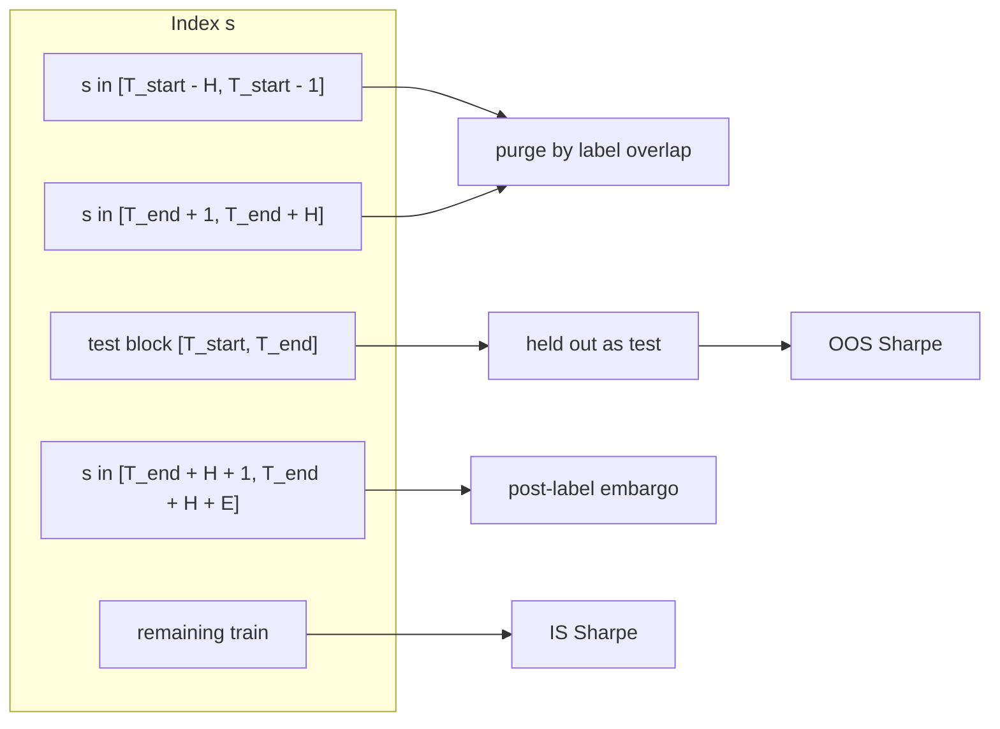

# GROK_REVIEW: Milestone 4.2 candidate `28e95f7`

**Verdict: PASS (MATERIAL: 0)**

- Reviewer seat: `GROK_REVIEW` (Grok Build, STANDARD lane, effort `XHIGH`)
- Exact candidate: `28e95f799a07ac5ab5c283bda129c929150ba356` (`28e95f7`, `feat(features): implement purged & embargoed cross-validation (CPCV)`)
- Tree: `d501e46b40fb9335721738c3cc6866810570c975`
- Baseline: `bb74533ed3a61d455f7df32aa5af1b137591afe9` (`HEAD^`)
- Review root: `/private/tmp/efr-m4-2-review-28e95f7` (detached HEAD at the exact candidate)
- Producer worktree was not used as the review root
- Working tree at review: source-clean; untracked `.venv` only
- Review card: `coord/card_m4_2_purged_embargoed_cpcv_review.md`
- Producer report: `coord/reports/m4_2_purged_embargoed_cpcv_impl.md`
- Coordination standard read from `/Users/rhapsoul/Documents/Codex/Standards/herdr_pi_coordinator_v7_two_file/` (`coordinator.md`, `routing_table.json`; table status `TEMPLATE_NOT_ACTIVE`; STANDARD lane seat `GROK_REVIEW`)
- Date: 2026-09-20
- Review posture: read-only on this clean root; this report is the only authored deliverable

This body reviews the exact candidate bytes named above. Coverage is `PurgedGroupTimeSeriesSplit`, `combinatorial_purged_cross_validation_pbo`, the `probability_of_backtest_overfitting` CPCV route, real-data diagnostic integration of `cpcv_summary`, committed official diagnostic artifacts, and the card-specified deterministic tests.

## Scope

Commit `28e95f7` adds purged and embargoed combinatorial cross-validation and wires a CPCV PBO section beside the existing unpurged CSCV baseline. Delta versus `bb74533`: 13 files, `+1565 / −325` (JSON regeneration dominates the subtraction).

| Path | Role |
| --- | --- |
| `src/features/cross_validation.py` | `PurgedGroupTimeSeriesSplit` and `combinatorial_purged_cross_validation_pbo` |
| `src/features/diagnostics.py` | Optional `holding_periods` / `embargo_periods` route into CPCV |
| `src/features/__init__.py` | Public export of both symbols |
| `research/real_data_multifactor_diagnostic.py` | `pbo_holding_periods=21`, `pbo_embargo_periods=5`, `cpcv_summary` |
| `tests/test_cross_validation.py` | 8 splitter / PBO unit tests |
| `tests/test_diagnostics.py` | `test_probability_of_backtest_overfitting_purged_and_embargoed` |
| `reports/real_data_multifactor_diagnostic.md` | Official CPCV section; CSCV cells unchanged |
| `reports/experiment_logs/real_data_multifactor_diagnostic.json` | Sidecar `cpcv_summary`; `estimator_version` `m4_2_purged_cpcv_v1` |
| `reports/experiment_logs/real_data_multifactor_diagnostic.trials.jsonl` | Append-only +320 `m4_2_purged_cpcv_v1` events |
| `docs/repo_map.md` | Features 18 / tests 235 |
| `coord/card_m4_2_purged_embargoed_cpcv.md` | Implementation card |
| `coord/card_m4_2_purged_embargoed_cpcv_review.md` | Review card |
| `coord/reports/m4_2_purged_embargoed_cpcv_impl.md` | Producer implementation report |

Evidence ceiling remains `DIAGNOSTIC_ONLY`. Unit tests use synthetic matrices and temporary Parquet fixtures. This review did not execute the official private-snapshot command.

## Coverage

| Check | Result on `28e95f7` |
| --- | --- |
| Exact-head identity | HEAD `28e95f799a07ac5ab5c283bda129c929150ba356`. Source tree clean at review. |
| Pre-test purge | For test block `[T_start, T_end]` and holding `H`, training index `s` with `s + H >= T_start` and `s < T_start` is dropped. Independent probe: `H=5`, test `[20, 39]`, indices `15..19` excluded, index `14` retained (`14 + 5 = 19`). |
| Post-test embargo at `H=0` | Training indices in `(T_end, T_end + E]` are dropped. Independent probe: `E=4`, test `[20, 39]`, indices `40..43` excluded, index `44` retained. |
| Combined `H>0` and `E>0` | Implemented test interval end is the last test sample's label end `T_end + H`. Immediate post-test indices are dropped by label-overlap purge; embargo then occupies `(T_end + H, T_end + H + E]`. See ADV-M42-2. |
| Scikit-learn surface | Class subclasses `BaseCrossValidator`, implements `split` and `get_n_splits`, and runs through `check_cv` and `cross_val_score(Ridge, ...)`. Default `groups=None` fold counts match `math.comb(n_splits, n_test_groups)`. |
| CSCV equivalence at `H=0`, `E=0` | Fast path and an independent splitter-path reconstruction both match `probability_of_backtest_overfitting` on PBO, `prob_loss`, combination count, relative ranks, and IS/OOS Sharpe. |
| Real-data integration | Runner calls unpurged CSCV first, then CPCV with `FORWARD_HOLDING_PERIODS` (21) and embargo 5. Official CSCV PBO remains parent `0.5285714285714286`. Factor tables are unchanged versus `bb74533`. |
| Edge handling | `n_samples < n_splits` raises. CPCV with `H=50`, `E=20` on 80 rows raises `ValueError` for an emptied train pool. Constructor rejects `n_splits < 2`, `n_test_groups` outside `[1, n_splits-1]`, negative horizons, and `embargo_pct` outside `[0, 1)`. |
| Deterministic QA | Card-specified pytest: 160 passed. `compileall` passed. `git diff --check HEAD^..HEAD` passed. Ruff reports 5 findings on touched sources (see ADV-M42-5). |



## Research-safety

### Purge

`PurgedGroupTimeSeriesSplit.split` builds integer sample starts `0 .. n-1` and label ends `start + holding_periods`. Each selected test group contributes interval `[first_sample_start, last_sample_label_end]`. A training row is dropped when `sample_starts <= t_end` and `sample_ends >= t_start`.

On the card's numbered witness (`n=100`, `n_splits=5`, `n_test_groups=1`, `H=5`, fold 1, test `[20, 39]`):

| Index | Label window | Decision |
| --- | --- | --- |
| 14 | `[14, 19]` | retained |
| 15 | `[15, 20]` | purged (touches `T_start=20`) |
| 19 | `[19, 24]` | purged |
| 20..39 | test | held out |

That is the card's pre-test window `s ∈ [T_start − H, T_start − 1]`. Closed-interval overlap at `T_start` is included. The adjacent index `T_start − H − 1` stays in train.

The same overlap predicate also drops post-test indices whose labels intersect the last test label. With `H=5` and embargo 0, indices `40..44` leave the train set. Lopez de Prado's purge (AFML Ch. 7) uses the last test observation's label end as the test-time right bound, so that extra drop is the overlapping-label rule. The card's purge formula with `T_end` equal to the last *test sample* keeps those post-test rows in train. ADV-M42-2 records the divergence and the missing combined unit pin.

### Embargo

Embargo uses `embargo_count = max(embargo_periods, ceil(embargo_pct * n_samples))` and drops `sample_starts ∈ (t_end, t_end + embargo_count]`. Because `t_end` is the last test label end, the embargo sits after the overlap-purge tail.

Card checkpoint 2 names window `[T_end + 1, min(N − 1, T_end + E)]` with `T_end` as the last test sample. At `H=0` that window is exact: independent probe with `E=4` drops `40..43` and keeps `44`. At `H=5`, `E=4`, fold 1, the excluded non-test indices are `15..19` (pre-test purge), `40..44` (post-test label overlap), and `45..48` (embargo after the label end). The card's immediate post-test indices `40..43` are still excluded. Additional indices `44..48` are also excluded.

The last fold (`test [80, 99]`) has no post-test tail; only the pre-test purge `75..79` is removed. Embargo past `n_samples − 1` is empty.

### Combinatorial paths and PBO

`get_n_splits` returns `C(n_splits, n_test_groups)`. With `groups=None`, `np.array_split` makes `n_splits` contiguous blocks and `itertools.combinations` yields that many folds. Independent counts: `(5,1)=5`, `(5,2)=10`, `(6,3)=20`, `(8,4)=70`.

`combinatorial_purged_cross_validation_pbo` at `H=0`, `E=0`, and `k = S/2` uses `_fast_symmetric_cscv`, which copies the Bailey/CSCV block-sum path in `probability_of_backtest_overfitting`. The unit test compares those two functions and matches. This review also rebuilt PBO from `PurgedGroupTimeSeriesSplit` with `H=0`, `E=0` (the general path the fast route skips). On a 120×6 Gaussian fixture, `n_splits=6`:

| Metric | Splitter path | CSCV |
| --- | --- | --- |
| `pbo` | 0.4 | 0.4 |
| `prob_loss` | 0.1 | 0.1 |
| `n_combinations` | 20 | 20 |
| `mean_relative_rank` | 0.5571428571428572 | 0.5571428571428572 |
| `mean_is_sharpe` | 0.4152743658682592 | 0.4152743658682593 |

`pytest.approx` would accept the Sharpe ulp. Partition order differs (test combinations versus IS combinations); the metric multisets agree.

When `H>0` or `E>0`, IS Sharpe uses the purged/embargoed train index and OOS Sharpe uses the full test index. That is the CPCV PBO construction. A train shorter than 2 rows raises.

Reported `mean_purged_samples` is the mean of `len(non-test) − len(train)` (purge and embargo together). Reported `mean_embargoed_samples` is the mean of `min(excluded_count, embargo_periods)`. On the official geometry `S=8`, `k=4`, `H=21`, `E=5`, those published cells are `94.0` and `5.0`. An independent replay of the same splitter arithmetic gives mean purge-only `84.0`, mean embargo-only `10.0`, and mean total excluded `94.0`. Embargo-only counts across the 70 combinations occupy `{0, 5, 10, 15, 20}`. ADV-M42-1.

### Diagnostic runner

`alpha_returns` is the long-only `BacktestResult.returns.iloc[1:]` panel of the 52 classical alphas. CSCV runs with default `holding_periods=0` and `embargo_periods=0`. CPCV runs in a `try` with `config.pbo_holding_periods` (`FORWARD_HOLDING_PERIODS`, 21) and `config.pbo_embargo_periods` (5). A `ValueError` sets `cpcv_summary = None` and leaves CSCV in place.

`BacktestResult.returns` are one-period portfolio P&L from prior-date holdings. Consecutive rows share sticky monthly positions; they are not a stacked 21-bar overlapping-return matrix. The 21-bar CPCV horizon equals the factor forward-return used for IC labels and is about one monthly holding. The caveat string describes overlapping 21-bar forward-return windows. ADV-M42-3.

Official markdown versus `bb74533` adds the heading `### Classical CSCV (unpurged)` and the CPCV block. CSCV cells stay `PBO 0.5286`, `prob_loss 0.0000`, `70` combinations, `mean_relative_rank 0.4412`, `mean_is_sharpe 0.0878`, `mean_oos_sharpe 0.0506`. Parent JSON `pbo_summary` is byte-identical (`pbo=0.5285714285714286`, `mean_is_sharpe=0.08778773118370847`). `ALPHA_001` Sharpe `1.0392` and `RANDOM_FOREST_COMPOSITE` mean IC `-0.0610` match the parent tables. DSR trial family remains 152 distinct / 160 attempts.

JSONL is append-only: 936 `m4_0_real_data_causal_accounting_v1` + 640 `m4_1_ml_combination_v1` + 320 new `m4_2_purged_cpcv_v1` (160 started + 160 completed). Paths remain redacted.

A reduced 160-bar synthetic runner (the committed fixture size) produced a non-null `cpcv_summary` with `holding_periods=21`, `embargo_periods=5`, `n_combinations=6`. `tests/test_real_data_multifactor_diagnostic.py` still asserts only `"pbo" in result["pbo_summary"]`. ADV-M42-4.

## Deterministic QA

Commands run on exact `28e95f799a07ac5ab5c283bda129c929150ba356` with `/private/tmp/efr-m4-2-review-28e95f7/.venv/bin/python` and `PYTHONPATH=src:.`. Review interpreter: CPython 3.12.13, sklearn 1.9.1, pandas 3.0.6, numpy 2.5.3.

```
PYTHONPATH=src:. .venv/bin/pytest tests/test_cross_validation.py tests/test_diagnostics.py tests/test_real_data_multifactor_diagnostic.py tests/test_project_structure.py -q
PYTHONPATH=src:. .venv/bin/python -m ruff check src/features/cross_validation.py src/features/diagnostics.py src/features/__init__.py research/real_data_multifactor_diagnostic.py tests/test_cross_validation.py tests/test_diagnostics.py tests/test_real_data_multifactor_diagnostic.py tests/test_project_structure.py
PYTHONPATH=src:. .venv/bin/python -m compileall -q src/features/cross_validation.py src/features/diagnostics.py src/features/__init__.py research/real_data_multifactor_diagnostic.py tests/test_cross_validation.py
git -c color.ui=false diff --check HEAD^..HEAD
```

| Command | Result |
| --- | --- |
| pytest (card-specified files) | 160 passed in 5.09s |
| collect-only breakdown | 8 + 68 + 18 + 66 |
| ruff check (touched sources) | 5 findings (F401, F841×3, F821) |
| compileall (touched sources) | passed (exit 0) |
| `git diff --check HEAD^..HEAD` | passed (exit 0) |

`tests/test_cross_validation.py` collects 8 tests: constructor validation, combinatorial fold counts, pre-test purge at `H=5`, post-test embargo at `H=0`/`E=4`, `cross_val_score` integration, CSCV numeric match at `H=0`/`E=0`, a reduced-sample CPCV smoke test, and CPCV input validation. `tests/test_diagnostics.py` adds `test_probability_of_backtest_overfitting_purged_and_embargoed`. This review did not re-run the full `tests/` tree; the producer full-suite count of 168 is unverified here.

Independent probes executed in this session (not committed): pre/post purge-embargo index sets versus the card formula; splitter-path CSCV reconstruction; purge-versus-embargo count decomposition on the official `(8,4,21,5)` geometry; `check_cv` / `cross_val_score`; `samples_info` integer versus timestamp; extra unique `groups`; small-`n` and large-`H` refusals; reduced real-data runner `cpcv_summary`.

## Findings

MATERIAL: none.

### ADV-M42-1 — Official CPCV count fields mix total exclusions into "purged" and cap "embargoed" at `E`

- Severity: `ADVISORY`
- Status: `OPEN`
- Reviewer: `GROK_REVIEW`
- Candidate: `28e95f799a07ac5ab5c283bda129c929150ba356`
- Claim: `mean_purged_samples` and `mean_embargoed_samples` are the average numbers of training rows purged and embargoed per CPCV split.
- Evidence: `combinatorial_purged_cross_validation_pbo` appends `excluded_count = (n_rows - len(test_idx)) - len(train_idx)` as purged and `min(excluded_count, embargo_periods)` as embargoed (`src/features/cross_validation.py:303-309`). Official markdown prints `Mean Purged Samples per Split: 94.0000` and `Mean Embargoed Samples per Split: 5.0000`. Independent splitter arithmetic on `S=8`, `k=4`, `H=21`, `E=5` yields mean purge-only 84.0, mean embargo-only 10.0, mean total excluded 94.0. Embargo-only values across the 70 combinations occupy `{0, 5, 10, 15, 20}`.
- Impact: PBO, ranks, and Sharpes use the actual `train_idx` after both filters. The published count cells describe a different quantity. A reader of the official report can treat embargo as a fixed 5-row trim.
- Resolution: Count purge-only and embargo-only masks separately (non-test rows that fail the overlap predicate versus rows that fail only the embargo predicate). Pin those means in `tests/test_cross_validation.py`.

### ADV-M42-2 — Test intervals use the last test sample's label end; combined `H` and `E` is unpinned

- Severity: `ADVISORY`
- Status: `OPEN`
- Reviewer: `GROK_REVIEW`
- Candidate: `28e95f799a07ac5ab5c283bda129c929150ba356`
- Claim: Training rows whose window `[s, s + H]` intersects test block `[T_start, T_end]` are purged, and the embargo window is `[T_end + 1, T_end + E]` with `T_end` the last test sample.
- Evidence: `g_end = int(sample_ends[g_idx[-1]])` (`src/features/cross_validation.py:163-165`), so each test interval is `[T_start, last_test_index + H]`. Independent fold-1 probe, `n=100`, `H=5`, `E=0`: indices `40..44` leave train. Card-formula reconstruction with `T_end = 39` keeps `40..44` in train. `test_purged_split_purging_boundary_exact_exclusion` asserts only `15..19` and `0..14`. `test_purged_split_embargo_boundary_exact_exclusion` uses `H=0`. Combined `H=5`, `E=4` excludes `15..19` and `40..48`.
- Impact: The implementation follows AFML overlapping-label purge (test times run through the last test label end) and is stricter than the card's sample-block formula. Immediate post-test indices named by checkpoint 2 are still excluded when `H>0`. Extra rows after `T_end + H` are embargoed. CI will accept a later change that drops the post-test overlap purge while keeping the two existing tests green.
- Resolution: Document `T_end` as last test label end. Add a fold that pins `H=5`, `E=0` post-test `40..44` and a fold that pins `H=5`, `E=4` embargo `45..48`.

### ADV-M42-3 — CPCV `H=21` is applied to one-period backtest P&L

- Severity: `ADVISORY`
- Status: `OPEN`
- Reviewer: `GROK_REVIEW`
- Candidate: `28e95f799a07ac5ab5c283bda129c929150ba356`
- Claim: CPCV purges training samples overlapping the 21-bar forward-return window on the PBO matrix.
- Evidence: `alpha_returns` is `{factor_id: backtest.returns.iloc[1:] for factor_id in alpha_ids}` (`research/real_data_multifactor_diagnostic.py:564-581`). `BacktestResult` period returns use prior-date holdings (`src/backtest/portfolio.py:219-221`). The experiment-log caveat states "purges training samples overlapping with the 21-bar forward-return window" (`research/real_data_multifactor_diagnostic.py:943`). Official CPCV uses `holding_periods=21`, `embargo_periods=5`. Unpurged CSCV on the same matrix remains parent `0.5285714285714286`; CPCV PBO on that run is the same value with `mean_relative_rank` `0.4412 → 0.4485`.
- Impact: The 21-bar setting matches the IC forward-return horizon and the approximate monthly holding length. Consecutive P&L rows are one-period returns with sticky positions. The purge is a serial-dependence buffer around CSCV block edges on that P&L series. CSCV baseline cells stay intact.
- Resolution: Name the PBO matrix as one-period long-only P&L in the CPCV section and caveat. Keep `H=21` as a declared dependence horizon, or switch CPCV onto an overlapping 21-bar strategy-return matrix if that is the intended AFML object.

### ADV-M42-4 — Runner and equivalence tests leave CPCV integration unpinned

- Severity: `ADVISORY`
- Status: `OPEN`
- Reviewer: `GROK_REVIEW`
- Candidate: `28e95f799a07ac5ab5c283bda129c929150ba356`
- Claim: Real-data CPCV is computed with 21-bar holding and 5-bar embargo, and `H=0`/`E=0` CPCV is identical to CSCV.
- Evidence: `test_real_data_config_defaults` omits `pbo_holding_periods` and `pbo_embargo_periods`. The runner test asserts `"pbo" in result["pbo_summary"]` and never reads `cpcv_summary` (`tests/test_real_data_multifactor_diagnostic.py:413`). `except ValueError: cpcv_summary = None` (`research/real_data_multifactor_diagnostic.py:575-584`) would keep that test green. `test_cpcv_pbo_matches_cscv_when_holding_and_embargo_zero` calls `combinatorial_purged_cross_validation_pbo` with `H=0`, `E=0`, which takes `_fast_symmetric_cscv` (`src/features/cross_validation.py:278-286`). Experiment-log `config` omits `pbo_n_splits`, `pbo_holding_periods`, and `pbo_embargo_periods`; those horizons live only inside `cpcv_summary`.
- Impact: This review's reduced-fixture run returned a non-null `cpcv_summary` with `H=21`, `E=5`. The splitter-path CSCV reconstruction also matched. CI still accepts a runner that swallows CPCV or a fast-path-only equivalence.
- Resolution: Assert `result["cpcv_summary"]["holding_periods"] == 21` and `embargo_periods == 5` on the synthetic runner. Compare splitter-path PBO at `H=0`/`E=0` to CSCV (for example by setting `n_test_splits = n_splits // 2` after disabling the fast path, or by reconstructing from `PurgedGroupTimeSeriesSplit`). Write the three PBO config fields into the experiment-log `config` object.

### ADV-M42-5 — Splitter API edges and Ruff on the new files

- Severity: `ADVISORY`
- Status: `OPEN`
- Reviewer: `GROK_REVIEW`
- Candidate: `28e95f799a07ac5ab5c283bda129c929150ba356`
- Claim: `PurgedGroupTimeSeriesSplit` conforms to `BaseCrossValidator` (`split`, `get_n_splits`) and `samples_info` can carry integer ends or timestamps.
- Evidence: `get_n_splits` returns `math.comb(self.n_splits, self.n_test_groups)` and ignores `groups` (`src/features/cross_validation.py:86-93`). With 10 unique group labels and `n_splits=5`, `split` yielded 10 folds while `get_n_splits` returned 5; `cross_val_score` on sklearn 1.9.1 returned 10 scores. Timestamp `samples_info` is ignored because only integer dtypes replace `sample_ends` (`src/features/cross_validation.py:134-135`); a datetime Series produced the same splits as `holding_periods=0`. Large `H`/`E` can yield empty `train_idx` from the splitter; the PBO wrapper raises. `holding_periods=True` is accepted (`isinstance(True, int)`). Ruff on touched sources: unused `Sequence`, unused `test_group_set` / `is_n` / `oos_n`, and F821 `Any` in `diagnostics.py:499` (`from __future__ import annotations` keeps that annotation from raising at import).
- Impact: The diagnostic and the unit `cross_val_score` test pass `groups=None`, where fold counts match. Timestamp `samples_info` is unused by the runner. Empty-train sklearn fits fail at estimator `fit`.
- Resolution: Compute `get_n_splits` from unique groups when `groups` is supplied, or reject `len(unique) != n_splits`. Reject non-integer `samples_info` (or convert timestamps against the sample index). Reject `bool` horizons. Raise from `split` when `train_idx` is empty. Import `Any` or drop that annotation; remove the unused names.

## Verdict

**PASS (MATERIAL: 0)**

`28e95f7` implements combinatorial purged/embargoed CV with a scikit-learn splitter, a CPCV PBO evaluator whose `H=0`/`E=0` path matches CSCV, and a real-data diagnostic that keeps the parent unpurged CSCV cells (`PBO=0.5285714285714286`) beside a 21-bar / 5-bar CPCV section. Card-specified tests passed (160). Independent pre-test purge, `H=0` embargo, splitter-path CSCV, and official-geometry count probes completed. OPEN advisories ADV-M42-1 through ADV-M42-5 record count-field arithmetic, AFML versus sample-block `T_end`, one-period P&L as the CPCV matrix, test gaps, and splitter API edges. They do not block acceptance of `28e95f7`.
