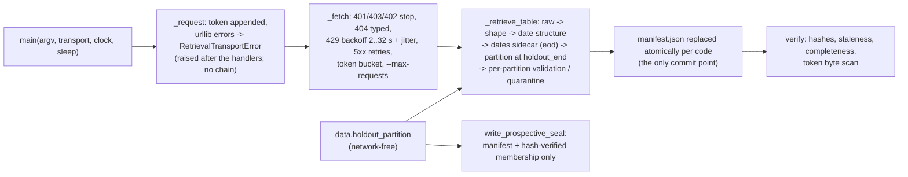

# M4.7a-1 Implementation Report: Retrieval and Partition

- Task/attempt: `m4_7a1-retrieval-and-partition-a1`
- Card: `coord/v8_review_20260923/card_m4_7a1_retrieval_and_partition.md`
- Operative plan: `coord/plans/m4_7_binding_plan.md` Revision 11, SHA-256
  `6541db93336e9181ebf3ad2f066b7b17f4550a17565036c2db5a5d82872a6407`
  (verified), sections 1.3, 1.4, 1.5, 7.2 (a-1), Appendices A, B, D, E.
- Branch: `claude/m4_7a1-retrieval-and-partition`, worktree
  `/private/tmp/efr-m47a1-retrieval-20260925`, baseline
  `2c07ee4db70bc90cd449382c69b63765de2eab7d` (main after PR #262).
- State: implemented and verified in the working tree. Nothing is committed,
  pushed, or opened as a PR.
- Environment: Python 3.12.13, pandas 3.0.6, NumPy 2.5.3 (`.venv`).
- Evidence ceiling: offline fake transport and synthetic fixtures only. No
  live network call, vendor token, vendor file, or private data was used. This
  stage makes no research, predictability, or profitability claim.

## Result

Every deliverable on the card is implemented. The 69 new tests pass: 61 in
`tests/test_eodhd_retrieval.py` (40 functions), 7 in
`tests/test_m4_7_holdout_seal.py`, and T-STRUCT-1. The full suite runs
2,875 passed, 2 skipped, and 1 failed. The one failure is
`test_handoff_trails_its_base_by_at_most_one_merged_pr`. It reads `HEAD~1`,
which is `49eacdd` in the uncommitted tree, and that commit predates the
refreshed checkpoint `2c07ee4`. Its helper measures lag 0 against
`2c07ee4`, which becomes `HEAD~1` once the branch holds its commit. The a-0
report recorded the same pre-commit behavior. Ruff, `compileall`, and
`git diff --check` pass.

Commands:

```text
PYTHONPATH=. .venv/bin/python -m pytest -q -n 8          # 2875 passed, 2 skipped, 1 failed (handoff lag, pre-commit)
PYTHONPATH=. .venv/bin/python -m pytest -q tests/test_eodhd_retrieval.py tests/test_m4_7_holdout_seal.py   # 68 passed
.venv/bin/ruff check . --exclude .venv                    # All checks passed
```

## Files

| File | Change |
| --- | --- |
| `src/data/eodhd_retrieval.py` | New, 1,021 lines. The CLI, transport seam, sanitizer, manifest, per-table retrieval, scale check, and `verify` |
| `src/data/holdout_partition.py` | New, 436 lines. Strict date parsing, the partition rule, manifest-authorized reads, the entry rule, raw counts, coverage start, and the prospective seal writer |
| `tests/test_eodhd_retrieval.py` | New. T-RET-1..17, a `plan` test, and an autouse fixture that fails any real `urlopen` call |
| `tests/test_m4_7_holdout_seal.py` | New. T-SEAL-1 |
| `tests/test_project_structure.py` | T-STRUCT-1 appended; `import ast` added |
| `scripts/repo_map.py`, `docs/repo_map.md` | The `src/data/` row names the seal and the network module; file counts regenerated |
| `docs/engineering_log.md` | New top entry |
| `docs/current_handoff.md` | Baseline refreshed to `2c07ee4` (PR #262); a-0 recorded as merged; a-1 candidate scope and next action |

## Architecture



`data.holdout_partition` carries the network-free half of the snapshot
contract, so a-2 stages can read retrieval artifacts through
`read_authorized_bytes` / `read_authorized_parquet` without importing the
network module. `eodhd_retrieval` imports it; nothing imports in the other
direction.

## Deliverables Against The Card

### Network module and CLI (plan 1.3)

| Card item | Implementation |
| --- | --- |
| Standard library HTTP only | `urllib.request`, `urllib.error`, `urllib.parse`; other stdlib: `argparse`, `json`, `hashlib` (through `sha256_bytes`), `os`, `sys`, `pathlib`, `io`, `math`, `random` (jitter), `re`, `subprocess` (`git rev-parse HEAD` for `snapshot.code_commit`), `time`, `traceback`; pandas/pyarrow for Parquet |
| `plan` | Offline. Prints every public request URL and `projected_requests`, `projected_duration_minutes`, `codes`, `membership_known`; with no manifest the code list is the benchmark only |
| `components` | Raw bytes to `raw/index/<index>.fundamentals.json`; `snapshot.components_retrieved_utc_date` and `components_response_keys` recorded; `components_malformed` for a non-object body or a `HistoricalTickerComponents` that is absent, a scalar, or holds a non-object; `components_empty` for an empty list or object; no membership file on either refusal; `snapshot_file_exists` on rerun |
| `symbols` | `delisted=0` and `delisted=1` raw to `raw/symbols/US_{listed,delisted}.json`; `symbols/{listed,delisted}.parquet` with `Code`, `Name`, `Exchange`, `Type`, `Isin` (null when absent) |
| `calendar` | Seal required; `raw/index/<index>.eod.json`; `calendar/<index>.dates.parquet` with the `date` column only |
| `splits` | Seal required; strict dates; partition at `holdout_end`; `ratio = N / M` finite and above zero per partition; `status`, `partition_statuses.discovery` / `.holdout` are the card's `splits_status`, `splits_discovery_status`, `splits_holdout_status` |
| `eod` | Refuses `holdout_seal_missing`, then `calendar_required_before_eod`, then `splits_required_before_eod`, each before any request; skips a code with `provider_error` split status as `skipped:split_table_provider_error`; writes `dates/<CODE>.<stamp>.parquet` before value validation; validates each partition through `_standardize_eod_frame` (the `load_eod_parquet` validators); records `split_evidence_basis` and `split_table_sha256_at_eod_validation` |
| `dividends` | Seal required; `value` finite and at least zero per partition; other vendor fields retained verbatim in `row_json` |
| `all` | Runs `components` and `symbols` when absent, exits 3 with `holdout_seal_required` without a seal, then runs `calendar` when absent, `splits`, `eod`, `dividends` (each processing its open codes only), and `verify` |
| `verify` | Offline; `artifact_hash_mismatch` over every authorized record, `split_evidence_stale`, `retrieval_complete` with `incomplete_codes_by_table_and_status`, `persistent_provider_error_by_table`, and a byte scan of every snapshot file for the four token forms (`token_leak_detected`, exit 1) |
| Token hygiene | `EFR_EODHD_API_TOKEN` read once in `main` via `os.environ.get`; absent or blank exits 2 with the fixed message before any directory is created; no `--token` option; stderr and `--debug` tracebacks pass through `_sanitize` |
| Exception sanitizer | `_request` catches `HTTPError`, `URLError`, `OSError`, `TimeoutError` and raises `RetrievalTransportError(status, typed_outcome, sanitized_message)` after the `except` blocks, so `__cause__` and `__context__` are both `None`; the 404 body is redacted before it is stored as the raw audit copy |
| Persistent provider errors | Every invocation ending `provider_error` appends its UTC date; the third distinct date sets `unavailable:persistent_provider_error` with one status-change log record; a refresh of a terminal entry ending 5xx appends the date and writes nothing else |
| Scale check | `_unverified_split`: consecutive bars whose dates lie in the calendar file; compared only when at most 20 calendar rows lie strictly between them; a step of `close / adjusted_close` above 15 percent quarantines unless a discovery split row lies within 5 calendar rows of the later bar; under the fallback the split-row list is empty |
| Transport seam | `main(..., transport=Callable[[str], bytes])` passes through to `_request`; `clock` and `sleep` are injected alongside it |
| Manifest and atomic writes | Appendix A layout; every file through a temporary file and `os.replace`; the manifest replace after each code and table is the commit point; attempt names carry a microsecond UTC stamp, and a stamp reusing a committed path refuses |

### Holdout seal (plan 1.4)

| Step | Implementation |
| --- | --- |
| Inputs | `write_prospective_seal` reads `manifest.json` and the membership file through `read_authorized_bytes` (hash first); records `inputs.components_raw_sha256` and `inputs.components_retrieved_utc_date` |
| Entry rule | `parse_membership_entries`: `entry_missing_field`, `entry_unparseable_date`, open for blank `EndDate` or one after the retrieval date (equal closes), `degenerate_interval`, `exact_duplicate_collapsed` to the first in raw order, then `raw_overlap` on every intersecting half-open entry of a code; every count enters `entry_counts` |
| Raw counts | `monthly_raw_counts`: calendar month-ends from the earliest retained start through the retrieval date; `start <= m` and (`end > m` or open) |
| Coverage start | `coverage_start(counts, 3)` and the strict sensitivity `coverage_start(counts, 0)` |
| Window | `holdout_end = holdout_start + 10 calendar years` (month-end of the same month); `holdout_overlaps_prior_exposure` above 2014-01-01 |
| Output | `holdout_seal_v1.json` with the section 5.4 fields, `confirmation.status = pending`, sorted-key JSON; the returned SHA-256 of the written bytes is `seal_prospective_sha256` |

## Test Oracle Map

| Oracle | Tests (`tests/test_eodhd_retrieval.py` unless noted) |
| --- | --- |
| T-RET-1 | `test_t_ret_1_token_absent_exits_2_with_fixed_message` (absent, empty, blank) |
| T-RET-2 | `test_t_ret_2_request_sanitizes_http_error_without_chaining`, `test_t_ret_2_no_written_byte_log_or_stream_holds_the_token` (token with `/`, space, `+`, `=`, `&`; an `HTTPError` whose URL and 404 body carry the token; `--debug`; a planted leak detected) |
| T-RET-3 | `test_t_ret_3_credential_and_entitlement_stop_without_retry`, `test_t_ret_3_404_continues_429_backs_off_then_stops_5xx_retries`, `test_t_ret_3_token_bucket_spaces_requests` |
| T-RET-4 | `test_t_ret_4_resume_skips_hashed_files_and_refresh_refetches` |
| T-RET-5 | `test_t_ret_5_data_dir_inside_repository_refuses` |
| T-RET-6 | `test_t_ret_6_split_ratio_parsing`, `test_t_ret_6_invalid_ratio_quarantines_only_its_partition` (`"0/1"`, `"1:2"`, `""`) |
| T-RET-7 | `test_t_ret_7_holdout_defect_quarantines_holdout_only_and_sidecar_is_identical` |
| T-RET-8 | `test_t_ret_8_components_parse_and_retrieval_date`, `test_t_ret_8_malformed_or_empty_components_refuse_and_block_the_seal` (six bodies) |
| T-RET-9 | `test_t_ret_9_seal_gated_commands_refuse_before_any_request` (four commands) |
| T-RET-10 (a)–(h) | `test_t_ret_10_a_…` through `test_t_ret_10_h_…`; (d) covers the seal pause, interruption inside `splits`, inside `eod`, and after `eod`, the seal's `retrieval_order`, and curated `--codes` additions; (e) also covers a plain resumed `eod` revalidating a stale entry |
| T-RET-11 | `test_t_ret_11_date_structure_refuses_the_whole_code` (unparseable, duplicate, unsorted), `test_t_ret_11_value_defect_in_the_same_position_quarantines_one_partition` |
| T-RET-12 | `test_t_ret_12_corporate_action_date_structure_refuses_the_table_only` (splits, dividends), `test_t_ret_12_partition_at_holdout_end_and_discovery_rows_drive_the_check` |
| T-RET-13 | `test_t_ret_13_row_without_date_key_is_malformed_response`, `test_t_ret_13_holdout_value_defect_quarantines_holdout_only` (non-numeric `close`, missing `volume`, negative `low`) |
| T-RET-14 | `test_t_ret_14_resume_and_completeness` |
| T-RET-15 | `test_t_ret_15_scale_check_compares_consecutive_on_calendar_bars_only` (25-row gap, 20-row gap, off-calendar Saturday in the gap, off-calendar spike), `test_t_ret_15_eod_before_calendar_refuses_before_any_request` |
| T-RET-16 | `test_t_ret_16_third_distinct_utc_date_sets_persistent_provider_error` |
| T-RET-17 | `test_t_ret_17_abc_refresh_authorizes_only_the_new_outcome` (404, empty, discovery defect), `test_t_ret_17_d_interrupted_refresh_leaves_committed_state_and_resumes_identically` (three outcomes; byte-identical manifest against an uninterrupted twin), `test_t_ret_17_d_attempt_names_never_overwrite_a_committed_file`, `test_t_ret_17_e_corporate_action_refreshes`, `test_t_ret_17_e_empty_refresh_is_stale_exactly_when_discovery_rows_existed`, `test_t_ret_17_f_tampered_file_is_hash_mismatch_and_unauthorized_file_is_refused`, `test_t_ret_17_g_refresh_ending_in_5xx_writes_nothing` |
| T-SEAL-1 | `tests/test_m4_7_holdout_seal.py`: two isolated 465-member month-ends give tolerant start 1990-01-31, strict 1997-08-31, and `holdout_end` 2000-01-31; three adjacent exceptions move the tolerant start to 1992-08-31; a 440-member month-end is not tolerated; hand-count rule cases; entry-rule counts; the prospective hash and rerun stability; refusals |
| T-STRUCT-1 | `tests/test_project_structure.py::test_t_struct_1_only_the_retrieval_module_imports_network_modules` (AST walk of `src`, `research`, `scripts`; `from urllib import request` resolves to `urllib.request`; the allowlisted module imports exactly `urllib.request` and `urllib.error`; no HTTP dependency in `pyproject.toml`) |

## Decisions, Interpretations, And Additions For Review

1. **`m*` is in band.** Plan 1.4 step 4 says "over all later month-ends". Read
   literally, an out-of-band `m*`, even one below 450, could open the
   window. The implementation evaluates the month-ends from `m*` on and
   requires `m*` itself in band. `test_t_seal_1_coverage_start_rule_on_hand_counts`
   pins it: `[460, 500, ...]` starts at the second month-end.
2. **`split_evidence_basis = split_evidence_quarantined`.** The plan names two
   basis values. A quarantined discovery split partition needs a third state,
   because the discovery `eod` partition fails closed there. Ablation S2
   replaced it with a null basis, and the discovery partition then passed
   validation (fail-open), so the explicit value stays.
3. **New refusal codes:** `data_dir_missing`, `snapshot_id_invalid`,
   `manifest_missing` (verify, or the seal, without a manifest), and
   `coverage_start_undefined` (no month-end meets the band rule).
4. **Exit codes:** 0 success; 1 for every typed refusal or stop, including
   `budget_exhausted` and `rate_limited_exhausted` after the committed state is
   kept; 2 for an absent token; 3 for `holdout_seal_required`.
5. **Unlisted HTTP statuses** (for example 400 or 418) map to `provider_error`.
   The outcome stays open and retried, so a transport anomaly never becomes a
   vendor absence.
6. **Partition file schemas.** Valid `eod` partitions hold `date, open, high,
   low, close, adjusted_close, volume` as standardized by the loader and load
   through `load_eod_parquet`. Valid split partitions hold `date, split, ratio`.
   Valid dividend partitions hold `date, value, row_json`, where `row_json` is
   the verbatim vendor row, `unadjustedValue` included, for a-2 to parse.
   Quarantine files hold `date, row_json` and are never repaired. Empty
   partitions are written as zero-row files so "valid zero-row table" is a
   file with a hash.
7. **Membership file.** `raw_row` plus the six entry fields, each stored as the
   vendor string or null; a Parquet round trip returns null as NaN, which the
   entry rule treats as blank.
8. **Stale entries are open.** Plan 1.3's caching rule skips a code only when
   its split evidence matches, so a plain resumed `eod` revalidates a stale
   code; `--refresh` does the same for every code.
9. **Request list.** Every ever-member code (`<Code>.US`, raw order), the
   benchmark, and every code named through `--codes` or
   `--consideration-securities`, persisted in `manifest.requested_codes` so
   `verify` covers curated additions. A refused invocation records nothing.
10. **Defaults.** `--from 1980-01-01` as the plan's usage line shows; `--to`
    open.

## Ablation

Baseline preserved: each experiment edited one file in place, ran the two
new suites (68 tests), and restored the original bytes with a SHA-256 check.
The script and its output are session scratch files outside the repository.

### Simplification attempts

| ID | Removal | Outcome | Decision |
| --- | --- | --- | --- |
| S1 | Re-sanitizing each `retrieval_log.jsonl` line | 68 passed; log records carry only public URLs, typed outcomes, and statuses, and `verify` scans the log bytes | Removed |
| S2 | Quarantined split evidence recorded as a null basis | `test_t_ret_10_h` failed: the discovery `eod` partition validated (fail-open) | Restored |
| S3 | Second `_request_list` computation in `_run_table` | 68 passed | Removed |
| S4 | Manifest commit before a single-shot transport refusal (`components`, `symbols`, `calendar`) | 68 passed; the commit carried only the uncommitted `requests_attempted` counter, the same treatment every other stop gives it | Removed |

### Guard-necessity checks

Each guard was removed in isolation; every one fails a targeted test and stays.

| ID | Guard removed | Failing test |
| --- | --- | --- |
| G1 | Committed-path collision refusal | `test_t_ret_17_d_attempt_names_never_overwrite_a_committed_file` |
| G2 | `quote_plus` redaction form | `test_t_ret_2_no_written_byte_log_or_stream_holds_the_token` |
| G3 | Hash check in the open-entry rule | `test_t_ret_17_f_…` |
| G4 | Stale check in the open-entry rule | `test_t_ret_10_e_…` |
| G5 | Raising outside the handlers (replaced by `raise … from None`) | both T-RET-2 tests (`__context__` retained) |
| G6 | On-calendar filter in the scale check | `test_t_ret_15_scale_check_…` |
| G7 | 20-row gap limit | `test_t_ret_15_scale_check_…` |
| G8 | 5-row split window | `test_t_ret_10_a_…` |
| G9 | Terminal-entry branch for `provider_error` | `test_t_ret_17_g_…` |
| G10 | Error-body sanitization | both T-RET-2 tests |
| G11 | Token bucket | `test_t_ret_3_token_bucket_spaces_requests` |
| G12 | Strict `YYYY-MM-DD` regex (Python 3.11+ `fromisoformat` accepts `20010103`) | `test_t_seal_1_entry_rule_counts_shared_with_the_build` |
| G13 | `m*` in band | two T-SEAL-1 tests |
| G14 | Hard band `[450, 560]` | `test_t_seal_1_exception_outside_the_hard_band_is_not_tolerated` |
| G15 | Adjacency rule | `test_t_seal_1_coverage_start_rule_on_hand_counts` |
| G16 | `raw_overlap` exclusion | `test_t_seal_1_entry_rule_counts_shared_with_the_build` |
| G17 | Hash-verified membership read in the seal | `test_t_seal_1_refusals` |

G1, G4, G11, and the `m*` case of G13 had no test before the ablation. Each
gained a targeted test before its removal was tried.

### Measured cost

A fake-transport probe with 1,000 member codes and 170 bars per code:
`splits` 4.1 s, `eod` 15.0 s, `dividends` 15.3 s, `verify` 1.8 s, and a
2.6 MB compact manifest (300 codes: 0.8 / 2.6 / 1.7 / 0.5 s, 0.78 MB). Commit
cost grows with manifest size because the manifest is replaced per code (the
plan's commit point). At the default 300 requests per minute, the ~3,000
network requests take about 10 minutes, so local overhead stays minor. The
manifest is written as compact sorted-key JSON for this reason.

## Known Limitations And Scope Boundaries

- **a-2 halves of shared oracles.** T-RET-17 (e) also names the split-basis,
  in-span, and terminal basis checks reading unavailable evidence, and (g)
  names `discovery_inputs_sha256` of derived artifacts. Those consumers are
  a-2 deliverables. This stage tests the retrieval half: statuses, authorized
  roles, staleness, and the unchanged entry.
- **T-RET-10 (a) panel.** The test builds the `split_factor` panel with
  `compute_cumulative_split_factor` from the discovery split partition and
  loads it through `load_eod_cohort_panels`; the universe build that writes
  real panels is a-2.
- **`research/m4_7_holdout_seal.py`** (the seal command) and T-SEAL-2..5 are
  a-2. `write_prospective_seal` takes `sealed_at`, `sealing_actor`, and
  `authorization_reference` from its caller and reads no clock.
- **Vendor shapes are documentation-based.** The fake transport follows the
  plan's endpoint table. `components` records the observed top-level keys so
  a-3's first live response becomes recorded evidence; a live shape mismatch
  refuses with a typed code rather than being coerced.
- **`plan`** assumes one request per code and table and no vendor call
  weights; the plan's weighted budget applies only when the vendor publishes
  weights.
- **Log growth.** `retrieval_log.jsonl` is append-only and not atomic; an
  interrupted attempt leaves its log lines, which is the audit intent.
- **Untracked files.** The worktree holds the pre-existing untracked task
  card and `.venv`; neither was modified.

## Next Gate

CRITICAL-lane review of this candidate by two fresh formal reviewers under
Coordination Standard V8.5, then the independent ABLATION pass and
coordinator acceptance of the exact head. Committing, pushing, and opening a
PR need an explicit instruction. The handoff-lag test passes once the branch
holds its commit.
