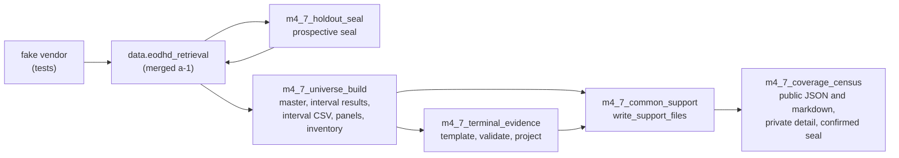

# M4.7a-2 Implementation Report: Seal Script, Universe Build, Terminal Tooling, Support Wiring, and Coverage Census

| Field | Value |
| --- | --- |
| Task/attempt | `m4_7a2-universe-and-census-a1` |
| Card | `coord/v8_review_20260923/card_m4_7a2_universe_and_census.md` |
| Plan | `coord/plans/m4_7_binding_plan.md` Revision 11, SHA-256 `6541db93336e9181ebf3ad2f066b7b17f4550a17565036c2db5a5d82872a6407` |
| Route, lane | `GENERAL_EXEC`, CRITICAL (structural: `ARCHITECTURE`, `SCHEMA_PROTOCOL_CONTRACT`, `SECURITY_AUTHORITY`) |
| Author session | Claude Opus 5.5 (`claude-opus-5-5`) via Claude Code |
| Base | `76a0e43` (main after PR #264) |
| Branch | `claude/m4_7a2-universe-and-census` |
| Evidence ceiling | `DIAGNOSTIC_ONLY`; synthetic snapshots only; no network call; no private data |

## 1. Result

Stage a-2 is implemented and verified on synthetic snapshots. Every a-2
snapshot in the suites is written by the merged a-1 retrieval module
(`data.eodhd_retrieval`) from a fake vendor, so the new code reads the real
Appendix A layout through manifest roles with SHA-256 verification. The
committed end-to-end fixture flows from components JSON through the seal,
date sidecars, partitioned tables, the universe build, terminal curation and
projection, the peeled common-support schedule, and the census to a confirmed
seal, and every valid segment runs through the long-only, long-short, and
equal-weight books with zero refusals.

Verification on the committed head:

| Check | Result |
| --- | --- |
| New and extended suites (`test_m4_7_universe_build`, `_terminal_evidence`, `_coverage_census`, `_holdout_seal`, `_common_support`) | 124 passed |
| `tests/test_governance_constitution.py` | 21 passed (the handoff-lag test reads `HEAD~1`, which is the base `76a0e43`) |
| Full suite (`pytest -n 8`) | 2,983 passed, 2 skipped (platform long-double) |
| `ruff check . --exclude .venv` | clean |
| `git diff --check` | clean |
| `docs/repo_map.md` | regenerated with `scripts/repo_map.py` (the structure test requires it after new research modules) |

## 2. Deliverables

| # | Deliverable | Location | Notes |
| --- | --- | --- | --- |
| 1 | Seal script and confirmation tooling | `research/m4_7_holdout_seal.py` | `seal_snapshot` calls `write_prospective_seal`, verifies the record's two inputs against the manifest (S5), the bytes' SHA-256, and `confirmation.status = pending`; `confirmed_seal_bytes` adds the census confirmation block and the holdout integrity counters without changing any prospective field (C33). CLI `python -m research.m4_7_holdout_seal` |
| 2 | Universe build | `research/m4_7_universe_build.py` | Snapshot access (`Snapshot`, `read_bar_dates`, `discovery_inputs_sha256`, `require_current`); entry typing shared with the seal; interval keys (C76); E1 gap split; E2 per interval before code-level rules (C52, C60) with `no_vendor_bars:<subreason>` (C57), `no_bars_in_interval`, and `rekeyed_rename_candidate` (C42, C48, C62); E3-E6 with ISIN continuity; calendar-row boundaries with the M4.4 loader and mask as the oracle (step 5); exclusive exit classes (C54); episode attribution of split and dividend rows; the last-bar split-basis check with feasibility and post-final-bar dispositions (C67, C72); the in-span step check with the `unadjustedValue` amount basis and own-basis reference prices (C73, C74, C81); the telescoped cumulative check under prior-close (C82, S3); the gap-dated refusal; `B_D` and `S_D` (C80, S2); panels with `split_factor`; `panel_split_table_present` (C55); inventory with panel hashes and `discovery_inputs_sha256`; the build manifest with every counter of plan 1.6 step 7 |
| 3 | Terminal evidence tooling | `research/m4_7_terminal_evidence.py` | `write_template` (one row per candidate permanent ID; `deferred_holdout` when `S <= i_H`), `validate` (every section 3.6 code, the lag rule by type, valuation row `V`, the corporate-action evidence check, the rename rule through ordinary stock arithmetic), `project` (exactly the seven engine fields) |
| 4 | Support wiring | `research/m4_7_common_support.py` (`write_support_files`, `SnapshotSupport`) | Bar presence from the hash-verified panel files, the mask from `resolve_pit_universe_mask`, `U` from candidates without an engine event, the a-0 schedule unchanged; writes `census/exclusion_set.json`, `census/gap_windows.json`, `census/segments.json` (Appendix A fields and `segments_sha256`) |
| 5 | Coverage census | `research/m4_7_coverage_census.py` | Every section 5.2 metric group, R-CENSUS-1..10 (`derive_readiness`, pure), the volume-basis diagnostic with median and tail criteria (C79, C85), `in_span_distribution_support` and `vp2_revisit_required`, the power projection (section 5.5), month-granularity public windows and segments, the private detail, the markdown header with VP-1, VP-2, O-8, the S14 rounding note, and the prior-exposure fractions, and the acyclic seal confirmation (`seal_prospective_sha256`, `census_json_sha256`, `seal_confirmed_sha256`) |
| 6 | Synthetic snapshot fixtures | `tests/m4_7_snapshot_support.py`, `tests/fixtures/m4_7/e2e_scenario.py` | The harness drives the a-1 CLI against a fake vendor; the e2e scenario carries every case the a-2 acceptance row names (section 5) |
| 7 | Test suites | `tests/test_m4_7_universe_build.py`, `tests/test_m4_7_terminal_evidence.py`, `tests/test_m4_7_coverage_census.py`, `tests/test_m4_7_holdout_seal.py` (T-SEAL-2..5 added), `tests/test_m4_7_common_support.py` (T-SUP-3 added) | Section 4 matrix |
| 8 | Ablation | This report, section 6 | 14 guard checks and 5 simplification attempts |
| 9 | Shared entry rule | `src/data/holdout_partition.py` | `classify_membership_entries` types every raw entry; `parse_membership_entries` is built on it; a-1 behavior and tests unchanged |

Supporting edits: `docs/current_handoff.md` refreshed to base `76a0e43`
(PR #264), `docs/engineering_log.md` entry, `docs/repo_map.md` regenerated.

## 3. Data flow

## 4. Test matrix

| ID | Test(s) | Status |
| --- | --- | --- |
| T-UNI-1 | `test_t_uni_1_clean_member_interval_and_mask_boundaries` | pass |
| T-UNI-2 | `test_t_uni_2_reused_ticker_with_a_gap_yields_two_permanent_ids` | pass |
| T-UNI-3 | `test_t_uni_3_continuous_history_with_different_names_fails_closed` | pass |
| T-UNI-4 | `test_t_uni_4_short_gap_discontinuity_needs_a_nearby_split_row` | pass |
| T-UNI-5 | `test_t_uni_5_round_trip_overlaps_and_exact_repeats` | pass |
| T-UNI-6 | `test_t_uni_6_holdout_discontinuity_is_not_evaluated_and_not_read` | pass |
| T-UNI-7 | `test_t_uni_7_open_end_date_variants` | pass |
| T-UNI-8 | `test_t_uni_8_e6_delisted_and_listed_reuse` (a)-(e), `test_t_uni_8_f_old_zero_bar_interval_keeps_its_e2_refusal` | pass |
| T-UNI-9 | `test_t_uni_9_containment_outcomes_partition_every_interval` | pass |
| T-UNI-10 | `test_t_uni_10_off_calendar_bar_is_counted_and_kept_out_of_the_panel` | pass |
| T-UNI-11 | a-0 oracle, `tests/test_m4_7_engine_bases.py::test_t_uni_11_signal_eligibility_properties` | unchanged |
| T-UNI-12 | `test_t_uni_12_interval_boundary_rows_agree_with_the_engine_mask` (Sunday, holiday, trading day), `test_t_uni_12_round_trip_oracle_refuses_a_shifted_boundary_rule` | pass |
| T-UNI-13 | `test_t_uni_13_panel_bars_equal_the_sidecar_projection_and_master_ignores_holdout_quarantine` | pass |
| T-UNI-14 | `test_t_uni_14_rekeyed_rename_candidates` (empty payload, kept bars, skipped, provider error, persistent, reused code, differing name) | pass |
| T-UNI-15 | (a) through (i) in seven tests; `test_build_refuses_when_a_panel_split_table_exists` | pass |
| T-UNI-16 | (a), (c), (d), (e) in the universe suite; (b) via T-UNI-8 (f); census grain in T-CENSUS-7, 8, 10 | pass |
| T-UNI-17 | (a) through (h) in eight tests, including the 2,520-bar accumulated VP-2 case and the 48-dividend ex-date drift on a long calendar | pass |
| T-TERM-1, 2, 7 | `test_t_term_1_2_7_consideration_arithmetic_and_valuation_rows`, `test_t_term_7_accepted_lags_by_type` | pass |
| T-TERM-3 | `test_t_term_3_projected_events_settle_through_both_engines` (`{cash: 2, stock: 2, mixed: 1}`, credited cash equals the hand value) | pass |
| T-TERM-4 | `test_t_term_4_known_at_must_not_follow_the_reference_row` (validator part; engines complete with a reset on `S`) | pass |
| T-TERM-5 | `test_t_term_5_one_fault_fixtures` (19 one-fault rows), `test_t_term_5_negative_return_refuses_the_command` | pass |
| T-TERM-6 | `test_t_term_6_future_price_invariance` (acquirer-only code; engine equity paths identical) | pass |
| T-TERM-8 | `test_t_term_8_projection_fields_and_rows` | pass |
| T-TERM-9 | `test_t_term_9_exit_classes_partition_and_agree_with_the_mask` | pass |
| T-TERM-10 | `test_t_term_10_rename_under_both_vendor_behaviors` | pass |
| T-TERM-11 | `test_t_term_11_holdout_boundary_deferral` (read recorder) | pass |
| T-SUP-3 | `test_t_sup_3_window_cap_is_evaluated_on_the_schedule`, `test_t_sup_3_caps_use_the_peeled_excluded_rows` | pass |
| T-SUP-11 engine runs | e2e acceptance test (Round 2 and Round 3 peels in the fixture; every valid segment through three books) | pass |
| T-CENSUS-1 | `test_t_census_1_breadth_series_and_within_month_collapse` | pass |
| T-CENSUS-2 | `test_t_census_2_public_outputs_carry_no_security_level_content` | pass |
| T-CENSUS-3 | `test_t_census_3_holdout_years_are_metadata_only` | pass |
| T-CENSUS-4 | truth table (12 single-rule cases), cap edges, unusable-entry charge, one-row missing bar | pass |
| T-CENSUS-5 | `test_t_census_5_power_projection_reference_table` (four decimals; flip at 355/356) | pass |
| T-CENSUS-6 | `test_t_census_6_discovery_overlap_with_prior_exposures` | pass |
| T-CENSUS-7 | `test_t_census_7_eligible_unpriced_member_days_by_reason` | pass |
| T-CENSUS-8 | (a) through (e) in five tests | pass |
| T-CENSUS-9 | refresh accounting for 404, empty payload, and discovery quarantine; stale build manifest alone | pass |
| T-CENSUS-10 | (a), (b)-(d), (e), (f) | pass |
| T-SEAL-2 | two tests (inputs, order, rerun a year later, closed and open end dates, prior-exposure refusal) | pass |
| T-SEAL-3 | `test_t_seal_3_read_recorder_across_every_downstream_stage` | pass |
| T-SEAL-4 | `test_t_seal_4_holdout_perturbation_changes_only_holdout_scoped_paths` (baseline, perturbed, discovery-perturbed control) | pass |
| T-SEAL-5 | `test_t_seal_5_hash_identities_are_acyclic` | pass |

## 5. End-to-end fixture

`tests/fixtures/m4_7/e2e_scenario.py` carries: cash, stock at lag 0, stock at
lag -1, mixed, and evidenced-worthless events; a rename under each vendor
behavior with its re-keyed candidate; a two-episode code with a split only in
its second episode; post-final-bar splits under each convention on one- and
two-episode codes; an omitted split; a reverse split cancelled by a dividend;
dividends carried back without a split; an undeclared and an unapplied
in-span split; prior-close dividends; a split and a distribution on one pair
and a distribution, split, distribution pair across missing bars; repeated
small undeclared steps; an exact repeat and a genuine overlap; one episode
with two exit classes; a delisted member on a reused listed code; a 404
member; a member whose reused code trades years later; a persistent split
provider error; an episode ending in the holdout decade with a later
discovery split; an episode continuous across `holdout_end`; and the Round 2
and Round 3 peeling joiners.

Measured on the fixture: 45 resolved intervals; 7 episode panel refusals
(`cross_episode_adjustment` 1, `explanations_disagree` 1,
`unexplained_deviation` 2, `in_span_step_mismatch` 2,
`cumulative_basis_drift` 1); split-basis outcomes 40 `unapplied_exact`,
3 `applied_exact`, 4 `refused`, 1 `not_evaluated_no_discovery_bar`;
6 accepted terminal events, 1 unresolved candidate, 1 deferred; 3 gap windows
(one with two terminal-reset peels); seal `confirmed`; readiness `blocked`
(R-CENSUS-1, 2, 5, 8, 9), which the fixture's 3.5-year calendar and its
deliberately refused cases produce by construction.

## 6. Ablation

Baseline preserved; each change applied in isolation and run against its
targeted tests (script in the session scratchpad; results below).

Guard-necessity checks:

| Guard removed | Targeted test outcome |
| --- | --- |
| G1 `panel_split_table_present` | fails |
| G2 census build-manifest `derived_artifact_stale` | passed on the first run (the inventory check masked it); witness `test_t_census_9_a_stale_build_manifest_alone_refuses` added, now fails |
| G3 gap-dated split refusal | fails |
| G4 cumulative check | fails |
| G5 E3 renamed exact copy (C87) | fails |
| G6 `read_bar_dates` date-only read | fails (T-SEAL-3) |
| G7 `holdout_terms_forbidden` | fails |
| G8 `known_at_after_reference` | fails |
| G9 step 5 interval round-trip oracle | passed on the first run (no witness); witness `test_t_uni_12_round_trip_oracle_refuses_a_shifted_boundary_rule` added, now fails |
| G10 feasibility through `P_k` | fails |
| G11 unresolved set `U` | fails |
| G12 E2 partial-overlap identity refusal | fails |
| G13 `B_D` and `S_D` record | fails |
| G14 volume-basis tail criterion | fails |

Simplification attempts:

| Attempt | Outcome |
| --- | --- |
| S1 drop the unreachable `retrieved_no_sidecar` subreason and its per-code sidecar flag | tests pass; kept |
| S2 drop the constant `derived_inputs_current` integrity check | tests pass; kept |
| S3 read engine events without date parsing | a test fails; restored |
| S4 fold the read-only support reader into `write_support_files` (no second consumer exists) | tests pass; kept |
| S5 drop the one-line `write_confirmed_seal` wrapper | tests pass; kept |

A supported no-change outcome holds for the remaining structure: the
contracts of plan sections 2.2, 3.6, and 5.3 are guards the plan names, and
each has a failing witness above.

## 7. Interpretations and deviations for review

1. **E3.** The plan's "continuous price history across their boundary" is
   implemented as: two differently named entries of one code whose own spans
   hold bars of the same E1 episode. This reading satisfies T-UNI-3,
   T-UNI-8 (d), (e), (f), and T-UNI-16 (c) together; a boundary-inside-an-episode
   reading would fire E3 on the T-UNI-8 (f) witness, where the plan expects E6.
2. **Fixture scale and dates.** T-CENSUS-10 (a) and (b) use 50 members with 7
   repeats or overlaps in place of 500 with 29, and the seal band is
   monkeypatched in the fixtures, following the merged a-1 test precedent.
   Oracle values tied to the `R10 §0.14` calendars (for example 389 eligible
   rows, `g_1 = 0.9704152`, the rounding `max abs(c)` of `1.05e-6`,
   `1.11e-4`, `5.50e-4`) are replaced by structural assertions on the
   fixture calendar; every other numeric oracle of T-UNI-15 and T-UNI-17
   (residuals `1/3`, `0.0101`, `0.0204`, `0.1`, drifts `0.143036`, `0.071068`,
   `0.002699`, `4.90e-3`, exposure `0.020203`, `0.3011`, `0.007528`, `0.1006`)
   is asserted.
3. **Additional private artifacts.** The build writes
   `identity/distribution_support.parquet` (per-row `B_D`, `S_D`) and an
   `episode_checks` list in the build manifest; the census consumes both.
   `identity/interval_results.csv` carries `eod_status` and
   `eod_discovery_status`, which plan 1.6 step 3 requires recording.
4. **Census definitions.** `members_per_month_end` counts resolved intervals
   with the seal's calendar-day rule, so it equals the seal's `n_raw` when no
   identity refusal applies (T-CENSUS-10 (a) asserts this). R-CENSUS-1's
   in-band years run from the sealed `coverage_start` on identity-adjusted
   month-end counts to the last calendar month-end. `permanent_ids` counts
   every master permanent ID, the benchmark and acquirer-only IDs included.
   E5 is reported as a total `e5_not_evaluated_holdout_rows` rather than per
   discovery year. An undefined in-span residual (undefined dividend amount)
   is recorded as `null` and counted in the above-0.15 bucket.
5. **Readiness of the clean case.** `ready` is asserted on the pure
   readiness function; the short synthetic calendars cannot meet R-CENSUS-1
   (16 years) or R-CENSUS-8 (60 IC months).
6. **T-SEAL-4 projection.** Retrieval-log records that name a holdout
   partition are holdout-scoped; request and status records are
   discovery-scope and are byte-identical across the runs.
7. **a-1 module edit.** `src/data/holdout_partition.py` gains
   `classify_membership_entries`; `parse_membership_entries` keeps its return
   contract and every a-1 test passes.

## 8. Limitations

- Every figure is synthetic and `DIAGNOSTIC_ONLY`; no private snapshot was
  opened and no network call was made.
- `build_universe` is one long procedural function following plan 1.6 steps
  1-7; the checks it calls are separate pure functions with their own tests.
- The census iterates member-days in Python loops; on the real snapshot
  (about 1,300 permanent IDs by 5,000 discovery rows) this is seconds, and it
  has not been profiled on real data.
- The read recorder patches the plan 5.4 readers; a reader outside that list
  would not be recorded.

## 9. Next gate

CRITICAL-lane review by two fresh, model-diverse formal reviewers, the
independent ABLATION pass, and coordinator acceptance of the exact head.
M4.7a-3 needs the owner's explicit run authorization recorded in the
engineering log before any private retrieval, build, or census. M4.7b-1 may
start on the synthetic end-to-end fixture.
