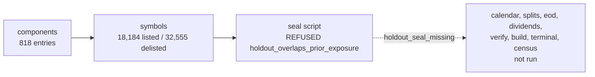

# M4.7a-3 Implementation Report: Local Private Run Stopped At The Holdout Seal

| Field | Value |
| --- | --- |
| Task/attempt | `m4_7a3-universe-and-census-a1` |
| Card | `coord/v8_review_20260923/card_m4_7a3_universe_and_census.md` |
| Plan | `coord/plans/m4_7_binding_plan.md` Revision 11, SHA-256 `6541db93336e9181ebf3ad2f066b7b17f4550a17565036c2db5a5d82872a6407` |
| Route, lane | `GENERAL_EXEC`, CRITICAL (structural: `ARCHITECTURE`, `SCHEMA_PROTOCOL_CONTRACT`, `SECURITY_AUTHORITY`) |
| Author session | Claude Opus 5.5 (`claude-opus-5-5`) via Claude Code |
| Base | `d15ef1d` (main after PR #266), verified live against `origin/main` |
| Branch | `claude/m4_7a3-universe-census` |
| Evidence ceiling | `DIAGNOSTIC_ONLY`; count-only aggregates; no network call |
| Status | **STOPPED** at the seal: `holdout_overlaps_prior_exposure` (plan 7.2 a-3 stop condition, owner decision O-3) |

## 1. Result

Stage a-3 stopped at step 2 of the canonical sequence. `components` and
`symbols` ran through the injected transport seam on the local EODHD
acquisitions. The seal script then refused:

```text
holdout_overlaps_prior_exposure: holdout_end 2029-07-31 is after 2014-01-01
```

Plan 1.4 step 5 and the a-3 stop list in plan 7.2 route this refusal to the
owner (O-3) and pause the stage with the typed reason. Every later command
(`calendar`, `splits`, `eod`, `dividends`) refuses `holdout_seal_missing`
without a seal, so the universe build, terminal curation, and census have no
input. No seal, census JSON, census markdown, or readiness value exists, and
this change commits none. No code was changed.

## 2. What ran



| Step | Command | Outcome |
| --- | --- | --- |
| 1 | `data.eodhd_retrieval.main(["components", ...], transport=local)` | exit 0; 818 entries; `components_retrieved_utc_date = 2026-08-07` |
| 1 | `data.eodhd_retrieval.main(["symbols", ...], transport=local)` | exit 0; 18,184 listed, 32,555 delisted |
| 2 | `python -m research.m4_7_holdout_seal --snapshot-id real_v1 ...` | exit 1; `holdout_overlaps_prior_exposure` |
| 3–6 | retrieval tables, build, terminal tooling, census | not run (seal absent) |

The local transport is a private adapter (`build_local_eodhd_snapshot.py`,
SHA-256 `6b7047a5b1c0ab5320518efd9bcfc4cb5b35acff661cf33dcd296956d33d835d`)
stored beside the snapshot under `<private_data_root>`. It stays out of the
repository because T-STRUCT-1 (`tests/test_project_structure.py`) allows
`urllib.error` imports only in `src/data/eodhd_retrieval.py`, and the adapter
must raise `urllib.error.HTTPError` for the 404 path. Its mapping:

| URL path | Local source |
| --- | --- |
| `fundamentals/GSPC.INDX` | components response of acquisition `snapshot_20260807T002458Z`, wrapped as `{"HistoricalTickerComponents": ...}` |
| `exchange-symbol-list/US?delisted=0/1` | active and delisted common-stock lists of the same acquisition |
| `eod/GSPC.INDX` | `SPY.US` EOD response of acquisition `snapshot_20260808T005805Z` (no local `GSPC.INDX` bars exist) |
| `eod/`, `splits/`, `div/<CODE>` | ledger RAW artifact of acquisition `snapshot_20260808T005805Z`; `EMPTY` returns `[]`; a code absent from the ledger raises HTTP 404 |

The adapter filters dated rows to the request's `from`/`to` window, the
vendor's documented semantics, and passes `--to 2026-08-07`, the acquisition
cutoff, to every table command. The local responses were retrieved without
`from`: their `SUCCESS` files hold 237,136 EOD, 93 split, and 1,138 dividend
rows dated before the module's default `from = 1980-01-01`, and none after
the cutoff. `components` runs under the module's `clock`
seam at 2026-08-07T00:24:58Z, the local response's acquisition time, so the
open-interval rule of plan 1.4 step 1 uses the date the response was
retrieved. The manifest's `snapshot.started_utc` carries the same instant.

## 3. Measurements behind the refusal

Entry outcomes under the shared entry rule (`classify_membership_entries`):

| Outcome | Entries |
| --- | --- |
| `retained` | 675 |
| `entry_missing_field` | 143 (every one lacks `StartDate`; none lacks `Code`) |
| `entry_unparseable_date`, `degenerate_interval`, `exact_duplicate_collapsed`, `raw_overlap` | 0 |

The 143 refused entries are all closed (`IsActiveNow = 0`; 96 carry
`IsDelisted = 1`), with `EndDate` from 2008-09-16 to 2023-12-18.

Raw month-end count `n_raw(m)` over the retained entries (count-only
aggregate, R11), with the upper bound that counts each refused entry as a
member from the earliest start through its `EndDate`:

| Month-end | `n_raw` | Upper bound |
| --- | ---: | ---: |
| 1995-12-31 | 147 | 290 |
| 2000-12-31 | 195 | 338 |
| 2005-12-31 | 236 | 379 |
| 2008-12-31 | 282 | 424 |
| 2010-12-31 | 313 | 455 |
| 2011-12-31 | 331 | 473 |
| 2013-12-31 | 366 | 479 |
| 2016-12-31 | 424 | 494 |
| 2018-12-31 | 460 | 501 |
| 2019-07-31 | 470 | 504 |
| 2019-12-31 | 476 | 504 |
| 2022-12-31 | 498 | 503 |
| 2026-07-31 | 504 | 504 |

| Quantity | Retained entries | Upper bound |
| --- | --- | --- |
| `coverage_start` (tolerant, 3 isolated exceptions) | 2019-07-31 | 2011-12-31 |
| `coverage_start_strict` | 2019-07-31 | 2011-12-31 |
| `holdout_end` (+10 years) | 2029-07-31 | 2021-12-31 |
| `holdout_end <= 2014-01-01` | fails | fails |

The local components response lists 818 entries, while the S&P 500 has had
well over a thousand distinct constituents since 1957; the counts climb
steadily from 54 in 1957 to the band in 2019, which is the signature of a
history that records current members and recent removals only. Imputing the
143 missing start dates is prohibited (R6) and would still fail the seal rule.
The shortfall is a vendor coverage limit of this membership source, and the
M4.7 design (a sealed earliest decade ending by 2014-01-01 plus at least five
discovery years) cannot be met from it.

## 4. Owner decision required (O-3)

Plan 7.6 O-3 names the choice between a shorter sealed window and breadth
extension. Options that the measurements bear on:

1. **Different membership source (new data authority).** A point-in-time
   S&P 500 constituent history with full removals (for example, a licensed
   index-membership file) replaces the components response; the plan's seal
   and census run unchanged. This is the only option that keeps the plan's
   sealed-decade design.
2. **Plan revision to the seal rule.** For example, a holdout sealed after
   the discovery window, or a shorter holdout. With the band starting
   2019-07-31, about seven in-band years exist in total, which cannot supply
   10 holdout years, 1 warm-up year, and 5 discovery years (R-CENSUS-1 needs
   16). Any variant is a CRITICAL plan revision.
3. **Survivor-cohort diagnostic.** Using the 675 retained entries as a
   universe before 2019 is a static survivor-biased cohort; R2 permits it
   only under `DIAGNOSTIC_ONLY` with the bias stated, and it never supports a
   ranking, selection, promotion, or profitability claim.

No option is chosen here; the choice is the owner's.

## 5. Issues pre-identified for the resumed run

These affect steps 3–6 when a-3 resumes and are recorded now so they are not
rediscovered:

- **Calendar source.** No local `GSPC.INDX` EOD response exists; the adapter
  serves the `SPY.US` dates (8,438 bars, 1993-01-29 to 2026-08-07). The
  universe build and census hard-code the label
  `calendar_source = GSPC.INDX_eod_dates_v1`, so a census from this snapshot
  would mislabel its calendar; R-CENSUS-5 would also need `coverage_start`
  on or after 1993-01-29. A resumed run needs either a real `GSPC.INDX`
  response or a label that states the substitution.
- **Dividend coverage.** 217 of 815 local dividend requests are `EMPTY`,
  including codes with long dividend histories whose raw response holds only
  one post-cutoff row. The in-span step check (C73) will refuse episodes whose
  adjusted series steps at undeclared distributions, and those member-days
  count toward R-CENSUS-9.
- **Code coverage.** The EOD acquisition holds 814 equity codes plus
  `SPY.US`; membership codes absent from its ledger receive HTTP 404 and type
  `unavailable:missing_symbol`.

## 6. Committed files

| File | Content |
| --- | --- |
| `coord/reports/m4_7a3_universe_and_census_impl.md` | This report |
| `docs/engineering_log.md` | Run authorization, provenance, stop, and snapshot state |
| `docs/current_handoff.md` | Refreshed to base `d15ef1d`; blocker and next action |

Not committed, because they do not exist: `reports/m4_7_coverage_census.json`,
`reports/m4_7_coverage_census.md`, `docs/preregistrations/m4_7_holdout_seal_v1.json`.

## 7. Privacy (R11)

The repository receives count-only aggregates, SHA-256 digests, acquisition
identifiers, and the typed refusal. No ticker, permanent ID, provider row,
provider response, membership list, credential, or private absolute path is
committed. The snapshot's byte scan finds no occurrence of the placeholder
token.

## 8. Verification

Run on the committed head `d2995ad` (the amend changes this report only).

| Check | Result |
| --- | --- |
| `.venv/bin/python -m pytest tests/test_governance_constitution.py tests/test_m4_7_*.py tests/test_project_structure.py` | 336 passed |
| `ruff check . --exclude .venv` | all checks passed |
| `git diff --check d15ef1d...HEAD` | clean |
| Token byte scan of the private snapshot | no match |

`.venv/bin/pytest` run directly fails collection with
`ModuleNotFoundError: research` because it omits the repository root from
`sys.path`; `python -m pytest`, the CI invocation, includes it. Before the
commit, `test_handoff_trails_its_base_by_at_most_one_merged_pr` failed,
because it reads `HEAD~1` as the base tip; it passes on the committed head.

## 9. Ablation

No repository code changed; the ablation covers the private adapter.

- Simplification attempt (kept): the window filter's sentinel defaults for
  absent `from` and `to` were removed, because the retrieval module always
  sends `from` and the adapter always passes `--to` on table requests; the
  filter now reads both keys directly. A clean rebuild of `components` and
  `symbols` with the simplified adapter reproduced every manifest file hash
  and the same seal refusal.
- Guard-necessity checks (retained): the `from` half of the filter removes
  the pre-1980 rows counted in section 2, so the written tables match the
  request window the manifest records; the `status != "SUCCESS"` branch that
  raises HTTP 404 is dead on this ledger (only `SUCCESS` and `EMPTY` occur)
  and stays as a fail-closed guard against serving a failed response's bytes.
- Limitation: the table-command paths of the adapter (`calendar`, `splits`,
  `eod`, `dividends`) have not executed, because the seal refused first.

## 10. Next gate

Owner decision O-3 on the membership shortfall. After the decision, a-3
resumes from the private manifest: under option 1 with a new `components`
retrieval into a fresh snapshot, under option 2 after the plan revision is
accepted. M4.7b-2 (registration freeze) stays blocked on a-3.
