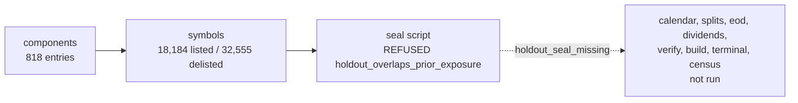

# M4.7a-3 Implementation Report: Option A Seal Rule, Local Private Run, And Coverage Census (Ready With Caveats)

| Field | Value |
| --- | --- |
| Task/attempt | `m4_7a3-universe-and-census-a1` (resumed after owner decisions O-3, O-7, and O-8) |
| Card | `coord/v8_review_20260923/card_m4_7a3_universe_and_census.md` |
| Plan | `coord/plans/m4_7_binding_plan.md` Revision 11, SHA-256 `6541db93336e9181ebf3ad2f066b7b17f4550a17565036c2db5a5d82872a6407`, revised for the seal rule by owner decision O-3 Option A and for the coverage shortfall by O-7 (`docs/decision_log.md`, 2026-09-26) |
| Route, lane | `GENERAL_EXEC`, CRITICAL (structural: `ARCHITECTURE`, `SCHEMA_PROTOCOL_CONTRACT`, `SECURITY_AUTHORITY`) |
| Author session | Claude Opus 5.5 (`claude-opus-5-5`) via Claude Code |
| Base | `d15ef1d` (main after PR #266), verified live against `origin/main` |
| Branch | `claude/m4_7a3-universe-census` |
| Evidence ceiling | `DIAGNOSTIC_ONLY`; count-only aggregates; no network call |
| Status | Complete: census readiness **`ready_with_caveats:coverage_shortfall_accepted,holdout_breadth_after_identity`**; VP-2 re-ratified under `DIAGNOSTIC_ONLY` (O-8) |

## 1. Result

Stage a-3 is complete. The owner chose Option A for O-3, and after the first
Option A census measured a coverage shortfall, Option 1 for O-7 (accept the
shortfall) and O-8 (re-ratify VP-2 under `DIAGNOSTIC_ONLY`). The full
canonical sequence ran on snapshot `real_v1`, and the committed census reads:

```text
ready_with_caveats:coverage_shortfall_accepted,holdout_breadth_after_identity
```

| Rule | Measured | Registered threshold | O-7 accepted bound | Result |
| --- | --- | --- | --- | --- |
| R-CENSUS-1 in-band history | 6.92 years | 7 | 6.9 | shortfall accepted |
| R-CENSUS-2 common support | 20 windows; excluded 0.384 | 6; 0.05 | 25; 0.45 | shortfall accepted |
| R-CENSUS-7 holdout breadth | min 468 | tolerant band | none | caveat |
| R-CENSUS-8 IC supply | 32 months | 48 | 32 | shortfall accepted |
| R-CENSUS-9 unpriced member-days | 0.330 | 0.02 | 0.40 | shortfall accepted |

R-CENSUS-3 (identity refusals 0.35 percent), R-CENSUS-4 (off-calendar
0.0008 percent), R-CENSUS-5, R-CENSUS-6, and R-CENSUS-10 pass their
registered thresholds. Each shortfall rule keeps `passed = false` in the
public JSON, so the registered miss and the owner acceptance both stay
visible. The first Option A census, `blocked` on the same measurements,
stays in history at `cfcbb91`.

The evidence ceiling is `DIAGNOSTIC_ONLY`. With 32 IC months the power
projection gives `kill_reachable_projection = false`; every IC month lies
inside the static 50-name cohort's prior-exposure window.

## 2. Option A implementation (`eb8c5a5`)

| File | Change |
| --- | --- |
| `src/data/holdout_partition.py` | `SEAL_RULES` keyed by `rule_version`: v1 (10-year holdout, cap 2014-01-01, 16 in-band years, 60 IC months) and Option A (1-year holdout, no cap, 7 in-band years, 48 IC months); `derive_holdout_window`, `build_prospective_seal`, and `write_prospective_seal` take the rule and `calendar_source`; `read_seal` refuses an unregistered rule; `read_holdout_end` reads through it |
| `research/m4_7_holdout_seal.py` | `--rule-version` and `--calendar-source` |
| `research/m4_7_coverage_census.py` | `derive_readiness(inputs, rule_version)` reads the minima from the seal rule and publishes `thresholds`; `calendar_source` from the seal; markdown header states the rule and calendar source |
| `research/m4_7_universe_build.py` | `Snapshot.calendar_source` from the seal; build manifest label |
| `research/m4_7_common_support.py`, `research/m4_7_sp500_pit_rerun.py` | `snapshot_support` takes `calendar_source`, so the census and the runner recompute the same `segments_sha256` |
| `tests/test_m4_7_holdout_seal.py`, `tests/test_m4_7_coverage_census.py` | Option A window and seal fields, unknown-rule refusal, Option A readiness thresholds and edges |

The default arguments keep every v1 seal and synthetic fixture unchanged
apart from the new `calendar_source` field, whose default is the former
hard-coded label. The Option A minima were fixed from dates alone before any
census ran: 7 years is 1 holdout, 1 warm-up, and 5 discovery years; a one-year
holdout on the `SPY.US` calendar allows at most 60 IC months with no gap
window, and 48 is four years.

## 3. Run on `real_v1`

| Step | Outcome |
| --- | --- |
| Seal (Option A, `SPY.US_eod_dates_v1`) | holdout `[2019-07-31, 2020-07-31)`; prospective SHA-256 `93ce6e5ad003927dbf7f1521c26aca6a17844cb3061a44f7885a5584612e9882` |
| `calendar` | 8,438 rows (1993-01-29 to 2026-08-07) |
| `splits`, `eod`, `dividends` | each 815 `retrieved`, 4 `unavailable:missing_symbol`; 2 discovery `eod` partitions quarantined; no holdout quarantine |
| `verify` | `retrieval_complete = true`; no hash mismatch, stale split evidence, or token leak |
| Universe build | 818 intervals: 663 resolved, 143 `entry_missing_field`, 12 identity refusals; 882 permanent IDs; 83 episodes refused a panel (80 `split_basis_unverified:in_span_step_mismatch`, 2 `unexplained_deviation`, 1 `split_attribution_ambiguous`) |
| Terminal evidence | 47 delisting candidates: 27 `unresolved`, 20 `deferred_holdout`; 0 engine events |
| Census (first Option A run) | `blocked`; JSON SHA-256 `5015a1d80389c8c69019d78011943765641935211a532dbe38ac7b9061095c5c`; superseded by the O-7 rerun in section 4 |

Curation: no local source holds deal consideration terms. The cross-stream
integration tree holds SEC Form 25 identity targets with few retrieved
bodies, so every discovery candidate stays `unresolved` and enters `U`
(R4, R6). Curating the 24 in-window events from public documents is the
largest lever on R-CENSUS-2 and R-CENSUS-8 (O-5 curation capacity).

Other census figures: discovery window `D0` 2021-08-31 to `D_last`
2026-08-07; `max_reset_to_reset_rows` and segments in the public JSON;
power projection `T_proj = 32`, `kill_reachable_projection = false`; IC
months inside the static 50-name cohort window 100 percent and inside the
historical evaluation window 6.25 percent; VP-1 `a1_volume_half =
consistent` over 65 rows (plan stop not triggered); VP-2 exposure 178,859
member-days with `S_D > 0.05` (22.5 percent of 795,198 eligible), so
`vp2_revisit_required = true`.

The in-span refusals carry 1,548 undeclared steps among 1,598 failing pairs,
1,358 of them with residual in `(1e-3, 1e-2]`. The pattern is consistent with
dividends applied to `adjusted_close` but absent from the 217 dividend tables
that the local acquisition recorded as `EMPTY`; the pipeline reads an empty
table as valid evidence of no rows.

The census first ran on uncommitted code (`code_commit = 682e01f`). After the
code commit the build, terminal, and census reran; the public JSON differs
only in `code_commit`, now `eb8c5a5`.

## 4. Owner decisions O-7 and O-8 and the calibration (`9fd7734`)

The first Option A census (`5015a1d8…5c5c`, code `eb8c5a5`) was `blocked`
on R-CENSUS-1, 2, 8, and 9 and set `vp2_revisit_required`. The owner then
decided:

- **O-7:** accept the shortfall as `ready_with_caveats:coverage_shortfall_accepted`,
  including 6.92 in-band years against 7.
- **O-8:** re-ratify VP-2 under `DIAGNOSTIC_ONLY`, covering the 22.5 percent
  of eligible member-days with `S_D > 0.05`.

| File | Change |
| --- | --- |
| `src/data/holdout_partition.py` | `accepted_shortfall` per seal rule (Option A bounds above; v1 none) |
| `research/m4_7_coverage_census.py` | a miss inside the bounds is the caveat `coverage_shortfall_accepted`; status composes every caveat; thresholds publish the bounds; markdown names each failing rule |
| `research/m4_7_sp500_pit_rerun.py` | `MIN_IC_MONTHS = 32`, `MIN_HALF_MONTHS = 16`, `CALENDAR_SOURCE = SPY.US_eod_dates_v1`, support caps 25 and 0.45, `O8_DISPOSITION = re_ratified_diagnostic_only`; `bind_snapshot` refuses a registered calendar source that differs from the snapshot seal |
| `tests/fixtures/m4_7/e2e_scenario.py`, `tests/fixtures/m4_7/runner_scenario.py` | the runner fixture seals with the registered calendar source |
| tests | accepted-shortfall caveat, six beyond-bound blocks, the calendar-source guard, seal-rule values; the sign-stability and MDE edges moved to 16 and 32 |

The census reran from `9fd7734` on unchanged build and terminal artifacts:
JSON SHA-256 `608fd1b1dd633e8985ea07537f6a944777cb38d684e86e7c75ada11ddc2d1c40`,
confirmed seal SHA-256 `b7f9380fa5f128c65966a2984f2a81b635b3f3777f32878270fc977a93bff506`
(confirmation `caveat`; prospective seal unchanged). Against the blocked
census only the four rule results, the status, the thresholds block, and
`code_commit` changed.

Limitations that the acceptance leaves in place: the 24 uncurated
delistings stay in `U`; 83,718 member-days of in-span refusals and the
177,177-member-day charge for the 143 entries without `StartDate` stay
unpriced; the bounds were set after the shortfall was measured.

## 5. First pass: the v1 seal refusal

`components` and `symbols` first ran under the v1 rule, and the seal refused
`holdout_overlaps_prior_exposure` (holdout_end 2029-07-31 after 2014-01-01).

### 5.1 What ran before the seal refusal



| Step | Command | Outcome |
| --- | --- | --- |
| 1 | `data.eodhd_retrieval.main(["components", ...], transport=local)` | exit 0; 818 entries; `components_retrieved_utc_date = 2026-08-07` |
| 1 | `data.eodhd_retrieval.main(["symbols", ...], transport=local)` | exit 0; 18,184 listed, 32,555 delisted |
| 2 | `python -m research.m4_7_holdout_seal --snapshot-id real_v1 ...` | exit 1; `holdout_overlaps_prior_exposure` |
| 3–6 | retrieval tables, build, terminal tooling, census | not run (seal absent) |

The local transport is a private adapter (`build_local_eodhd_snapshot.py`,
SHA-256 `6b7047a5b1c0ab5320518efd9bcfc4cb5b35acff661cf33dcd296956d33d835d`)
stored beside the snapshot under `<private_data_root>`. It stays out of the
repository because T-STRUCT-1 (`tests/test_project_structure.py`) allows
`urllib.error` imports only in `src/data/eodhd_retrieval.py`, and the adapter
must raise `urllib.error.HTTPError` for the 404 path. Its mapping:

| URL path | Local source |
| --- | --- |
| `fundamentals/GSPC.INDX` | components response of acquisition `snapshot_20260807T002458Z`, wrapped as `{"HistoricalTickerComponents": ...}` |
| `exchange-symbol-list/US?delisted=0/1` | active and delisted common-stock lists of the same acquisition |
| `eod/GSPC.INDX` | `SPY.US` EOD response of acquisition `snapshot_20260808T005805Z` (no local `GSPC.INDX` bars exist) |
| `eod/`, `splits/`, `div/<CODE>` | ledger RAW artifact of acquisition `snapshot_20260808T005805Z`; `EMPTY` returns `[]`; a code absent from the ledger raises HTTP 404 |

The adapter filters dated rows to the request's `from`/`to` window, the
vendor's documented semantics, and passes `--to 2026-08-07`, the acquisition
cutoff, to every table command. The local responses were retrieved without
`from`: their `SUCCESS` files hold 237,136 EOD, 93 split, and 1,138 dividend
rows dated before the module's default `from = 1980-01-01`, and none after
the cutoff. `components` runs under the module's `clock`
seam at 2026-08-07T00:24:58Z, the local response's acquisition time, so the
open-interval rule of plan 1.4 step 1 uses the date the response was
retrieved. The manifest's `snapshot.started_utc` carries the same instant.

### 5.2 Measurements behind the v1 refusal

Entry outcomes under the shared entry rule (`classify_membership_entries`):

| Outcome | Entries |
| --- | --- |
| `retained` | 675 |
| `entry_missing_field` | 143 (every one lacks `StartDate`; none lacks `Code`) |
| `entry_unparseable_date`, `degenerate_interval`, `exact_duplicate_collapsed`, `raw_overlap` | 0 |

The 143 refused entries are all closed (`IsActiveNow = 0`; 96 carry
`IsDelisted = 1`), with `EndDate` from 2008-09-16 to 2023-12-18.

Raw month-end count `n_raw(m)` over the retained entries (count-only
aggregate, R11), with the upper bound that counts each refused entry as a
member from the earliest start through its `EndDate`:

| Month-end | `n_raw` | Upper bound |
| --- | ---: | ---: |
| 1995-12-31 | 147 | 290 |
| 2000-12-31 | 195 | 338 |
| 2005-12-31 | 236 | 379 |
| 2008-12-31 | 282 | 424 |
| 2010-12-31 | 313 | 455 |
| 2011-12-31 | 331 | 473 |
| 2013-12-31 | 366 | 479 |
| 2016-12-31 | 424 | 494 |
| 2018-12-31 | 460 | 501 |
| 2019-07-31 | 470 | 504 |
| 2019-12-31 | 476 | 504 |
| 2022-12-31 | 498 | 503 |
| 2026-07-31 | 504 | 504 |

| Quantity | Retained entries | Upper bound |
| --- | --- | --- |
| `coverage_start` (tolerant, 3 isolated exceptions) | 2019-07-31 | 2011-12-31 |
| `coverage_start_strict` | 2019-07-31 | 2011-12-31 |
| `holdout_end` (+10 years) | 2029-07-31 | 2021-12-31 |
| `holdout_end <= 2014-01-01` | fails | fails |

The local components response lists 818 entries, while the S&P 500 has had
well over a thousand distinct constituents since 1957; the counts climb
steadily from 54 in 1957 to the band in 2019, which is the signature of a
history that records current members and recent removals only. Imputing the
143 missing start dates is prohibited (R6) and would still fail the seal rule.
The shortfall is a vendor coverage limit of this membership source; the v1
design (a sealed earliest decade ending by 2014-01-01 plus at least five
discovery years) cannot be met from it, which led to owner decision O-3.

## 6. Committed files

| File | Content |
| --- | --- |
| `src/data/holdout_partition.py`, `research/m4_7_holdout_seal.py`, `research/m4_7_coverage_census.py`, `research/m4_7_universe_build.py`, `research/m4_7_common_support.py`, `research/m4_7_sp500_pit_rerun.py` | Option A seal rule and declared calendar source (`eb8c5a5`); O-7 bounds and runner calibration (`9fd7734`) |
| `tests/test_m4_7_holdout_seal.py`, `tests/test_m4_7_coverage_census.py`, `tests/test_m4_7_sp500_pit_rerun.py`, `tests/test_m4_7_decision.py`, `tests/test_m4_7_family_a.py`, `tests/fixtures/m4_7/*.py` | Option A, O-7, and runner tests |
| `reports/m4_7_coverage_census.json`, `reports/m4_7_coverage_census.md` | Public census aggregates, readiness `ready_with_caveats` |
| `docs/preregistrations/m4_7_holdout_seal_v1.json` | Option A seal with confirmation `caveat` |
| `docs/decision_log.md` | O-3 Option A; O-7 and O-8 |
| `docs/engineering_log.md` | Run authorization and provenance; the stop; the resumed run |
| `docs/current_handoff.md` | Refreshed to base `d15ef1d` |
| `docs/repo_map.md` | Regenerated (mapped `docs/` file count) |
| `coord/reports/m4_7a3_universe_and_census_impl.md` | This report |

## 7. Privacy (R11)

The public census and seal hold counts, fractions, month-level windows,
hashes, and typed codes. A scan of the three public files finds no member
code, permanent ID, or private path; the only exchange-suffixed strings are
the benchmark calendar label `SPY.US_eod_dates_v1` and the seal's
`dates/<CODE>.US.parquet` pattern. Provider rows, membership lists, the
adapter, and the snapshot stay under `<private_data_root>`.

## 8. Verification

Run on head `0cf2645` (the amend that adds this table changes this report only).

| Check | Result |
| --- | --- |
| `.venv/bin/python -m pytest tests/test_governance_constitution.py tests/test_m4_7_*.py tests/test_project_structure.py tests/test_eodhd_retrieval.py` | 422 passed |
| `ruff check . --exclude .venv` | all checks passed |
| `git diff --check d15ef1d...HEAD` | clean |
| Public-file privacy scan (member codes, `#E` IDs, private paths) | no match |
| Census rerun from `9fd7734` against the blocked census | only rule results, status, thresholds, and `code_commit` differ |
| `docs/repo_map.md` regeneration | unchanged in this round |

## 9. Ablation

O-7 round (`9fd7734`):

- Guard-necessity check (retained): removing the runner's calendar-source
  guard fails `test_registered_calendar_source_must_match_the_snapshot_seal`.
- Simplification attempt (rejected): overwriting the registered thresholds
  with the accepted values removes the caveat branch, but the census then
  reports R-CENSUS-1, 2, 8, and 9 as passed and the status as
  `ready_with_caveats:holdout_breadth_after_identity` alone, hiding the
  shortfall that O-7 names.

Option A round (`eb8c5a5`):

- Guard-necessity check (retained): removing the unregistered-rule refusal
  from `read_seal` fails `test_a_seal_with_an_unknown_rule_version_is_refused`,
  and `derive_readiness` then raises an untyped `KeyError`.
- Simplification attempt (rejected): a `date.max` sentinel for the Option A
  cap removes the two `is None` branches with identical readiness, and fails
  only `test_option_a_readiness_thresholds_follow_the_seal_rule`, because the
  public thresholds would publish a fictitious cap `9999-12-31` instead of
  `null`.
- Private adapter (first pass): the window filter's sentinel defaults were
  removed and a clean rebuild reproduced every manifest file hash; the `from`
  filter and the non-`SUCCESS` 404 guard are retained. Its table paths have
  now executed on the full run.

## 10. Next gate

M4.7b-2: freeze `docs/preregistrations/m4_7_sp500_pit_rerun_v1.json` with the
Option A seal, `census_json_sha256` `608fd1b1…1c40`, `seal_confirmed_sha256`
`b7f9380f…f506`, the runner's calibrated protocol, and the O-1, O-3, and O-6
values, before any discovery-window computation.
