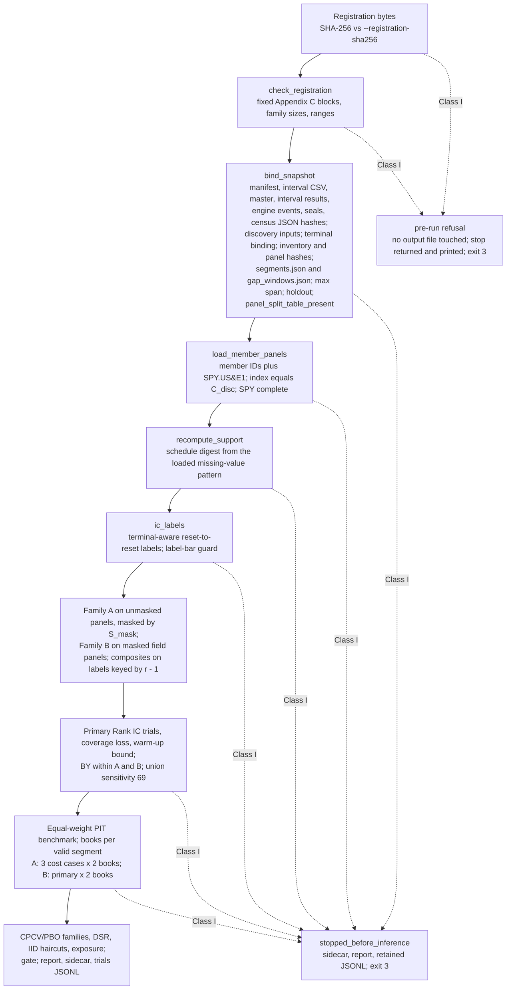

# M4.7b-1 Implementation Report: Runner Integration on Synthetic Fixtures

| Field | Value |
| --- | --- |
| Task | `/private/tmp/m47b1_runner_task.md` (M4.7 Phase b-1) |
| Plan | `coord/plans/m4_7_binding_plan.md` Revision 11, SHA-256 `6541db93336e9181ebf3ad2f066b7b17f4550a17565036c2db5a5d82872a6407`; sections 4, 6, 7.3, Appendices A, B, C, E |
| Route, lane | `GENERAL_EXEC`, CRITICAL |
| Author session | Claude Opus 5.5 (`claude-opus-5-5`) via Claude Code |
| Base | `de3172b` (main after PR #265) |
| Branch | `claude/m4_7b1-runner-integration` |
| Evidence ceiling | `DIAGNOSTIC_ONLY`; synthetic snapshots only; no network call; no private data |

## 1. Result

Stage b-1 is implemented and verified on a committed synthetic fixture
universe. `research/m4_7_sp500_pit_rerun.py` now carries the runner entry
point over the a-0 core and the a-2 snapshot files. It binds a registration by
SHA-256, re-checks every derived input before any panel is read, recomputes
the peeled schedule from the loaded panels, runs Family A and Family B on
member-only engine frames over the valid segments, applies per-family BY,
halves, MDE, coverage loss with the warm-up bound, four CPCV/PBO families, and
the gate, and writes the report, the JSON sidecar, and the trials JSONL. No
engine file changed.

The fixture universe flows through the merged a-1 retrieval module, the seal
script, the universe build, the terminal tooling, and the census, then through
the runner. The run completes with zero Class I stops, every Family A trial
`evaluated` (6 primary, 18 long-short, 18 long-only), the warm-up bound
satisfied for all six factors, and the registered outcome `extend_first`.

Verification on the candidate head:

| Check | Result |
| --- | --- |
| `tests/test_m4_7_sp500_pit_rerun.py` | 50 passed (156 s wall with `-n 4`; the shared end-to-end run takes about 125 s) |
| Existing M4.7 suites (`common_support`, `coverage_census`, `decision`, `terminal_evidence`) | 100 passed, unchanged |
| Full suite (`pytest -n 8`) on the committed head | 3,039 passed, 2 skipped (platform long-double) |
| `ruff check . --exclude .venv` | clean |
| `git diff --check` | clean |
| `docs/repo_map.md` | regenerated with `scripts/repo_map.py` (two new test files) |

## 2. Deliverables

| # | Deliverable | Location | Notes |
| --- | --- | --- | --- |
| 1 | Runner | `research/m4_7_sp500_pit_rerun.py` | `REGISTERED` (the fixed Appendix C blocks), `check_registration`, `bind_snapshot`, `load_member_panels`, `recompute_support`, `family_b_alphas`, `family_b_composites`, `ic_labels`, `coverage_loss`, `ic_evaluation`, `run_segmented_book`, `book_statistics`, `book_trial`, `excess_metrics`, `cpcv_family`, `excluded_event_exposure`, `run_rerun`, `render_report`, `main`. The a-0 functions are unchanged |
| 2 | Support seam | `research/m4_7_common_support.py` (`snapshot_support`) | The census writer and the runner compute the schedule through one function from a bar-presence matrix; `write_support_files` is otherwise unchanged |
| 3 | Census estimate seam | `research/m4_7_coverage_census.py` (`post_join_warmup_estimate`) | The census estimate as a pure function; `run_census` output unchanged |
| 4 | Fixture universe | `tests/fixtures/m4_7/runner_scenario.py` | Section 5 |
| 5 | Tests | `tests/test_m4_7_sp500_pit_rerun.py` | Section 4 |
| 6 | Records | `docs/engineering_log.md`, `docs/current_handoff.md` (refreshed to base `de3172b`), `docs/repo_map.md` | |

CLI: `python -m research.m4_7_sp500_pit_rerun --snapshot-id <ID>
--registration-sha256 <hash> [--registration <path>] [--output-dir <dir>]
[--census-json <path>] [--seal-record <path>] [--data-dir <dir>]`. Exit 0 on
completion, 3 on a Class I stop, 2 on a missing data directory.

## 3. Run sequence

A Class II error (any other `BacktestValidationError` or `ValueError` from a
book, an estimator, a factor, or the composite builders) keeps the trial as
`failed` with its error type and message at `p = 1` and the run continues.

## 4. Test matrix

| ID | Test(s) | Status |
| --- | --- | --- |
| T-TERM-7 (runner part) | `test_t_term_7_runner_assumptions_list_the_lag_distribution` | pass |
| T-SUP-4 | `test_t_sup_4_books_and_benchmark_share_measured_rows_and_exposure_is_typed`, `test_t_sup_4_cpcv_family_omits_failed_columns` | pass |
| T-SUP-5 | `test_t_sup_5_every_book_completes_and_a_one_row_gap_member_is_held_around_the_window` | pass |
| T-SUP-6 | `test_t_sup_6_a_missing_value_the_census_did_not_record_stops_the_run` | pass |
| T-SUP-7 | `test_t_sup_7_two_segment_hand_oracle` (both books) | pass |
| T-SUP-9 | `test_t_sup_9_book_failures_are_trial_level_or_class_one`, `test_t_sup_9_a_label_bar_missing_past_the_census_is_class_one`, `test_t_sup_9_class_one_inside_a_segment_stops_and_keeps_written_trials` | pass |
| T-SUP-10 | `test_t_sup_10_ic_rows_and_book_holdings_align` | pass |
| T-REG-1 | `test_t_reg_1_registration_matches_the_implemented_protocol`, `test_t_reg_1_departures_from_the_protocol_refuse` (21 departures) | pass |
| T-REG-2 | `test_t_reg_2_hash_is_written_into_report_sidecar_and_every_trial`, `test_t_reg_2_hash_mismatch_is_class_one_before_any_trial`, `test_cli_exit_codes` | pass |
| T-REG-4b (runner part) | `test_t_reg_4b_family_b_masking_and_composite_inputs` | pass |
| T-REG-6 | `test_t_reg_6_equal_weight_pit_benchmark_hand_oracle` (equity path at `1e-12`) | pass |
| T-REG-8 | `test_t_reg_8_cpcv_families_are_aligned_on_mrows` | pass |
| T-REG-9 | `test_t_reg_9_typed_statistics_and_the_header` | pass |
| T-REG-10 | `test_t_reg_10_engine_frames_hold_member_permanent_ids_only` (every recorded engine call) | pass |
| T-REG-11 | `test_t_reg_11_coverage_loss_and_the_census_warmup_bound` | pass |
| T-REG-12 | `test_t_reg_12_a_panel_split_table_refuses_before_loading` | pass |
| T-REG-13 | `test_t_reg_13_stale_inputs_refuse_and_the_rebuilt_state_loads` | pass |
| Acceptance | `test_b1_synthetic_end_to_end_rerun_meets_the_acceptance_row` | pass |
| Guard witnesses | `test_binding_guards_refuse_before_loading`, `test_loaded_calendar_and_benchmark_guards`, `test_warmup_bound_violation_is_class_one`, `test_family_a_trial_count_is_asserted_before_inference`, `test_failed_trials_keep_their_slots_and_the_gate_reads_evaluation_incomplete` | pass |

## 5. Fixture universe

`tests/fixtures/m4_7/runner_scenario.py` serves 104 random-walk anchors plus
one cash deal, one stock deal at lag 0 and one at lag -1 (acquirer-only
`ACQ.US`), one rename into a successor code, one unresolved delisting, one
two-row mid-month halt, one missing bar on a reset row, one ticker reuse (two
permanent IDs), one joiner with prior history, one new listing, one index
removal, and one terminal-reset joiner, with `SPY.US` as the benchmark. The
calendar is weekly (591 rows); the 252-row warm-up and 68 IC months fit, and
each engine call stays small. The halt, the reset-row gap, the unresolved
delisting, and the terminal-reset joiner share one month, so their windows
merge into one peeled window between two valid segments.

Measured on the fixture:

| Quantity | Value |
| --- | --- |
| Member columns | 116 (`SPY.US#E1` and `ACQ.US#E1` have panels and never enter an engine frame) |
| Accepted terminal events | 4 (cash lag 0; stock lag 0; stock lag -1; rename as stock lag 0); 1 unresolved |
| Gap windows, excluded rows | 1 window (`missing_bar`, `terminal_reset_missing_bar`, `unresolved_delisting`; 1 peeled row); 8 rows, fraction 0.0262 |
| `|U|`, `|G|` | 1, 4 |
| IC months | 68 supplied; 1 in the gap; 2 horizon-unmeasured |
| `max_reset_to_reset_rows` | 5 (weekly calendar) |
| Family A primary | 6 `evaluated`, 68 months each; MDE_f 0.0343 to 0.0541 |
| Family B primary | 48 `evaluated`, 15 `invalid_insufficient_ic_months` |
| Books | 36 Family A and 126 Family B, all `evaluated`; 14 Family B books never trade on the fixture and carry `zero_variance` |
| PBO | A long-short 0.314, A excess 0.143, B long-short 0.614, B excess 0.343 (all `available`) |
| Gate | `extend_first`, `power_status = inadequate`, no contrary rejection |
| Census readiness | `blocked` by R-CENSUS-5 alone (the synthetic calendar starts after the sealed coverage start); R-CENSUS-1 through 4 and 6 through 10 pass |

The fixture values are synthetic and carry no research meaning.

## 6. Ablation

Baseline preserved; each change applied alone to a copy of the baseline tree
and run against the targeted tests with a driver in the session scratchpad
(`abl/driver.py`, 23 variants in parallel).

Simplification attempts:

| Attempt | Outcome | Decision |
| --- | --- | --- |
| S1 recursive key collector for the `kill_reachable` check replaced by a JSON key search | tests pass | kept |
| S2 the holdout-overlap raise after loading (unreachable: `C_disc` starts at `i_H` and the index equality check precedes it) | tests pass | kept; the guard record stays in the header |
| S3 the second `max_reset_to_reset_rows` comparison after the recomputed digest (the digest covers the value) | tests pass | kept; the file-level check in `bind_snapshot` remains and types `max_reset_span` |
| S4 the union-family sensitivity (plan 7.7 item 1) | 8 end-to-end tests error | restored; plan 6.3 and 6.4 register it; witness assertions added |
| S5 the private per-month label record | tests pass | retained because Appendix A names it; witness assertions added |
| S6 an unused `segments_record` return field | tests pass | kept |
| S7 the IID Sharpe haircut summary | tests pass | retained because plan 6.4 lists it; witness assertion added |
| S8 the explicit Family A trial count before the family summary (guard G15 below) | the family partition of `summarize_multiple_testing` refuses the same count with `family_size_mismatch` | kept; the summary refusal is the assertion |
| Plan 7.7 item 3: share the trial loop with the 50-name runner | analysis: that loop uses fixed-horizon labels, one bounded window, and raises on any error; M4.7 needs reset-to-reset labels, segments, and the Class I/II split | no change |
| Plan 7.7 items 5 and 7: one-segment collapse and per-segment reporting | the runner has no segment-count branch to remove; a one-segment run takes the same path | no change |

Guard-necessity checks (each guard removed alone):

| Guard removed | Targeted outcome |
| --- | --- |
| G01 registration hash | fails (T-REG-2, CLI) |
| G02 `panel_split_table_present` re-check | fails (T-REG-12) |
| G03 inventory discovery-input check | fails (binding witness: stale inventory digest under an unchanged manifest) |
| G04 panel file hashes | fails (T-REG-13) |
| G05 terminal binding | fails (binding witness: curated evidence edited after validation) |
| G06 recomputed schedule digest | fails (T-SUP-6) |
| G07 `segments.json` and `gap_windows.json` binding | fails (binding witness: edited gap-window file) |
| G08 file-level max-span check | fails (binding witness) |
| G09 label-bar guard | fails (T-SUP-9) |
| G10 warm-up bound | fails (witness: inflated census estimate) |
| G11 holdout seal agreement | fails (binding witness) |
| G12 loaded calendar equality | fails |
| G13 SPY completeness | fails |
| G14 Class I engine reasons | fails (T-SUP-9, both parts) |
| G15 explicit Family A count | passes; subsumed by the family summary (S8) |
| G16 fixed-section equality in `check_registration` | fails (T-REG-1 departures) |

The binding witnesses G03, G05, G07, and G10 were added in this stage because
another check masked each guard on the first design of the tests.

## 7. Interpretations and deviations for review

1. **CLI.** The task names `--registration <PATH_OR_HASH>`; the plan (6.1,
   7.4 c-1) names `--registration-sha256`. The runner takes `--registration`
   as the path (default `docs/preregistrations/m4_7_sp500_pit_rerun_v1.json`)
   and requires `--registration-sha256`. `--census-json` and `--seal-record`
   default to the repository paths the census writes, because the
   registration pins `census_json_sha256` and `seal_confirmed_sha256` of files
   outside the snapshot.
2. **`registration_invalid`.** A departure from the registered protocol that
   is not a family-size mismatch stops as Class I `registration_invalid:<field>`;
   Appendix B has no code for it.
3. **Family A parameters.** T-REG-1 requires equality with
   `research/m4_7_family_a.py`, so the registration's Family A parameters use
   the implementation keyword names (`lookback_periods`, `skip_periods`,
   `window`, `window_periods`, `ddof`) in place of the Appendix C skeleton
   names.
4. **Owner values.** Costs (O-1) and objectives (O-6) are read from the
   registration and range-checked (sensitivity equals twice primary, zero case
   zero; IR above 0, tracking error in `(0, 0.25]`, drawdowns in `(0, 1)`);
   every other fixed block must equal `REGISTERED`.
5. **SPY completeness** is typed `calendar_mismatch`; plan 2.4 states both
   requirements together and names no separate runner code.
6. **Public granularity.** Report and sidecar give gap windows, segment
   bounds, and excluded-event exposure at month granularity with no permanent
   ID, following the census public convention (R11). The per-month label
   record is private at `<snapshot>/rerun/label_records.json`; per-factor
   finite-pair counts and invalid-month counts sit in the trial records.
7. **Census readiness** is recorded in the header and gates nothing; the plan
   gives the runner no readiness code, and b-2 requires `ready` or
   `ready_with_caveats` before the freeze.
8. **T-SUP-5 "ready census".** The fixture census is blocked by R-CENSUS-5
   alone; the schedule rules (R-CENSUS-2, 8, 9) pass.
9. **T-SUP-10** uses twelve names (deciles need at least ten) and Rank IC with
   `min_pairs = 3`.
10. **T-REG-11 calendar.** No 600-row business-day calendar places resets at
    both rows 401 and 550; the test uses one with a reset at 550 and asserts
    that GAP is outside `Elig` at `t = 400`.
11. **T-REG-4b runner part** captures the builder inputs (labels keyed by
    `r - 1`, `forward_holding_periods = max_reset_to_reset_rows`, rebalance
    dates, IC history, composite IDs) and the output mask; horizon invariance
    of the builders is the a-0 test.
12. **T-REG-13 (c)** verifies the rebuilt state through `bind_snapshot`,
    `load_member_panels`, and `recompute_support`; the full run path is the
    end-to-end test.
13. **Composite configuration.** `_build_composites` receives
    `signal_lag_periods = 1`, `forward_holding_periods = max_reset_to_reset_rows`,
    and the 50-name runner's `ridge_alpha = 0.1`.

## 8. Limitations

- Every figure is synthetic and `DIAGNOSTIC_ONLY`; no private snapshot was
  opened and no network call was made.
- Runtime on real data is unprofiled. The long-only engine validates source
  provenance over every cell on each call; on the fixture a call takes about
  0.47 s over 561 x 116 cells. Scaled linearly to 5,000 x 1,300 cells and
  four segments, the c-1 run would take several hours.
- The weekly fixture calendar gives horizons of 4 to 5 rows; the registered
  business-day horizon is 19 to 23 rows.
- Borrow cost is absent from the long-short engine; the report states it.

## 9. Next gate

CRITICAL-lane review by two fresh, model-diverse formal reviewers, the
independent ABLATION pass, and coordinator acceptance of the exact head. b-2
(registration freeze) follows a-3 and b-1 and needs the private census.

## 10. Attempt 2 remediation

Source: coordinator instruction `/private/tmp/m47b1_remediation_task.md`
after the dual audit of `6dea917` (Seat 1: MATERIAL 1; Seat 2: MATERIAL 0).

| Finding | Change | Test |
| --- | --- | --- |
| AUDIT1-M47B1-001 (MATERIAL, P1): a refused retry truncated the prior trials JSONL | `run_rerun` hashes the registration, compares it with `--registration-sha256`, parses it, and runs `check_registration` before any output file is opened. A refusal at that stage (`registration_hash_mismatch`, `registration_invalid`, or a family-size mismatch) writes nothing and returns the sidecar with `outputs_written = False`; the CLI prints the stop and exits 3. `_Trials` truncates the JSONL only after these checks pass; every later Class I stop still writes the sidecar, the report, and the trials recorded so far | `test_pre_run_refusals_leave_prior_outputs_byte_identical` (a seeded 231-record trials JSONL, sidecar, and report stay byte-identical under a wrong hash and under an invalid registration with a matching hash); `test_t_reg_2_hash_mismatch_is_class_one_before_any_trial` (the output directory stays empty); `test_cli_exit_codes` (printed stop, no sidecar) |
| AUDIT1-M47B1-002 (ADVISORY, P2): a failed equal-weight benchmark crashed `render_report` | The benchmark line reads its fields only when the status is `evaluated`; a failed benchmark renders its status, error type, and message, and its metrics read `undefined` | `test_a_failed_equal_weight_benchmark_is_rendered_as_typed_status` (injected Class II failure; the run completes and the report carries every section) |
| AUDIT1-M47B1-003 / ADV-1 (ADVISORY, P2): daily book halves were missing | `book_halves` splits a book's daily net returns at the factor's IC-half `boundary_reset_date` (plan 4.4, 6.8): a return dated on or before the boundary reset ends a holding period that began before it and belongs to the first half; later returns belong to the second half. Each half records rows, mean daily net return, annualized volatility, and `return_test_statistics` (typed status, observed Sharpe, HAC). The status is `undefined_no_ic_boundary` when the factor has no boundary (failed primary trial, the equal-weight benchmark) and `undefined_boundary_outside_measured_rows` when a half is empty. Every book trial carries `halves`; the Family A books table shows the status and both half means | `test_daily_book_halves_split_at_the_ic_boundary` (hand split, means, volatility, typed undefined cases); the acceptance test asserts that all 36 Family A books carry evaluated halves at their factor's boundary that cover every measured row |

Regression checks, each fix reverted alone on a copy of the tree: creating
the trials file before the hash check fails both byte-identity cases;
restoring the unconditional benchmark field reads fails the benchmark test;
moving the boundary row into the second half fails the halves test.

Verification on the attempt 2 head: `tests/test_m4_7_sp500_pit_rerun.py`
54 passed; `tests/test_governance_constitution.py` 21 passed; full
suite 3,043 passed and 2 skipped; `ruff check . --exclude .venv` and
`git diff --check` clean.

Scope of AUDIT1-M47B1-003: daily book halves are implemented and verified per
plan sections 4.4 and 6.8. Two diagnostic displays are deferred as
non-blocking enhancements under the Milestone Admission and Walking Skeleton
rules: the chained display equity curve across segments, and the attribution
of `coverage_loss_beyond_estimate_f` to interior missing bars versus zero
volume. Neither feeds the gate, a statistic, or a trial record; each waits for
the milestone whose real-data result consumes it.

## 11. Attempt 3 remediation

Source: coordinator instruction `/private/tmp/m47b1_remediation_task_a3.md`
after the Round 2 independent audit of `d1f79e1`.

| Finding | Change | Test |
| --- | --- | --- |
| AUDIT2-M47B1-A2-001 (MATERIAL, P1): a refusal after the hash check (in `bind_snapshot`, `load_member_panels`, or `recompute_support`) still truncated the prior trials JSONL and rewrote the sidecar and report | `_Trials` truncates its JSONL on the first `add`; construction touches no file. `run_rerun` runs every stage in one `try`; a `RunnerStop` raised before the first trial record returns the sidecar with `run_status = stopped_before_inference`, `outputs_written = False`, and `trial_records_retained = 0` and writes no file. A stop after the first trial record writes the retained trials, the sidecar (`outputs_written = True`), and the report, as before | `test_pre_run_refusals_leave_prior_outputs_byte_identical`, parametrized over five stops: `registration_hash_mismatch`; `registration_invalid` in `check_registration` (`label_contract`); `registration_invalid` in `bind_snapshot` (`snapshot.snapshot_id`); `derived_artifact_stale` (`census_json_sha256`); `census_runner_inconsistency:schedule_digest` (an unrecorded missing value injected into the loaded panels). Each seeds a 231-record trials JSONL, sidecar, and report and asserts the three files stay byte-identical and no other file appears. `test_trials_file_is_untouched_until_the_first_record` covers `_Trials` directly |
| AUDIT2-M47B1-A2-003 (ADVISORY): deferred diagnostics were unrecorded | Section 10 records book halves as implemented and verified per plan 4.4 and 6.8, and the chained display equity curve and the interior-missing-bar versus zero-volume attribution of `coverage_loss_beyond_estimate_f` as deferred non-blocking diagnostics | none (documentation) |

Contract change for existing tests. A stop before the first trial record now
writes nothing, so four tests that asserted an empty trials JSONL or a written
report after such a stop assert the new contract instead:
`test_t_sup_6_...` (empty output directory, `outputs_written = False`, and the
stop reason in `render_report(sidecar)`), `test_t_reg_12_...` and
`test_t_reg_13_...` (output directory absent), and
`test_loaded_calendar_and_benchmark_guards` (empty output directory). Stops
after the first trial record (`test_t_sup_9_class_one_...`,
`test_warmup_bound_violation_is_class_one`,
`test_family_a_trial_count_is_asserted_before_inference`) keep their
retained-trial assertions unchanged.

Simplification (ablation). With the trials file lazy, the attempt 2 split of
`run_rerun` into a registration `try` that returned early and a second `try`
after `_Trials` construction is redundant; one `try` and one
`not trials.records` branch replace both, and the pre-inference sidecar keeps
the same keys and values. Guard-necessity checks, each reverted alone on a
copy of the tree: restoring the eager truncation in `_Trials.__init__` fails
all five byte-identity cases, the direct `_Trials` test, and the four
contract-change tests (11 failures); removing the `not trials.records` branch
fails all five byte-identity cases and the four contract-change tests (10
failures). The
`_initialized` flag is retained as the task specifies; `not self.records` is
behaviorally equivalent.

Verification on the attempt 3 head: `tests/test_m4_7_sp500_pit_rerun.py`
58 passed; `tests/test_governance_constitution.py` 21 passed; full suite
3,047 passed and 2 skipped; `ruff check . --exclude .venv` and
`git diff --check` clean.
