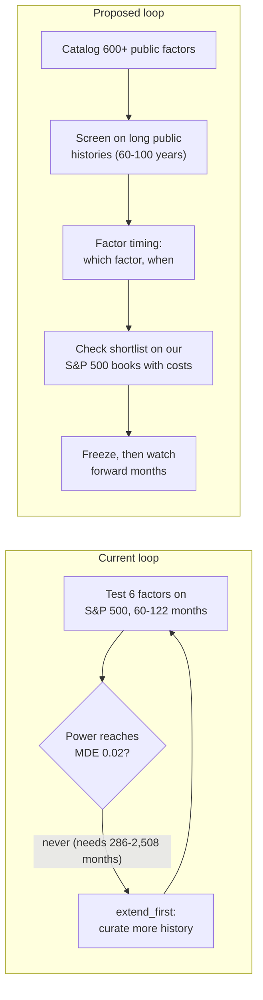

# North Star Drift And Speed Audit

- **Author**: Claude Code, model `claude-opus-5-5` (Opus 5.5), coordinator seat
- **Date**: 2026-09-28
- **Base**: `main` at `1c56939b0172b8f248c993961bac89fc8d2b6a13`; PR #275 open (M4.8 Stage D)
- **Method**: one workflow of six independent audit lenses (drift, time use, rule necessity, factor sources,
  factor timing, fast path), then an adversarial red-team pass and a fact-check pass that re-measured every number
  and re-fetched external sources. Lens reports are in `/tmp/claude-audit/out/` (local scratch, not committed).
  No private data was read; no repository file other than this report and one correction to
  `coord/reports/progress_assessment_opus.md` was changed.
- **Evidence ceiling**: `DIAGNOSTIC_ONLY`. The factor-timing numbers in section 7 come from a scratch run on public
  Ken French data, reproduced by the fact-checker; they are an audit illustration and support no claim.
- **Owner request (2026-09-28, paraphrased)**: progress is too slow; reach the North Star as fast as possible; audit
  whether the North Star drifted from the owner's intent; collect as many factors as possible from public sources
  and broker reports; keep the structure simple; Milestone 5 means "judge under which conditions which factor gives
  higher returns or smaller drawdowns"; avoid over-engineering, over-defensiveness, wording fights, and data
  perfectionism; get the whole loop running.

## 1. Verdict In Plain Words

1. **The North Star drifted.** The owner wrote one sentence of it: automated stock selection for long-term net
   returns. The parts that now steer the work were written by an agent audit on 2026-09-23 and adopted as a
   package: a five-factor "edge thesis", a statistical stop rule, a tax hurdle, and a Milestone 5 that means
   broker and execution infrastructure. These parts push toward fewer factors and more data polishing, the
   opposite of the owner's intent.
2. **The slowness has one mechanical cause.** The stop rule says "keep extending the data until the test can detect
   a Rank IC of 0.02". On S&P 500 monthly data that needs 286 to 2,508 months (24 to 209 years). Adding more stocks
   barely helps. The rule can never say "stop" or "go"; it can only say "extend", so every null result produces
   another data-curation milestone (M4.7, support v2, M4.8).
3. **The rules that stop fake backtest profits are few and cheap.** About a dozen guards matter (section 5). Most
   of the remaining rule mass (seal machinery, per-event SEC curation, 70 lettered plan rules, dual-seat review on
   every stage) protects effects of about 0.1% of the data.
4. **The owner's Milestone 5 question is answerable within days, with data the program has never used.** Free
   public factor-return libraries give 600-plus factor series with 60 to 100 years of monthly history. Timing
   research needs many months, and these libraries have them; the S&P 500 panel has 60 to 122.
5. **Expect a sobering answer.** Published evidence and a scratch run agree: simple factor timing adds 0 to about
   2 percentage points a year before costs, and often nothing after costs. Holding all factors equally is hard to
   beat. Risk is more predictable than return, so "smaller drawdown" is the more promising half of the idea.

## 2. Where The Program Stands

The detailed position is in `coord/reports/progress_assessment_opus.md`. Summary:

| Item | Status |
| --- | --- |
| Engine (timing, point-in-time universe, costs, statistics) | Built and tested: 38,497 runtime lines, 3,297 tests |
| Real-data looks | 3, all with zero surviving factors after multiple-testing correction; all underpowered |
| Factors in code | 6 core + 52 WorldQuant alphas + 11 composites, prices and volume only |
| M4.8 | Stages A–C merged, D reviewed (MATERIAL 0) and open; E–H remain; expected outcome `extend_first` |
| Owner's Milestone 5 (factor timing) | No stage covers it; one regime composite exists as 1 of 63 exploratory trials |

## 3. North Star Drift

### 3.1 Who wrote which sentence

| Sentence or rule | Origin | Evidence |
| --- | --- | --- |
| Automated stock selection and trading for sustainable, risk-controlled, long-term net returns; stable profit is a goal without a guarantee | Owner, 2026-09-15 | `docs/decision_log.md:663` |
| Demo-first delivery; avoid unbounded perfectionism | Owner, 2026-09-15 | `docs/decision_log.md:664` |
| "Determine what candidate factors are useful for"; "at least ten price-derived factors" | Owner, 2026-08-01 (missing from the current North Star) | `docs/decision_log.md:1074-1078` |
| Edge thesis: five named premia; short-horizon alphas "outside the thesis" | Agent audit, 2026-09-23 | `coord/reports/strategic_audit_opus_5_5.md:334`; blanket adoption at `docs/decision_log.md:548-549` |
| Kill criterion: MDE ≤ 0.02; "an underpowered null extends history or breadth before any pivot" | Agent audit, 2026-09-23 | `strategic_audit_opus_5_5.md:337`; code `research/m4_7_sp500_pit_rerun.py:121, :190-193` |
| Hurdle "after costs and taxes" | Agent audit, 2026-09-23 (no tax model exists) | `strategic_audit_opus_5_5.md:336` |
| Milestone 5 as an execution platform with kill switches, reconciliation, broker connectivity | Agent review remediation | commit `ab26368`; `docs/current_roadmap.md:46` |

### 3.2 Drift table

| Owner intent | Current text | Verdict | Effect |
| --- | --- | --- | --- |
| Get the whole loop running fast | Demo-first text matches; the kill criterion forces "extend before any pivot" | Partial; the gate contradicts the words | High: three nulls, three curation rounds |
| Collect as many factors as possible | `north_star.md:28-33` narrows to five premia; `:62-63` "without a factor zoo"; `PROJECT_SPEC.md:260-265` 14 items per factor in batches of 5–10; M4.8 plan `:119` bans new factors; families frozen byte-identical (`:77`) | Drift in the opposite direction | High: no factor added since 2026-09-19 |
| Simple structure | `AGENTS.md:151-154` asks for simplicity; practice produced a 4,018-line M4.7 plan (Rev 10) and a 1,363-line M4.8 plan plus 535 lines of history | Partial | High |
| M5 = which factor wins or loses less under which conditions | M5 = broker and execution platform in another repository | Missing | High: the owner's M5 has 0% progress by definition |
| Higher return or smaller drawdown | Drawdown is a pass/fail budget, never measured by market condition | Partial | Medium |
| No over-defensiveness | R4 read as "refuse the run" drives SEC EDGAR curation of 68 events; M-2, M-9, anchor, and seal rules | Partial; practice drifts | High |
| (Never asked) Tax hurdle | Written as a hurdle; no model exists | Agent addition | Low |
| (Never asked) 0.02 all-factor power floor | Unreachable on available data | Agent addition | High |

### 3.3 The owner's speed directives did not stick

On 2026-09-25 the owner ordered "eliminate data perfectionism; eliminate over-engineering"
(`docs/decision_log.md:387-399`). The M4.8 plan written the next day tightened the unpriced-coverage cap from the
accepted 0.40 to 0.05 (plan `:913`, O-7 bounds "do not carry" at `:924`) and required zero unevidenced
disappearances (`:914`). Directives in chat do not survive plan authoring and review; they have to be written into
the files that gate work.

## 4. Where The Time Went (measured)

| Period | Calendar days | PRs | Lines added | Real-data results |
| --- | --- | --- | --- | --- |
| Track A, 2026-05-21 to 2026-09-14 | 117 (89%) | 203 | 285,856 | 0 (14-trial run refused; 0 of 189 identities accepted) |
| Post-pivot, 2026-09-15 to 2026-09-28 | 14 (11%) | 70 merged + 2 open | 169,367 | 3 looks |

Post-pivot composition (70 merged PRs, 168,915 added lines): runtime code 15.2%, tests 16.5%, generated reports
49.8%, coord evidence 12.1%, docs 6.3%. By purpose (judgement classification): 39 PRs and 57% of added lines built
synthetic-only capability. M4.5 impact (+24,730 lines) and M4.6 attribution have no real-data consumer; the real
rerun sets `impact_model: none` (`research/m4_7_sp500_pit_rerun.py:396`).

Top time sinks, ranked by measured cost:

| Rank | Sink | Measurement |
| --- | --- | --- |
| 1 | Proof-first data standard before any result (Track A) | 117 days, 0 results; 36,713 lines later deleted (PR #259) |
| 2 | Capability work with no real-data consumer | 39 of 72 post-pivot PRs; 21,713 runtime lines |
| 3 | Rigor spent on a sample that cannot reach the stop rule (M4.8) | 4 plan revisions, 10 stage attempts, about 134,000 words of M4.8 prose against about 4,000 runtime lines; expected outcome known in advance |
| 4 | Review loops on plan wording and records | M4.7 plan took about 70% of M4.7's time to first result (10 dual-seat rounds; 47 MATERIAL and 64 ADVISORY findings in rounds 1–9); Stage C attempts c2–c4 reproduced c1's gate result (same `D0_pre`, same 62 months); about 31% of advisories concern records or wording |
| 5 | Data-perfectionism gates and owner-item queues | Support v1 dropped 38.4% of rows (the owner caught it, the reviewers did not); at least 17 owner items in 6 days; "seal" appears 137 times in the M4.8 plan |

Items that measured as cheap: the writing-style bans (no review finding cites them), the handoff freshness test,
GitHub PR latency (median open time 0.34 hours).

**Honest credit.** Review is expensive and it catches real bugs. The light-review sprint #224–#255 (32 PRs in 75
hours) let 16 MATERIAL defects through, including volume split-adjusted twice (4× dollar volume) and returns
stitched across two securities (`strategic_audit_opus_5_5.md:115`). In the GPT plan review, 14 of 26 MATERIAL
findings were genuine research-validity defects. The fix is to aim review at code that computes real-data numbers,
and to stop reviewing wording, claims files, and plan literalism.

## 5. Rules: What To Keep, What To Cut

### 5.1 The guards that must survive (red-team verified)

These fourteen guards stop a backtest from showing profits that do not exist. Each is cheap once built, and most
are already built.

| # | Guard | Plain meaning |
| --- | --- | --- |
| 1 | Timing | Decide on today's close, trade at the next close; fundamentals usable from filing date + 1 day; macro data carries its release lag; never use the NBER recession flag, revised data, or full-sample standardization as an input. One future-perturbation test covers every factor and timing rule |
| 2 | Point-in-time universe | Use the stock list known on each date, including companies later removed, acquired, or bankrupt |
| 3 | Delisting, side-aware | Cash acquisition at last close or deal price; failure or unknown: −100% for a long position, last close + 30% (declared) for a short, or no long-short claim; same rule for the benchmark; rerun with "last close for all" and flag sign flips |
| 4 | Missing data | Never invent prices; blank every window that touches bad data, lookbacks included; report the unpriced share split by later exit class and label the result "survivorship-exposed" when later-delisted names are over-represented |
| 5 | Identity | Never glue two companies' prices together; fail closed on ticker reuse using vendor IDs |
| 6 | Return basis | One total-return series; dollar volume from split-only close × split-adjusted volume, with one split-continuity test |
| 7 | Costs | Commission plus spread on turnover; switch cost for factor-timing rules; zero-cost runs labelled "gross"; borrow cost stated for shorts |
| 8 | Trials | A hashed trial file committed before each run; every run appended; the correction counts every tested variant; the method is fixed before results; top lists carry q-values |
| 9 | Two tiers | Exploratory screen fully visible; a confirmatory shortlist of 10 or fewer frozen before its confirmation data is opened; confirmation uses months the screen never touched |
| 10 | Timing-rule evidence | Walk-forward only; at most 5 declared signals; equal-weight-all-factors baseline; episode count; holds in both halves and after dropping the most influential episode; drawdown with an interval |
| 11 | Report header | Benchmark, costs, universe and bias, trial count, sample reuse, evidence ceiling |
| 12 | Review | Two seats from different model families for code on the real-data path that computes signals, returns, identity, costs, or statistics; one seat for everything else; wording findings are never MATERIAL |
| 13 | Data terms | Raw provider rows and third-party CSVs stay out of the public repository; commit a manifest and hashes |
| 14 | Non-execution | No brokerage, no orders in this repository |

### 5.2 Cuts

| Proposal | Red-team verdict |
| --- | --- |
| Catalog hundreds of factors; cataloguing needs no review | Safe cut |
| Drop the tax hurdle, the "factor zoo" non-goal, the writing-style bans, English-only owner summaries, the handoff freshness test, per-change ablation, three separate logs, per-round evidence folders | Safe cut |
| Replace the 0.02 stop rule with a fixed, pre-declared number of looks and a decision on net return with a confidence interval; "no detectable edge at this data size" counts as a result | Cut with guard: no open-ended "keep looking" |
| Replace binding plans with a one-to-two-page design note and one review round | Cut with guard: the trial file declares the family |
| Spend the mid-sample holdout seal and remove the two-segment machinery | Cut with guard: decide before seeing any new-factor result; name the replacement unseen test (a dated freeze plus forward months, and an out-of-time split for public series) |
| Drop the 68-event SEC EDGAR curation, claim contract, schema fields, second curator | Safe once guard 3 replaces R4's "refuse the run" |
| Drop M-2, M-9, and anchor adjudication; accept vendor dates | Cut with guard: keep the absent-member additions (the one real survivorship finding) |
| Coordinator sets technical defaults; owner decides money, data access, legal terms, and goals | Cut with guard: no default may loosen guards 1–8; every default is logged |
| Pause M4.8 after Stage D | Cut with guard: record the resume point, disclose the support v2 exclusion, label the post segment as reused three times |
| One reviewer per PR everywhere | **Unsafe**: this is the setup that let 16 defects through |
| Treat the 33% unpriced share as perfectionism | **Unsafe until measured**: split it by later exit class first |
| Delisting rule of −100% for every "unknown" | **Unsafe as written**: it hands the short leg a free +100%; use guard 3 |
| Build a factor-by-condition table on the full sample and read a rule off it | **Unsafe as a rule source**; safe as a description. The rule at month t may use only data through t−1 |

## 6. Factor Collection

### 6.1 What exists and what is blocked

- In code: 58 base factors, all prices and volume. Adding them is fast: 52 WorldQuant alphas landed in one day
  (PRs #225–#229, 2026-09-19).
- Blocked by rules: the five-premia edge thesis, "without a factor zoo" (`north_star.md:62-63`), the 14-item
  checklist and 5–10 batch limit (`PROJECT_SPEC.md:260-265`), and M4.8's frozen families (`:77`, `:119`).
- A circular lock: value and quality (two of the five named premia) enter only after a price-only factor survives
  (`strategic_audit_opus_5_5.md:404`; `coord/plans/m4_7_binding_plan.md:98-99`). None survives, so value and
  quality never enter.
- The program has never used a public factor library: a search of `docs/`, `coord/`, `src/`, and `research/` for
  Fama, French, JKP, and Open Source Asset Pricing returns nothing.

### 6.2 Public sources (web-verified 2026-09-28)

Type: **A** ready-made factor return series; **B** stock-level signal values; **C** formulas or code only.

| Source | Content | History | Terms | Type |
| --- | --- | --- | --- | --- |
| Open Source Asset Pricing (Chen–Zimmermann), openassetpricing.com | 212 predictors (165 clear, 47 likely) + 114 placebos; by data: accounting 99, price 45, analyst 18, trading 13, other 12, options 9, 13F 8, event 8 | Monthly and daily, mostly through Dec 2024 | Free; code GPL-2.0 (reimplement, never copy into this Apache-2.0 repo); data license unstated | A; B keyed by CRSP ID; C |
| JKP Global Factor Data, jkpfactors.com | 153 factors, 13 themes, 93 countries | Monthly and daily, through Dec 2025 | Data CC BY-NC 4.0; code MIT | A |
| Kenneth French Data Library | FF3, FF5, momentum, short- and long-term reversal, industry portfolios, sorts | Momentum from 1927-01; FF5 from 1963-07 | Copyright notice | A |
| Hou–Xue–Zhang, global-q.org | q-factors + 201 anomalies (momentum 43, value 32, investment 32, profitability 50, intangibles 33, frictions 11) | 1967–2025 | Terms unstated | A |
| AQR Data Library | Quality Minus Junk, Betting Against Beta, HML Devil, Value and Momentum Everywhere | Updated 2026 | Credit requested | A |
| Stambaugh (Wharton) | Mispricing factors, Pastor–Stambaugh liquidity, 11 anomalies | 1962–2025 | Terms unstated | A |
| WorldQuant 101 | Formulas; 52 implemented; 30 more need only price and volume | n/a | Paper | C |
| Guotai Junan 191 (2017 report "Quantitative Special Topic No. 93") | Short-horizon price-volume formulas | n/a | Copyrighted report; formulas widely republished | C |
| Microsoft Qlib Alpha158 / Alpha360 | OHLCV-based features | n/a | MIT | C |
| Chinese broker factor handbooks (e.g. Huatai single-factor series), JoinQuant library | Valuation, growth, momentum, turnover, volatility, money flow, quality | n/a | Copyrighted | C |
| SEC Financial Statement Data Sets and XBRL APIs | As-filed company financials | 2009-04 onward (small filers from about 2011) | Free US government data | raw fundamentals |

Collectable totals (judgement on overlap): about 600 ready-made return series (about 250–350 distinct ideas); about
300–400 price-volume formulas computable on our EODHD bars; about 100 accounting factors that need fundamentals.

### 6.3 Data the owner may already have

The owner's EODHD key returns S&P 500 membership history. EODHD documents that endpoint as included "with any plan
that has the Fundamental Data API", while the repository records the plan as "All World" ($19.99, prices only). One
owner-authorized test call settles whether fundamentals are already paid for; the Fundamentals feed costs $59.99 a
month otherwise. EODHD fundamentals are likely restated values and omit companies delisted before 2018, so SEC
as-filed data (free) is the safer first source for value and quality.

### 6.4 Collection design

- One catalog file, six columns: `id, source, formula_or_ref, inputs, horizon, status`. Seed it from Open Source
  Asset Pricing's documentation (331 rows), JKP's 153 names, WorldQuant 101, and GTJA 191: about 1,000 rows on day
  one.
- Formulas live as text in the catalog. Code goes in one module per source, reusing `src/features/operators.py`.
  Two shared tests replace the 14-item checklist: a future-perturbation test over every factor and a smoke test
  (runs, not constant, coverage reported).
- Downloaded return series go to a gitignored local cache; commit only a manifest with URL, date, SHA-256, and row
  count. The repository is public.
- Collecting creates no statistical cost; only testing does. The guard: count every tested factor in the
  correction, and label top lists "candidates".

**Plain statistical warning.** More factors do not create more discoveries on the same 60–122 months. With 300
factors tested, about 15 useless ones look good at the usual 5% level by pure chance, and a real factor needs an IC
of about 0.07–0.10 to survive correction. The value of a large catalog is choice: pick a short list on long public
histories, then confirm it on data the screen never saw.

## 7. Milestone 5 As Factor Timing

### 7.1 What the evidence says

| Approach | Finding |
| --- | --- |
| Factor momentum (Ehsani–Linnainmaa 2022; Gupta–Kelly 2019) | The average factor earned 51 bp a month after an up year and 6 bp after a down year; time-series factor momentum Sharpe 0.84 across 65 factors |
| Volatility management (Moreira–Muir 2017; Cederburg et al. 2020) | Strong in-sample; across 103 strategies the out-of-sample versions generally earn lower Sharpe ratios |
| Momentum crash protection (Barroso–Santa-Clara 2015; Daniel–Moskowitz 2016) | Scaling momentum by its own recent volatility cuts crashes; 14 of the 15 worst momentum months followed a negative two-year market return |
| Valuation timing (Asness et al. 2017; Haddad–Kozak–Santosh 2020) | Weak for simple value-spread timing; model-based timing of anomaly portfolios shows predictability |
| A century of evidence (Ilmanen et al. 2021) | Premia are "mildly predictable", but "significant profitability eludes a host of timing strategies once proper data lags and transaction costs are accounted for" |
| Post-publication decay (McLean–Pontiff 2016) | Returns 26% lower out of sample and 58% lower after publication |

Plain summary: a factor's own recent return and its recent volatility help a little; macro regime labels and
valuation timing mostly fail after costs; the typical gain is 0 to 2 percentage points a year before costs.

### 7.2 Scratch run (audit illustration, reproduced by the fact-checker)

Seven Ken French long-short factors, 1973-07 to 2026-08 (638 months), 20 bp switch cost, family declared before
running:

| Rule | Annual return | Sharpe | Max drawdown | Versus equal weight, HAC p |
| --- | --- | --- | --- | --- |
| B0 equal weight across 7 factors | 3.59% | 0.83 | −16.4% | — |
| T1 hold factors with positive trailing 12-month return | 4.26% | 0.63 | −33.8% | 0.30 |
| T2 weight by inverse trailing volatility | 3.46% | 0.83 | −16.6% | 0.44 |
| T3 owner's idea: bull/bear regime, hold factors that did well in past same-regime months | 3.64% | 0.84 | −16.4% | 0.61 |

- Nothing survives correction (BY q = 1 for all three rules). At 50 bp switch cost T1 falls below B0.
- The owner's rule rarely acts (1% monthly turnover): nearly every factor had a positive past average in both
  regimes, so its answer was "hold everything".
- Premia decayed: B0's Sharpe was 1.48 in 1973–1999 and 0.45 in 2000–2026.
- Risk persists: one year's volatility predicts the next year's for all 7 factors (rank correlation 0.17–0.53);
  returns do not (−0.21 to +0.35).
- Power: the smallest detectable yearly gain is 6.8% at 60 months, 4.8% at 122, and 2.1% at 638. The literature's
  2% is detectable only with long public histories. On the S&P 500 panel, timing research cannot give an answer.

### 7.3 The simplest working pipeline

1. Download French FF5, momentum, and reversal files (then OSAP and JKP as a second, separately declared family);
   record hash and date.
2. Declare at most four signals before any result: the factor's trailing 12-month return, its trailing volatility,
   market trend, and one stress series (credit spread, lagged).
3. Rule: start from equal weight, tilt each factor by its signal, cap at 2/N.
4. Walk-forward: weights for month t+1 use data through t; the first 10 years are warm-up.
5. Costs: 20 bp per unit of weight change, 50 bp as sensitivity; label "gross of each factor's internal costs".
6. Evaluate against equal-weight-all-factors and the market: return, Sharpe, max drawdown with an interval, worst
   12 months, turnover, both halves, post-publication months.
7. Statistics with existing code: `adjust_pvalues` and `return_test_statistics`
   (`src/features/multiple_testing.py:37, :75`), `deflated_sharpe_ratio` (`src/features/diagnostics.py:342`),
   `calculate_max_drawdown` (`src/backtest/metrics.py:36`), regime detectors (`src/features/regime.py:16, :53`).
8. Output a one-page "overweight next month" list with tables; then apply the weights to large-cap legs or factor
   ETFs to measure the gap to what the owner can trade.

Size: about 200–250 runtime lines and 150–250 test lines. None of the M4.8 identity, terminal, or census machinery
is needed.

## 8. Power: Three Plain Facts

1. More stocks barely help: 1,000–3,000 names reduce the key noise term by 1–13%, because factor payoffs swing
   over time (`coord/reports/v8_review_20260923/m48_route_evaluation_opus.md:169-174`). This corrects the progress
   report's earlier recommendation.
2. More factors do not add power per factor; they raise the bar each factor must clear.
3. More months add power. Public factor libraries hold 600–1,200 months per factor; that is where the owner's
   timing question can be answered. The S&P 500 books then check whether a shortlisted factor survives large caps
   and costs.

## 9. Recommended Plan

| Step | Days | Deliverable |
| --- | --- | --- |
| 1. Decide and unblock | 1 | Merge PR #275; decision-log entry "M4.8 paused after Stage D" with the resume point; owner decisions in section 10; North Star and AGENTS amendments committed |
| 2. Catalog and public factor-timing study | 1–4 | Six-column factor catalog (about 1,000 rows); `research/factor_timing_public.py` on French data, then OSAP and JKP; one-page report answering "which factor, when" |
| 3. Stock-level factor expansion | 3–8 | 30 more price-only WorldQuant alphas and about 40 OSAP price signals; about 15 value and quality factors from SEC as-filed data (or EODHD if entitled) |
| 4. Exploration runner | 6–10 | `research/factor_scan.py` reusing the rerun's loaders, IC evaluation, books, and statistics; hashed trial file; header prints unpriced share by exit class, costs, trial count |
| 5. Bridge | 10–12 | Shortlist of 10 or fewer, chosen on post-publication public history, frozen; checked on the S&P 500 books with costs as a sign-and-cost check |
| 6. Plain report | 12–14 | Two-page owner report in plain language; forward-observation clock starts on the frozen shortlist |

Sprint process: a one-page card per step, at most two review rounds, cross-family dual review only for real-data
inference code, wording findings advisory, ablation once at sprint end.

## 10. Owner Decisions Needed

1. Pause M4.8 after merging Stage D.
2. Authorize download and interpretation of public academic factor libraries (French, AQR, JKP, OSAP,
   Hou–Xue–Zhang) and FRED series, with raw files kept out of the public repository.
3. Authorize one EODHD fundamentals test call; choose SEC as-filed data as the default fundamentals source.
4. Adopt the revised North Star (section 11) and the guard list (section 5.1), including the side-aware delisting
   rule that replaces R4's "refuse the run".
5. Adopt the sprint process in section 9.
6. Spend the mid-sample seal, with a dated freeze plus forward months as the replacement unseen test.

## 11. Proposed North Star (draft for owner approval)

> **North Star.** Build an automated stock selector for US equities that aims to beat an index fund over the long
> term after trading costs, with smaller drawdowns. Profit is the aim and carries no guarantee.
>
> **Core question.** Which factors earn more, or lose less, in which market conditions?
>
> **Path.**
> 1. Collect as many published factors as possible (academic libraries, factor-sharing sites, broker research) in
>    one catalog. Cataloguing needs no review.
> 2. Screen every factor with one standard backtest and keep every result.
> 3. Measure each factor's return and drawdown by market condition, using long public histories.
> 4. Milestone 5: turn the findings into a simple monthly rule that picks factors from past data only, and test it
>    in simulation against holding all factors equally and against an index fund.
> 5. Freeze a short list, confirm it on data the screen never used and on forward months.
> 6. Milestone 6 (separate, later authorization): paper trading, then real money, in a separate system.
>
> **Guards against fake backtest profits.** Section 5.1 of this report, in fourteen lines.
>
> **Speed rule.** Work that cannot change a result or a decision in the current step waits.

## 12. Corrections To Earlier Coordinator Statements

- `coord/reports/progress_assessment_opus.md` recommended breadth as the lever that moves gate 4. The route
  evaluation contradicts it (breadth scales σ_LR by 0.87–0.99). The report now carries the correction.
- Lens figures corrected by the fact-check: the six-test BY significance bar is z ≈ 2.93 (3.77 includes the 80%
  power term); 3 of 7 controller Process Failures punish asking or stopping early; 70 of PRs #204–#275 are merged;
  14 AGENTS.md commits fell on 2026-09-14..16.

## 13. Limitations

- Classification of PRs by purpose and of advisories by topic is judgement.
- The exit-class split of the 33% unpriced member-days is unmeasured; it needs private data and is the first check
  to run before relaxing any coverage cap.
- The EODHD fundamentals entitlement, the JKP US start date, and some literature magnitudes are unverified.
- The scratch factor-timing run uses a hindsight-chosen factor list (RMW and CMA were published in 2015) and is
  gross of each factor's internal trading costs.
