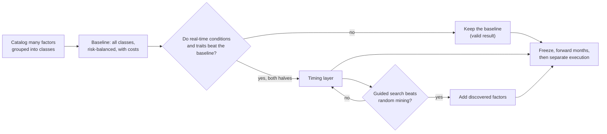

# North Star Vision Assessment: Factor Classes, Market Conditions, And Discovery

- **Author**: Claude Code, model `claude-opus-5-5` (Opus 5.5), coordinator seat
- **Date**: 2026-09-28
- **Method**: one workflow with four explorers (literature scout, product designer, statistics red team, empirical
  probe on public data) and one judge. Explorer reports are local scratch in `/tmp/claude-vision/out/`; scratch
  scripts in `/tmp/claude-vision/`. No repository result was produced and no private data was read.
- **Evidence ceiling**: `DIAGNOSTIC_ONLY`. Probe numbers are long-short public factor returns, before each factor's
  own trading costs, including small caps, with a hindsight-assembled factor list; they support no claim.

## 1. The Owner's Idea

The owner judged a platform that only measures whether one factor worked in one period to be of little value,
because factors decay and public factors are limited. The revised idea: learn in which kinds of periods (described
by features visible at the time) which kinds of factors (described by their own features) earn more or lose less;
use those features to find new factors; test locally; then trade automatically.

## 2. Verdict

The revised question is better than a factor scoreboard and makes a sound North Star after four changes of
emphasis:

1. Group factors into classes by shared traits (theme, data source, trading speed, risk profile, years since
   publication) and test classes; per-factor state rules are exploratory only.
2. Put risk first. Risk is predictable and stable over decades; conditional returns are weak and unstable.
3. Treat new-factor discovery as a counted search that must beat random data mining on data it never saw.
4. State the null outcome up front: "holding all factor classes, balanced by risk, is best" is a valid result.

| Part | Support | Evidence |
| --- | --- | --- |
| Factor class × market condition, risk | Strong | After high-volatility months all 13 JKP themes are 1.2–2.4× more volatile; a factor's risk rank predicts next year's at +0.75 (1972–1999) and +0.73 (2000–2025) |
| Factor class × market condition, return | Weak | Return-rank persistence falls from +0.35 to +0.05 across the halves; none of 612 factor × state tests survives correction; a randomly placed fake regime "explains" as many factors as real regimes; walk-forward state models beat equal weight in 1982–1999 (+0.6 to +1.0%/yr) and lose in 2000–2025 (−0.4 to −1.1%/yr) |
| One stable conditional pattern | Moderate | Momentum does badly after a falling market in both halves (−0.41 and −0.90%/month), matching Daniel–Moskowitz (2016) |
| Risk-balanced mix across factors | Promising | Inverse-volatility weights across 153 JKP factors: Sharpe 0.94 vs 0.72 for equal weight, worst loss −7.8% vs −14.0%, slightly lower return; the Sharpe gain appears in both halves. On only 7 French factors the same rule gave no gain, so breadth matters |
| Guided discovery of new factors | Weak as "guided"; plausible as counted mining | Mining 29,000 accounting ratios predicts as well as peer-reviewed factors, and both keep about half their strength after the original sample (Chen, Lopez-Lira, Zimmermann, arXiv 2212.10317); no study found shows trait-guided search beating plain mining |
| Profit after costs for a small investor | Weak to modest | The average anomaly nets about 4 bp a month after costs and decay; good combinations about 20 bp (Chen–Velikov 2023); smart-beta indexes went from +2.77%/yr in backtests to −0.44%/yr after launch (SSRN 3622753) |

### 2.1 A correction to a common intuition

"Defensive factors (low risk, quality) do better in bad times" holds in the same month the market falls (+0.76%
per month spread, t 4.1), which cannot be known in advance. After a high-volatility month, defensive factors did
worse than value, size, and momentum in both halves. Defensive factors act as a hedge to hold all the time, rather
than a signal to switch on.

### 2.2 Limits that shape the design

- Slow market states give only about 7–30 episodes since 1963 (19 down-trend episodes and about 20 credit cycles
  in 1972–2025). A state with fewer than 10 episodes supports description only.
- The 153 JKP factors behave like about 6 independent bets and cluster into 13 themes.
- Per-factor testing can detect only a state effect of about 15%/yr; one pooled, pre-declared class question can
  detect about 7%/yr.
- Premia after 2000 are about half their earlier size.
- Public factors are long-short with small caps and no costs; the owner's tradable version is long-only large-cap
  and taxed. Claims rest on the repository's own point-in-time books after costs.

## 3. Recommended End State

A monthly factor-class allocator:

1. **Baseline product.** Hold every factor class, sized by forecast risk (inverse volatility), turned into a
   long-only US large-cap portfolio with costs.
2. **Timing layer.** A few pre-declared questions test whether real-time market conditions (trend, volatility,
   credit stress) and factor traits improve on the baseline after costs, in both halves of history and after
   publication.
3. **Discovery layer.** New candidates come from traits that survive; each is judged by the same bar as random data
   mining (Open Source Asset Pricing ships 114 placebo signals as a control) on data it never saw.
4. **Forward observation, then execution.** A dated freeze, forward months inside the predicted range, then paper
   trading and small capital in the separately authorized execution system.

## 4. Proposed North Star Text

> **North Star.** Build an automated US stock selector that learns which classes of factors, grouped by shared
> traits such as theme, data source, trading speed, and risk profile, earn more or lose less in market conditions
> visible at the time. Each month it decides how much to hold of each class, using only information known then, and
> turns that into a long-only portfolio of US large-cap stocks. It aims to beat an index fund and a cheap
> factor-ETF blend after costs over the long term. Risk control comes first; losing years are expected, and profit
> carries no guarantee. "Holding all classes, balanced by risk, is best" is a valid result. New factors enter
> through a counted search that must beat random data mining on data it never saw. Real-money trading belongs to a
> later, separately authorized system that starts after a forward-observation period.

## 5. Expected Outcomes

- Central case: net returns close to the index with a somewhat smoother path.
- Good case: a low single-digit excess over SPY before tax.
- A long-only stock portfolio still takes the market's crashes; factor tilts change its drawdown by a few points.
- A strategy with a true Sharpe ratio of 0.5 still loses money in about 31% of years.
- The most durable deliverable is an honest measuring machine plus a risk-controlled allocator.

## 6. First Steps

1. Commit a hashed trial file before any repository result: at most 3 real-time states (12-month market trend,
   63-day realized volatility, lagged credit spread) with fixed thresholds, at most 6 traits and 5 rules, baselines
   of equal weight, inverse volatility, and the market. The audit and probe runs count as trials already seen (R9).
2. Loaders with a SHA-256 manifest for French, JKP (153 factors, 13 themes), and FRED; synthetic fixture tests that
   each month uses only data through the month before.
3. Walk-forward baseline report: equal weight against inverse volatility across 13 themes and 153 factors, at 20
   and 50 bp switch costs, both halves, post-publication months, maximum drawdown, and volatility-forecast accuracy.
4. The declared state tilt and one pooled model, with HAC standard errors, BY correction, a random-date null, and
   the episode count behind each cell. The pooled model must avoid `src/features/ml_combination.py:136`, whose
   default cross-sectional z-score turns a state value shared by every factor into NaN, which the row filter at
   `:179` then drops without warning (an R6 defect to fix or bypass).
5. Bridge test: three price-based classes as long-only top-quintile point-in-time S&P 500 portfolios with costs.

## 7. Limitations

- The probe was scratch work with no pre-declared family; its rolling 10-year thresholds were added after seeing
  the state counts.
- Several literature magnitudes come from abstracts and search-indexed summaries.
- The tax figure is an illustration.
