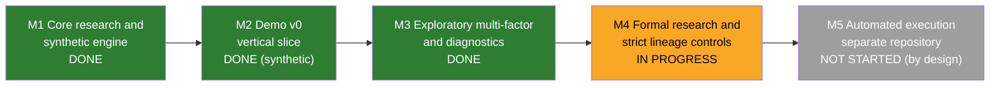
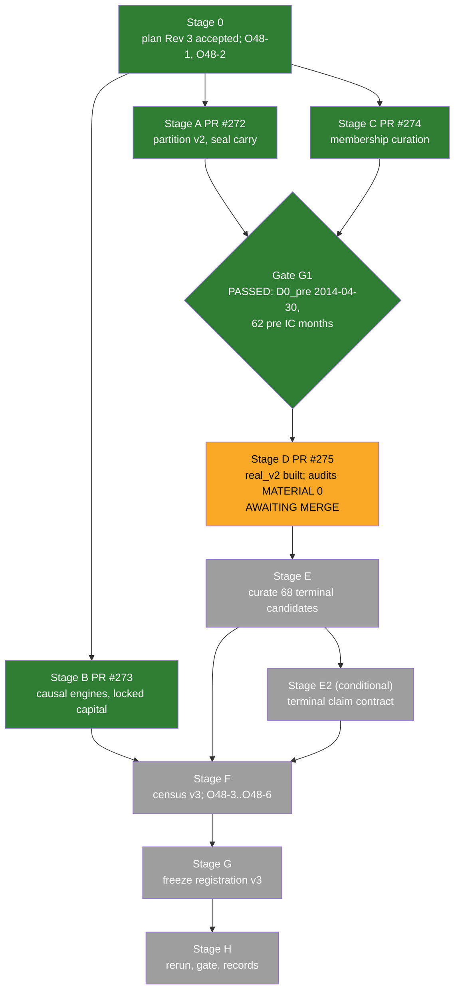

# Program Progress Assessment Against The North Star

- **Author**: Claude Code, model `claude-opus-5-5` (Opus 5.5), coordinator seat
- **Date**: 2026-09-28
- **Base**: `main` at `1c56939b0172b8f248c993961bac89fc8d2b6a13` (PR #274 merged); open PR #275 at head
  `d1bf6a32e8c57e51e04375f58df5e0882b276d62` (M4.8 Stage D)
- **Evidence ceiling**: `DIAGNOSTIC_ONLY`. This report makes no ranking, selection, promotion, or profitability
  claim. Percentages in section 4 are coordinator judgements under a stated rubric; they are estimates, and every
  count behind them is cited.
- **Sources read**: `docs/north_star.md`, `docs/current_roadmap.md`, `docs/current_handoff.md`,
  `coord/plans/m4_8_binding_plan.md` (Revision 4), `coord/reports/m4_8d_real_v2_impl.md`,
  `coord/reports/v8_review_20260923/m48d/{audit1_m48d_gpt6astra,audit2_m48d_opus,claims_m48d}.md`,
  `reports/m4_7_sp500_pit_rerun_v2.md`, `coord/reports/strategic_audit_opus_5_5.md`, `docs/decision_log.md`
  headings, live `gh pr` state, and `git` history.

## 1. Conclusion

The research platform is mature and the evidence toward the North Star is at its first real test. The program has
built an auditable, point-in-time, cost-aware simulation stack (Milestones 1–3 complete, Milestone 4 diagnostic
layer M4.0–M4.7 merged, M4.8 Stages A–C merged, Stage D built and reviewed with MATERIAL 0). Three looks at real
data have produced zero Benjamini–Yekutieli survivors, and every look has been underpowered: the best Family A
minimum detectable effect is 0.0437 against the 0.02 kill-criterion floor. The central North Star question, whether
a diversified premia edge exists net of costs, is still unanswered.

| View | Position | Estimate |
| --- | --- | --- |
| Research-repository scope (Milestones 1–4) | Engine, PIT universe, statistics, and registration discipline built; formal promotion controls open | about 75% |
| Milestone 4.8 | Stage 0, A, B, C merged; D awaiting merge; E, F, G, H remain | about 45% by stage, about 40% by remaining effort |
| Evidence ladder to the North Star (section 4.2) | Gate 3 of 10 passed; gate 4 (adequate power) blocked | about 15–20% |
| Automated execution (Milestone 5) | Separate future repository; zero work, by design (R12) | 0% |

The most likely M4.8 outcome is `extend_first` again. At the v2 volatility, 122 IC months give a Family A MDE of
0.031–0.091; reaching 0.02 needs 286 IC months for the best-powered factor and 2,508 for the worst. S&P 500
history extension alone cannot reach the kill criterion's power, so the owner decision O48-3 (reading of a null)
is the real strategic fork after M4.8.

## 2. The North Star And The Five Primary Milestones

**North Star**: automated stock selection and trading pursuing sustainable, risk-controlled, long-term net returns.
Stable profit is an objective without a guarantee. This repository is the simulation-only research phase.

| Element | Definition (`docs/north_star.md`) |
| --- | --- |
| Edge thesis | Diversified, low-turnover harvesting of published premia in liquid US equities: momentum, short-term reversal, low risk, value, quality |
| Objective | Net-of-cost excess over SPY and the equal-weight PIT universe, with target IR, tracking-error, and drawdown budgets |
| Planning prior | Net IR about 0.3–0.6 |
| Hurdle | Beat index fund plus factor ETFs after costs and taxes |
| Kill criterion | Adequately powered (MDE ≤ 0.02 mean monthly Rank IC) pre-registered family with no BY survivor at 5% stops engine work; an underpowered null extends history or breadth first |

| Milestone | Status | Evidence |
| --- | --- | --- |
| 1. Core research and synthetic engine | Complete baseline | Loaders, timing contract, drift-aware accounting, synthetic demos; Track A 14-trial run REFUSED and preserved as history |
| 2. Demo v0 vertical slice | Implemented on synthetic fixtures | `python -m research.demo_v0` with all-attempt case logging |
| 3. Exploratory multi-factor | Complete | M3-01..M3-08, M3.9 (52 WQ-101 alphas, composites, regime layer), M3.10 hardening |
| 4. Formal research and lineage | In progress | M4.0–M4.7 merged (PR #246–#271); M4.8 Stages A–C merged (PR #272–#274); Stage D PR #275 open |
| 5. Automated execution | Future, separately authorized | Chain: freeze → independent reproduction → forward observation → paper → small capital → live |

## 3. Current Exact Progress

### 3.1 Milestone 4 sub-milestones

| Sub-milestone | Result | Data |
| --- | --- | --- |
| M4.0 | Local 50-name real-data diagnostic; total-return basis | Static survivor cohort (diagnostic only) |
| M4.1 | Walk-forward ML combination | 50-name cohort |
| M4.2 | Purged and embargoed CPCV | 50-name cohort |
| M4.3 | Multiple-testing diagnostics (Bonferroni, Holm, BH, BY, DSR) | Synthetic |
| M4.4 | PIT membership, terminal cash settlement | Synthetic |
| M4.5 | Square-root impact and capacity | Synthetic |
| M4.6 | Style risk attribution | Synthetic |
| M4.7 | S&P 500 PIT universe, registration v1 and v2 reruns on `real_v1` | Real; outcome `extend_first` |
| M4.8 | Registration v3, two-segment extended history, causal terminal settlement | In progress |

### 3.2 Milestone 4.8 stage map

| Stage | State | Key measurement |
| --- | --- | --- |
| 0 | Done | Plan Rev 3 accepted 2026-09-26; Rev 4 (`816a3bea…bd74c`) EXPERT candidate; §3.3 acceptance entry still absent from `docs/decision_log.md` |
| A | Merged (PR #272) | Partition rule v2, seal carry, segment-local validation, census v3 code |
| B | Merged (PR #273) | Causal mask, support v2 retirement, halt gap return, locked capital, terminal schema v3 |
| C | Merged (PR #274) | 182 supplement rows, 402 reconstructed changes, 17 factsheet anchors; G1: unresolved 4/303 = 0.0132 (cap 0.02), R3-2c 0.0088 |
| D | PR #275 open, CI green (3 checks), MERGEABLE, no GitHub review yet | 848 intervals, 755 resolved, 926 permanent IDs, 1,223 panels; 0 holdout reads; seal carry verified; 3,297 tests pass; AUDIT Seat 1 MATERIAL 0 / ADVISORY 3, Seat 2 MATERIAL 0 / ADVISORY 6 |
| E | Not started | 68 in-scope terminal candidates to curate from SEC EDGAR |
| E2 | Conditional | Opens only if claim demand > 0 |
| F | Not started | Census v3; must address 111 of 448 pre-segment members at `D0_pre` without a pre-side panel |
| G | Not started | Registration v3 freeze; support v2 risk acceptance expires |
| H | Not started | Rerun and gate outcome |

Stage count: 4 of 9 mandatory stages merged, 1 built and reviewed. Stages A–D ran in about two days
(2026-09-26 to 2026-09-28).

### 3.3 Open owner items

| Item | Needed before |
| --- | --- |
| Coordinator §3.3 acceptance record for plan Rev 4 and the c4 candidate | Stage D merge record |
| M-2 disposition of 10 vendor-date discrepancy lines | Stage F |
| iCloud sync of `<private_data_root>` (41 conflict copies seen during Stage D; R11) | Before further private rebuilds |
| Boundary-file contract (`curated_identity_boundary_v1`) into plan §2.3 (A1-D-ADV-02, A2-D-ADV-1) | Stage G freeze |
| O48-4 step 2 default from Stage E counts | Stage F |
| O48-3 reading of a null, O48-5 VP-2, O48-6 costs | Stage G |
| Registration v2 validator accepts a cash completion after calendar end (A2-05) | Carried |

## 4. Quantified Distance To The North Star

### 4.1 Real-data evidence so far

| Look | Universe | IC months | Family A BY survivors | Best Family A MDE | PBO | Outcome |
| --- | --- | --- | --- | --- | --- | --- |
| M4.0 | Static 50 survivors | 119 | 1 of 64 with \|t\| > 2 (2.9 expected under null); DSR max 0.27 | 0.074 (Bonferroni) | 0.53 | No detectable predictability |
| Registration v1 | S&P 500 PIT `real_v1` | 32 | 0 | — | ≥ 0.50 | `extend_first` |
| Registration v2 | S&P 500 PIT `real_v1`, 424–433 names | 60 | 0 of 6 (Family B 0 of 63) | 0.0437 (AMIHUD) | A 0.21 / 0.17; B 0.46 / 0.34 | `extend_first` |

Registration v2 Family A mean IC: MOM_12_1 +0.019, HIGH_52W +0.009, REV_1M −0.017, LOW_VOL −0.006, LOW_BETA −0.016,
AMIHUD −0.013; every BY q = 1. The descriptive MOM_12_1 long-only book shows IR 0.35 against SPY at primary costs;
its IC test has HAC p = 0.33, so it supports no claim. The equal-weight PIT benchmark trailed SPY by 0.27 in total
return over the window.

### 4.2 Evidence ladder

Gates 1–3 hold. Gate 4 is the binding constraint. Gates 5–10 depend on an edge existing, which no evidence yet
shows or rules out.

### 4.3 Power arithmetic for M4.8

MDE scales with `1/√T`. From the registration v2 MDE_f at T = 60, with the v2 σ_LR carried:

| Factor | MDE at 60 (v2) | Projected MDE at 122 (M4.8) | IC months needed for 0.02 |
| --- | --- | --- | --- |
| AMIHUD_ILLIQ_63 | 0.0437 | 0.0306 | 286 |
| REV_1M | 0.0683 | 0.0479 | 699 |
| MOM_12_1 | 0.0724 | 0.0508 | 787 |
| HIGH_52W | 0.0746 | 0.0523 | 834 |
| LOW_VOL_252 | 0.1017 | 0.0713 | 1,551 |
| LOW_BETA_252 | 0.1293 | 0.0907 | 2,508 |

The plan's own projection (§5.4) needs 356 IC months at `s = 0.10`, so `kill_reachable_projection` is expected to
be false and O48-3 fires. M4.8 improves power by about 30% and leaves the kill criterion unreachable.

### 4.4 Platform metrics

| Measure | Value |
| --- | --- |
| Lifetime | 669 commits since 2026-05-21; 272 merged PRs |
| Recent cadence | 154 commits since 2026-09-01 |
| Runtime Python (`src/`, `research/`) | 38,497 lines in 79 files |
| Tests | 49,197 lines in 109 files; 3,297 passed, 2 skipped at `d1bf6a3` |
| Invariants R1–R12 | All BLOCKING rows implemented or guarded; PIT-006 delayed payment and stock consideration land in M4.8 Stages B/E |

## 5. Gaps Between The Repository And The North Star

| Gap | Evidence | Impact |
| --- | --- | --- |
| Power ceiling | Section 4.3 | History extension on about 430 names cannot reach MDE 0.02. Breadth barely helps: 1,000–3,000 names scale σ_LR by 0.87–0.99 because time-varying factor premia dominate IC variance (`coord/reports/v8_review_20260923/m48_route_evaluation_opus.md:169-174`). No stock-level monthly design on this data reaches 0.02 (correction 2026-09-28, see `coord/reports/north_star_speed_audit_opus.md`) |
| Edge-thesis coverage | Family A holds momentum, reversal, low risk, liquidity; the pipeline is price-only | Value and quality premia named in the thesis are untested; they need point-in-time fundamentals |
| Hurdle benchmark | Benchmarks are SPY and equal-weight PIT | The index-plus-factor-ETF hurdle and taxes have no implementation |
| Cost realism | Borrow absent in long-short engine; spread floor deferred; M4.8 §0.5 puts cost recalibration out of scope while the roadmap backlog row says M4.8 calibrates it | Long-short results understate costs; the roadmap row is stale |
| Formal promotion controls | Roadmap M4 row | Full corporate-action reconciliation and complete all-trial accounting remain open |
| Sample reuse | Post-holdout months tested for the third time; pre-segment overlaps prior exposures | Only the carried seal `[2019-07-31, 2020-07-31)` and forward observation remain unexamined |
| Documentation freshness | `docs/current_roadmap.md` updated 2026-09-23, M4 row stops at M4.7 | P2: stale program position |

## 6. Recommendations

1. Merge PR #275 after the coordinator records Rev 4 §3.3 acceptance and dispositions the nine advisories; resolve
   the iCloud owner item before the next private build.
2. Complete M4.8 Stages E–H as registered; its value is a cleaner causal universe and a second segment, and its
   expected gate outcome is `extend_first`.
3. Prepare O48-3 now with quantified options: (a) breadth expansion beyond the S&P 500, (b) point-in-time
   fundamentals for value and quality, (c) an owner revision of the power definition. Correction (2026-09-28): the
   route evaluation shows breadth scales σ_LR by only 0.87–0.99, so option (a) also leaves gate 4 unreachable; the
   follow-up audit `coord/reports/north_star_speed_audit_opus.md` supersedes this recommendation.
4. Refresh the roadmap M4 row and the spread-floor backlog row to match plan §0.5.

## 7. Limitations

- Section 4 percentages are coordinator judgements under the stated rubric.
- MDE projections carry the v2 σ_LR; the pre segment may differ (plan §10).
- This assessment computed no new statistic on real data and read no private file.
