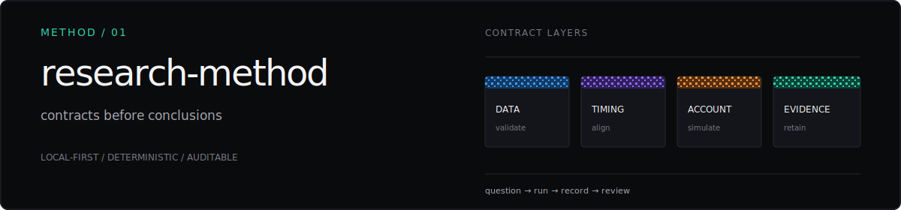
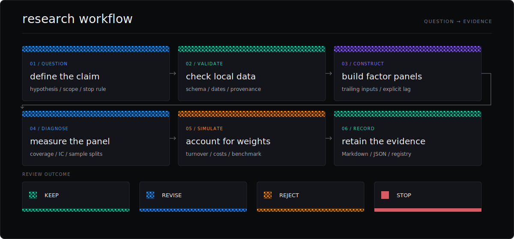
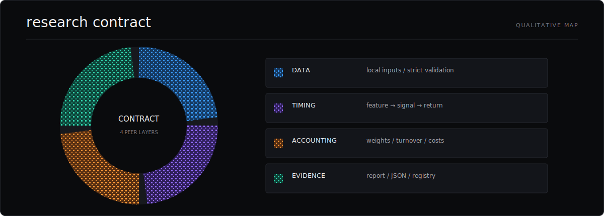
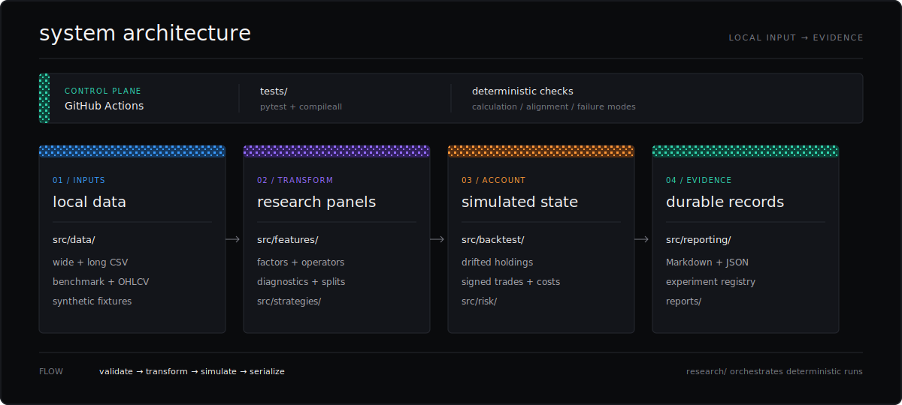
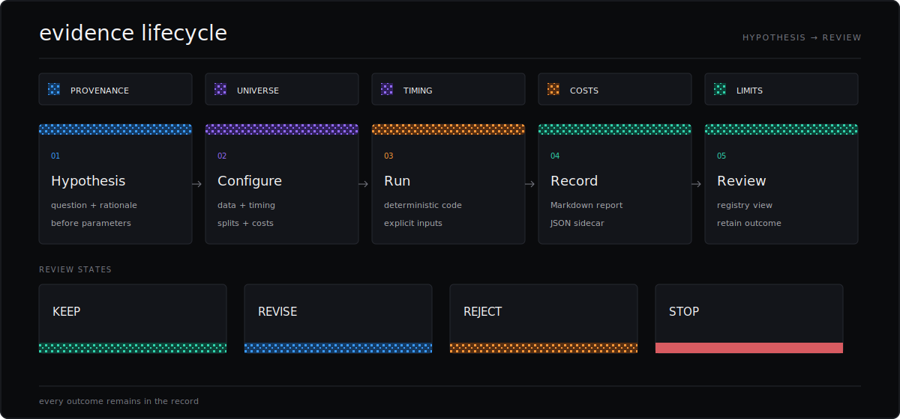
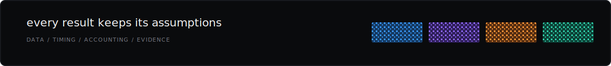

# Research Method

[← Project homepage](../README.md)



The method keeps local data, feature timing, simulated accounting, and evidence records connected from question to review.

## Workflow



`QUESTION → VALIDATE → CONSTRUCT → DIAGNOSE → SIMULATE → RECORD`

Every run begins with an explicit claim and ends with a retained review outcome.

## Research contract



- **Data:** local inputs with explicit schemas, provenance, validation, and date alignment.
- **Timing:** feature, signal, rebalance, and return-measurement dates remain distinct.
- **Accounting:** target weights, turnover, costs, slippage, and benchmark treatment remain visible.
- **Evidence:** configuration, assumptions, outputs, limitations, and review outcome travel together.

The wheel is qualitative; equal arcs indicate peer contract layers rather than measured proportions.

## System



| Layer | Repository paths | Responsibility |
| --- | --- | --- |
| Inputs | `src/data/` | Local CSV validation and aligned research panels |
| Transform | `src/features/`, `src/strategies/` | Factors, diagnostics, sample splits, and target weights |
| Account | `src/backtest/`, `src/risk/` | Drift-aware holdings, signed trades, costs, metrics, and optional position caps |
| Evidence | `src/reporting/`, `research/`, `reports/` | Deterministic runs, Markdown reports, JSON logs, and registry views |

Tests and CI form the control plane. The `lean/` directory remains a metadata and signal-contract scaffold.

## Accounting

| Contract | Current behavior |
| --- | --- |
| Signal availability | Default `signal_lag_periods=1` selects the previous available signal row |
| Return timing | Weights set on date `t` earn returns from the next available price row |
| Portfolio | Long-only equal-weight selection with an optional position cap and residual cash |
| Holdings | Post-trade weights on rebalance dates; drifted closing weights between rebalances |
| Trades | Signed target weights minus drifted pre-trade weights on rebalance dates |
| Turnover | Sum of absolute signed trades under the undivided convention |
| Costs | Fixed basis points on turnover, charged after returns and expressed on beginning-period return basis |
| Slippage | Fixed impact or reviewed exact-date precomputed impact with return-basis metadata |
| Tracking error | Annualized population volatility of aligned daily net strategy returns versus cost-free benchmark returns |
| Episode metrics | Completed positive-weight episodes with reconciled applied costs and explicit terminal-open counts |

## Controls

- Explicit signal lag, point-in-time features, and exact panel alignment.
- Deterministic failure behavior for invalid or incomplete inputs.
- Optional long-only position caps applied before drift-aware trade calculation.
- Interpretation gates tied to provenance, universe, timing, benchmark, splits, costs, and limitations.

Current methodology work is tracked in the [handoff](current_handoff.md), [roadmap](current_roadmap_gap_refresh.md), and [project specification](../PROJECT_SPEC.md).

## Evidence



Synthetic and committed-fixture evidence exercises implementation behavior and reproducibility. Real-data interpretation begins after the methodology fields and readiness gates have been reviewed.

## Verify

```bash
python -m pytest -q
python -m compileall src tests research
python -m compileall lean
git diff --check
```

## Records

[Project specification](../PROJECT_SPEC.md) · [Experiment contract](../EXPERIMENT_LOG.md) · [Risk evaluation design](risk_evaluation_metrics_design.md) · [Decision log](decision_log.md) · [Engineering log](engineering_log.md) · [Experiment registry](../reports/experiment_registry.md)


