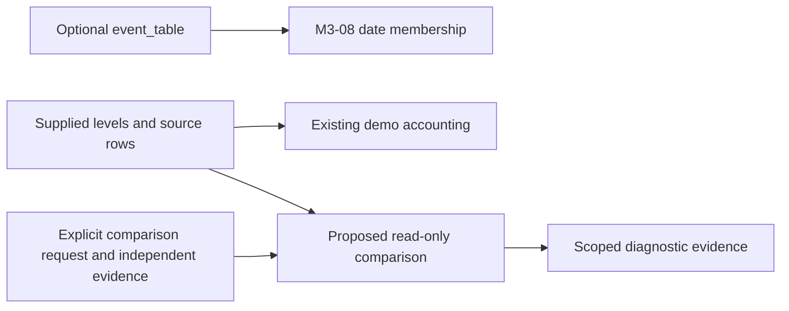

# Proposed Synthetic Ordinary Cash Dividend Comparison

Status: **OWNER SEMANTICS ACCEPTED FOR SYNTHETIC TESTS ONLY; FORMAL CRITICAL
ACCEPTANCE PENDING**. This Step 2 local draft specifies one synthetic
comparison. Independent CRITICAL reviews, binding acceptance and Step 3
implementation remain pending. Source baseline:
`57035fbfe3f8495e6495feecb8afbc2664f3f237`. Numeric precision/error contract
repaired on `3a040b67d874dc850772d8053fd8c15cc9e29060`. Owner-approved
synthetic economics are unchanged.

The recommendation is `synthetic_ordinary_cash_dividend_gross_ex_close_v1`:
compare an independently declared ordinary dividend and raw close anchors
with the return already encoded in supplied gross total-return levels. One
reference share earns the gross dividend across the ex-date interval, with
zero withholding and theoretical reinvestment at the ex-date close. The
comparison produces diagnostic evidence and preserves every accounting input.

The [Step 1 proof](../reports/split_proof_attempt.md) establishes adjusted
split-series consumption through both demos. The
[proposed roadmap](proposed_next_steps_roadmap.md#2-freeze-one-economic-event-comparison-contract)
assigns this separate economic convention to an owner decision.

## Owner semantic decision

**Owner decision: accepted for synthetic tests only.** Approval covers the
pre-ex-date holder entitlement, gross zero-withholding treatment, theoretical
fractional ex-close reinvestment, and after-ex-close evidence cutoff together.
The coordinator record `coord/step2_semantic_acceptance.md` binds this decision
to draft `a6a22e8a3f9007dfe439192aae1dd433d6a093f7`.

A share worth USD 100 at the prior observed close, with a USD 2 dividend and
USD 98 ex-date close, has ending gross wealth USD 100. Supplied total-return
levels 100 -> 100 therefore match a 0% return. A raw 100 -> 98 series gives
-2%; adding the USD 2 again to the already flat total-return series gives
+2%. Those two numerical counterexamples establish the comparison and the
independent cash-overlay refusal.

The recommendation values the synthetic entitlement at par on the ex-date and
assumes fractional reinvestment at that close despite later payment. This is
a declared gross measurement convention. Tax, settlement, receivable credit
risk, payment delay, and implementable reinvestment costs require separately
accepted semantics for any later dataset or execution use. With 20%
withholding, ending wealth would be 98 + 1.6 = 99.6 and return -0.4%, which
illustrates why this owner choice changes the reference economics.

The owner semantic gate is resolved for that synthetic scope. Formal CRITICAL
acceptance remains pending. An amended entitlement, withholding, reinvestment,
or timing choice requires revised examples and expectations before economic
acceptance behavior can be implemented.

## Evidence boundary and compatibility

Current `research/dividend_policy.py` exposes date membership and
`current / previous - 1` arithmetic. M3-08 accepts `None`, empty event tables,
and repeated valid event dates, while keeping columns opaque. Its malformed,
missing, and off-source-date refusals retain their existing behavior.
PIT-007 continues to refuse every supplied `cash_dividends` overlay, including
zero and empty objects.

Proposed Step 3 entry is a **separate, explicitly supplied comparison request**
carrying this convention identifier, independent evidence, a fixed window,
and a cutoff. The name is conceptual; this draft introduces no callable
signature or schema. Supplying `event_table` alone continues to request only
M3-08 date membership. Economic column names never activate the comparison.
Existing validation and overlay refusal run independently and retain their
original error type, reason, report preservation, and attempt retention.



The comparison output has no input path to prices, factors, targets, holdings,
cash, trades, turnover, costs, benchmark construction, or the timing ledger.
Step 3 must preserve those objects exactly with the comparison enabled or
absent. Official `DEMO_V0_CONFIG`, M3-01 `FROZEN_CONFIG`, default disclosures,
reports, and attempt logs keep their existing scope and bytes in this task.

## Proposed fixture and field meanings

Each comparison covers one ordinary cash dividend for one permanent security
and listing over two adjacent observed closes. The synthetic fixture declares
complete event coverage for that security and interval, with exactly one
ordinary dividend and no split, special distribution, identity transition,
currency change, or terminal event. A complete declaration covers this fixture
only. Absence of a row establishes zero evidence coverage.

| Evidence | Proposed meaning and requirement |
| --- | --- |
| Identity | Exact permanent security `SYNTH:ORD_A`, listing `SYNTH:LIST_A`, event `SYNTH:DIV_A_01`, and revision `r1`; all anchors and the supplied asset column have an explicit one-to-one mapping to that security/listing. Ticker text alone is insufficient. |
| Independent raw anchors `P_p`, `P_e` | USD per one unchanged ordinary share at prior close `p` and ex-date close `e`; raw price basis, same share basis and currency, both strictly positive. Their fixture literals and provenance are independent of supplied levels. |
| Dividend `D` | Strictly positive finite gross USD per entitled pre-ex-date ordinary share; event type explicitly ordinary cash dividend. A declared zero amount is outside this first event family. |
| Supplied levels `A_p`, `A_e` | Positive gross total-return index levels with one common scale, explicit USD economics, zero withholding and ex-close reinvestment policy, and an immutable adjustment-set/version declaration. The levels have index-point units and supply only their ratio. |
| Numeric representation | Real non-Boolean finite scalars whose values equal finite IEEE-754 binary64 encodings; required anchors, supplied levels and amount have `OBSERVED` status. Missing fields carry a typed reason. Strings, complex values, Boolean values, infinities and NaNs receive explicit refusal; conversion, fill, clipping and silent repair stay prohibited. Each admitted scalar converts to the unique rational equal to its binary64 encoding before comparison. |
| Evidence identity | Freeze fixture contents/hashes, convention version, raw and adjusted field descriptions, identity mapping, selected event revision, source-label mapping, availability declarations, window, cutoff, coverage and numeric precision. Preserve prior versions and results. |
| Coverage | Complete explicit coverage through the cutoff for every required role, the two anchors, the listing episode and the event interval; an unverified coverage declaration gives insufficient evidence. |

Raw prices and total-return levels serve different roles. The comparison
never multiplies adjusted levels by raw volume, uses index levels as execution
prices, or asserts price/volume compatibility. A generic `adjusted_close`,
split-only series, price-return series, net-dividend series, unknown vendor
adjustment, different currency, or payment-date reinvestment policy cannot
qualify through a coincidentally equal ratio.

Source and evidence dates remain exact labels. A supplied synthetic mapping
binds each label to its expressly invented UTC close and availability time.
The mapping establishes fixture ordering; exchange sessions, holidays,
settlement and timezone conversions remain outside the claim.

## Entitlement, event roles, availability and revisions

The reference unit is one share held immediately after `p` close through the
incoming return at `e` close. Its gross entitlement is `D`. A sale at `e`
close follows that incoming return; a purchase at `e` close first earns the
next interval. Actual portfolio quantities stay outside this asset-level
oracle. In a later integrated fixture, a signal at the observed row before
`p` can establish holdings at `p`; a signal stamped `p` executes earliest at
`e` and earns its first subsequent return. This ordering preserves
`after_close_signal_next_observed_close_v1`.

| Role | Fixture value or policy |
| --- | --- |
| Prior label and close | `p = 2026-04-01`, synthetic close `2026-04-01T21:00:00Z` |
| Ex-date label and close | `e = 2026-04-02`, synthetic close `2026-04-02T21:00:00Z`; compare only `(close[p], close[e]]` |
| Announcement/public availability | `2026-03-30T12:00:00Z` for `r1` |
| Provider availability, revision publication, conservative `known_at` | Each `2026-03-30T12:00:00Z` in this artificial fixture; ingestion/retrieval at that time; parent and identity declarations available by this time |
| Anchor availability | Each close anchor and its supplied level available at its close plus one second |
| Comparison cutoff `C` | `2026-04-02T21:00:01Z`, inclusive; after the ending close and all required input availability |
| Record and payment dates | Fixture metadata `2026-04-03` and `2026-04-10`; these labels carry no return-window or knowability authority |
| Effective role | Ordinary dividend entitlement at the declared ex-date boundary; the valid listing episode covers both anchors. Typed half-open identity intervals and their availability follow the PIT contract. |

The oracle is an after-the-fact comparison as of `C`. The ending close can
participate because this evidence result cannot select an earlier target or
retroactively validate an earlier signal. Any future decision-time use would
require its own earlier cutoff and every applicable availability check.

Every selected input must be available by `C`, within its immutable vintage's
inclusive knowledge cutoff and declared role coverage. `known_at` must be at
least the latest applicable publication, public, provider, revision and parent
availability time. Unknown or date-only availability blocks this bounded
proposal; this fixture supplies exact timestamps rather than inferring a
calendar-based release time.

Select the unique unsuperseded event revision using only revisions available
by `C`. The event identity stays stable across revisions; each revision has
its own identity and explicit supersession link. An eligible linear history
selects its unique current revision. A later revision remains retained and
excluded at earlier cutoffs. Duplicate `(event_id, revision_id)` rows,
conflicting identity contents, cycles, missing predecessors, or competing
eligible heads give insufficient evidence without deduplication or summing.

Example: `r2` supersedes `r1`, changes `D` from 2 to 3, and becomes known at
`2026-04-03T12:00:00Z`. At `C`, `r1` remains selected and the return remains
0%. A new comparison with an explicitly later covered cutoff selects `r2`,
obtains 1%, and mismatches unchanged supplied levels 100 -> 100. It appends a
new result linked to the new evidence vintage and preserves the earlier
result. Latest-only evidence with unknown prior availability is insufficient.

## Independent reference and exact numerical expectations

The raw anchors and event amount define reference wealth independently:

```text
initial wealth                  = P_p
ending gross entitlement wealth = P_e + D
theoretical ending share units  = 1 + D / P_e
r_reference                     = (P_e + D) / P_p - 1
r_supplied                      = A_e / A_p - 1
delta                           = r_supplied - r_reference
TOLERANCE                       = 1/10^12
match                           = abs(delta) <= TOLERANCE
```

### Numeric precision and error contract

Admitted numeric inputs are real non-Boolean finite scalars whose values
equal finite IEEE-754 binary64 encodings. Each admitted value converts to
the unique rational equal to that encoding:

```text
to_rational(x) = Fraction(*float(x).as_integer_ratio())
```

That map is the exact dyadic rational of the binary64 bit pattern. Local
design evidence uses Python's standard-library `fractions.Fraction` and
`float.as_integer_ratio`. Boolean values, including `True` and `False`,
follow D30 before conversion.

The formulas above are evaluated in the field of rationals on those
`to_rational` images. `TOLERANCE` is the exact decimal rational `1/10^12`.
Relative tolerance is zero. Identity, basis, availability, coverage and
missingness checks receive no numerical tolerance. Display rounding occurs
after the predicate. The match predicate uses the unrounded rational
`delta`.

Fixture decimals that name injected returns or the tolerance (`5e-13`,
`2e-12`, `1e-12`) are the exact decimal rationals `5/10^13`, `2/10^12`, and
`1/10^12`. Fixture decimals that name prices, amounts, or index levels
convert by IEEE-754 round-to-nearest-even into binary64, then `to_rational`.
D04, D05, and D44 use injected `r_supplied` literals. D42, D43, and D45 use
explicit `A_p` / `A_e` binary64 literals; their comparison input is the
unrounded computed rational delta.

MATCHED and MISMATCHED follow the rational predicate, or a proven error
bound that selects one side of `1/10^12`. A diagnostic binary64 evaluation
of the same formulas may be recorded as an observation. A proven bound uses
a rounded value `delta_hat` and a finite `eps` satisfying
`|delta_hat - delta| <= eps`:

- `|delta_hat| + eps <= 1/10^12` classifies MATCHED.
- `|delta_hat| - eps > 1/10^12` classifies MISMATCHED.
- A bound that includes both sides of `1/10^12`, with no rational
  classification produced, classifies `INSUFFICIENT_EVIDENCE` with reason
  `comparison_precision_insufficient`.

Exact rational classification of admitted inputs is the local-evidence
method. The finite-rounding witness is `P_p=1`, `P_e=1e16`, `D=1`,
`A_p=1`, `A_e=1e16`. Every input is a positive finite exact binary64 value.
Rational evaluation yields `r_supplied = 10^16 - 1`, `r_reference = 10^16`,
`delta = -1`. Binary64 evaluation of the documented formulas yields
`delta = 0.0` because `1e16 + 1` rounds to `1e16`. Required outcome:
`MISMATCHED`, `1/1`, `return_difference`.

Exact rational evaluation of admitted positive finite inputs yields a
finite rational. Diagnostic binary64 overflow is recorded and leaves that
rational classification in force. An implementation that emits no rational
or proven-bound classification, including when diagnostic binary64
evaluation is nonfinite, emits `INSUFFICIENT_EVIDENCE` with reason
`arithmetic_nonfinite` or `comparison_precision_insufficient`.

The hand oracle fixes `P_p=100`, `P_e=98`, `D=2`, `A_p=100`, `A_e=100`.
Ending share units are `50/49`, whose value at 98 is exactly 100. Both
returns are exactly zero. A second independent witness uses `P_e=101`:
wealth is 103, reference return `3/100`, and supplied levels 100 -> 103
match. Common rescaling to 50 -> 51.5 leaves that return unchanged.

The independent test oracle uses these literal wealth values and rational
expected returns, fixed before evaluating supplied levels. It imports no
production return or adjustment helper, derives no dividend or raw anchor
from the supplied series, and performs no price rebuilding. Perturbing `D`,
`P_e`, or `A_e` individually retains the fixed counterexamples below.
Independence describes the fixed literals and calculation path. All examples
are invented and establish no independent vendor verification.

For semantic sensitivity only, a following raw close of 102 would value the
`50/49` reference shares at `5100/49`, giving cumulative return `2/49`
(approximately 4.081632653%). Holding the USD 2 as cash instead would give
104 and 4%. This two-interval illustration explains reinvestment; comparison
coverage remains the single `(p,e]` interval.

## Expected-outcome matrix

All rows inherit the complete base fixture except the named mutation.
`MATCHED` and `MISMATCHED` require comparable evidence. `INSUFFICIENT_EVIDENCE`
blocks an economic acceptance claim for the named scope. `NOT_REQUESTED`
records the default path. The labels and reasons below are proposed diagnostic
vocabulary, separate from existing runtime exceptions and research promotion
states. Every row remains under the synthetic diagnostic evidence ceiling.
Comparable numeric success uses reason `within_tolerance`. Comparable numeric
difference uses reason `return_difference`. Every `MATCHED` or `MISMATCHED`
row carries that default token.

Coverage notation is `compared / requested`, followed by the reason.
Requested items are explicit security/window requests; duplicate supplied
rows never increase the denominator. Absent or empty evidence for an explicit
one-window request gives `0/1`. Default mode gives `0/0`, with no coverage
percentage. Multiple requests retain per-item outcomes and counts; any
mismatch or insufficient item prevents an all-requested-windows match claim.

| Case | Mutation | Exact proposed outcome |
| --- | --- | --- |
| D01 | Base fixture | `MATCHED`, `1/1`, `within_tolerance`; reference 0, supplied 0, delta 0 |
| D02 | `P_e=101`, `A_e=103` | `MATCHED`, `1/1`, `within_tolerance`; reference and supplied `3/100` |
| D03 | D02 with `A_p=50`, `A_e=51.5` | `MATCHED`, `1/1`, `within_tolerance`; both `3/100`, scale invariant |
| D04 | Base with injected `r_supplied = 5/10^13` (exact decimal; `r_reference = 0`) | `MATCHED`, `1/1`, `within_tolerance`; unrounded delta `5/10^13` |
| D05 | Base with injected `r_supplied = 2/10^12` (exact decimal; `r_reference = 0`) | `MISMATCHED`, `1/1`, `return_difference`; unrounded delta `2/10^12` |
| D06 | `D=3`, other values fixed | `MISMATCHED`, `1/1`, `return_difference`; reference `1/100`, supplied 0, delta `-1/100` |
| D07 | `P_e=97`, other values fixed | `MISMATCHED`, `1/1`, `return_difference`; reference `-1/100`, supplied 0, delta `1/100` |
| D08 | Levels 100 -> 98 falsely declared gross total return | `MISMATCHED`, `1/1`, `return_difference`; reference 0, supplied `-1/50`, delta `-1/50` |
| D09 | Levels 100 -> 102 under base evidence | `MISMATCHED`, `1/1`, `return_difference`; reference 0, supplied `1/50`, delta `1/50` |
| D10 | Unknown raw/share basis or generic vendor-adjusted levels | `INSUFFICIENT_EVIDENCE`, `0/1`, `basis_unknown` |
| D11 | Declared raw, split-only, net-dividend, or different reinvestment basis for supplied levels | `INSUFFICIENT_EVIDENCE`, `0/1`, `basis_incompatible`, even for an equal ratio |
| D12 | Currency differs or amount is cents/lot with unaccepted conversion | `INSUFFICIENT_EVIDENCE`, `0/1`, `currency_or_unit_incompatible` |
| D13 | Either raw or adjusted anchor missing, including no prior row | `INSUFFICIENT_EVIDENCE`, `0/1`, `anchor_missing`; preserve typed reason |
| D14 | Anchors skip an observed row, ex-date role differs, date is off-source, or timestamp mapping is ambiguous | `INSUFFICIENT_EVIDENCE`, `0/1`, `window_invalid` |
| D15 | Ticker-only, ambiguous column mapping, changed permanent security or listing episode | `INSUFFICIENT_EVIDENCE`, `0/1`, `identity_unresolved` |
| D16 | Eligible `r1` plus retained `r2` known after `C` | `MATCHED`, `1/1`, `within_tolerance`; select `r1`, reference 0; excluded `r2` disclosed |
| D17 | Only event revision becomes known after `C` | `INSUFFICIENT_EVIDENCE`, `0/1`, `event_unavailable_at_cutoff` |
| D18 | Later covered cutoff selects `r2` with `D=3`; unchanged levels | `MISMATCHED`, `1/1`, `return_difference`; reference `1/100`, delta `-1/100`; retain original D16 result |
| D19 | `known_at` predates an applicable parent/provider/revision timestamp | `INSUFFICIENT_EVIDENCE`, `0/1`, `availability_inconsistent` |
| D20 | Unknown/date-only availability, latest-only history, or unavailable anchor | `INSUFFICIENT_EVIDENCE`, `0/1`, `availability_unproven` |
| D21 | Duplicate `(event_id, revision_id)` rows, even identical copies | `INSUFFICIENT_EVIDENCE`, `0/1`, `duplicate_event_revision` |
| D22 | Competing heads, cycle, missing predecessor or conflicting stable event identity | `INSUFFICIENT_EVIDENCE`, `0/1`, `revision_lineage_unresolved` |
| D23 | Two distinct events on the same ex-date for two independently mapped securities; both use base values | Two `MATCHED` items, aggregate `2/2`, `within_tolerance`; repeated date preserved |
| D24 | Two distinct ordinary events on the same security/window | `INSUFFICIENT_EVIDENCE`, `0/1`, `multiple_events_in_window`; aggregation deferred |
| D25 | Explicit request with absent evidence | `INSUFFICIENT_EVIDENCE`, `0/1`, `event_evidence_absent` |
| D26 | Explicit request with empty evidence | `INSUFFICIENT_EVIDENCE`, `0/1`, `event_evidence_empty` |
| D27 | Default path, with absent/empty/repeated-date valid M3-08 metadata | `NOT_REQUESTED`, `0/0`; economic comparison remains inactive |
| D28 | Split, special dividend, stock dividend, spin-off or other unsupported event in requested interval | `INSUFFICIENT_EVIDENCE`, `0/1`, `event_type_unsupported` |
| D29 | Mixed ordinary dividend and split/terminal event on same security/window | `INSUFFICIENT_EVIDENCE`, `0/1`, `event_type_unsupported`; retain every row |
| D30 | Any required numeric is Boolean, complex, text, NaN, infinity or an untyped null | `INSUFFICIENT_EVIDENCE`, `0/1`, `numeric_invalid` |
| D31 | Any of raw anchors `P_p`, `P_e` or supplied levels `A_p`, `A_e` is `<= 0`, or `D <= 0` | `INSUFFICIENT_EVIDENCE`, `0/1`, `numeric_domain_invalid` |
| D32 | Valid finite input scalars produce nonfinite diagnostic binary64 arithmetic, and the comparison emits no rational or proven-bound classification | `INSUFFICIENT_EVIDENCE`, `0/1`, `arithmetic_nonfinite` |
| D33 | Anchor status is `PROVIDER_GAP`, `STALE`, `HALTED`, or another state outside `OBSERVED` | `INSUFFICIENT_EVIDENCE`, `0/1`, `observation_unusable`; retain supplied typed state |
| D34 | Required role coverage or immutable vintage cutoff ends before `C` | `INSUFFICIENT_EVIDENCE`, `0/1`, `coverage_unproven` |
| D35 | Entitlement, gross/withholding, or reinvestment policy absent | `INSUFFICIENT_EVIDENCE`, `0/1`, `policy_unresolved` |
| D36 | One base match and one separately requested unsupported-security window | Per-item D01 and D28; aggregate `1/2`, partial coverage, no aggregate match |
| D37 | Separate `cash_dividends` argument supplied, including zero/empty | Existing PIT-007 `ValueError` before economic success; previous report retained |
| D38 | Malformed/missing/off-source M3-08 event dates | Existing M3-08 type/value refusal independently retained; previous report retained |
| D39 | `r1` and valid superseding `r2` both known by later covered cutoff | Select `r2` once; D18 numeric mismatch; `1/1`, `return_difference`, no duplicate-identity refusal |
| D40 | Complete values and roles, but any required provenance/hash is absent or inconsistent | `INSUFFICIENT_EVIDENCE`, `0/1`, `evidence_identity_unproven` |
| D41 | Finite-rounding witness: `P_p=1`, `P_e=1e16`, `D=1`, `A_p=1`, `A_e=1e16` | `MISMATCHED`, `1/1`, `return_difference`; exact delta `-1`; diagnostic binary64 delta `0.0` |
| D42 | Explicit levels `A_p=100`, `A_e=0x1.9000000000dbfp+6` (binary64 of `100*(1+5e-13)`) | `MATCHED`, `1/1`, `within_tolerance`; unrounded delta `3519/7036874417766400` |
| D43 | Explicit levels `A_p=100`, `A_e=0x1.90000000036f9p+6` (binary64 of `100*(1+2e-12)`) | `MISMATCHED`, `1/1`, `return_difference`; unrounded delta `14073/7036874417766400` |
| D44 | Base with injected `r_supplied = 1/10^12` (exact decimal inclusive boundary) | `MATCHED`, `1/1`, `within_tolerance`; unrounded delta `1/10^12` |
| D45 | Explicit levels `A_p=100`, `A_e=0x1.9000000001b7ep+6` (binary64 of `100*(1+1e-12)`) | `MISMATCHED`, `1/1`, `return_difference`; unrounded delta `3519/3518437208883200` |
| D46 | Overflow/range witness: `P_p=2^-1074`, `P_e=1`, `D=1`, `A_p=1`, `A_e=1` | `MISMATCHED`, `1/1`, `return_difference`; exact finite rational delta; diagnostic binary64 nonfinite |
| D47 | Proven error bound includes both sides of `1/10^12`, and no rational classification is produced | `INSUFFICIENT_EVIDENCE`, `0/1`, `comparison_precision_insufficient` |

A request with several defects retains every applicable reason, ordered by
evidence identity, permanent identity, event/revision uniqueness, policy/basis,
window/coverage, availability, observation status, numeric validity, then
arithmetic. Any failed prerequisite suppresses the numerical match verdict.
Present missing fields as typed missing evidence and observed invalid values
as invalid evidence; never infer a zero dividend, zero return, or a terminal
payoff. Requests cannot hide an unsupported co-event by filtering it out.

## Diagnostic labels and runner effect

`MATCHED`, `MISMATCHED`, `INSUFFICIENT_EVIDENCE`, and `NOT_REQUESTED` are
diagnostic comparison labels. They remain separate from existing runtime
exceptions and research promotion states. `NOT_REQUESTED` is the default
path: supplying `event_table` alone continues to request only M3-08 date
membership. An explicit comparison request records one of the other three
labels as diagnostic evidence. D37 and D38 keep their existing exception
types, reasons, previous-report retention, and attempt retention.

Current contracts uniquely imply that diagnostic/exception split and the
unchanged M3-08 metadata API. The mapping from `MATCHED`, `MISMATCHED`, and
`INSUFFICIENT_EVIDENCE` onto Step 3 demo-runner attempt success or official
report replacement remains an owner-semantic implementation question. This
repair leaves that mapping unset.

## Verification and remaining gates

Step 2 verifies hand arithmetic, numeric perturbations, scenario dispositions,
and isolated design ablations using local synthetic evidence. These checks
establish internal consistency of the proposal. The historical
[Step 2 attempt report](../reports/dividend_design_attempt.md) records the
original design checks. The precision-contract repair evidence is recorded in
[the precision-fix attempt report](../reports/pr221_precision_fix_attempt.md).

Owner semantic acceptance covers synthetic tests only. Step 3 still requires
the independent CRITICAL reviews and binding-plan acceptance, followed by
explicit implementation scope. Its tests must exercise both demo consumers,
exact input and accounting
preservation, explicit comparison opt-in, default disclosures, refusal and
start/failure retention, and every applicable case above. D37 and D38
comparison-path failures remain retained before any successful-report
replacement. Producer scenario checks leave runtime enforcement and
independent review unverified.

The first implementation has no schema registry, generalized event engine,
provider adapter, calendar inference, adjustment-factor reconstruction,
price rebuilding, dividend cash posting, reinvestment engine, or benchmark
substitution. Existing benchmark returns retain their supplied-series basis
and common measured rows; this one asset/window comparison establishes no
benchmark validation or portfolio-performance claim. Real data and additional
event families require separately scoped evidence and acceptance.
