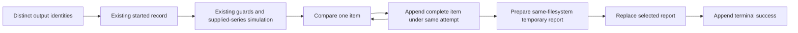

# Step 3 Synthetic Dividend Comparison Implementation Attempt

The accepted ordinary synthetic dividend comparison is implemented as an
explicit, read-only diagnostic through Demo v0 and M3-01. Exact rational
classification, all D01-D47 dispositions, retained reviewer/adjudication
obligations, and both runner lifecycles have deterministic coverage. Local
packaging remains blocked by the available build environment. Fresh CRITICAL
implementation reviews remain with the coordinator. Milestone 3 remains in
progress; Step 4 retains its private-data owner gate.

## PR222 remaining dictionary-envelope repair

Repair of remaining AUDIT-222-002 on candidate
`10825d64acae25b16227787112f6210a8ae9cdec`. The scalar-wrapper cases from
the first repair stayed green. `{"items": anchor}` versus
`{**anchor, "json_evidence": "dict"}` still produced identical snapshots and
hashes, and classification changed to `MATCHED` without resealing.
Dictionaries now encode as `{"json_evidence": "object", "items": {<caller
keys>}}`. That mutation changes digest and retained representation with the
declared hash left unchanged. AUDIT-222-FIX-ADV-001 (`Decimal` revision_id
breaking strict JSON) is a typed-serialization hole and is repaired by
encoding selected revision fields through `json_evidence`. Coordinator
report: `coord/pr222_fix2_attempt.md` in the sibling docs tree. Repair QA:
focused 550 passed; full suite `--basetemp=/tmp/dividend_comparison_runtime_fix2_full`
3364 passed, 2 skipped, 1 warning; ruff and compileall passed; 34 frozen
artifacts hash-identical.

## PR222 identity and evidence-hash repair

Repair of failed candidate `4d4d4f2c8b28dd6883a6155f8c250371ee42a753` against
base `5d673f26eea0174236c601fa822916506894ef20`. AUDIT-222-001 and
AUDIT-222-002 were reproduced on that exact head before editing. Overlapping
requested scopes that assign the same supplied asset to different permanent
identities, or the same identity to different assets, now receive
`identity_unresolved` and `economic_acceptance` false before each item is
appended. Distinct assets (D23) and nonoverlapping sequential episodes keep
their prior diagnoses. `json_evidence` marks caller dictionaries and tuples
so encoded integers, rationals, nonfinite scalars, and list/tuple containers
remain distinct. Classification-changing mutations change digest and snapshot.

AUDIT-222-003, GROK-222-ADV-001, GROK-222-ADV-002, and GROK-222-ADV-004 were
existing-contract holes with local repairs: typed observation serialization,
report JSON `attempt_id`, independent panel binding, and non-string evidence
keys as `evidence_identity_unproven`. GROK-222-ADV-003 did not raise on a
tz-aware panel in live reproduction; binding now uses the same tz-naive
unique-index predicates as `window_invalid`. Accepted gross/zero-withholding/
ex-close economics, diagnostic-completion policy, default `NOT_REQUESTED`
bytes, frozen configs/official reports/logs/split golden, and accounting
paths are unchanged. Isolated ablation was not required.

Repair QA used interpreter
`/Users/rhapsoul/Documents/Codex/projects/efr-demo-v0-20260916/.venv/bin/python`
with `PYTHONPATH=src`. Focused suite: 546 passed. Full suite with
outside-repository `--basetemp`: 3360 passed, 2 skipped, 1 warning. The
card's in-repository `--basetemp=build/dividend_comparison/runtime_fix_full`
reproduced the existing 101 ledger/EODHD path-guard failures. Ruff and
compileall passed. All 34 preserved official artifacts remained
hash-identical. Coordinator attempt report:
`coord/pr222_fix_attempt.md` in the sibling docs tree.

## Scope and source identity

- Work date: 2026-09-18, America/Los_Angeles.
- Writer root: `/Users/rhapsoul/Documents/Codex/projects/efr-dividend-comparison-20260919`.
- Branch: `codex/dividend-comparison-20260919`.
- Clean starting HEAD: `5d673f26eea0174236c601fa822916506894ef20`, PR221 merge.
- Accepted design candidate: `7307a19d1a72138afd423cf5d6ece99f33970925`.
- Implementation card was read in full before editing. Card SHA-256:
  `2db4bf6557112de0522e6b7b66ca3f860b85a25100cbf2ded5b735b3e20c3433`.
- `coord/pr221_acceptance.md` SHA-256:
  `832c1d007e8e7963d267a63e0c6cef125803a531f610c380a2f2325581851be9`.
- `coord/pr221_adjudication.md` SHA-256:
  `ca5f5e6b5f968a4715f128b8fa6de51224bbd9deda2c70d92d2063b2174c3d3a`.
- Accepted `docs/synthetic_event_reconciliation_design.md` SHA-256:
  `a7b7ccdb4086e97b46dae484a85bc74c717aa7baf1eed344c74cab5e757ee843`.
- Read sources also included AGENTS, controller/current handoff/roadmap,
  PROJECT_SPEC, North Star, proposed Step 3 roadmap, timing contract and
  applicable PIT availability, identity, corporate-action, field-dictionary,
  missingness and benchmark sections, both runners, existing dividend/date
  guards, split proof, and CI commands.

One writer worked within this root. Accepted design bytes, official configs,
committed official reports and attempt logs, and the original split golden
retain their baseline identity. The opt-in comparison supplies no data to
signals, prices, holdings, accounting, benchmark construction, turnover, costs,
or the timing ledger. All evidence uses synthetic literals and committed
synthetic fixtures. GitHub, Herdr, credentials, private data, and trading
operations stayed outside this work.

## Delivered implementation

| File | Change |
| --- | --- |
| `research/dividend_comparison.py` | Bounded request/window structures; exact scalar admission; immutable fixture content identity; field, policy, identity, window, coverage, availability, revision and observation checks; rational classifier; typed JSON records; per-item retention; report/log identity preflight and same-filesystem report replacement. |
| `research/demo_v0.py` | Optional `comparison_request`; unchanged supplied-series pipeline followed by retained diagnoses and temporary report replacement; terminal success follows replacement; original opt-in exceptions survive secondary terminal-log errors. |
| `research/synthetic_multifactor_backtest_demo.py` | Equivalent opt-in path for M3-01, with unchanged return object and accounting. |
| `tests/test_dividend_comparison.py` | 429 collected deterministic cases, including independent literal/rational oracles and both consumers' lifecycle/fault boundaries. |
| `docs/dividend_comparison_api.md` | Full callable boundary, evidence field definitions, serialization, timestamp/coverage rules, and runner failure semantics. |
| `CHANGELOG.md`, `docs/engineering_log.md`, `docs/repo_map.md` | Scoped English delivery/process evidence and deterministic map refresh. |
| This report and local release manifest | Acceptance, QA, ablation, preserved failures, exact identities and writer handoff. |

`DividendComparisonRequest.windows` is a nonempty tuple of explicit
`DividendWindow` scopes. Structural errors raise; missing evidence within a
valid scope yields the accepted typed diagnosis. Distinct securities have
separate requested windows. All rows and revisions remain in the item
snapshot. A later cutoff/vintage produces a new retained attempt.

The first-family economics remain gross USD per unchanged ordinary share,
pre-ex-date holder entitlement, zero withholding, theoretical ex-close
reinvestment, adjacent observed closes, and after-close evidence cutoff.
The implementation evaluates the independent wealth formula with exact
rational values. The evidence snapshot binds supplied anchors to actual
panel cells. Exact expected values in tests use fixed literal wealth and
independent `Fraction` values, with zero relative tolerance.



Valid mismatch and insufficient-evidence outcomes complete as diagnostic
execution success. Their economic acceptance remains false. The report binds
the attempt and exposes comparison status/coverage; terminal execution status
comes from the log. Default `None` requests preserve conceptual
`NOT_REQUESTED` coverage `0/0` without new fields or records.

## D01-D47 acceptance coverage

All named tests below are in `tests/test_dividend_comparison.py`; the full
focused command also exercises unchanged dividend-policy, event-membership,
both demo suites and the split proof. `test_exact_matrix` compares exact
numerators/denominators against independent literal expectations.

| Case | Implemented disposition / exact evidence | Test binding |
| --- | --- | --- |
| D01 | MATCHED, 1/1; reference/supplied/delta all 0. | `test_exact_matrix` |
| D02 | MATCHED, 1/1; both returns 3/100. | `test_exact_matrix` |
| D03 | MATCHED, 1/1; 50 -> 51.5 retains 3/100. | `test_exact_matrix` |
| D04 | MATCHED at injected exact 5/10^13. | `test_injected_exact_return_boundary` |
| D05 | MISMATCHED at injected exact 2/10^12. | `test_injected_exact_return_boundary` |
| D06 | MISMATCHED; reference 1/100, delta -1/100. | `test_exact_matrix` |
| D07 | MISMATCHED; reference -1/100, delta 1/100. | `test_exact_matrix` |
| D08 | MISMATCHED; raw-like levels yield delta -1/50. | `test_exact_matrix` |
| D09 | MISMATCHED; double-count-like levels yield delta 1/50. | `test_exact_matrix` |
| D10 | INSUFFICIENT_EVIDENCE, 0/1, basis_unknown. | `test_insufficient_matrix`, completion tests |
| D11 | Incompatible raw/split/net/price-return bases and policies fail despite equal ratios. | `test_insufficient_matrix`, `test_incompatible_basis_equal_ratio_D11`, policy tests |
| D12 | Currency/unit incompatibility; explicit cents/lot witness. | `test_insufficient_matrix` |
| D13 | Every missing raw/adjusted anchor retains anchor_missing and typed status; typed null gaps retain gap identity. | `test_insufficient_matrix`, `test_each_missing_anchor_D13`, `test_typed_missing_anchor_preserves_gap_without_invalid_relabel` |
| D14 | Skipped/off-source anchors, ex role, ambiguous label/close mappings and cutoff-at-close fail. Existing source-row guard retains precedence. | `test_window_boundary_D14`, `test_declared_source_adjacency_both_runners` |
| D15 | Ticker-only/ambiguous mapping, changed security, invalid half-open listing interval fail. | `test_identity_episode_boundary_D15`, `test_insufficient_matrix` |
| D16 | Earlier cutoff selects r1; retained later-known r2 is disclosed and excluded. | `test_revision_history_D16_D18_D39`, later-attempt history test |
| D17 | Event known after C remains unavailable; 0/1. | `test_insufficient_matrix`, inclusive-availability test |
| D18 | Later covered vintage selects D=3; exact delta -1/100; earlier result survives. | `test_revision_history_D16_D18_D39`, later-attempt history test |
| D19 | Inconsistent known/public/provider/revision/parent timing suppresses verdict. | `test_insufficient_matrix`, per-field availability and temporal tests |
| D20 | Unknown/date-only/unavailable evidence and latest-only unresolved predecessor fail. | Per-field availability, temporal and revision-defect tests |
| D21 | Identical duplicate event/revision rows fail without deduplication. | `test_insufficient_matrix`, ordered-reason test |
| D22 | Competing heads, cycles, missing predecessors, stable-identity conflict fail. | `test_revision_defects_D22` |
| D23 | Two independently mapped securities on the repeated ex-date both match; 2/2. | `test_two_windows_same_date` |
| D24 | Two distinct events on one security/window fail; denominator remains 1. | `test_insufficient_matrix` |
| D25 | Explicit absent event evidence and `evidence=None` diagnose absence, 0/1. | Matrix and runner-completion tests |
| D26 | Empty event list and `evidence={}` diagnose empty evidence, 0/1. | Matrix and runner-completion tests |
| D27 | Default absent/empty/repeated-date metadata preserves no-comparison reports/logs and original accounting. | `test_default_metadata_has_no_comparison_records_D27`, accounting-preservation test |
| D28 | Split/special/stock dividend/spin-off/terminal families remain unsupported. | `test_all_unsupported_families_D28_D29`, matrix tests |
| D29 | Mixed ordinary and unsupported co-events retain all rows and fail coverage. | `test_all_unsupported_families_D28_D29` |
| D30 | Boolean, NumPy Boolean, complex, text, null, NaN, infinity and nonrepresentable exact values fail admission. | `test_admission_before_conversion_D30` across all five numeric roles |
| D31 | Zero/negative values in all five roles fail domain checks. | `test_nonpositive_domain_D31` |
| D32 | Missing rational/bound classification with nonfinite arithmetic gives arithmetic_nonfinite, 0/1. | `test_missing_classification_is_insufficient` (conditional classifier branch) |
| D33 | PROVIDER_GAP/STALE/HALTED/SUSPENDED/DELISTED/INVALID remain distinct and unusable. | `test_typed_status_D33`, typed missing tests |
| D34 | Every role's complete/verified interval and independent vintage cutoff cover C. | `test_each_role_coverage_D34`, temporal tests |
| D35 | Missing entitlement/gross/withholding/reinvestment policy remains unresolved. | `test_policy_absence_and_incompatibility_D11_D35` |
| D36 | Matched plus unsupported requested window retains per-item labels, 1/2 and false aggregate acceptance. | `test_two_windows_same_date`, runner-completion tests |
| D37 | Zero/empty cash overlays retain PIT-007 ValueError ahead of malformed comparison evaluation; prior report survives. | `test_guard_precedence_D37_D38` and unchanged policy suite |
| D38 | Off-source/missing/malformed M3-08 dates retain original type/reason and report preservation. | `test_guard_precedence_D37_D38` and unchanged event-membership suite |
| D39 | Valid eligible r1/r2 lineage selects r2 once, with exact D18 mismatch. | `test_revision_history_D16_D18_D39` |
| D40 | Missing/inconsistent content hash/provenance/version and mismatched actual panel anchors fail identity binding. | `test_evidence_binding_D40`, matrix tests |
| D41 | Exact MISMATCHED delta -1; diagnostic binary64 delta 0. | `test_exact_matrix`; predicate-removal ablation fails |
| D42 | MATCHED; exact delta 3519/7036874417766400. | `test_exact_matrix` |
| D43 | MISMATCHED; exact delta 14073/7036874417766400. | `test_exact_matrix` |
| D44 | Inclusive MATCHED at exact 1/10^12. | `test_injected_exact_return_boundary` |
| D45 | MISMATCHED; exact delta 3519/3518437208883200. | `test_exact_matrix` |
| D46 | MISMATCHED; reference 2^1075-1, delta 1-2^1075; typed binary64 +inf diagnostic. | `test_exact_matrix` |
| D47 | A hypothetical bound crossing 1/10^12 without exact classification yields comparison_precision_insufficient, 0/1. | `test_missing_classification_is_insufficient` (conditional classifier branch) |

D04/D05/D44 inject exact returns only into the internal classifier. D32/D47
exercise the design's conditional absence-of-classification branches. The
production comparison always computes the rational verdict; its public
request introduces no injected-return, bound optimization or precision-mode
switch. D41/D46 remain mandatory production rational classifications.

## Retained advisory and lifecycle obligations

| Obligation | Runtime/test evidence |
| --- | --- |
| AUDIT-R2-ADV-001 / adjudicated numeric coverage gap | Integer `2**53+1`, NumPy signed/unsigned equivalents, Decimal 0.1 and Fraction 1/10 are refused before rounding, for every numeric role. Representable integer 2/2^53, Decimal/Fraction 2 and NumPy controls remain admitted. The adjudicator's constructed Pp=Pe=2, Ap=1, Ae=2^52+1 witness is exercised. |
| Mandatory rational D41/D46 classification | Exact values above; binary64 diagnostic carries no verdict authority. Removing the rational predicate produces the D41 false match. |
| Structural request versus evidence deficiency | Eight malformed request classes fail; valid absent/empty/unknown-basis/invalid-numeric evidence is diagnosed. No requested windows is a structural failure. |
| JSON-safe exact and invalid values | Decimal-string numerator/denominator, exact typed input encodings, explicit nonfinite/complex diagnostics, strict `allow_nan=False`. |
| Item discriminator and identity | `dividend_comparison_item`, same attempt ID, item ID, scope, convention, cutoff, vintage/hash, full snapshot and revisions. |
| Item append errors propagate before replacement | First/second item append faults, partial JSON append and later comparator exceptions retain prefixes and completed items. |
| Completed items survive later failures | Three exception classes at later comparison, preparation, replacement, terminal append and post-replacement boundaries in both consumers. |
| Temporal/status coverage and negative histories | Every availability field/role, inclusive C, exclusive listing end, each typed status, mismatch-then-match and r1-then-r2 histories. |
| Diagnostic-only runner decision | MATCHED, MISMATCHED, INSUFFICIENT, partial and mixed outcomes complete as execution success with explicit per-item economic acceptance; default emits no comparison fields. |
| Post-replacement interruption limits | OSError, KeyboardInterrupt and SystemExit after replacement preserve actual new report bytes and log failure/interruption; restoration is never claimed. |
| Existing guards and immutable inputs | D37/D38/source refusals retain precedence; prices, metadata, signals, holdings, returns, turnover, costs, benchmarks, timing ledger and metadata match the baseline exactly. |
| Output identity | Equal paths, symlinks and hardlinks fail before start append; six removal-ablation failures prove the retention guard. |

The fault grid covers start append, pipeline, second comparison, first/second
item append, initial and full report preparation, temporary creation,
replacement, terminal success append and post-replacement exceptions.
Secondary terminal-log exceptions/interruptions preserve the original error.
Two intentional partial JSON append fixtures retain their damaged trailing
line and unchanged earlier prefix; automated repair is absent.

## QA commands, environments, and retained failures

All Python commands used the supplied existing interpreter
`/Users/rhapsoul/Documents/Codex/projects/efr-demo-v0-20260916/.venv/bin/python`
and `PYTHONPATH=src` for pytest. Observed environment: Python 3.12.14,
pandas 3.0.5, NumPy 2.5.3, macOS. Logs live under ignored
`build/dividend_comparison/`.

The focused command is:

```text
python -m pytest tests/test_dividend_comparison.py tests/test_dividend_policy.py tests/test_demo_v0.py tests/test_synthetic_multifactor_backtest_demo.py tests/test_demo_split_proof.py tests/test_event_date_membership.py -q --basetemp=build/dividend_comparison/runtime_final
```

| Run / command | Observed result | Retained log |
| --- | --- | --- |
| Initial new comparison tests | 331 passed, 1 failed: duplicate revisions suppressed secondary invalid-numeric reason; fixed by inspecting eligible current-head candidates. | `focused_initial.log` |
| Corrected new comparison tests | 332 passed. | `focused_second.log` |
| Expanded focused tests | 476 passed, 2 failed: test expected comparison after an already-enforced source-row refusal; assertions corrected to preserve guard precedence. | `focused_expanded.log` |
| Focused baseline | 490 passed. | `focused_final_baseline.log` |
| First full suite | 3303 passed, 1 failed, 2 skipped: generated map freshness; map regenerated. | `full_pre_ablation.log` |
| Post-ablation focused / full | 494 passed / 3308 passed, 2 skipped, 1 warning. | `focused_final.log`, `full_final.log` |
| Output-identity focused / full | 500 passed / 3314 passed, 2 skipped, 1 warning. | `focused_release.log`, `full_release.log` |
| Final focused delivery | 523 passed, including 429 new comparison cases. | `focused_delivery.log` |
| Final full delivery | 3337 passed, 2 skipped, 1 warning; 41.77 seconds. | `full_delivery.log` |
| `python -m ruff check .` | Passed. | `ruff_delivery.log` |
| `python -m compileall src tests research lean` | Passed; includes both CI compilation groups. | `compile_delivery.log` |
| `python -m build` | Environment failure: isolated dependency provisioning could not resolve pypi.org. | `build_final.log` |
| `python -m build --no-isolation` | Environment failure: supplied interpreter has no setuptools.build_meta / setuptools. | `build_no_isolation.log` |
| `python scripts/repo_map.py` | Regenerated deterministically; freshness validated by full suite. | `map_final.log` |
| Whitespace and frozen checks | Unstaged/staged/base-range whitespace passed; all 34 pre-existing report/log/golden artifacts hash-identical; both frozen config ASTs identical. | `frozen_verification.json`, release manifest |

Final coverage inspection added D13's `anchor_missing` reason for a missing
source-panel endpoint alongside `window_invalid`; its direct regression and
additional basis/currency/provenance/coverage variants passed the final gate.
The prior 3314-test run remains retained as an intermediate checkpoint.

The two skips concern platforms where longdouble has no precision beyond
float64. The single constant-input Spearman warning belongs to the existing
ablation test. The card's historical 33 pandas-2.2.3 baseline failures remain
historical, unmodified evidence; this work makes no zero-regression claim for
that untested environment or the Linux/Python-3.11 CI environment. Packaging
requires an environment with the declared setuptools/wheel build dependencies.
The blocked build attempts remain explicit failures rather than successful
packaging claims.

## Isolated ablation and retained baseline

`build/dividend_comparison/ablate.py` saved the four implementation/test files
under `baseline/`, saved SHA-256 identities in `baseline_hashes.json`, mutated
one hypothesis per experiment, ran the focused suite, and restored the baseline
in `finally`. The retained simplification was applied only after its checks
passed. The script and all negative logs remain on disk.

| Isolated hypothesis | Behavior and cost observation | Disposition |
| --- | --- | --- |
| Baseline | 490 passed; 5.463 seconds subprocess wall time. | Preserved. |
| Remove repeated source-index validation plus forwarding parameter | 490 passed; 5.394 seconds. Existing demo guards require exact declared-source rows; comparator already checks panel adjacency. Smaller callable and duplicate validation removed. | Retained. |
| Remove pre-conversion exact representability check | 25 failed, 465 passed; 5.632 seconds. All five numeric roles admitted finite nonrepresentable inputs incorrectly. | Restored. |
| Replace exact match predicate with binary64 diagnostic predicate | 1 failed, 489 passed; 5.400 seconds. D41 became a false MATCHED. | Restored. |
| Defer item appends until all comparisons finish | 6 failed, 484 passed; 5.438 seconds. Later exceptions/interruptions lost the first completed item in both consumers. | Restored. |
| Remove final report/log identity guard in an isolated pytest process | 6 failed, 400 deselected; 0.29 seconds test time. Same-path/symlink/hardlink cases violated pre-append refusal and retention. Source files stayed unchanged. | Retained guard. |

Times are single local observations, without a performance-improvement claim.
The numeric, identity, timing, observation, coverage, retention and existing
pipeline guards remain. Final typed-missing, missing-source-anchor, field/coverage variants and
output-identity checks were added during final validation; the release focused/full runs revalidated them.
This ablation covers the bounded comparison and runner integration, with
preserved positive/negative evidence. Whole-project subsystem/runtime ablation
remains outside this claim.

## Artifact preservation and release

The local release manifest binds all changed/new delivery files to this
baseline and branch, including this report, and inventories QA/source/ablation
hashes. The manifest omits its own recursive hash. Official reports/logs and
split golden are represented by their original hashes and verified unchanged.
`build/dividend_comparison/runtime_final/` retains 388 actual temporary fixture
reports and attempt logs; `runtime_final_index.json` inventories their bytes
and observed status counts: 329 starts, 194 successes, 89 failures, 36
interruptions, 76 matched items, 8 mismatches and 10 insufficient items. Ten
starts remain intentionally incomplete in failure-injection fixtures; two logs
retain injected partial trailing JSON lines. Earlier runtime directories remain retained.

The authorized local Git stage attempt failed with:

```text
fatal: Unable to create '.git/index.lock': Operation not permitted
```

The full error is retained in `build/dividend_comparison/git_add.log`.
Sandbox permissions make `.git` read-only. HEAD remains the starting merge;
no local commit was created. The delivery therefore uses
`reports/dividend_comparison_release_manifest.json` for coordinator commit.
The manifest records `writer_released=true`, the exact baseline/branch,
all nine delivery-file hashes, QA/ablation evidence hashes, and unchanged
frozen-artifact identities. The worktree retains the scoped files for the
coordinator. Publication authority remains closed under this card.

## Limitations and next gate

The completed software evidence covers one explicitly declared synthetic
ordinary dividend family and its requested windows. Fixture provenance and
complete coverage are caller declarations bound to content hashes. This work
establishes neither independent vendor verification nor benchmark, portfolio,
empirical profitability, or full adjustment certification. The supplied
simulation retains its accepted timing and cost behavior; the comparison
cannot retroactively validate a signal or alter a trade.

The log/report protocol is sequential and local. It preserves earlier bytes
until replacement and completed item evidence across catchable later failures.
A post-replacement error can leave the new report with failed/incomplete
execution; an uncatchable process termination can leave an incomplete start.
Concurrent writers, power-loss durability and cross-file atomic rollback are
outside this lightweight diagnostic path.

The coordinator owns fresh CRITICAL implementation reviews on the exact
released candidate and the outstanding packaging-environment gate. Step 4
requires explicit owner scope for a named dataset, access and intended use
before private inspection or interpretation. Milestone 3 remains in progress.
The writer releases these local artifacts for coordinator version management;
this task performs no push, PR, merge or subsequent roadmap work.
